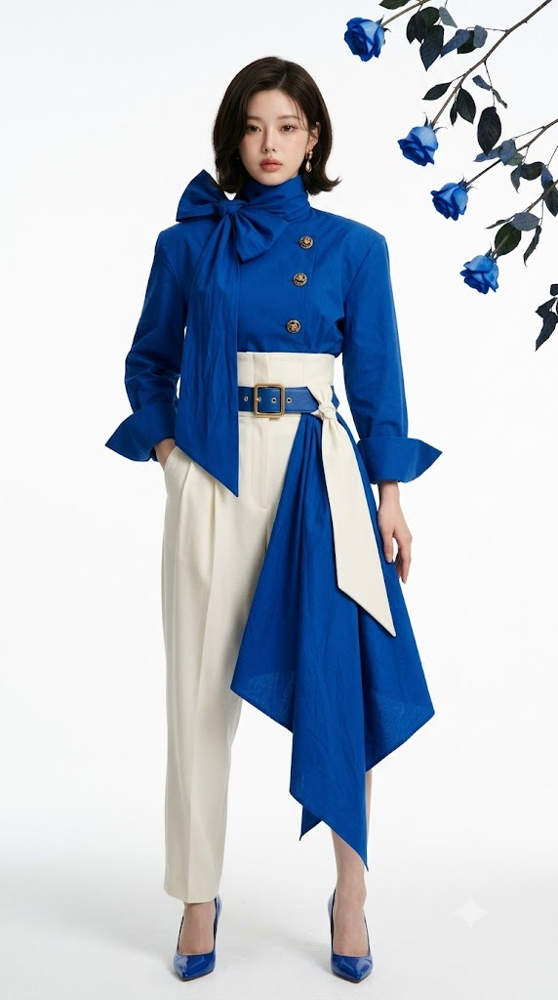
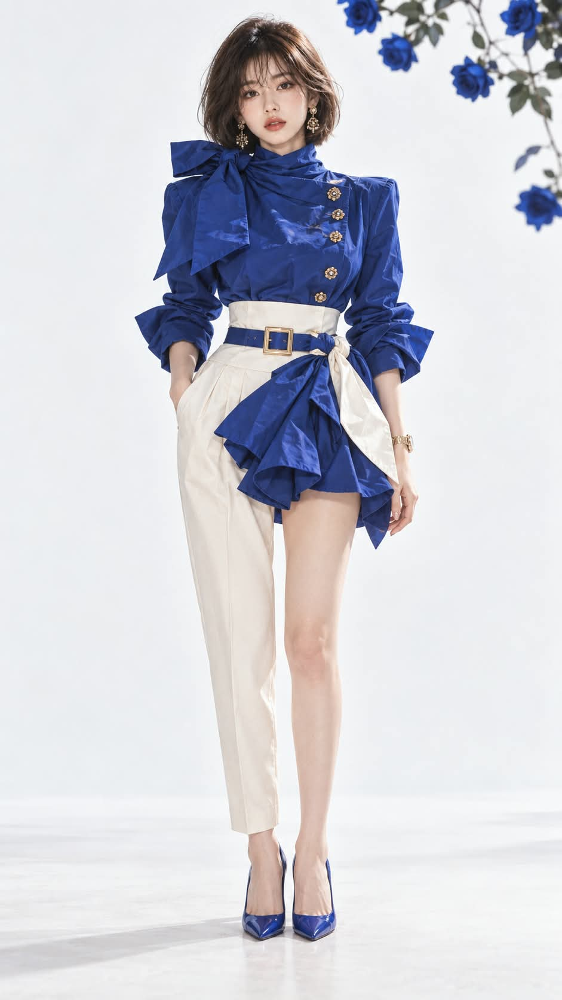

# 하이엔드 로열 블루 룩 & 블루 로즈 화이트 스튜디오 실사 패션 화보 프롬프트

## 1. 개요 및 아트 디렉팅 가이드

- **컨셉**: 퓨어 화이트 심리스 스튜디오에서 생화 블루 로즈를 배경으로, 로열 블루 블라우스 재킷과 비대칭 테이퍼드 슬랙스를 착용한 하이엔드 럭셔리 브랜드 캠페인 패션 화보
- **촬영 스펙**: 세로 9:16 비율, Canon EOS R5 + 85mm f/4 렌즈 RAW 원본 실사 (모공, 솜털, 원단 섬유 질감이 생생한 100% 포토리얼, CG/일러스트/3D 렌더 절대 배제)
- **반드시 지킬 핵심 3가지**:
  1. **얼굴 인상 보존 (1순위)**: 업로드한 얼굴의 눈·코·입 크기, 형태, 간격, 콧대, 입술, 피부톤, 점, 미세한 좌우 비대칭 등 원본 인상 100% 복제 (성형 미화, 눈 키우기, 턱 깎기 금지)
  2. **빳빳한 블루 코튼 스카프 볼륨**: 벨트 오른쪽 매듭에서 몸 중앙 쪽 사선으로 내려와 허벅지 앞에서 크게 펼쳐져 각진 크링클 주름 볼륨을 세우며, 다리 사이 앞부분과 짧은 바지 끝단을 확실히 가림 (하늘거리는 얇은 천, 앞치마, 기저귀 모양 절대 금지)
  3. **다리 & 발 간격 포즈**: 두 다리는 곧게 모으되, 두 발은 붙이지 않고 약 10cm 간격을 두고 똑바로 선 정면 8등신 모델 자세
- **의상 디렉팅 (로열 블루 & 아이보리)**:
  - **상의**: 선명한 딥 로열 블루(사파이어 계열) 코튼 포플린 블라우스 재킷 (패드 숄더, 하이넥 위 리본 매듭 스카프, 화면 오른쪽으로 치우친 앤틱 골드 단추 4개, 오버사이즈 턴백 커프스)
  - **허리**: 아이보리 와이드 코르셋 밴드 + 로열 블루 이중 버클 가죽 벨트
  - **하의 (비대칭 슬랙스)**: 크림 아이보리 투턱 테이퍼드 슬랙스 (화면 왼쪽: 앵클 기장 긴 바지 / 화면 오른쪽: 사타구니 아래 짧은 기장으로 스카프에 가려짐)
  - **허리 스카프 & 새시**: 빳빳한 로열 블루 스카프(사선 흐름 후 조각적 각진 볼륨 전개) + 화면 오른쪽 바깥 사선으로 교차하는 아이보리 새시
- **세트 & 소품 & 조명**:
  - 이음새 없는 퓨어 화이트 심리스 스튜디오 배경
  - 화면 오른쪽 위 모서리에서 프레임 안으로 살짝 늘어져 들어오는 생화 블루 로즈(3~5송이 아웃포커스 보케)
  - 로열 블루 에나멜 스틸레토 힐(굽 10cm), 골드 드롭 귀걸이 및 골드 메탈 브레이슬릿 시계
  - 대형 소프트박스 하이키 스튜디오 조명, 각진 주름에 또렷한 음영과 자연스러운 그림자

---

## 2. 프롬프트 전문

```text
[실사 패션 화보 프롬프트 - 로열 블루 룩]

★ 최우선: 이것은 일러스트나 그림이 아니라 실제 사람 모델을 스튜디오에서 촬영한 원본 사진입니다.
Canon EOS R5, 85mm f/4 렌즈로 촬영한 RAW 사진. 실제 피부 모공, 솜털, 미세한 피부 요철, 원단 섬유 질감이 보이는 사실적인 사진. 애니메이션, 반실사, 3D 렌더, 디지털 페인팅, 에어브러시 보정 느낌이 전혀 없어야 합니다.

※ 이 프롬프트에서 좌우는 모두 "화면에 보이는 기준"입니다. 화면 왼쪽 = 사진을 볼 때 왼쪽.

★ 반드시 지킬 핵심 3가지

1. 업로드한 얼굴의 인상 그대로

2. 빳빳한 블루 코튼 스카프가 화면 오른쪽 매듭에서 몸 중앙 쪽(화면 왼쪽 아래)으로 사선을 그리며 내려온 뒤, 허벅지 앞에서 크게 펼쳐져 각진 주름 볼륨을 세운다. 이 스카프가 다리 사이 앞부분과 짧은 바지 끝단을 가린다. 하늘거리는 얇은 천도, 납작한 앞치마도, 오므린 기저귀 모양도 아니다

3. 두 다리는 모으되 두 발은 붙이지 않고 약 10cm 떨어뜨려 선다

━━━━━━━━━━━━━━━━━━
★ 얼굴 인상 보존 (모든 지시보다 우선)
━━━━━━━━━━━━━━━━━━
[우선순위 규칙]

이 프롬프트의 모든 지시 중 업로드한 얼굴의 인상 유지가 1순위입니다

헤어, 메이크업, 표정, 체형 지시가 얼굴 인상과 충돌하면 무조건 업로드한 얼굴을 따릅니다

헤어, 메이크업, 표정, 체형은 업로드한 얼굴 위에 덧입히는 것이지, 새 모델의 얼굴을 설계하라는 뜻이 아닙니다

결과물은 "이 사람이 이 옷을 입고 화보를 찍은 사진"이어야 하며, "비슷한 분위기의 다른 모델"이 되면 실패입니다

턱선은 V라인으로 자연스럽게 갸름하게 조정해도 되지만, 눈·코·입과 전체 인상은 업로드한 얼굴 그대로

[업로드한 얼굴에서 그대로 복제할 것]

눈: 크기, 모양, 눈꼬리 각도, 눈꺼풀 라인, 눈동자 크기와 색, 두 눈 사이 간격, 눈매가 주는 분위기

코: 콧대 높이, 코 길이, 콧볼 너비, 코끝 모양

입: 입 크기, 입술 두께, 윗입술과 아랫입술 비율, 입꼬리 모양

피부톤과 얼굴 고유의 특징(점 등)

이목구비 사이 간격과 배치, 미세한 좌우 비대칭

사진 속 인물이 가진 전체적인 인상과 분위기

가족이나 지인이 보고 바로 본인이라고 알아볼 수 있어야 함

[절대 하지 말 것]

눈을 키우거나, 눈매를 더 또렷하고 강하게 바꾸지 않음

콧대를 높이거나 코끝 모양을 바꾸지 않음

입술 모양과 크기를 바꾸지 않음

얼굴을 더 예쁘게, 더 모델처럼 보정하지 않음

메이크업과 표정은 색과 미세한 근육 움직임만 더할 뿐, 눈·코·입의 형태를 바꾸지 않음

사진의 머리 각도, 헤어, 의상, 배경, 조명, 포즈, 체형은 가져오지 않음. 가져오는 것은 얼굴뿐

━━━━━━━━━━━━━━━━━━
신체 비율: 8등신
━━━━━━━━━━━━━━━━━━

전체 키가 머리 길이의 8배인 8등신 패션모델 비율

비율은 얼굴 이목구비를 바꾸지 않고, 목·몸통·다리를 길게 해서 맞춤

가늘고 긴 목, 반듯한 어깨, 가는 허리

허리선이 높고 다리가 길어 하체가 상체보다 확연히 긴 비율

길고 곧은 다리, 가는 발목, 슬림한 팔

실제 사람의 자연스러운 8등신. 과장된 만화 비율 아님

━━━━━━━━━━━━━━━━━━
표정
━━━━━━━━━━━━━━━━━━

업로드한 얼굴의 인상을 해치지 않는 범위에서, 웃음기 없는 차분하고 도도한 무표정

입은 자연스럽게 다묾

눈은 편하게 뜨고 카메라를 정면으로 바라봄

얼굴은 정면, 고개를 좌우로 돌리거나 기울이지 않음. 턱은 수평에서 아주 살짝만 듦

━━━━━━━━━━━━━━━━━━
메이크업 (실제 뷰티 화보 메이크업)
━━━━━━━━━━━━━━━━━━

업로드한 얼굴의 피부톤 그대로, 모공과 피부결이 보이는 세미 글로우 베이스

눈: 원래 눈 모양 그대로, 눈꼬리를 아주 살짝만 뺀 얇은 블랙 아이라인, 옅은 브라운 섀도, 자연스러운 속눈썹

눈썹: 원래 눈썹 모양 그대로 자연스러운 흑갈색으로 결 정리

볼: 아주 은은한 피치 블러셔

립: 선명한 트루 레드. 원래 입술 라인 그대로, 촉촉한 광택

━━━━━━━━━━━━━━━━━━
헤어
━━━━━━━━━━━━━━━━━━

자연스러운 흑갈색, 실제 모발의 윤기

턱선 길이의 단정한 단발 보브. 머리끝이 살짝 안으로 말린 C컬

결이 곧고 매끄러운 깔끔한 둥근 실루엣. 부스스함, 뻗침, 레이어드 없음

화면 오른쪽 옆머리는 귀 뒤로 넘겨 귀와 귀걸이가 보임. 화면 왼쪽 옆머리는 귀를 덮고 귀걸이 펜던트가 머리 끝 아래로 보임

머리카락이 눈·코·입을 가리거나 인상을 바꾸지 않음

━━━━━━━━━━━━━━━━━━
의상 (실제 옷)
━━━━━━━━━━━━━━━━━━
[색상]

모든 블루는 녹색 기운이 전혀 없는 선명한 딥 로열 블루(울트라마린·사파이어 계열). 틸, 청록, 네이비 아님

의상 전체 무늬 없는 단색

[상의 - 로열 블루 블라우스 재킷]

빳빳한 코튼 포플린. 광택 없는 매트한 면 질감, 구겨진 종이처럼 크고 각진 크링클 주름

몸에 맞는 슬림핏, 살짝 각 잡힌 패드 숄더

밑단은 하이웨이스트 허리밴드 안에 넣어 입음

[목]

높은 스탠드 터틀넥 칼라 위로 같은 로열 블루 스카프를 여러 번 감음

화면 왼쪽 목 옆에서 크게 리본 매듭, 리본 고리와 자락이 어깨 위로 빳빳하게 늘어져 가슴 윗부분까지만 내려옴

[단추 - 비대칭 배치]

여밈선과 단추는 몸 중앙이 아니라 화면 오른쪽으로 치우친 세로선 위에 있음

장미·매듭 모양으로 조각된 앤틱 골드 단추 4개가 쇄골 아래부터 허리밴드 바로 위까지 세로로 배열

몸 정중앙에는 단추 없음

[소매]

긴 소매, 손목에서 팔뚝 중간까지 크게 접어 올린 오버사이즈 턴백 커프가 여러 겹으로 부풀며 옆으로 뻗침

[허리]

갈비뼈 아래부터 골반 위까지 오는 넓은 아이보리 코르셋형 하이웨이스트 허리밴드

그 위에 로열 블루 가죽 벨트. 큰 사각 골드 버클 위에 작은 사각 골드 고리가 하나 더 겹친 이중 버클. 버클은 몸 중앙에서 살짝 화면 왼쪽

[하의 - 아이보리 비대칭 슬랙스]

크림 아이보리 울 블렌드 수트 원단, 하이웨이스트 투턱 테이퍼드 슬랙스

허리 아래 깊은 턱 주름 두 개로 골반·허벅지는 둥글고 넉넉하고, 무릎 아래로 확실히 좁아져 발목에서 가늘게 떨어짐. 일자 핏 아님

앞면에 세로 칼주름

화면 왼쪽 다리: 발목이 살짝 보이는 앵클 기장의 긴 슬랙스

화면 오른쪽 다리: 바지가 사타구니 바로 아래에서 아주 짧게 끝나고, 앞으로 내려온 블루 스카프에 가려 보이지 않음

[허리 스카프 + 아이보리 새시 - 위치·소재·흐름 정확히]
큰 스카프 한 장을 벨트에 묶고 남은 자락을 몸 앞으로 늘어뜨린 스타일링. 스카프는 몸 앞에만 있고 뒤나 옆구리로 감기지 않음.

1. 소재 - 매우 중요

상의와 같은 로열 블루의 빳빳한 코튼 포플린. 힘이 있어 천이 스스로 형태를 유지하고, 접힌 부분이 각지게 서 있음

광택 없는 매트한 면 질감, 상의와 같은 크고 각진 크링클 구김

완전히 불투명. 빛이나 다리가 비치지 않음

시폰·오간자·실크처럼 얇고 하늘거리거나 축 처지는 천이 아님

2. 매듭

벨트 오른쪽 끝, 몸 중앙보다 살짝 화면 오른쪽(버클과 화면 오른쪽 골반 사이 중간쯤) 벨트 위에서 블루 스카프와 아이보리 새시가 함께 도톰하게 묶임

3. 블루 스카프의 흐름

매듭에서 나온 블루 천이 폭 10~15cm 띠로 모아진 채, 몸 중앙 쪽(화면 왼쪽 아래)을 향해 사선으로 내려옴. 사타구니 높이에서 이 띠가 몸 중앙선에 닿음

사타구니 높이부터 빳빳한 천이 크게 펼쳐지며, 몸 중앙선에서 화면 오른쪽 허벅지 바깥까지 앞면을 덮음. 천의 힘 때문에 몸에서 바깥으로 떠서 크고 각진 주름 덩어리로 부풀어 서 있음

주름: 종이를 구긴 듯 큼직하고 각진 접힘이 여러 겹. 부드럽게 늘어지는 드레이프가 아니라 형태가 살아 있는 조각적인 볼륨

밑단: 허벅지 윗부분~중간, 옆으로 내린 오른손 손끝 바로 위 높이에서 거의 수평으로 끝남. 밑단 가장자리는 빳빳하게 말려 꺾인 러플이 바깥으로 열려 있음. 안으로 오므려 모으지 않음

이 흐름 덕분에 다리 사이 앞부분과 짧은 바지 끝단이 스카프 뒤로 숨고, 스카프 밑단 아래로 바로 맨다리가 보임

바깥 옆으로 길게 떨어지는 꼬리나 무릎까지 내려가는 자락 없음

4. 아이보리 새시

같은 매듭에서 나온 폭 약 12~15cm의 넓은 아이보리 코튼 띠가, 블루와 반대로 화면 오른쪽 아래(바깥쪽) 사선으로 블루 스카프 윗부분 위를 가로질러 내려옴

새시 끝은 화면 오른쪽 골반 바깥, 오른손 손목 높이에서 뾰족한 삼각형으로 끝남

새시 왼쪽에는 중앙으로 내려가는 블루 띠가, 새시 오른쪽에는 골반 옆 블루 천이 보여 블루가 새시를 양옆에서 감쌈

몸 중앙으로 내려오거나 화면 왼쪽 긴 바지 앞으로 넘어오지 않음

━━━━━━━━━━━━━━━━━━
액세서리 / 소품
━━━━━━━━━━━━━━━━━━

양쪽 귀에 골드 드롭 귀걸이: 작은 골드 매듭 아래로 울퉁불퉁한 너겟·꽃봉오리 모양 펜던트가 늘어짐

화면 오른쪽 손목에 골드 메탈 브레이슬릿 시계

상의와 같은 로열 블루 에나멜 포인티드 토 스틸레토 힐, 굽 약 10cm

━━━━━━━━━━━━━━━━━━
포즈 / 구도
━━━━━━━━━━━━━━━━━━

세로 9:16, 머리부터 발끝까지 전신샷, 인물은 중앙

인물이 화면 세로 높이의 약 85%를 차지

정면을 향해 똑바로 서 있는 자세

다리: 두 다리를 모아 곧게 나란히 섬. 두 발은 서로 붙지 않고 약 10cm 떨어져 있어 두 발목 사이에 작은 틈이 보임. 무릎은 서로 가깝지만 닿지 않음. 두 발끝은 정면, 어느 발도 앞으로 나오지 않음

화면 왼쪽 손은 긴 슬랙스 앞주머니에 손목까지 무심하게 넣음

화면 오른쪽 손은 주머니에 넣지 않고, 스카프 바깥 옆으로 힘을 빼고 늘어뜨림. 손끝이 스카프 밑단보다 살짝 아래에 있음. 손이 스카프를 잡거나 누르지 않음

허리 높이 정면 앵글, 왜곡 없음

━━━━━━━━━━━━━━━━━━
배경 / 조명 (실제 촬영 세트)
━━━━━━━━━━━━━━━━━━

실제 스튜디오의 깨끗한 퓨어 화이트 심리스 배경. 벽과 바닥이 이음새 없이 이어짐

배경 꽃은 조화가 아닌 실제 생화 블루 로즈
· 선명한 로열 블루 꽃잎, 겹겹이 말린 장미 꽃잎 결, 가시 있는 어두운 줄기, 잎은 최소한

블루 로즈 배치:
· 화면 오른쪽 위 모서리 바깥에서 긴 줄기의 블루 로즈 3~5송이가 프레임 안으로 살짝 늘어져 들어옴
· 인물 머리보다 위쪽, 인물과 겹치지 않음
· 살짝 아웃포커스로 흐려져 깊이감을 줌

바닥은 흰색, 소품·꽃잎 없음

대형 소프트박스를 쓴 밝은 하이키 스튜디오 조명. 얼굴은 정면에서 고르게 밝게 비춰 이목구비가 선명하게 보임

스카프의 각진 주름과 슬랙스 주름에 또렷한 음영, 발밑에 짧은 실제 그림자

아이보리 슬랙스가 흰 배경에 묻히지 않게 크림 톤 유지

하이엔드 럭셔리 브랜드 캠페인 화보 톤, 미세한 필름 그레인

━━━━━━━━━━━━━━━━━━
제외할 것
━━━━━━━━━━━━━━━━━━
업로드한 얼굴과 다른 인상, 다른 사람 얼굴, 커진 눈, 바뀐 눈매, 높아진 콧대, 바뀐 코 모양, 바뀐 입술 모양, 얼굴 성형 보정, 전형적인 AI 모델 얼굴, 일러스트, 애니메이션, 반실사, 3D 렌더, 디지털 페인팅, 인형 같은 얼굴, 에어브러시 피부, 짧은 다리, 과장된 만화 비율, 기울어진 고개, 부스스한 머리, 틸·청록·네이비 블루, 몸 중앙의 단추, 일자 바지, 시폰·오간자·실크 스카프, 하늘거리는 얇은 스카프, 비치는 스카프, 축 처진 스카프, 납작한 앞치마 같은 스카프, 기저귀 같은 스카프, 밑단을 오므려 모은 스카프, 바깥쪽으로만 흐르는 블루 스카프, 무릎까지 늘어진 스카프 자락, 밑위의 갈라진 틈 노출, 짧은 쪽 바지 밑단 노출, 뒤로 감긴 스카프, 몸 중앙으로 내려온 아이보리 자락, 단일 버클, 붙은 발, 골반 너비 이상 벌린 다리, 한 발 앞으로 내딛은 자세, 걷는 포즈, 양손 주머니, 어두운 배경, 조화, 그려진 꽃, 손가락·다리 변형, 텍스트, 로고, 워터마크
```

---

## 3. 결과물 비교 갤러리

| 생성 모델 | 생성 결과 이미지 |
| :--- | :--- |
| **제미나이 (Gemini)** |  |
| **ChatGPT (DALL-E 3)** |  |
