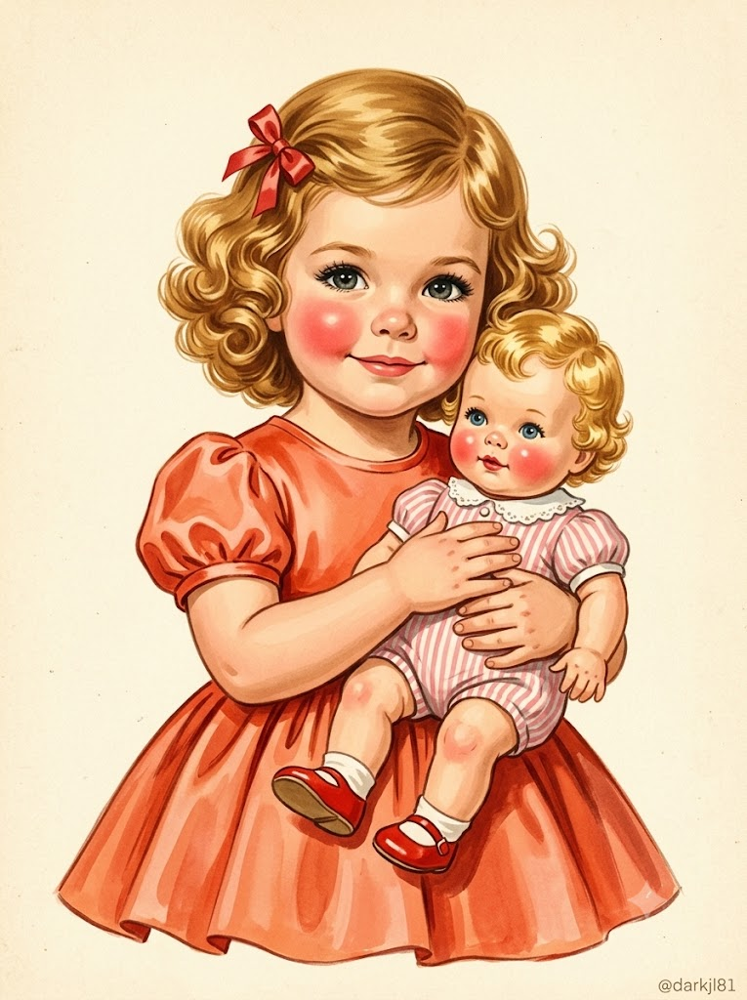
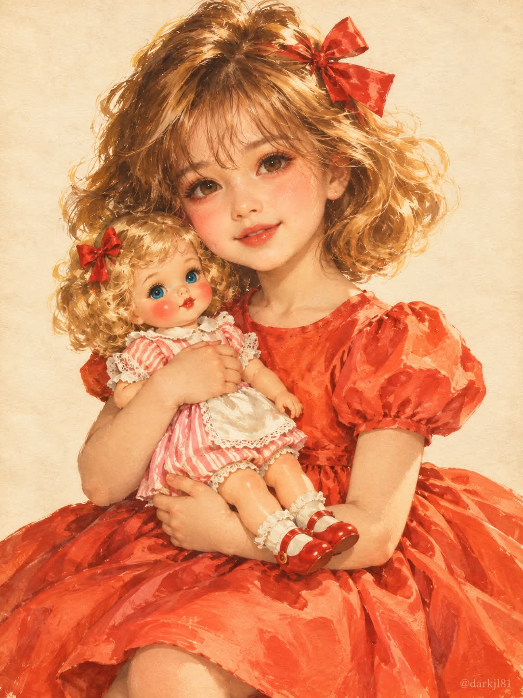

# 1950년대 미국 빈티지 광고 삽화풍 어린아이 미니미 일러스트 프롬프트

## 1. 개요 및 아트 디렉팅 가이드

- **컨셉**: 얼굴 사진의 주인공을 1950년대 미국 빈티지 광고·아동 잡지 삽화풍의 '어린아이 미니미'로 그리는 과슈/수채 일러스트. 사진 속 인물의 성별에 따라 여자아이 버전과 남자아이 버전을 자동 적용
- **얼굴 사용 & 미화 규칙**:
  - 사진에서는 눈·코·입의 생김새와 전체 인상만 가져오고, 약 5~6세 어린아이의 얼굴 비율(둥근 볼, 큰 눈, 작은 코·입)로 재구성
  - 본인임을 바로 알아볼 수 있는 수준을 유지하며 딱 한 단계만 다듬기 (대칭 정돈, 맑은 눈동자, 부드러운 입매, 화사한 피부), 미화보다 닮음을 우선
  - 사진에 안경·선글라스가 있으면 테와 렌즈를 그대로 유지하고, 없으면 추가하지 않음
- **공통 구도 & 표정**:
  - 상반신부터 무릎 위까지 보이는 세로 3:4 구도, 살짝 3/4로 돌린 몸에 거의 정면인 얼굴과 정면 시선
  - 입꼬리를 살짝 올린 수줍고 사랑스러운 미소, 진한 속눈썹과 둥글고 진한 장밋빛 홍조, 작고 붉은 입술
  - 두 팔로 가슴 앞의 인형을 소중하게 끌어안은 포즈
- **여자아이 버전**:
  - 빨간 새틴 리본을 단 꿀빛 금발 웨이브 컬 단발, 다홍~코랄 오렌지빛 퍼프 소매 새틴 원피스
  - 분홍·흰색 줄무늬 롬퍼와 빨간 메리제인 구두의 빈티지 아기 인형
- **남자아이 버전**:
  - 앞머리를 옆으로 넘긴 꿀빛 금발의 1950년대 소년 헤어, 피터팬 칼라 흰 셔츠와 코랄 오렌지빛 멜빵 반바지, 빨간 나비넥타이
  - 분홍·흰색 줄무늬 멜빵바지를 입은 빈티지 곰 인형
- **화풍 & 배경**:
  - 따뜻하고 부드러운 붓터치와 종이 질감, 채도 높은 레드·오렌지와 크림색의 조화, 빈티지 인쇄물 같은 약간 바랜 색감
  - 무늬 없는 따뜻한 아이보리/크림색 단색 종이 배경
- **워터마크**: 우하단에 작은 글씨로 `@darkjl81`, 그 외 텍스트·로고·서명 없음

---

## 2. 프롬프트 전문

```text
첨부한 얼굴 사진의 주인공을 1950년대 미국 빈티지 광고·잡지 삽화풍의 "어린아이 미니미"로 그려줘.
사진 속 인물의 성별을 판단해서, 여성이면 [여자아이 버전], 남성이면 [남자아이 버전]의 헤어·의상·인형을 적용할 것. 나머지 구도·화풍·규칙은 공통으로 적용할 것.

[얼굴 사진 사용 규칙 — 매우 중요]

사진에서는 오직 눈·코·입의 생김새와 전체적인 인상만 가져올 것. (단, 안경·선글라스는 예외로 유지)

얼굴형, 피부톤·질감, 헤어스타일, 이마·헤어라인, 화장, 수염은 사진에서 가져오지 말 것.

사진 속 고개 기울기·얼굴 방향·시선 각도는 절대 따라 하지 말 것. 각도와 표정은 아래 설명대로 새로 그릴 것.

표정은 사진의 표정이 아니라 아래 서술대로 새로 그릴 것.

성인 사진이어도 약 5~6세 어린아이의 얼굴 비율(둥근 볼, 큰 눈, 작은 코·입)로 재구성하되, 눈·코·입의 특징이 닮아 보이게 할 것.

[살짝 미화 규칙 — 정도 조절 중요]

보는 사람이 "본인이 맞네" 하고 바로 알아볼 수 있는 수준을 유지하면서, 딱 한 단계만 더 예쁘고 귀엽게 다듬을 것.

눈·코·입의 모양과 배치, 눈 모양(쌍꺼풀 유무, 눈꼬리 방향), 코의 형태, 입술 모양 같은 고유 특징은 바꾸지 말 것.

다듬는 범위는 다음으로만 한정: 좌우 대칭을 아주 약간 정돈, 눈동자를 조금 더 맑고 반짝이게, 입매를 조금 더 부드럽게, 피부를 깨끗하고 화사하게.

눈을 과하게 키우거나, 코를 깎거나, 다른 사람처럼 보이게 하는 성형급 변화는 절대 금지.

미화보다 닮음이 항상 우선. 애매하면 덜 고칠 것.

[안경·선글라스 유지 규칙]

사진 속 인물이 안경이나 선글라스를 쓰고 있다면 반드시 그대로 씌워서 그릴 것.

테 모양(둥근테, 사각테, 뿔테, 무테, 보잉 등), 테 색상, 테 두께, 렌즈 색과 투명도(투명·틴트·미러·검정)를 사진과 똑같이 유지할 것.

크기만 어린아이 얼굴에 맞게 줄이고, 1950년대 일러스트 화풍의 붓터치로 자연스럽게 표현할 것.

선글라스로 눈이 가려진 경우 눈을 억지로 비쳐 보이게 그리지 말고 사진처럼 렌즈를 유지할 것.

사진에 안경·선글라스가 없으면 절대 추가하지 말 것.

[공통 — 인물 구도와 표정]

약 5~6세 아이, 상반신~무릎 위까지 보이는 세로 구도, 정면에서 살짝 3/4로 돌린 몸, 얼굴은 거의 정면, 시선은 정면 관람자를 향함.

표정: 입꼬리를 살짝 올린 수줍고 사랑스러운 미소, 입은 다물거나 아주 살짝 벌림.

크고 맑은 눈, 진하게 그린 속눈썹, 양 볼에 둥글고 진한 장밋빛 홍조, 작고 붉은 입술.

두 팔로 가슴 앞에 품에 안은 물건(아래 버전별 지정)을 소중하게 끌어안고 있음. 한 손은 몸통을, 다른 손은 다리를 받치고 있음.

[여자아이 버전]

헤어: 꿀빛 금발의 어깨 위 길이 웨이브 컬 단발, 풍성하고 탐스러운 곱슬, 한쪽 머리 위에 작은 빨간 새틴 리본.

의상: 다홍~코랄 오렌지빛 새틴 원피스, 둥근 목선, 볼록한 퍼프 반팔, 가슴 아래에서 주름 잡힌 풍성한 치마.

안고 있는 것: 빈티지 아기 인형 — 금발 곱슬머리, 파란 눈, 붉은 홍조 볼, 작은 빨간 입술, 분홍·흰색 세로 줄무늬 롬퍼, 흰 레이스 칼라와 소매 프릴, 흰 앞치마 받이, 빨간 메리제인 구두.

[남자아이 버전]

헤어: 꿀빛 금발의 짧고 부드러운 웨이브 컬, 앞머리를 옆으로 살짝 넘긴 단정한 1950년대 소년 헤어, 리본 없음.

의상: 둥근 피터팬 칼라의 흰 반팔 셔츠, 그 위에 다홍~코랄 오렌지빛 멜빵 반바지(어깨 멜빵과 앞쪽 단추 2개), 목에 작은 빨간 나비넥타이.

안고 있는 것: 빈티지 곰 인형 — 꿀빛 갈색 털, 둥근 검은 단추 눈, 갈색 수놓은 코와 입, 분홍·흰색 세로 줄무늬 멜빵바지, 목에 빨간 리본, 발바닥은 크림색 펠트.

[화풍]

1950년대 미국 광고 일러스트·아동 잡지 표지풍 과슈/수채 페인팅.

따뜻하고 부드러운 붓터치, 종이 질감이 살짝 느껴지는 마감, 부드러운 확산광, 은은한 하이라이트.

채도 높은 레드·오렌지와 크림색의 조화, 빈티지 인쇄물 같은 약간 바랜 색감.

배경: 무늬 없는 따뜻한 아이보리/크림색 단색 종이 배경.

[기타]

텍스트, 로고, 서명은 넣지 말 것. 단, 우하단에 작은 글씨로 "@darkjl81" 워터마크만 넣을 것.

비율 3:4 세로.
```

---

## 3. 결과물 비교 갤러리

| 생성 모델 | 생성 결과 이미지 |
| :--- | :--- |
| **제미나이 (Gemini)** |  |
| **ChatGPT (DALL-E 3)** |  |
