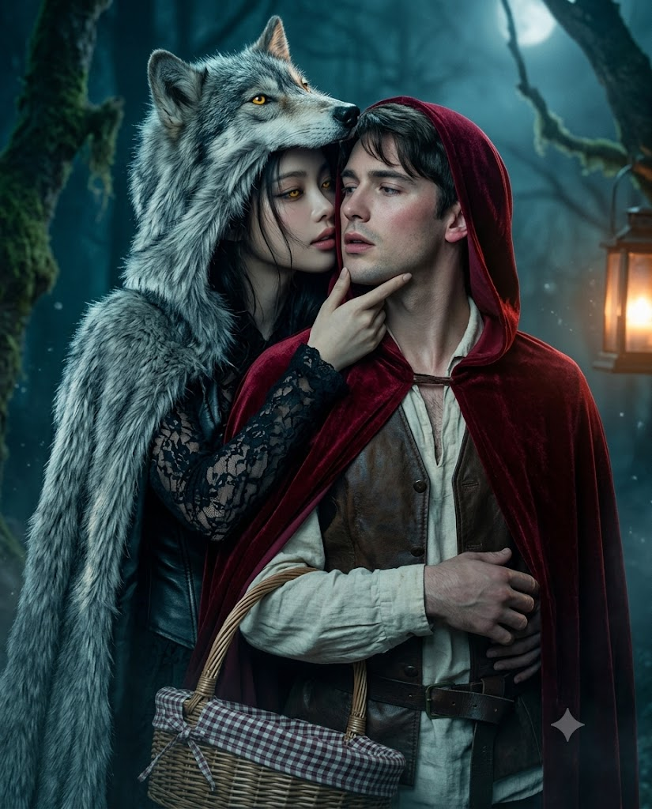
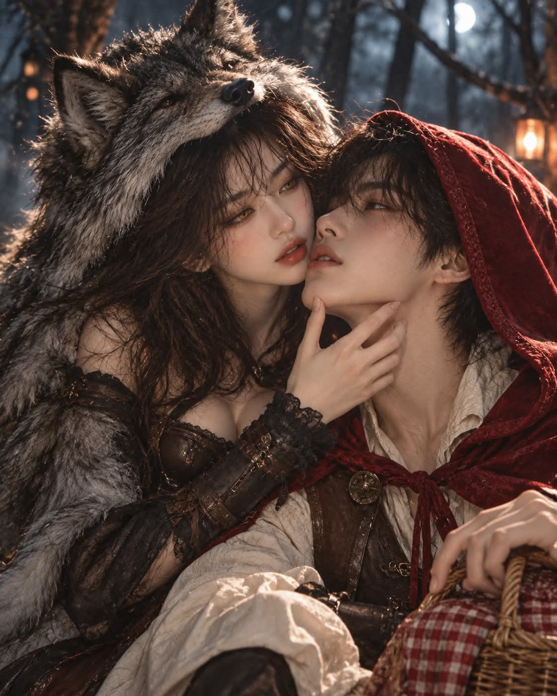

# 늑대후드 여자와 빨간망토 남자 백허그 시네마틱 판타지 스틸컷 프롬프트

## 1. 개요 및 아트 디렉팅 가이드

- **컨셉**: 동화 '빨간 망토'의 역할을 뒤집어, 늑대 털 후드를 쓴 여자가 빨간 망토의 남자를 뒤에서 껴안은 키스 직전의 순간을 담은 시네마틱 판타지 영화 스틸컷 (세로 4:5 실사)
- **업로드 사진 사용 규칙**:
  - 닮음이 장면 연출보다 우선. 눈·코·입의 생김새와 배치 비율을 그대로 옮기고, 미화·정형화·평균화하지 않음
  - 얼굴형·피부톤·헤어·표정·고개 각도·시선은 사진에서 가져오지 않고 프롬프트 서술대로 새로 그림
  - 사진에 안경이 있으면 테와 렌즈를 그대로 유지하고, 없으면 그리지 않음
  - 사진 2장이면 첫 번째는 늑대후드 여자, 두 번째는 빨간망토 남자에 적용하고, 1장이면 성별에 맞는 역할에만 적용
- **장면 & 구도**:
  - 안개가 낮게 깔린 깊은 밤의 동화 속 숲, 이끼 낀 고목 사이로 가늘게 쏟아지는 달빛
  - 두 사람 모두 카메라를 향한 백허그, 두 얼굴이 겹치지 않고 나란히 보이는 3/4 정면 각도, 입술 사이가 손가락 한 마디 정도인 정지된 순간
  - 정면 눈높이의 허리 위 미디엄 클로즈업
- **늑대후드 여자 (주도하는 쪽)**:
  - 늑대 귀와 주둥이가 달린 은회색·흑회색 털 후드 망토, 짙은 가죽 코르셋 조끼와 어두운 레이스 블라우스
  - 눈의 생김새는 유지한 채 홍채만 호박빛 노란색, 동공만 세로로 가늘게 바꾼 눈
  - 한 팔로 허리를 감싸고 다른 손끝으로 턱선을 돌리는 자세, 장난스럽고 위험한 미소
- **빨간망토 남자 (당하는 쪽)**:
  - 짙은 진홍색 벨벳 후드 망토, 풀어헤친 크림색 리넨 셔츠와 갈색 가죽 조끼, 손에 늘어진 등나무 바구니
  - 당황과 설렘이 섞인 얼굴, 살짝 벌어진 입술과 옅은 홍조
- **조명 & 색감**:
  - 차가운 청회색 달빛 키라이트와 따뜻한 주황빛 랜턴 림라이트, 이목구비를 살리는 정면 보조광
  - 어두운 청록·남색 톤 속에서 빨간 망토와 노란 눈만 선명하게 튀는 대비
- **화질**: 85mm 렌즈의 얕은 심도, 약간의 필름 그레인과 안개 입자, 벨벳·털 소재감

---

## 2. 프롬프트 전문

```text
[이미지 생성 프롬프트 — 늑대후드 여자와 빨간망토 남자, 백허그 키스 직전]

■ 업로드 사진 사용 규칙 (최우선)

업로드 사진 속 인물과 한눈에 같은 사람으로 알아볼 수 있어야 한다. 닮음이 장면 연출보다 우선이다.

사진에서 눈·코·입의 생김새를 정확히 그대로 옮긴다:
· 눈: 눈의 크기, 길이, 눈꼬리 각도, 쌍꺼풀 유무와 두께, 눈 사이 간격 (단, 여자의 홍채 색과 동공 모양은 아래 서술대로 바꾼다)
· 코: 콧대 높이와 폭, 코끝 모양, 콧볼 크기
· 입: 입술 두께, 윗입술·아랫입술 비율, 입꼬리 모양, 입 폭
· 눈·코·입 사이의 간격과 배치 비율

이목구비를 미화·정형화·서구화하지 않는다. 일반적인 '예쁜 얼굴'로 평균화하지 않는다.

얼굴형, 피부톤, 헤어, 이마·헤어라인, 표정, 고개 각도, 기울기, 시선 방향은 사진에서 가져오지 않는다. 표정은 아래 서술대로 새로 그리되, 표정이 바뀌어도 이목구비의 형태는 유지한다.

사진 속 인물이 안경을 쓰고 있으면 그 안경을 그대로 가져온다. 안경테의 모양, 두께, 색, 재질, 렌즈 크기를 사진과 동일하게 유지한다. 사진에 안경이 없으면 안경을 그리지 않는다.

안경은 장면 각도(3/4 정면)에 맞게 자연스럽게 얼굴에 얹히도록 다시 그리되, 디자인은 바꾸지 않는다.

사진이 2장이면 첫 번째 사진 = 늑대후드 여자, 두 번째 사진 = 빨간망토 남자. 서로의 이목구비와 안경을 섞지 않는다.

사진이 1장이면 사진 속 인물의 성별에 맞는 역할에만 적용하고, 상대 인물은 장면에 어울리는 성인 인물로 새로 그린다.

■ 장면

깊은 밤의 동화 속 숲. 안개가 낮게 깔린 이끼 낀 고목 사이로 달빛이 가늘게 쏟아진다.

늑대후드 여자가 빨간망토 남자를 뒤에서 껴안고 있다. 두 사람 모두 몸은 카메라를 향한다.

남자는 살짝 몸을 낮춰 여자에게 기대고, 정면에 가까운 얼굴로 고개만 살짝 뒤로 돌린다.

여자는 남자의 어깨 너머로 얼굴을 내밀어 입술을 가까이 가져간다.

두 얼굴이 겹치지 않고 나란히 보이며, 둘 다 양쪽 눈이 보이는 3/4 정면 각도.

입술 사이 거리는 손가락 한 마디 정도. 아직 닿지 않은, 키스 바로 직전의 정지된 순간.

카메라는 정면 눈높이, 허리 위 미디엄 클로즈업. 두 얼굴이 화면 상단 절반을 크게 차지한다.

■ 늑대후드 여자 (주도하는 쪽)

은회색·흑회색이 섞인 늑대 털 후드를 쓴 모습. 후드 정수리에 늑대 귀가 서 있고, 늑대 주둥이 부분이 이마 위로 챙처럼 드리워진다. 털 결이 풍성하고 사실적이다.

후드는 이마 위까지만 덮어 눈·코·입에 그림자가 지지 않는다.

후드는 어깨와 등을 덮는 털 망토 형태, 안에는 짙은 가죽 코르셋 조끼와 어두운 레이스 블라우스.

후드 아래로 흐트러진 긴 머리카락 몇 가닥이 뺨에 걸린다.

한 팔은 남자의 허리를 감싸 안고, 다른 손 손끝은 남자의 턱선을 살짝 잡아 자기 쪽으로 돌린다.

눈: 어둠 속 맹수처럼 빛나는 호박빛 노란 홍채. 동공은 늑대처럼 세로로 가늘게 찢어진 형태. 홍채가 달빛을 받아 은은하게 반사광을 낸다. 눈의 생김새(크기·눈꼬리·쌍꺼풀)는 사진 그대로 유지하고 홍채 색과 동공만 바꾼다.

안경을 쓴 경우 렌즈 너머로 노란 홍채와 세로 동공이 선명하게 보여야 한다. 렌즈에 달빛이 비쳐 눈이 가려지지 않게 하고, 노란 눈빛이 렌즈 안쪽에서 은은하게 빛나도록 한다. 안경다리는 늑대 후드 안쪽으로 자연스럽게 들어간다.

표정: 남자의 입술을 내려다보는 사냥감을 노리는 시선, 입꼬리에 장난스럽고 위험한 미소.

■ 빨간망토 남자 (당하는 쪽)

짙은 진홍색 벨벳 후드 망토, 후드를 머리에 쓰고 있으며 후드 가장자리 안쪽에 달빛이 은은하게 걸린다. 후드가 얼굴에 그림자를 드리우지 않는다.

망토 안에는 풀어헤친 크림색 리넨 셔츠와 갈색 가죽 조끼, 허리에 가죽 벨트.

한 손은 허리를 감싼 여자의 팔 위에 겹쳐 올려져 있고, 다른 손에는 체크 천이 덮인 등나무 바구니가 힘없이 늘어져 있다.

헤어는 후드 아래로 살짝 내려온 앞머리.

안경을 쓴 경우 안경다리는 빨간 후드 안쪽으로 자연스럽게 들어간다.

표정: 당황과 설렘이 섞인 얼굴, 살짝 벌어진 입술, 눈을 반쯤 감기 직전. 귀와 볼에 옅은 홍조.

■ 조명·색감

차가운 청회색 달빛 키라이트 + 화면 밖 랜턴의 따뜻한 주황빛 림라이트가 두 얼굴 윤곽을 감싼다.

얼굴 정면에 부드러운 보조광을 더해 이목구비가 선명히 보이게 한다.

전체는 어두운 청록·남색 톤. 빨간 망토와 여자의 노란 눈만 선명하게 튀는 대비.

■ 화질·스타일

시네마틱 판타지 영화 스틸컷, 실사, 85mm 렌즈, 얕은 심도.

얼굴은 선명하게 초점, 털 끝과 배경만 흐리게 보케.

필름 그레인 약간, 미세한 안개 입자, 피부 질감과 벨벳·털 소재감이 살아있게.

■ 금지

입술이 실제로 닿은 키스 장면 금지 (반드시 닿기 직전).

업로드 사진의 고개 각도·표정·헤어·배경 반영 금지.

여자 눈의 생김새 자체를 늑대 눈으로 바꾸는 것 금지 (홍채 색과 동공만 변경).

남자 눈은 평범한 사람 눈 유지.

사진에 있는 안경을 빼거나 다른 디자인으로 바꾸는 것 금지.

사진에 없는 안경을 새로 추가하는 것 금지.

렌즈 반사광이 눈을 가리는 것 금지.

텍스트, 로고, 워터마크 생성 금지.

비율 4:5 세로.
```

---

## 3. 결과물 비교 갤러리

| 생성 모델 | 생성 결과 이미지 |
| :--- | :--- |
| **제미나이 (Gemini)** |  |
| **ChatGPT (DALL-E 3)** |  |
