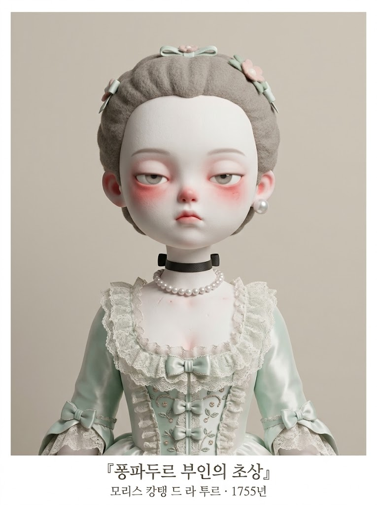
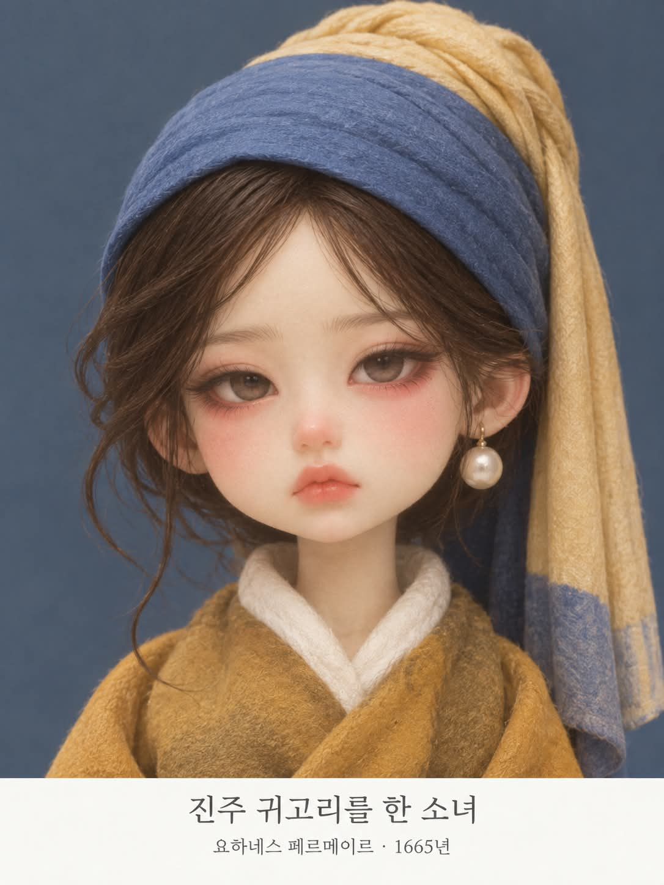

# 명화 코스튬 뾰루퉁 미니미 디자이너 아트토이 증명사진 프롬프트

## 1. 개요 및 아트 디렉팅 가이드

- **컨셉**: 관상 분석을 통해 인물과 가장 닮은 서양 고전 명화 초상화를 매칭하고, 광택 없는 매트한 소프트 비닐 질감의 '뾰루퉁 미니미 디자이너 아트토이' 증명사진 구도로 정교하게 재해석한 캐릭터 아트워크
- **7단계 명화 매칭 & 검증 알고리즘**:
  1. **관상 분석**: 성별/나이대, 눈매, 코/입매, 분위기 형용사 2개 구체적 명시
  2. **후보 5점 선별**: 화가 상이, 최소 3개 시대(르네상스/바로크/로코코/19세기/20세기 등), 최소 2개 지역의 옷을 갖춰 입은 동성 인물 초상화 선정
  3. **제외 룰**: 「진주 귀걸이를 한 소녀」 및 누드/신화화 엄격 배제
  4. **형태적 대조**: 분석된 이목구비와 가장 구체적으로 닮은 1점 최종 선정
  5. **원작 의상 요소 추출**: 머리 장식, 헤어, 칼라/소매/몸판, 장신구의 원작 디테일 확인
  6. **검증 및 재선정**: 복식 요소 추측 불가 시 차순위 후보로 자동 재선정
  7. **재현 및 사전 안내**: 도출 결과와 명화 정보(제목, 화가, 연도, 선정 이유, 의상 요소) 선행 텍스트 출력
- **미니미 얼굴 & 아트토이 스타일**:
  - **피부 & 질감**: 창백할 만큼 하얀 아이보리 톤의 매트하고 보송한 소프트 비닐 피규어 질감
  - **눈매 & 블러셔**: 윗눈꺼풀이 반쯤 내려온 나른한 아몬드형 눈, 눈가 전체와 볼에 번진 붉은 블러셔, 빨갛게 상기된 둥근 단추 코
  - **표정**: 입을 꾹 다문 채 입꼬리가 살짝 내려간 시큰둥하고 새침한 뾰루퉁(Pouty) 표정
  - **헤어 & 안경**: 양모·펠트 질감의 부드럽게 뭉친 헤어, 사진 속 안경·선글라스 형태/틴트 100% 보존 착용
- **증명사진 구도 & 타이포그래피**:
  - 세로 3:4 비율, 정면 좌우대칭 바스트 구도, 채도 낮은 단색 파스텔 스튜디오 배경
  - 프레임 하단 얇은 흰색 여백 띠에 세리프체로 1행: 명화 한국어 제목, 2행: 화가명(한국어) · 제작 연도 중앙 정렬 표기

---

## 2. 프롬프트 전문

```text
[작업 개요]
업로드한 사진 속 인물을 "미니미 디자이너 아트토이 인형"으로 새로 만들어 증명사진 구도로 촬영한 이미지를 생성해줘.
업로드 사진은 얼굴 이목구비와 안경·선글라스 참고용으로만 사용하고, 그 외의 모든 요소는 아래 서술대로 새로 만든다.

[사진에서 가져올 것 / 가져오지 말 것]
- 사진에서는 눈, 코, 입의 생김새(모양, 크기 비율, 눈매 방향, 입술 형태)만 가져온다.
- 얼굴형, 피부, 헤어스타일, 이마와 헤어라인, 표정은 사진에서 가져오지 않는다.
- 사진 속 고개 기울기, 얼굴 방향, 시선 방향, 각도는 절대 가져오지 않는다.
- 가져온 이목구비는 아래 아트토이 스타일로 단순화하되, 보는 사람이 "이 사람을 닮은 인형"이라고 알아볼 수 있을 만큼 특징(눈매 기울기, 코 크기, 입 모양)을 살린다.

[안경·선글라스]
- 사진 속 인물이 안경이나 선글라스를 쓰고 있으면 인형에도 반드시 씌운다.
- 테 모양(둥근테, 사각테, 하금테, 무테 등), 테 두께, 테 색, 렌즈 색과 농도를 사진과 똑같이 맞춘다.
- 인형의 큰 얼굴 비율에 맞게 크기만 키우고, 아트토이답게 형태를 살짝 둥글고 단순하게 정리한다. 테는 매트한 질감.
- 투명 안경이면 렌즈 너머로 인형의 눈이 또렷하게 보이게 한다.
- 선글라스면 렌즈가 눈을 가린 그대로 표현하고, 렌즈 아래로 붉은 블러셔가 살짝 보이게 한다.
- 정면 증명사진 구도에 맞춰 안경도 좌우 대칭, 수평으로 반듯하게 씌운다.
- 사진 속 인물이 안경이나 선글라스를 쓰지 않았다면 인형에도 씌우지 않는다.

[미니미 얼굴 스타일 - 디자이너 아트토이]
- 부드러운 3D 렌더링으로 만든 소프트 비닐 디자이너 아트토이 느낌. 광택 없는 매트하고 보송한 질감.
- 단순하고 둥근 캐릭터 피규어 형태를 유지한다.
- 머리가 몸보다 훨씬 크고, 몸은 가늘고 작은 비율. 턱이 작고 이마가 넓은 둥근 얼굴.
- 피부는 창백할 만큼 하얀 아이보리 톤, 파우더를 바른 듯 매끈하고 보송함.
- 눈: 크고 옆으로 긴 아몬드형 눈, 윗눈꺼풀이 반쯤 내려온 나른한 눈매. 눈동자는 크고 옅은 회갈색, 하이라이트는 거의 없거나 아주 은은하게. 속눈썹은 거의 보이지 않게 단순하게.
- 눈 밑과 눈가 전체에 붉은 기가 번진 듯한 진한 블러셔, 코끝도 빨갛게 상기된 느낌.
- 코는 작고 동그란 단추 모양. 입은 아주 작고, 입꼬리가 살짝 내려간 형태.
- 눈썹은 가늘고 옅게, 미간 쪽이 살짝 올라간 모양.
- 귀는 작고 둥글며 끝이 살짝 붉다.
- 모발은 굵은 가닥이 부드럽게 뭉쳐진 매트한 양모·펠트 같은 질감, 가닥 결이 은은하게 보인다.
- 실제 피규어를 촬영한 듯한 3D 렌더 질감.

[표정]
- 사진의 표정은 무시하고 새로 그린다.
- 입을 꾹 다문 채 살짝 뾰로통하고 시큰둥한 표정, 졸린 듯 반쯤 감긴 눈으로 정면을 바라본다. 새침하고 귀여운 뚱한 인상.

[명화 선택 규칙 - 반드시 순서대로]
1. 업로드 사진의 관상을 분석해 아래 4가지를 한 줄씩 적는다.
- 성별과 나이대 인상
- 눈매 (길이, 기울기, 쌍꺼풀, 눈두덩)
- 코와 입매가 주는 인상
- 전체 분위기를 나타내는 형용사 2개
2. 후보는 "옷을 갖춰 입은 인물을 그린 유명 초상화"로만 한정하고, 후보 5점을 먼저 나열한다. 조건:
- 5점 모두 화가가 서로 달라야 한다.
- 시대를 최소 3개 이상으로 나눈다 (르네상스 / 바로크 / 18세기 로코코 / 19세기 / 20세기 초 등).
- 지역을 최소 2개 이상으로 나눈다 (이탈리아, 플랑드르·네덜란드, 스페인, 프랑스, 영국, 독일, 오스트리아 등).
- 사진 속 인물과 같은 성별의 인물 초상화로만 고른다.
3. 「진주 귀걸이를 한 소녀」(페르메이르)는 너무 자주 선택되므로 후보에서 제외한다.
4. 5점 각각에 대해 "그림 속 인물의 얼굴 특징이 1번 분석의 어느 항목과 닮았는지"를 한 줄씩 적고, 가장 구체적으로 닮은 1점을 고른다. 유명도는 선택 기준에서 완전히 제외한다.
5. 고른 그림 속 인물이 실제로 입고 있는 것을 이미지 생성 전에 아래 항목별로 글로 먼저 적는다.
- 머리 장식과 헤어
- 옷의 형태(칼라, 소매, 몸판)와 색
- 장신구
6. 5번 항목 중 하나라도 구체적으로 적을 수 없거나 추측으로 채워야 한다면, 그 그림은 버리고 2번 후보 중 다음으로 닮은 그림으로 넘어가 5번부터 다시 한다. 후보 밖에서 새로 가장 유명한 작품을 떠올려 대체하지 않는다.
7. 적은 내용만 그대로 재현한다. 단, 사진 속 안경·선글라스는 예외로 함께 씌운다.

[의상 표현]
- 5번에서 적은 대표 요소(머리 장식, 칼라, 장신구, 의상 색 조합)는 반드시 바스트 구도 안에 모두 보이게 넣는다.
- 형태는 아트토이답게 부드럽고 단순하게 정리하고, 원단은 매트한 니트·펠트·면 같은 포근한 질감으로 표현한다.
- 헤어도 그림 속 인물의 헤어를 위 모발 질감으로 재해석해 표현한다.

[안내 문구]
- 이미지 생성 전에 아래 내용을 한국어로 먼저 알려준다.
- 1번 관상 분석 4줄
- 2번에서 나열한 후보 5점 (제목 · 화가 · 시대 · 지역)
- 최종 선택한 명화 제목, 화가, 제작 연도
- 그 명화를 고른 이유 2~3줄 (그림 속 인물 얼굴과 닮은 점 중심)
- 5번에서 적은 그림 속 의상 요소

[구도 - 증명사진]
- 정면을 똑바로 바라보는 증명사진 자세. 고개 기울기 없이 좌우 대칭.
- 머리 끝부터 가슴 위까지 나오는 상반신 바스트 구도, 인물이 화면 정중앙.
- 양어깨가 수평이고, 시선은 정면 카메라를 향한다.
- 선택한 명화의 원래 구도(측면, 고개 돌림, 어깨 너머 시선 등)는 따르지 않고, 반드시 정면 증명사진 구도로 바꾼다.

[배경과 조명]
- 증명사진처럼 단색의 부드러운 배경. 배경색은 선택한 명화 의상과 잘 어울리는 채도 낮은 차분한 톤으로 정한다.
- 정면에서 들어오는 고르고 확산된 부드러운 스튜디오 조명.
- 전체 색감은 채도를 낮춘 파스텔톤, 붉은 블러셔만 포인트로 살아 있게.

[작품 정보 표기]
- 증명사진 프레임 하단에 인물과 겹치지 않는 얇은 흰색 여백 띠를 두고, 그 안에 작품 정보를 표기한다.
- 첫째 줄: 선택한 명화의 한국어 제목 (가장 크게)
- 둘째 줄: 화가 이름(한국어) · 제작 연도 (작게)
- 글꼴은 깔끔한 세리프체, 짙은 회색, 가운데 정렬.
- 한글 철자가 틀리거나 깨지지 않게 정확하게 쓴다.

[비율]
- 세로 3:4 비율의 증명사진 프레임.

[금지 사항]
명화 선택
- 「진주 귀걸이를 한 소녀」 선택 금지
- 후보 5점을 나열하지 않고 바로 한 점을 고르는 것 금지
- 유명하다는 이유로 고르는 것 금지
- 누드화, 반라, 천이나 시트만 걸친 인물, 뒷모습 인물의 그림 선택 금지
- 여신, 님프, 목욕, 오달리스크처럼 벗은 몸이 주로 그려지는 신화·누드 주제의 그림 선택 금지
- 풍경화, 정물화, 추상화, 인물이 작게 그려진 그림 선택 금지
- 그림 속 의상을 확실히 모르는 작품 선택 금지

의상
- 그림에 없는 옷, 머리 장식, 장신구를 새로 지어내기 금지 (사진 속 안경·선글라스만 예외)
- 그림 색감만 빌려와 다른 드레스를 만드는 것 금지
- 대표 요소가 프레임 밖으로 잘리게 하는 것 금지

얼굴과 스타일
- 레진 구체관절 인형, 유리 안구 인형처럼 표현 금지
- 실사 사람 얼굴, 2D 일러스트, 애니메이션 그림체 금지
- 광택 나는 피부, 모공·피부 결 묘사 금지
- 가늘고 흩날리는 실제 머리카락 표현 금지
- 사진 속 얼굴형, 피부, 헤어, 이마·헤어라인, 표정을 가져오기 금지
- 사진 속 고개 기울기, 얼굴 방향, 시선 각도를 가져오기 금지
- 웃는 표정, 입 벌린 표정 금지

안경·선글라스
- 사진에서 쓰고 있던 안경·선글라스를 빼먹기 금지
- 사진과 다른 테 모양, 테 색, 렌즈 색으로 바꾸기 금지
- 사진에 없던 안경·선글라스를 새로 씌우기 금지
- 비뚤어지거나 한쪽으로 기운 안경 금지

구도와 배경
- 고개 기울임, 측면, 비스듬한 각도 금지
- 명화 원본의 측면·고개 돌린 구도를 그대로 따르는 것 금지
- 손이 화면에 나오는 것 금지
- 소품, 가구, 장식, 패턴이 있는 배경 금지
- 강한 그림자, 강한 반사광 금지

글자
- 작품 정보 표기 외에 어떤 글자, 로고, 워터마크도 넣지 않기
- 한글 오타, 깨진 글자 금지
```

---

## 3. 결과물 비교 갤러리

| 생성 모델 | 생성 결과 이미지 |
| :--- | :--- |
| **제미나이 (Gemini)** |  |
| **ChatGPT (DALL-E 3)** |  |
