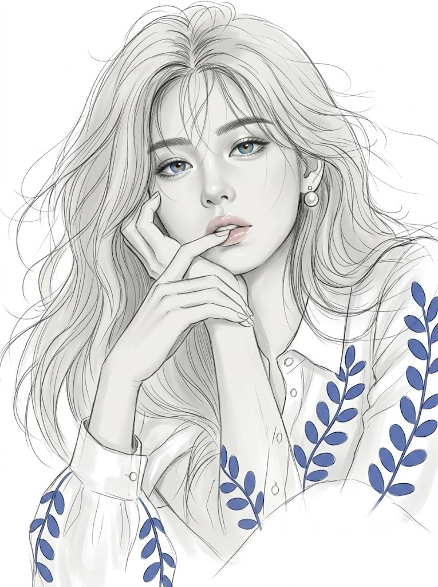
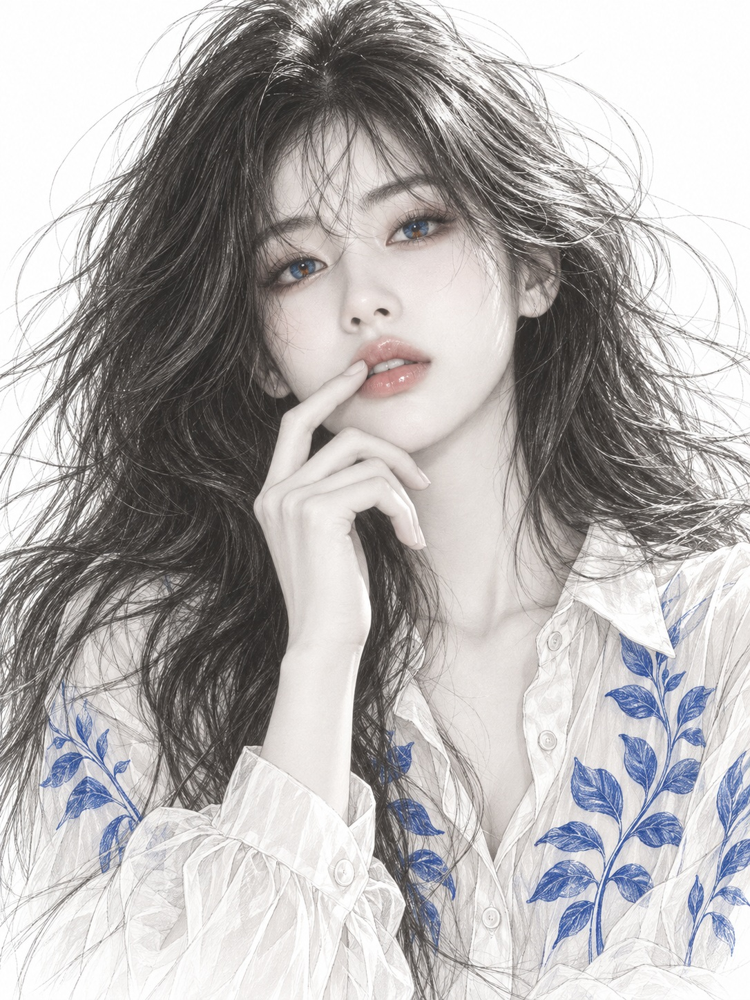

# 사실주의 연필 스케치, 하이키 모노톤 패션 일러스트 초상 프롬프트

## 1. 개요 및 아트 디렉팅 가이드

- **컨셉**: 매끈한 세미리얼리즘 디지털 페인팅의 얼굴과 흩날리는 연필 스케치 라인 아트를 결합한 하이키 모노톤 패션 일러스트 바스트 샷 초상. 색은 푸른 눈동자, 연분홍 입술, 블라우스의 푸른 잎사귀 세 곳에만 사용. GPT용과 Gemini용 두 버전으로 작성
- **버전별 차이**:
  - **GPT 버전**: 색 제한, 동일 인물, 착용품, 포즈, 표정, 헤어, 의상, 화풍, 배경을 항목별로 나눈 규칙형 프롬프트
  - **Gemini 버전**: 같은 내용을 문단으로 풀어 쓴 서술형 프롬프트
- **색 제한 규칙 (가장 중요)**:
  - 그림 전체는 밝은 회백색 위주의 하이키 모노톤 그레이스케일, 피부도 맑은 회백색 톤
  - **눈동자**: 채도 높고 맑게 빛나는 푸른색에 동공 주변의 작은 주황빛 얼룩
  - **입술**: 거의 투명에 가까운 연한 핑크 글로스
  - **블라우스 잎사귀 무늬**: 코발트 블루
  - 피부톤, 볼 홍조, 아이섀도, 머리카락 색, 원단 색 등 그 외의 색은 모두 금지
- **동일 인물 규칙**:
  - 눈·눈썹·코·인중·입술의 형태와 점·보조개 같은 고유한 특징을 사진 그대로 옮겨, 친구나 가족이 바로 알아볼 수 있게 유지
  - 인종적 특징과 전체 인상을 유지하고, 각도·시선·표정·헤어·의상·배경·조명만 새로 그림
  - 안경·선글라스·얼굴 피어싱은 사진에 있을 때만 같은 디자인으로 착용
- **포즈 & 표정**:
  - 고개를 살짝 뒤로 젖히고 턱을 들어 보는 사람을 내려다보는 자세, 검지 끝이 윗입술 가장자리에 살며시 닿은 손
  - 눈꺼풀을 살짝 내린 나른한 눈빛과 살짝 벌어진 입술, 차갑고 시크하면서도 몽환적인 분위기
- **헤어 & 의상**:
  - 여성은 가운데 가르마의 풍성하게 흐트러진 긴 머리, 남성은 이마가 살짝 드러나는 단정한 짧은 머리. 잔머리 몇 가닥이 가는 선이 되어 화면 밖으로 뻗어 나감
  - 얇게 비치는 화이트 오간자 셔츠 블라우스, 가슴 양쪽과 소매 위쪽의 큼직한 잎사귀 가지 무늬
- **화풍 & 배경**:
  - 얼굴과 손은 에어브러시로 매끈하게 블렌딩된 도자기 같은 피부, 머리카락과 블라우스는 가늘고 긴 흑연 선과 겹쳐 그은 스케치 흔적
  - 아무것도 없는 깨끗한 순백 배경, 아래쪽 블라우스는 선이 성겨지며 배경 속으로 사라짐

---

## 2. 프롬프트 전문

### GPT 버전

```text
업로드한 얼굴 사진을 바탕으로, 세미리얼리즘 디지털 일러스트와 연필 스케치 라인 아트가 결합된 하이키 모노톤 패션 일러스트 바스트 샷 초상화를 그려줘.

[가장 중요 – 색 제한 규칙]
- 그림 전체는 밝은 회백색 위주의 하이키 모노톤 그레이스케일이며, 얼굴과 손의 피부도 맑은 회백색 톤으로만 표현한다.
- 색은 오직 아래 세 곳에만, 정해진 영역 안에서만 칠한다. 경계 밖으로 번지거나 물들지 않는다.
1) 눈동자(홍채)만: 채도 높고 맑게 빛나는 푸른색 벽안, 동공 주변에 주황빛이 작은 얼룩처럼 조금 섞인다. 눈 흰자, 눈꺼풀, 눈두덩, 속눈썹은 회색.
2) 입술 안쪽만: 거의 투명에 가까운 연한 핑크 글로스. 빨강·코랄·진한 립스틱 색이 아니라 맑은 분홍빛이 얇게 비치는 정도.
3) 블라우스 잎사귀 무늬만: 코발트 블루.
- 절대 금지: 피부톤(살구색·베이지·분홍), 볼 홍조, 아이섀도, 아이라인 색, 코끝·귀·눈가·손끝의 붉은 기, 손톱 색, 머리카락 색, 블라우스 원단 색, 안경·선글라스 색.

[동일 인물 – 가장 중요]
- 그림 속 인물은 업로드 사진 속 인물과 반드시 동일 인물이다. 친구나 가족이 보자마자 알아볼 수 있을 만큼 얼굴 인상을 정확하게 유지한다.
- 사진 그대로 옮길 것: 눈의 모양과 크기, 쌍꺼풀 유무와 형태, 눈꼬리 방향, 두 눈 사이 간격, 눈썹 모양과 두께, 콧대 높이와 코끝 모양, 콧볼 너비, 인중 길이, 입술 두께와 입꼬리 모양, 점·보조개 같은 고유한 특징.
- 인종적 특징과 얼굴의 전체 인상도 사진과 같게 유지한다. 일러스트 화풍으로 다듬되 다른 사람 얼굴이나 서구적인 얼굴로 바꾸지 않는다.
- 사진에서 가져오지 않을 것: 머리 각도, 고개 기울기, 시선, 표정, 헤어스타일, 의상, 배경, 조명.

[얼굴 착용품 – 사진에 있을 때만]
- 사진 속 인물이 안경, 선글라스, 얼굴 피어싱 등을 착용하고 있으면 같은 디자인으로 그대로 착용시킨다. 없으면 아무것도 추가하지 않는다.
- 착용품은 아래 자세의 고개 각도에 맞게 다시 그린다.
- 안경: 투명 렌즈 너머로 눈동자가 또렷하게 보인다.
- 선글라스: 렌즈는 반투명한 연한 회색 틴트로, 렌즈 너머로 푸른 눈동자가 비쳐 보인다.
- 착용품은 회색 톤의 가는 라인으로 표현한다.

[포즈와 구도 – 고정]
- 고개를 살짝 뒤로 젖히고 턱을 약간 들어, 얼굴이 아주 조금 위를 향하며 한쪽으로 미세하게 기울어진 자세.
- 화면 아래쪽에서 한 손이 올라와, 검지 끝이 윗입술 가장자리에 살며시 닿아 있다. 나머지 손가락은 부드럽게 구부러져 턱 아래로 흘러내린다. 손에는 아무것도 들고 있지 않다.
- 바스트 샷: 머리 윗부분부터 가슴 위쪽까지, 얼굴은 화면 중앙보다 약간 위.

[표정과 분위기 – 새로 그림]
- 눈꺼풀을 아주 살짝만 내려 나른한 눈빛이지만, 본래 눈매의 모양이 그대로 드러날 만큼 충분히 떠 있다. 내려다보는 듯한 시선으로 보는 사람을 바라본다.
- 입술은 힘을 빼고 아주 살짝 벌어져, 숨을 내쉬는 듯한 순간.
- 몽환적이고 퇴폐적인 무드, 차갑고 시크하면서도 나른한 관능미.

[헤어]
- 여성으로 보이면: 가운데 가르마의 긴 머리가 얼굴 주변으로 풍성하게 흐트러져 어깨 뒤로 흘러내린다.
- 남성으로 보이면: 이마가 살짝 드러나는 단정한 짧은 머리.
- 머리카락 바깥쪽 잔머리 몇 가닥이 가는 선이 되어 바람에 날리듯 화면 밖으로 길게 뻗어 나간다.

[의상 – 고정]
- 얇고 비치는 오간자(시어) 소재의 화이트 롱슬리브 셔츠 블라우스.
- 작고 단정한 셔츠 칼라, 첫 단추를 하나 풀어 목선이 살짝 드러나고, 앞중심에 작은 단추가 일렬로 달려 있다.
- 가슴 양쪽에 큼직한 잎사귀 가지 모티프가 앞중심 기준 좌우 대칭으로 하나씩. 끝이 둥근 타원형 잎이 줄기 양옆으로 마주 달린 형태, 잎맥이 가는 선으로 표현됨.
- 같은 잎사귀 가지 모티프가 양쪽 소매 위쪽에도 세로로 길게 들어가 있다.
- 소매는 풍성하고 넉넉한 실루엣.

[화풍]
- 얼굴과 손: 세미리얼리즘 디지털 페인팅. 실사에 가까운 입체감이지만 모공·잡티 없이 에어브러시로 매끈하게 블렌딩된 도자기 같은 피부, 또렷하고 날카로운 눈썹, 길고 가는 목선의 미형 일러스트.
- 머리카락과 블라우스: 연필 스케치 라인 아트. 가늘고 긴 흑연 선이 자유롭게 휘날리며, 윤곽선 밖으로 제스처 선이 삐져나가고 여러 번 겹쳐 그은 듯한 스케치 흔적이 보인다. 면은 거의 칠하지 않고 선 위주로 표현한다.
- 얼굴의 매끈한 블렌딩과 바깥의 흩날리는 선이 강한 대비를 이룬다.
- 그림자는 진하지 않고 옅은 회색, 전체적으로 밝고 화사하고 차가운 하이키 톤.
- 눈동자는 그림에서 가장 선명하게 빛나는 포인트로, 홍채 결과 하이라이트가 섬세하다.

[배경]
- 아무것도 없는 깨끗한 순백 배경. 종이 질감, 지우개 자국, 얼룩 없음.
- 화면 아래쪽 블라우스는 선이 점점 성겨지며 흰 배경 속으로 자연스럽게 사라진다.

결과물은 깔끔한 하이키 모노톤 패션 일러스트이며, 색은 빛나는 푸른 눈동자, 투명한 연분홍 입술, 블라우스의 푸른 잎사귀 세 곳에만 있어야 한다. 그리고 무엇보다 업로드한 사진 속 바로 그 사람의 얼굴이어야 한다.
```

### Gemini 버전

```text
업로드한 사진 속 인물을 주인공으로, 세미리얼리즘 디지털 일러스트와 연필 스케치 라인 아트가 결합된 하이키 모노톤 패션 일러스트 바스트 샷 초상화를 만들어줘.

이 그림의 인물은 업로드한 사진 속 인물과 반드시 동일 인물이다. 친구나 가족이 보자마자 그 사람이라고 알아볼 수 있을 만큼 얼굴 인상을 정확하게 유지해줘. 눈의 모양과 크기, 쌍꺼풀 유무와 형태, 눈꼬리 방향, 두 눈 사이 간격, 눈썹 모양과 두께, 콧대 높이와 코끝 모양, 콧볼 너비, 인중 길이, 입술 두께와 입꼬리 모양, 점이나 보조개 같은 고유한 특징을 사진 그대로 옮겨 그린다. 인종적 특징과 얼굴의 전체 인상도 사진과 같게 유지하고, 일러스트로 다듬되 다른 사람 얼굴이나 서구적인 얼굴로 바꾸지 않는다. 머리 각도, 시선, 표정, 헤어, 의상, 배경, 조명만 사진과 상관없이 아래 묘사대로 새로 그려줘. 사진 속 인물이 안경이나 선글라스, 얼굴 피어싱을 착용하고 있다면 같은 디자인 그대로 착용한 모습으로 그리고, 선글라스 렌즈는 반투명한 연회색이라 그 너머로 눈동자가 비쳐 보인다.

인물은 고개를 살짝 뒤로 젖히고 턱을 들어, 한쪽으로 미세하게 기울어진 얼굴로 보는 사람을 내려다보고 있다. 눈꺼풀을 아주 살짝만 내려 나른한 눈빛이지만 본래 눈매의 모양이 그대로 드러날 만큼 충분히 떠 있고, 힘을 뺀 입술은 숨을 내쉬듯 아주 살짝 벌어져 있다. 화면 아래쪽에서 올라온 한 손의 검지 끝이 윗입술 가장자리에 살며시 닿아 있고, 나머지 손가락은 부드럽게 구부러져 턱 아래로 흘러내린다. 손에는 아무것도 들고 있지 않다. 몽환적이고 퇴폐적이며, 차갑고 시크하면서도 나른한 관능미가 흐르는 분위기다.

여성이라면 가운데 가르마의 긴 머리가 얼굴 주변으로 풍성하게 흐트러져 어깨 뒤로 흘러내리고, 남성이라면 이마가 살짝 드러나는 단정한 짧은 머리다. 잔머리 몇 가닥은 가는 선이 되어 바람에 날리듯 화면 밖으로 길게 뻗어 나간다. 옷은 얇게 비치는 화이트 오간자 셔츠 블라우스로, 작은 셔츠 칼라에 첫 단추가 풀려 있고 앞중심에 작은 단추가 줄지어 있다. 가슴 양쪽에는 둥근 타원형 잎이 줄기 양옆으로 마주 달린 큼직한 잎사귀 가지 무늬가 좌우 대칭으로 들어가 있고, 같은 무늬가 풍성한 소매 위쪽에도 세로로 길게 이어진다.

그림 전체는 밝은 회백색 위주의 하이키 모노톤이고, 피부도 맑은 회백색 톤이다. 색은 딱 세 곳에만 있다. 홍채는 채도 높고 맑게 빛나는 푸른 벽안에 동공 주변으로 주황빛이 작은 얼룩처럼 섞여 있고, 입술은 거의 투명한 연분홍 글로스가 얇게 비치며, 블라우스의 잎사귀 무늬는 코발트 블루다. 피부, 눈가, 볼, 손끝, 머리카락, 블라우스 원단은 모두 순수한 회색 톤이다.

얼굴과 손은 세미리얼리즘 디지털 페인팅으로, 실사에 가까운 입체감이지만 모공이나 잡티 없이 에어브러시로 매끈하게 블렌딩된 도자기 같은 피부, 또렷하고 날카로운 눈썹, 길고 가는 목선을 가진 미형 일러스트다. 반면 머리카락과 블라우스는 연필 스케치 라인 아트로, 가늘고 긴 흑연 선이 자유롭게 휘날리고 윤곽 밖으로 제스처 선이 삐져나가며 여러 번 겹쳐 그은 스케치 흔적이 보인다. 얼굴의 매끈함과 바깥의 흩날리는 선이 강한 대비를 이룬다. 그림자는 옅은 회색이라 전체가 밝고 화사하며 차갑다. 눈동자는 그림에서 가장 선명하게 빛나는 포인트다.

배경은 아무것도 없는 깨끗한 순백이며, 화면 아래쪽 블라우스는 선이 점점 성겨지며 흰 배경 속으로 자연스럽게 사라진다.

깔끔하고 세련된 하이키 모노톤 패션 일러스트. 그리고 무엇보다 업로드한 사진 속 바로 그 사람의 얼굴이어야 한다.
```

---

## 3. 결과물 비교 갤러리

| 생성 모델 | 생성 결과 이미지 |
| :--- | :--- |
| **제미나이 (Gemini)** |  |
| **ChatGPT (DALL-E 3)** |  |
