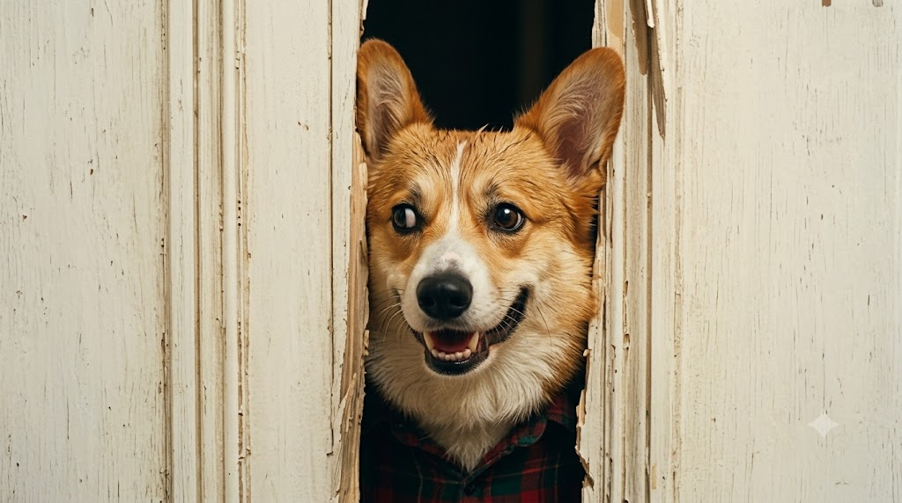
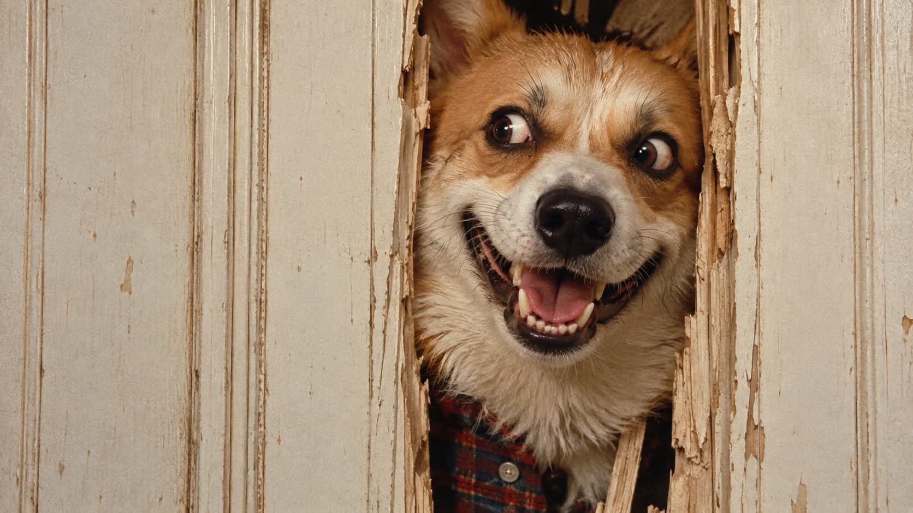

# 부서진 문 구멍 광기 어린 미소 1980년대 시네마틱 영화 스틸컷 프롬프트

## 1. 개요 및 아트 디렉팅 가이드

- **컨셉**: 도끼로 부순 문 구멍 사이로 얼굴을 들이민 광기 어린 미소의 장면을, 1980년대 35mm 필름 질감의 가로 16:9 시네마틱 영화 스틸컷으로 재현. 업로드한 사진의 대상이 남성·여성·동물 중 무엇인지에 따라 맞춰 그림
- **배경 & 구도**:
  - 화면 전체를 채운 크림빛 흰색 페인트칠 나무 패널 문, 군데군데 벗겨진 페인트와 긁힌 자국
  - 문 중앙에서 약간 오른쪽, 쪼개진 생나무 조각이 삐죽삐죽 튀어나온 세로로 긴 구멍
  - 얼굴이 구멍을 빈틈없이 꽉 채우고, 정수리부터 셔츠 깃까지 구멍을 세로로 가득 메우는 구도
- **각도 & 표정**:
  - 정면 얼굴에서 고개를 화면 왼쪽으로 아주 살짝 기울이고, 눈동자는 왼쪽 옆으로 확 돌린 곁눈질
  - 눈썹을 높이 치켜올리고 윗니와 아랫니가 모두 드러나게 입을 크게 벌린 광기 어린 섬뜩한 미소
- **대상별 표현**:
  - **남성**: 땀으로 번들거리는 상기된 피부, 헝클어진 짧은 머리와 이마로 흘러내린 젖은 머리카락, 거뭇한 수염 자국
  - **여성**: 구멍 가장자리에 눌려 엉킨 헝클어진 긴 머리, 화장기 거의 없는 맨얼굴
  - **동물**: 사람으로 바꾸지 않고 동물 그대로, 구멍에 눌려 접힌 귀와 이빨을 전부 드러낸 미소, 사실적인 털 질감
- **의상 & 조명**: 구멍 아래쪽에 살짝 보이는 어두운 빨강·초록 체크무늬 플란넬 셔츠 깃, 부드럽고 평평한 따뜻한 실내 조명과 땀에 맺힌 하이라이트
- **얼굴 합성 규칙**:
  - 사람은 눈·코·입의 생김새만 가져오고 안경은 유지, 동물은 종·품종·털 색과 무늬·눈 색·코 모양을 그대로 유지
  - 사진 속 각도·시선·표정은 따르지 않고 프롬프트 서술대로 새로 그림

---

## 2. 프롬프트 전문

```text
가로 16:9 비율의 시네마틱 영화 스틸컷. 1980년대 35mm 필름으로 촬영한 질감, 은은한 필름 그레인, 따뜻하고 살짝 바랜 색감.

[배경과 구도]
화면 전체를 크림빛이 도는 흰색 페인트칠 나무 패널 문이 채우고 있다. 문에는 세로 홈이 여러 줄 파여 있고, 오래되어 페인트가 군데군데 벗겨지고 긁힌 자국이 있다. 문 중앙에서 약간 오른쪽에 도끼로 부순 세로로 긴 구멍이 뚫려 있다. 구멍은 딱 얼굴 하나가 겨우 들어갈 만큼 좁고, 구멍 가장자리는 날카롭게 쪼개진 생나무 조각과 거친 나뭇결 파편이 삐죽삐죽 튀어나와 있다.

[주인공 – 업로드한 사진 속 대상]
구멍 사이로 얼굴을 들이밀고 있는 것은 업로드한 사진 속 바로 그 대상이다. 결과물을 본 누구나 사진 속 대상이라고 알아볼 수 있어야 한다.
업로드 사진을 보고 남성, 여성, 동물 중 무엇인지 판단해서 그에 맞게 그린다.

얼굴이 구멍 안을 빈틈없이 꽉 채운다. 구멍의 양쪽 쪼개진 나무 가장자리가 관자놀이와 뺨, 턱선 바로 옆에 닿을 듯 붙어 있어서, 얼굴 주변으로 구멍 안쪽의 어두운 공간은 거의 보이지 않는다. 얼굴을 억지로 밀어 넣은 듯한 느낌. 정수리부터 턱 아래 셔츠 깃까지 구멍을 세로로 가득 메운다. 얼굴은 화면 세로 높이의 대부분을 차지할 만큼 크게, 가로 중앙보다 약간 오른쪽에 위치한다.

정면을 향한 얼굴에서 고개가 화면 왼쪽으로 아주 살짝 기울어져 있다. 눈동자는 화면 왼쪽 옆으로 확 돌려 곁눈질하고 있다.
표정: 눈썹(동물이면 눈 위 근육)을 높이 치켜올리고, 입은 귀에 걸릴 듯 크게 벌려 윗니와 아랫니가 모두 드러나는 광기 어린 섬뜩한 미소. 흥분과 광기가 섞인 위협적인 얼굴.

남성일 때: 땀으로 번들거리고 약간 상기된 피부. 어두운 색의 헝클어진 짧은 머리, 땀에 젖은 머리카락 몇 가닥이 이마 위로 흘러내림. 턱과 입가에 거뭇한 수염 자국.
여성일 때: 땀으로 번들거리고 약간 상기된 피부. 어두운 색의 헝클어진 긴 머리가 구멍 가장자리에 눌려 얼굴 양옆으로 엉켜 있고, 땀에 젖은 앞머리 가닥이 이마 위로 흘러내림. 수염 없음, 화장기 거의 없는 맨얼굴.
동물일 때: 사람으로 바꾸지 않고 동물 그대로 그린다. 털은 땀과 흥분으로 살짝 젖어 헝클어지고 이마 털 몇 가닥이 삐죽 뻗쳐 있다. 귀는 구멍 가장자리에 눌려 접히거나 비집고 튀어나와 있다. 입꼬리를 사람처럼 크게 끌어올려 이빨(송곳니 포함)을 전부 드러낸 광기 어린 미소를 짓는다. 실제 동물 사진처럼 사실적인 털과 피부 질감을 유지한다.

의상: 화면 아래쪽 구멍 끝에 어두운 빨강·초록 계열 체크무늬 플란넬 셔츠의 깃이 살짝 보인다. 동물도 이 셔츠를 입고 있다.

[조명]
실내의 부드럽고 평평한 따뜻한 조명. 흰 문은 약간 밝게 날아갈 듯하고, 얼굴의 땀과 젖은 털에 하이라이트가 맺힌다.

[얼굴 합성 규칙]
업로드한 사진은 얼굴 참고용으로만 사용한다.

사람일 때: 사진에서 가져오는 것은 눈, 코, 입의 생김새뿐이다. 이 세 가지는 사진 속 사람과 똑같이 닮게 그린다. 얼굴형, 피부, 헤어, 이마와 헤어라인은 사진에서 가져오지 않고 위 서술대로 그린다. 사진 속 사람이 안경을 쓰고 있으면 안경을 그대로 씌운다.

동물일 때: 사진 속 동물의 종과 품종, 털 색, 무늬, 눈 색, 코 모양을 그대로 가져와 같은 동물로 알아볼 수 있게 그린다.

사진 속 고개 기울기, 얼굴 방향, 시선, 머리 각도는 절대 가져오지 않는다. 각도와 시선은 위 서술대로만 그린다.

표정은 사진의 표정이 아니라 위에 서술한 광기 어린 미소와 치켜올린 눈썹으로 새로 그린다.

문, 구멍 크기, 얼굴이 구멍을 꽉 채운 구도, 각도, 조명, 의상은 위 서술에서 전혀 바뀌면 안 된다.

실사 사진처럼 사실적으로, 고해상도.
```

---

## 3. 결과물 비교 갤러리

| 생성 모델 | 생성 결과 이미지 |
| :--- | :--- |
| **제미나이 (Gemini)** |  |
| **ChatGPT (DALL-E 3)** |  |
