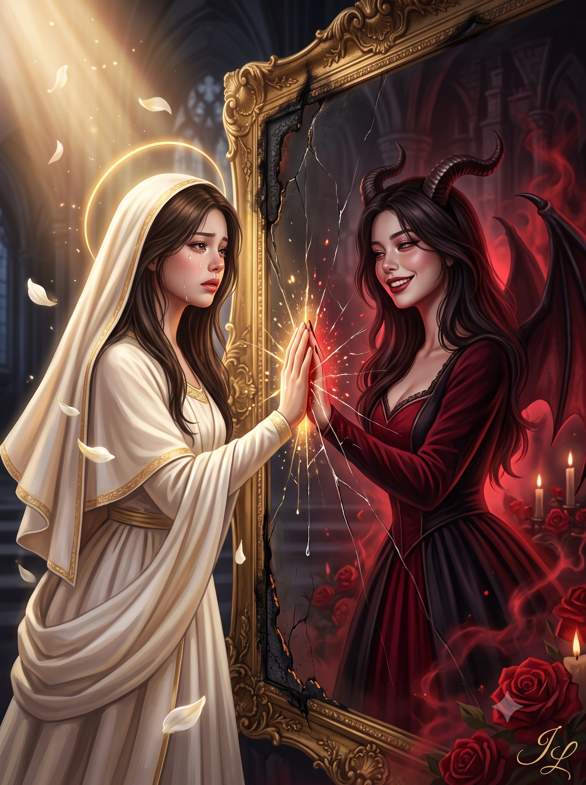
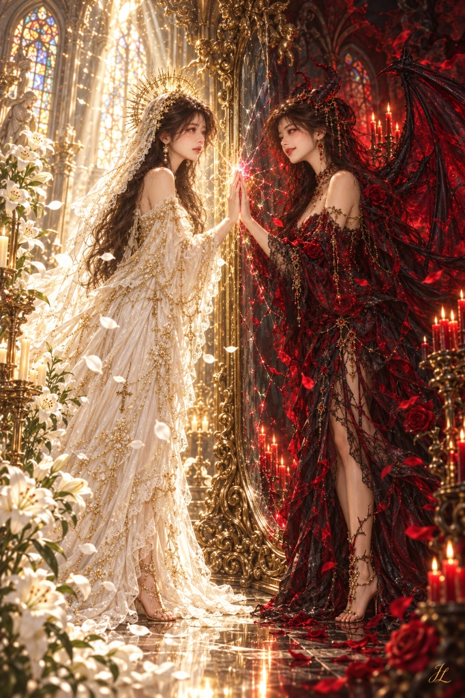

# 거울 속 성녀와 악마 로판 일러스트 프롬프트

## 1. 개요 및 아트 디렉팅 해설
- **콘셉트 테마**: 거대한 바로크 전신 거울을 사이에 두고 현실의 **순백의 성녀(Saint)**와 거울 속 **타락한 악마(Devil)**가 손바닥을 맞대고 마주 선 다크 판타지 종교화풍의 로맨스 판타지 표지 일러스트
- **핵심 아트 디렉팅 & 연출 디테일**:
  - **얼굴 동일성 & 로판풍 미화 (Face Identity)**:
    - 원본 사진의 얼굴형, 눈매, 미간, 콧대, 입술선, 턱선을 두 인물 모두에게 100% 동일하게 유지.
    - 잡티 없는 도자기 투명 피부, 깊은 안구 광채와 풍성한 속눈썹, 화사한 명암 채색으로 로판 표지 수준의 극상 미화 적용.
  - **3/4 각도와 상호 응시 (Minimal Angle & Mutual Gaze)**:
    - 완전 측면(프로필)을 배제한 3/4 각도. 카메라를 보지 않고 고개를 살짝 기울여 오직 서로의 눈동자만을 깊게 응시.
  - **극적인 표정 대비 (Tears vs Seductive Smirk)**:
    - **왼쪽 성녀**: 뺨을 타고 흐르는 투명한 눈물방울, 젖은 속눈썹과 붉어진 눈가, 슬프지만 무너지지 않는 굳건하고 성스러운 눈빛.
    - **오른쪽 악마**: 입꼬리를 매혹적으로 끌어올린 퇴폐적인 미소, 반쯤 감긴 나른한 눈매, 턱을 살짝 치켜든 조소와 유혹의 표정.
  - **거울 대칭 미러 포즈 & 마법적 충돌**:
    - 천장까지 닿는 금박 바로크 전신 거울면에 손바닥과 손가락 끝을 정확히 맞댄 좌우 대칭 포즈.
    - 맞댄 손끝에서 금빛 신성력과 핏빛 마력이 충돌하듯 터져 나오는 찬란한 빛 입자와 방사형으로 퍼져나가는 거울 표면의 미세 균열.
  - **좌우 상반된 공간과 배경 오브젝트**:
    - **왼쪽 (성녀의 영역)**: 순백과 상아색의 화려한 성의(진주와 십자가 장식), 성스러운 금빛 후광(Halo), 스테인드글라스 사이로 쏟아지는 천상의 빛, 만개한 순백의 백합과 흩날리는 백합 꽃잎.
    - **오른쪽 (악마의 영역)**: 시스루 블랙·크림슨 레이스 드레스, 검게 휘어진 악마의 뿔과 거대한 박쥐 날개, 핏빛 연기와 촛불, 흩날리는 붉은 장미 꽃잎.
  - **스튜디오 골드 시그니처**:
    - 화면 우측 하단 모서리에 은은한 골드 필기체 모노그램으로 반투명하게 새겨진 서명 **"JL"**.

---

## 2. 프롬프트 전문 (코드 블록)

```text
[0. 얼굴 고정 — 최우선]
첨부한 사진 속 얼굴과 완전히 동일한 인물로 유지할 것.
얼굴형, 눈 모양, 눈 사이 간격, 콧대, 입술 형태, 턱선을 바꾸지 말 것.
두 인물의 얼굴도 서로 완전히 동일해야 함.
로맨스 판타지 소설 표지 수준의 미화 — 도자기처럼 매끈한 피부, 크고 깊은 눈,
섬세한 턱선과 콧대, 긴 속눈썹, 화사한 채색.

[1. 시선 — 각도는 최소로]
얼굴은 3/4 각도까지만 돌릴 것. 측면(프로필)으로는 돌리지 말 것.
고개는 살짝만 안쪽으로 기울이고, 시선(눈동자)만 서로를 향하게 할 것.
두 인물 모두 카메라를 보지 말 것.
eyes looking toward each other, head turned only slightly, 3/4 view,
not full profile, no eye contact with viewer

[2. 표정 — 좌우가 완전히 달라야 함]
왼쪽 성녀: 울고 있음. 뺨을 타고 흐르는 눈물방울, 젖은 속눈썹, 붉어진 눈가,
살짝 일그러진 눈썹. 슬프지만 무너지지 않는 굳건한 눈빛.
오른쪽 악마: 활짝 웃고 있음. 입꼬리를 크게 올린 퇴폐적이고 매혹적인 미소,
반쯤 감긴 눈, 살짝 치켜든 턱, 조소하는 듯한 표정.
두 표정의 대비가 한눈에 확연히 드러나야 함.

[3. 장면]
천장까지 닿는 거대한 전신 거울. 금박 바로크 프레임이며 가장자리는 갈라지고 검게 그을려 있음.
왼쪽(현실) — 순백과 상아색 성의, 금빛 후광, 위에서 내려오는 따뜻한 성스러운 빛, 흰 백합.
오른쪽(거울 속) — 검붉은 드레스, 어둡게 휘어진 뿔, 그림자로 흩어지는 박쥐 날개,
붉은 연기빛, 붉은 장미와 촛불.

[4. 포즈]
두 인물이 거울면에 손바닥을 맞댐. 손가락 끝까지 정확히 겹쳐 정렬.
상체를 서로를 향해 약간 기울여 좌우 대칭 미러 포즈를 이룸.
화면 중앙 거울면에서 금빛과 핏빛이 수직으로 갈라짐.

[5. 연출]
성녀의 눈물 한 방울이 거울면에 닿아 흘러내리는 디테일.
맞댄 손바닥 접점에서 금빛과 붉은빛이 충돌하듯 터져 나오는 빛 입자.
거울의 균열이 맞댄 손을 중심으로 방사형으로 퍼져나감.
왼쪽은 흰 백합 꽃잎, 오른쪽은 붉은 장미 꽃잎이 각각 떠다님.

[6. 서명]
이미지 하단 오른쪽 모서리에 "JL" 서명을 작게 넣을 것.
우아한 필기체 모노그램 형태. 은은한 금색.
작고 절제된 크기로, 배경과 조화롭게 반투명하게 배치.
인물이나 주요 요소를 가리지 않을 것.
small elegant "JL" signature monogram, bottom right corner,
gold cursive script, subtle and semi-transparent

[7. 스타일]
로맨스 판타지 표지 일러스트, 영화적 조명, 강한 명암 대비, 정교한 디테일,
대칭 구도, 전신 샷, 다크 판타지 종교화 풍, 고해상도.

[8. 네거티브]
정면 응시 금지, 양쪽 동일한 표정 금지, 완전 측면 얼굴 금지,
손가락 왜곡 금지, 얼굴 비대칭 금지, 흐릿함 금지, 서명 외 텍스트/워터마크 금지.
```

---

## 3. 결과물 비교 갤러리

| 생성 모델 | 결과 이미지 |
| :--- | :--- |
| **Google Gemini** |  |
| **OpenAI GPT** |  |
