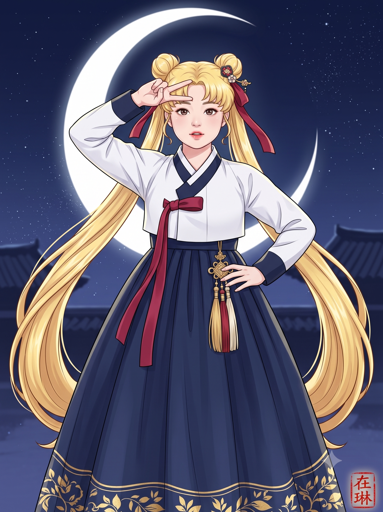
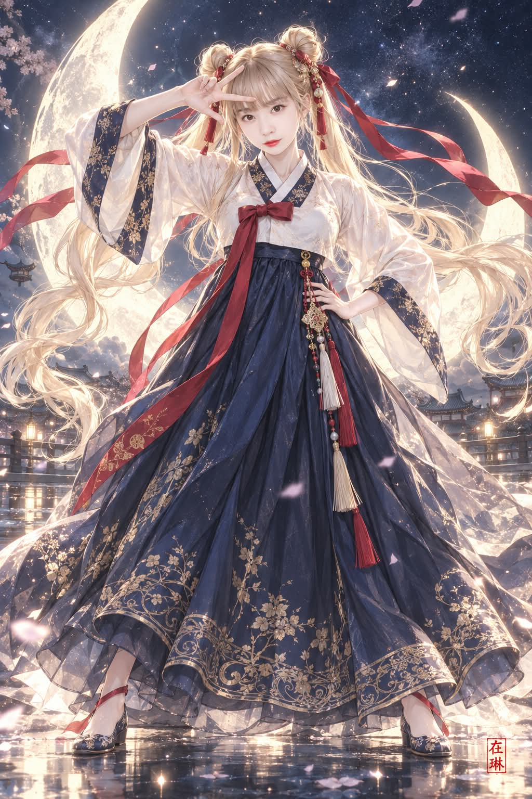

# 세일러문 한복 버전 로맨스 판타지 일러스트 프롬프트

## 1. 개요 및 아트 디렉팅 해설
- **콘셉트 테마**: 애니메이션의 전설적인 히로인 '세일러문'의 시그니처 비주얼과 포즈를 **한국 정통 여성 한복과 로맨스 판타지(로판) 웹툰·표지 일러스트** 화풍으로 완벽하게 재해석한 작품
- **핵심 조형 원리 및 연출**:
  - **인물 아이덴티티 보존 (0순위)**:
    - 원본 인물의 얼굴형, 눈매, 코, 입술, 특유의 부드러운 인상을 먼저 유지한 채 로판 표지풍으로 미화 재해석 (V라인이나 획일적인 AI 얼굴 배제).
  - **시그니처 헤어 & 포즈**:
    - **헤어**: 밝은 금발의 둥근 더블 번(Odango)과 붉은 전통 댕기를 길게 늘어뜨린 무릎 아래 기장의 풍성한 트윈테일.
    - **포즈**: 어깨너비보다 넓게 다리를 벌리고 선 당당한 전신(7~7.5등신) 구도.
    - **오른손 시그니처 V사인**: 오른쪽 눈썹 바로 위 이마 앞 30~45도 비스듬한 3/4 각도로 펼친 정교하고 완벽한 5개 손가락 해부학(검지·중지만 분리).
    - **왼손**: 허리에 얹은 당당하고 자신감 넘치는 포즈.
  - **정통 한국 여성 한복 고증**:
    - 흰색 반회장저고리, 깃과 끝동의 짙은 남색 포인트, 다홍색 긴 고름.
    - 가슴 아래에서 시작해 풍성하게 바닥까지 떨어지는 깊은 남색 A라인 치마와 은은한 금박 문양.
    - 허리 옆에 달린 전통 노리개(금색 장식과 다홍·아이보리 술).
  - **배경 및 라이팅**:
    - 깊은 남빛 밤하늘과 은은한 별가루, 인물 뒤를 가득 채우는 거대하고 눈부신 초승달 역광 림라이트.
  - **시그니처 낙관**:
    - 우측 하단 여백에 전서체 한자 주문방인(朱文方印) 낙관 **「在琳」** 배치.

---

## 2. 프롬프트 전문 (코드 블록)

```text
첨부 사진 속 인물을 기반으로 한국 로맨스 판타지 웹툰·웹소설 표지 스타일의 고해상도 전신 일러스트를 그려줘. 실사 얼굴 합성이나 사진 필터 방식은 금지하고, 처음부터 새로 그린 2D 일러스트로 만든다.

[얼굴 동일성 — 최우선]
사진 속 인물을 아는 사람이 "이 사람을 모티브로 그렸다"고 알아볼 수 있어야 한다. 일반적인 미인 얼굴을 만든 뒤 비슷하게 고치지 말고, 원본 얼굴 구조를 먼저 유지한 채 그 얼굴을 로판 화풍으로 다시 그린다.
유지할 것: 얼굴형과 가로세로 비율, 부드럽고 둥근 윤곽, 볼 볼륨, 턱 길이·폭·턱끝, 눈 크기·형태·눈꼬리·눈 사이 간격, 쌍꺼풀, 눈썹 위치, 코 길이·폭·코끝, 인중 길이, 입술 두께와 비율, 입꼬리, 이목구비 배치, 특유의 부드러운 인상.
금지: V라인 턱, 과하게 큰 눈, 눈 간격 변경, 작고 뾰족한 코, 작아진 입술, 좁아진 얼굴, 길어진 얼굴, 흔한 AI 미인 얼굴.
허용되는 미화: 깨끗하고 투명한 피부, 은은한 홍조, 맑은 다층 홍채와 작은 하이라이트, 섬세한 속눈썹, 은은한 눈화장, 윤기 있는 붉은 입술. 골격은 바꾸지 않는다.
화풍: 얇고 깨끗한 선화, 부드러운 셀 셰이딩, 섬세한 그라데이션. 실사도 과한 만화체도 아닌 표지 일러스트 수준. 스타일보다 닮음이 우선.

[헤어]
앞머리 인상은 일부 유지. 밝은 금발, 머리 위 좌우 둥근 번(odango) 두 개, 각 번에서 무릎 아래까지 내려오는 풍성하고 실크 같은 트윈테일. 번에 붉은 전통 댕기를 길게 늘어뜨린다. 작은 전통 장신구는 가능, 왕관·티아라 금지.

[의상 — 정통 한국 여성 한복]
한푸, 기모노, 서양 드레스, 퓨전 한복처럼 보이면 안 된다.
저고리: 흰색 짧은 반회장저고리, 흰 동정, 깃과 끝동에 짙은 남색, 곡선 배래, 넉넉한 소매, 길게 늘어진 다홍색 고름. 코르셋처럼 조이지 않음.
치마: 가슴 바로 아래에서 시작하는 깊은 남색 치마, 볼가운이 아닌 부드럽게 떨어지는 풍성한 A라인, 바닥 기장, 자연스러운 세로 주름, 벌린 다리에 맞춰 좌우로 퍼짐. 치맛단에 절제된 금박 문양.
노리개: 허리 옆에 하나. 금색 장식, 작은 매듭, 다홍·아이보리 술이 아래로 늘어짐.

[체형·구도]
머리끝부터 발끝, 머리카락 끝, 치맛단까지 모두 프레임 안에 들어오는 전신. 인물은 화면 중앙. 자연스러운 성인 여성 체형, 약 7~7.5등신. 큰 머리, 극단적 소두, 긴 다리, SD·치비 금지.

[포즈]
정면을 향한 당당한 자세. 다리는 어깨너비보다 훨씬 넓게 벌리고 양발로 단단히 선다. 상체와 어깨는 정면, 턱은 살짝 들고 카메라를 정확히 응시한다.
왼손: 팔꿈치를 바깥으로 크게 굽히고 손을 허리에 정확히 얹는다.
오른손: 팔을 들어 팔꿈치는 머리 바깥 위에서 굽히고, 손은 정수리 위가 아니라 오른쪽 눈썹 바로 위 이마 앞에 가깝게 둔다. V 사인의 꼭짓점은 오른쪽 눈썹 위, 두 손가락은 이마 바깥 위쪽으로 열린다. 눈·코·입을 가리지 않는다.

[오른손 해부학 — 필수]
정확히 다섯 손가락. 검지와 중지만 펴서 서로 완전히 분리하고, 약지·새끼는 접고, 엄지가 접힌 손가락을 누른다. 손은 카메라에 평평하게 보이지 않도록 30~45도 비스듬한 3/4 각도. 손가락 주변에 머리카락이나 리본이 겹치지 않게 하고, 어두운 하늘이나 달빛을 배경으로 실루엣이 선명하게 보이게 한다.
금지: extra/missing/fused/duplicated/crossed/twisted fingers, split fingertips, deformed hand.

[표정]
자신감 있고 생기 있는 주인공 분위기, 원본의 부드러운 인상 유지. 입술은 아주 살짝 벌림. 활짝 웃음, 윙크, 찡그림 금지.

[배경·조명]
깊은 남빛 밤하늘과 작은 별, 은은한 별가루. 인물 뒤로 화면을 지배할 만큼 거대하고 밝은 초승달. 먼 곳에 작고 어두운 기와지붕 실루엣은 선택 사항. 꽃잎 과다, 복잡한 배경 금지.
초승달이 역광이 되어 금발, 소매, 치맛단에 금빛·은빛 림라이트를 만들고, 금박이 은은하게 반짝인다. 앞쪽 보조광으로 얼굴은 밝고 선명하게.

[낙관]
우측 하단 모서리에서 조금 안쪽에, 화면 세로의 1/15 이하 크기로 작은 붉은 정사각형 주문방인을 찍는다. 전서체, 약간 불규칙한 가장자리, 인주 번짐과 비백이 있어 실제로 찍은 듯한 질감. 디지털 워터마크처럼 보이면 안 된다.
The seal must contain exactly these two characters: 在琳. No other text, Hangul, letters, numbers, signatures, logos, or watermarks.

[우선순위]
1. 얼굴 동일성 2. 정확한 오른손 해부학과 이마 앞 V 사인 3. 허리에 얹은 왼손, 넓게 벌린 다리 4. 정통 한복 5. 발까지 보이는 전신 6. 금발 더블 번과 긴 트윈테일 7. 거대한 초승달 8. 在琳 낙관
스타일이 얼굴 동일성과 충돌하면 얼굴이 우선이고, 장식이 손 해부학과 충돌하면 손이 우선이다.
```

---

## 3. 생성 예제

| Gemini | GPT |
| :---: | :---: |
|  |  |
