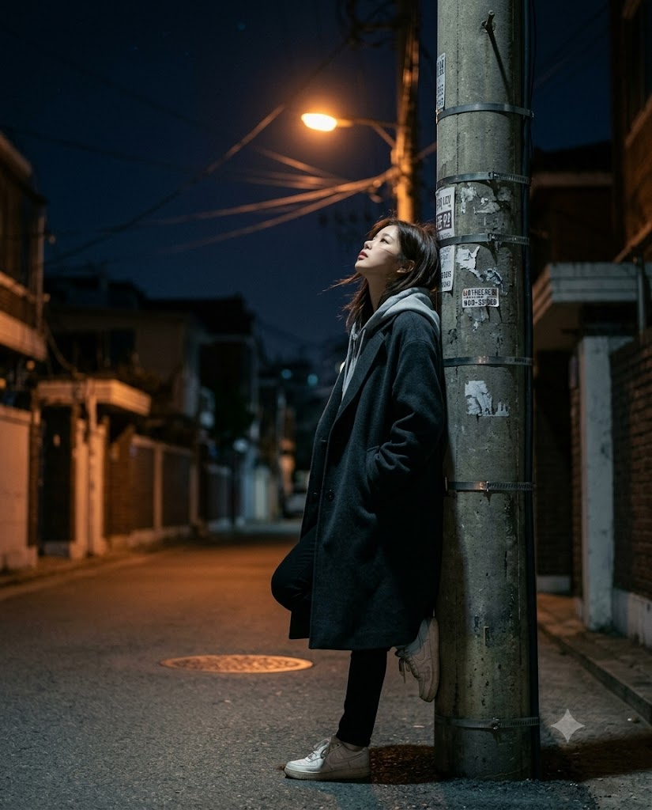
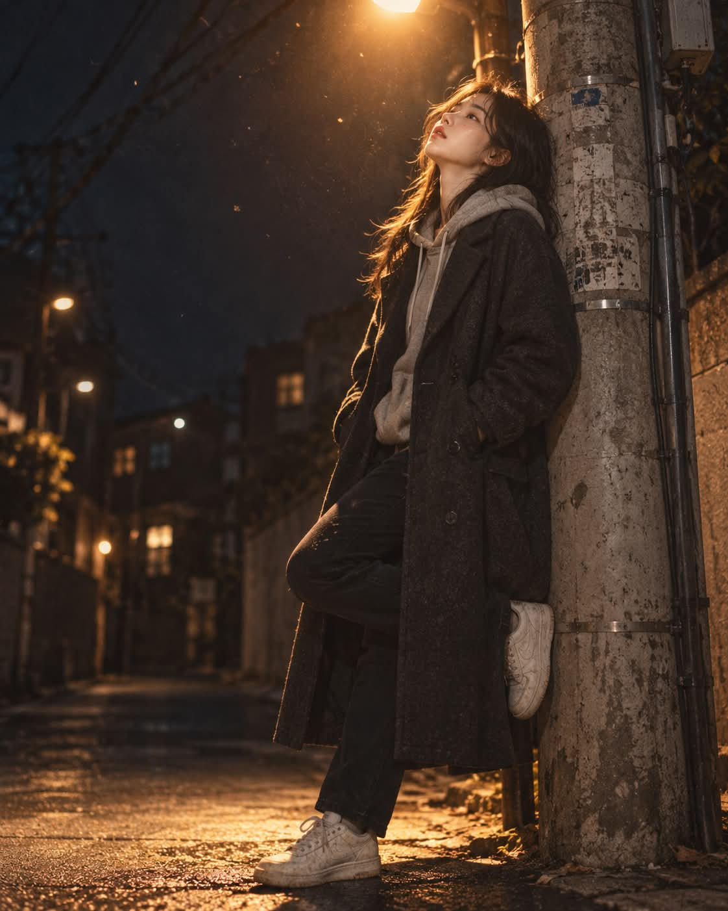

# 수고했어 오늘도, 늦은 밤 골목 가로등 영화 스틸컷 프롬프트

## 1. 개요 및 아트 디렉팅 가이드

- **컨셉**: 늦은 밤 조용한 주택가 골목, 가로등 하나만 켜진 전신주에 기대어 밤하늘을 올려다보는 인물을 담은 영화 스틸컷 느낌의 실사 사진. 고요하고 쓸쓸하지만 어딘가 위로받는 듯한 밤의 감성
- **얼굴 사용 규칙**:
  - 업로드 사진에서는 눈·코·입의 생김새만 가져오고, 얼굴형·피부·헤어·각도·시선·표정은 프롬프트 서술대로 새로 그림
  - 성별은 업로드 사진의 인물을 따르며, 헤어는 남성(흑갈색 짧은 머리)과 여성(흑갈색 어깨 길이 머리)으로 나누어 적용
- **장면 & 포즈**:
  - 전단지 자국과 금속 밴드, 얽힌 전선이 보이는 낡은 회색 콘크리트 전신주, 어둠에 잠긴 골목과 멀리 흐릿한 창문 불빛
  - 전신주에 등과 어깨를 기대고 고개를 젖혀 하늘을 보는 3/4 측면 얼굴, 코트 주머니에 넣은 두 손, 한쪽 발바닥을 전신주에 댄 편안한 자세
  - 입술이 살짝 벌어진 채 반쯤 뜬 눈으로 멍하게 하늘을 보는 담담한 표정
- **의상**: 차콜색 오버사이즈 롱코트, 코트 밖으로 꺼낸 회색 후드티, 검은 슬림 팬츠, 낡은 흰색 스니커즈
- **조명 (핵심)**:
  - 유일한 광원인 머리 위 나트륨 가로등의 따뜻한 주황빛이 원뿔 모양으로 떨어지고, 빛줄기 속에 먼지 입자와 날벌레가 반짝임
  - 고개를 든 얼굴이 빛을 그대로 받아 밝고 몸 아래쪽은 점점 어두워지며, 빛의 원 밖은 차가운 푸른빛 어둠
- **구도 & 카메라**:
  - 세로 4:5, 살짝 낮은 로우앵글의 전신 구도, 인물이 화면 세로 높이의 90% 이상을 차지하도록 가깝게 촬영
  - 35mm 렌즈와 얕은 심도, 화면 상단 모서리에 일부만 걸린 가로등
- **화질 & 색감**: 약간의 필름 그레인, 따뜻한 주황과 차가운 남색의 대비 색보정, 구름 사이로 희미한 별이 보이는 짙은 남색 하늘

---

## 2. 프롬프트 전문

```text
[얼굴 합성용 프롬프트 – 업로드 사진은 얼굴 참고용 1장]

■ 얼굴 사용 규칙 (최우선)

업로드 사진에서는 눈·코·입의 생김새만 가져온다.

얼굴형, 피부, 헤어, 이마·헤어라인은 사진에서 가져오지 않는다.

사진 속 고개 기울기, 얼굴 방향, 시선, 표정은 절대 가져오지 않는다.

각도·표정·헤어·의상·구도는 아래 서술대로만 새로 그린다. 얼굴 외 요소는 사진 때문에 바뀌면 안 된다.

성별은 업로드 사진의 인물을 따른다.

■ 장면
늦은 밤, 조용한 주택가 골목. 낡은 회색 콘크리트 전신주에 전단지 자국과 금속 밴드, 얽힌 전선이 보이고, 전선은 화면 위쪽을 가로질러 밤하늘로 이어진다. 전신주 위쪽 가로등 암에 달린 가로등 하나만 켜져 있다. 배경 골목은 어둠에 잠겨 있고 멀리 창문 불빛 몇 개만 흐릿하게 보인다.

■ 인물 포즈
인물은 전신주에 등과 어깨를 기대고 서서, 고개를 뒤로 젖혀 밤하늘을 올려다본다. 턱이 위로 들려 목선이 드러나고, 얼굴은 3/4 측면으로 하늘을 향한다. 양손은 코트 주머니에 넣었고, 한쪽 무릎을 살짝 굽혀 발바닥을 전신주에 댄 편안한 자세. 시선은 카메라가 아닌 하늘.

■ 표정
아무 생각 없이 멍하게 하늘을 보는 담담하고 조용한 표정. 입술은 아주 살짝 벌어져 있고, 눈은 반쯤 뜬 채 아련하다. 미소 없음.

■ 헤어
남성: 자연스러운 흑갈색 짧은 머리, 앞머리가 약간 흐트러짐.
여성: 흑갈색 어깨 길이 머리, 바람에 몇 가닥이 얼굴 옆으로 날림.

■ 의상
어두운 차콜색 오버사이즈 롱코트, 안에 회색 후드티(후드는 코트 밖으로 꺼냄), 검은 슬림 팬츠, 낡은 흰색 스니커즈. 코트 어깨에 가로등 빛이 닿아 울 질감이 드러난다.

■ 조명 (핵심)
유일한 광원은 머리 위 가로등. 따뜻한 주황빛 나트륨 가로등 빛이 원뿔 모양으로 위에서 아래로 떨어지며, 빛줄기 속에 먼지 입자와 날벌레 몇 마리가 반짝인다. 고개를 든 얼굴이 이 빛을 그대로 받아 이마·콧대·광대·입술이 따뜻하게 밝혀지고, 목 아래와 몸 아래쪽은 점점 어두워진다. 빛의 원 밖은 차가운 푸른빛 어둠. 발밑 아스팔트에 가로등 빛이 둥글게 고이고, 인물과 전신주의 그림자가 짧게 떨어진다.

■ 구도·카메라
세로 4:5, 살짝 낮은 로우앵글에서 인물의 머리부터 발끝까지 전신을 담되, 인물이 화면 세로 높이의 90% 이상을 차지할 만큼 가깝게 촬영한다. 인물은 화면 중앙에 배치하고, 전신주는 인물 바로 뒤 오른쪽 가장자리에 걸치듯 일부만 보인다. 인물 앞쪽(왼쪽) 도로와 골목 배경은 화면 폭의 20% 이내로 최소화해 빈 공간이 생기지 않게 한다. 가로등은 화면 상단 모서리에 일부만 걸리게 하고, 빛줄기가 인물 얼굴 위로 바로 떨어지도록 한다. 35mm 렌즈, 얕은 심도로 배경은 부드럽게 흐려짐.

■ 화질·분위기
실사 사진, 영화 스틸컷 느낌, 필름 그레인 약간, 따뜻한 주황과 차가운 남색의 대비 색보정. 고요하고 쓸쓸하지만 어딘가 위로받는 듯한 밤의 감성. 하늘은 짙은 남색이며 구름 사이로 희미한 별 몇 개.

■ 금지
사진 속 얼굴 각도·시선·표정 반영 금지, 카메라 응시 금지, 인물 주변 넓은 여백·작게 나온 인물 금지, 추가 인물 금지, 글자·로고 금지, 과도한 보정·만화풍 금지.
```

---

## 3. 결과물 비교 갤러리

| 생성 모델 | 생성 결과 이미지 |
| :--- | :--- |
| **제미나이 (Gemini)** |  |
| **ChatGPT (DALL-E 3)** |  |
