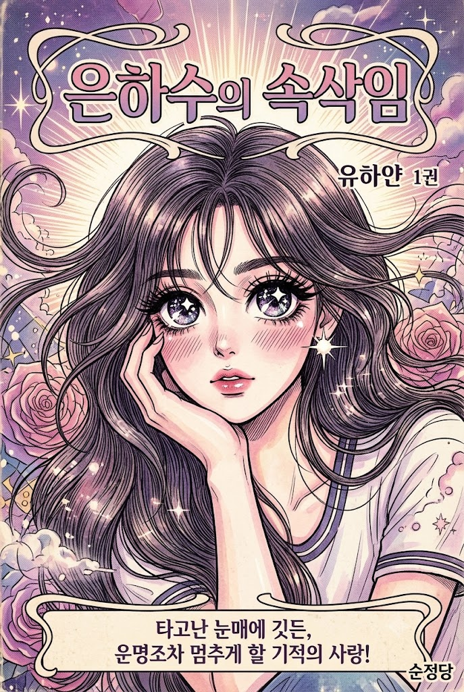
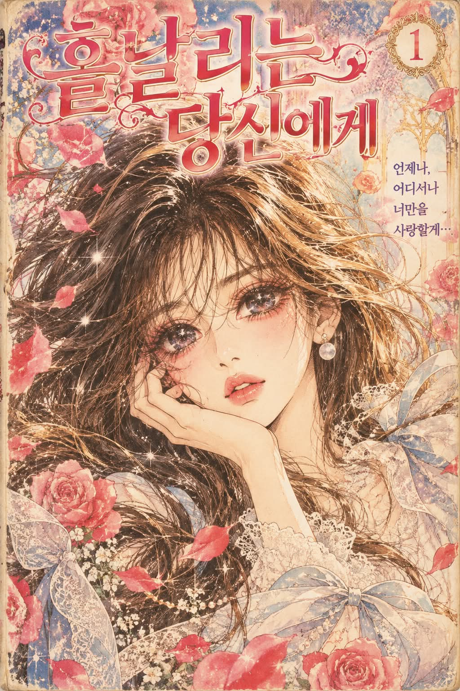

# 1980~90년대 정통 순정만화 단행본 표지 일러스트 프롬프트

## 1. 개요 및 아트 디렉팅 가이드

- **컨셉**: 1980~90년대 한국·일본 황금기 순정만화 작가의 수작업 원화 감성을 극대화한 클래식 만화 단행본 표지 일러스트
- **화풍 및 그림체 통일 원칙 (가장 중요)**:
  - 실사, 반실사, 현대 웹툰풍을 철저히 배제하고 순정만화 원화의 과장된 미학을 타협 없이 100% 적용
  - 성별과 나이에 관계없이 모든 인물을 동일 작가의 손끝에서 나온 통일된 펜선과 채색 문법으로 표현
- **눈매 & 이목구비 과장 표현 (은하수 눈망울)**:
  - **눈동자**: 홍채 내 5겹 이상의 그러데이션, 대형 화이트 하이라이트 2~3개와 별/십자 반짝이 5개 이상 삽입
  - **이목구비**: 극도로 짧은 선 하나의 코, 얇고 작은 입술, 뺨의 사선 해칭(Hatching) 홍조
  - **머릿결 & 신체**: 화면 밖으로 크게 흩날리는 수천 가닥의 섬세한 잉크 펜선, 8~9등신의 가늘고 우아한 체형
- **성별 세부 작화 분기**:
  - **여성**: 얼굴 절반을 차지하는 대형 타원형 눈, 극단적으로 길고 말려 올라간 위아래 속눈썹, 샤프한 V라인 턱
  - **남성**: 가로로 길고 눈꼬리가 살짝 올라간 날카로운 꽃미남 눈매(동일한 별빛 하이라이트 포함), 넓은 어깨와 호리호리한 실루엣
- **관상 기반 표지 서사 및 과잉 연출**:
  - 인물의 관상(눈매, 눈썹, 코, 입, 골격)을 통해 운명의 서사와 감정선 도출
  - 도출된 서사에 맞춘 상징 오브제(꽃잎, 깃털, 보석 파편 등)가 화면 전체에 소용돌이치는 과잉 연출, 방사형 집중선 및 후광 효과
- **단행본 표지 북디자인 & 인쇄 질감**:
  - 세로 2:3 비율, 상단 감성 한글 타이틀 로고와 장식 프레임, 권수/가상 출판사 로고
  - 하단 단행본 띠지(광고 카피 문구), 80~90년대 인쇄 특유의 누런 무광 종이 톤과 미세한 CMYK 망점, 스크린톤 질감

---

## 2. 프롬프트 전문

```text
첨부한 사진 속 인물을 1980~90년대 한국·일본 정통 순정만화 단행본 표지 일러스트로 다시 그려줘. 실사 사진 느낌은 하나도 남기지 말고, 그 시절 순정만화 작가가 손으로 직접 그린 원화로 완전히 바꿔줘. 순정만화 특유의 과장된 표현을 최대한 강하게, 넘칠 만큼 넣어줘. 절제하지 마.

[0. 그림체 통일 - 가장 중요]
- 사진 속 모든 인물을 성별, 나이와 상관없이 전부 같은 순정만화 그림체로 그려. 한 명의 작가가 한 장의 원화에 동시에 그린 것처럼 선 굵기, 눈 그리는 방식, 하이라이트 개수, 채색 방식, 스크린톤 질감이 모두 똑같아야 해.
- 누구 하나라도 실사풍, 반실사풍, 요즘 웹툰풍, 다른 만화 장르 그림체로 그리지 마. 남자도 예외 없이 순정만화 그림체로 완전히 바꿔.
- 성별에 따른 차이는 아래 4-1, 4-2의 얼굴 형태 차이만 허용하고, 그림체 자체는 하나로 통일해.

[1. 인물 유지 기준]
- 사진에서는 인물의 정체성만 가져와. 눈매의 인상, 눈썹 모양, 코와 입의 특징, 헤어 색과 대략적인 헤어스타일, 성별과 나이대 느낌을 유지해.
- 얼굴 구조는 순정만화 그림체에 맞게 과감하게 새로 그려. 원본 비율은 무시하고 그림체 문법을 우선하되, "이 사람을 그린 그림"이라는 건 알아볼 수 있어야 해.
- 사진 속 의상은 디자인의 큰 틀만 참고하고, 5번 테마에 어울리게 순정만화 표지답게 훨씬 우아하고 드라마틱하게 바꿔.

[2. 여러 명일 때]
- 사진에 있는 인원수를 정확히 그대로 그려. 한 명도 빼거나 추가하지 마.
- 각 인물은 각자의 얼굴 특징, 헤어, 성별, 나이대를 따로 유지해. 서로 얼굴이 섞이지 않게 한 명 한 명이 다른 사람으로 구분돼야 해. 단, 그림체는 0번에 따라 완전히 같아야 해.
- 사진 속 인물들의 좌우 위치 순서와 키 차이, 서로 기대거나 붙어 있는 관계감은 유지하되, 배치는 표지 구도에 맞게 재구성해. 인물들이 서로 겹쳐지며 층을 이루는 순정만화 표지식 군상 구도로.
- 모든 인물에게 같은 공을 들여. 한 명만 정성껏 그리고 나머지는 대충 그리지 마.

[3. 안경·액세서리]
- 사진 속 인물이 착용한 안경, 선글라스, 모자, 머리핀, 귀걸이, 목걸이, 피어싱 같은 착용물은 빠짐없이 유지하고, 순정만화 그림체로 다시 그려.
- 안경은 테 모양과 색을 유지하되 가는 펜선으로 그리고, 렌즈는 투명하게 처리해서 렌즈 너머로 크고 반짝이는 눈이 그대로 보이게. 렌즈 위에 사선으로 빛 반사 하이라이트를 한두 줄 넣어.
- 선글라스는 렌즈 색을 유지하면서 렌즈 안쪽으로 눈매가 은은하게 비쳐 보이게.
- 액세서리는 반짝임 하이라이트를 더해 보석처럼 빛나게.

[4. 얼굴 그림체 - 최대 과장, 전원 공통]
- 눈동자 안에 큰 흰색 하이라이트 2~3개와 별 모양·십자 반짝이 하이라이트를 5개 이상 가득 박아서, 눈 속에 은하수가 들어있는 것처럼. 홍채는 5겹 이상의 그러데이션.
- 코는 아주 짧은 선 하나로만, 입은 작고 얇게.
- 볼에는 사선 해칭 홍조.
- 머리카락은 가는 펜선으로 수천 가닥의 결을 그리고, 크게 휘날리게. 머리카락이 화면 가장자리 밖으로 흘러나가도록.
- 몸은 8~9등신의 가늘고 긴 비율, 손가락은 길고 가늘게.

[4-1. 여성 인물]
- 눈은 얼굴의 거의 절반을 차지할 만큼 크고 세로로 긴 타원형.
- 위아래 속눈썹 모두 과장되게 길고 풍성하게, 끝이 말려 올라가게.
- 극단적으로 갸름하고 뾰족한 턱, 길고 가는 목, 입술에 반짝이는 광택.

[4-2. 남성 인물]
- 순정만화 속 꽃미남 남주인공으로 그려. 눈은 여성보다 가로로 길고 눈꼬리가 살짝 올라간 날카로운 형태지만, 크기는 충분히 크고 눈동자 속 하이라이트와 별 반짝임은 여성과 똑같이 가득 넣어.
- 윗속눈썹은 길고 선명하게, 눈썹은 가늘고 길게 뻗은 형태.
- 턱은 뾰족하고 갸름하게, 얼굴선은 매끄럽게. 수염이나 거친 피부 표현은 사진에 있어도 아주 옅게 정리해.
- 이마와 눈을 살짝 가리는 길고 가는 앞머리, 흩날리는 머리결.
- 어깨는 넓지만 몸은 길고 호리호리하게, 목은 길게.
- 볼 홍조는 여성보다 옅게, 하지만 해칭 표현은 똑같이.

[4-3. 아이·중장년·노년 인물이 있을 때]
- 나이대 특징(얼굴 크기, 주름, 흰머리 등)은 유지하되, 순정만화에서 그 나이대를 그리는 방식으로 부드럽고 아름답게 정리해. 이 인물들도 눈 하이라이트, 선, 채색, 스크린톤은 전원 공통 규칙과 똑같이.

[5. 관상으로 표지 테마 정하기]
- 먼저 사진 속 인물의 관상을 읽어. 눈매의 모양과 기울기, 눈썹의 굵기와 결, 콧대와 코끝, 입매와 입꼬리, 이마의 넓이, 광대와 턱선, 얼굴형, 전체적인 인상을 관상학적으로 풀이해서 이 사람의 기질, 성격, 타고난 운명의 결을 해석해.
- 그 관상 풀이를 바탕으로, 이 사람이 순정만화 주인공이라면 어떤 인물이고 어떤 이야기의 주인공일지 정해. 캐릭터 유형, 이야기의 장르와 운명, 감정 톤을 모두 관상에서 끌어내.
- 정해진 이야기에 맞춰 계절, 시간대, 날씨, 주조색 팔레트, 배경에 흩날릴 상징물, 의상의 분위기, 표정과 포즈, 시선 방향, 눈물과 홍조의 진하기까지 전부 결정해.
- 특정 계절이나 색감, 소재를 기본값으로 삼지 마. 무조건 봄·꽃·분홍 파스텔로 가지 말고, 관상이 말해주는 대로만 골라.
- 여러 명이면 한 명씩 따로 관상을 읽어 각자의 캐릭터를 정하고, 그 관상들이 만났을 때 생기는 관계와 이야기로 하나의 표지 테마를 만들어. 각 인물의 표정과 포즈는 각자의 관상 캐릭터에 맞게 다르게.
- 관상 풀이는 그림에 반영만 하고, 외모를 깎아내리거나 부정적으로 단정하는 해석은 쓰지 마.

[6. 선과 채색]
- 가늘고 섬세한 G펜·스푼펜 느낌의 잉크 선. 선 굵기 강약을 뚜렷하게.
- 채색은 컬러잉크와 투명 수채 느낌. 붓 자국, 물 번짐, 색이 겹친 가장자리, 화이트 잉크로 찍은 점 하이라이트가 보이게.
- 색은 5번에서 정한 팔레트로 칠하되, 눈동자와 입술, 포인트 소품에만 채도를 확 올려.
- 흑백 스크린톤(망점, 그러데이션 톤, 반짝이 톤, 테마에 맞는 무늬 톤)을 곳곳에 겹겹이 붙인 듯한 질감을 많이 섞어.

[7. 배경과 연출 - 과잉 연출]
- 배경은 구체적인 장소를 사실적으로 그리지 말고, 5번 테마의 상징물로 빈틈없이 채우는 순정만화식 상징 연출로 가. 상징물이 인물을 둘러싸고 화면 가득 흩날리게.
- 반짝이는 가루, 빛망울 같은 순정만화 특유의 반짝임 효과를 사방에.
- 인물 뒤로 방사형 집중선처럼 퍼지는 빛줄기와, 인물 윤곽을 따라 번지는 강한 후광.
- 한 명이면 상반신 또는 바스트샷으로 화면을 꽉 채우고, 여러 명이면 모두의 얼굴이 크게 잘 보이도록 상반신 위주로 촘촘히 배치해.

[8. 표지 디자인]
- 세로형 단행본 표지 비율(약 2:3).
- 상단에 손글씨 느낌의 장식적인 한글 제목 로고를 넣어. 제목과 부제는 5번 테마와 인원수에 어울리게 네가 자유롭게 지어.
- 권수 표시, 작가 이름 자리, 가상의 출판사 로고를 표지 구석에 작게 배치. 실존하는 출판사나 작가 이름은 쓰지 마.
- 제목 로고 주변에 테마에 어울리는 장식 프레임.
- 표지 하단에 단행본 띠지를 두르고, 5번에서 읽은 관상 풀이를 이 인물의 운명을 암시하는 한 문장 광고 문구로 바꿔서 한글로 넣어.
- 글자, 로고, 띠지가 인물 얼굴을 가리지 않게 배치해.

[9. 인쇄 질감]
- 80~90년대 인쇄물처럼 약간 바랜 색, 미세한 CMYK 망점, 종이의 누런 기운과 표지 코팅의 은은한 광택.
- 현대 디지털 일러스트의 매끈한 셀 채색, 3D 렌더링, 실사 질감, 요즘 애니메이션·웹툰 그림체는 절대 쓰지 마.
```

---

## 3. 결과물 비교 갤러리

| 생성 모델 | 생성 결과 이미지 |
| :--- | :--- |
| **제미나이 (Gemini)** |  |
| **ChatGPT (DALL-E 3)** |  |
