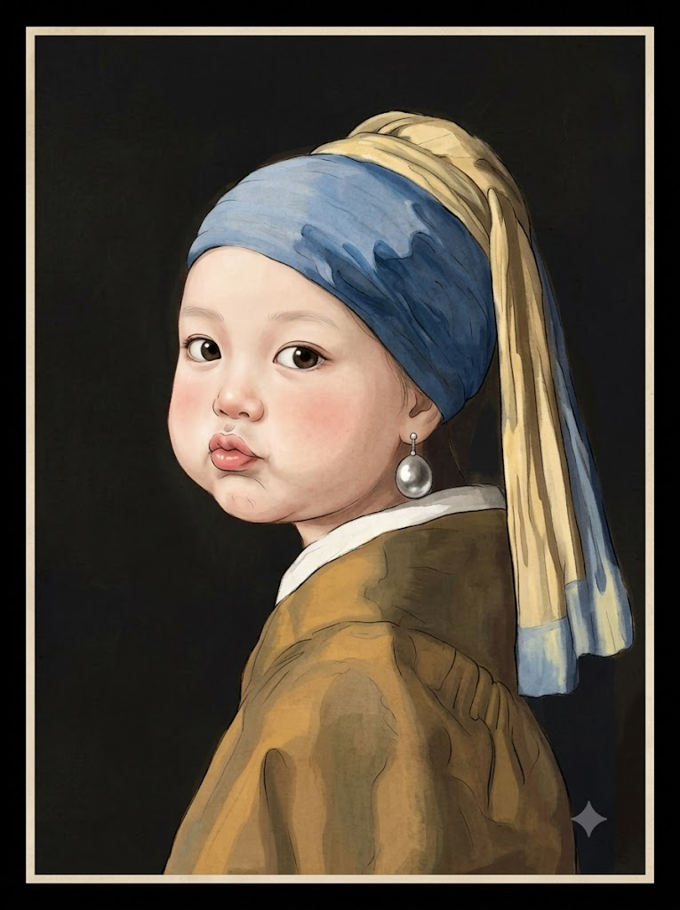
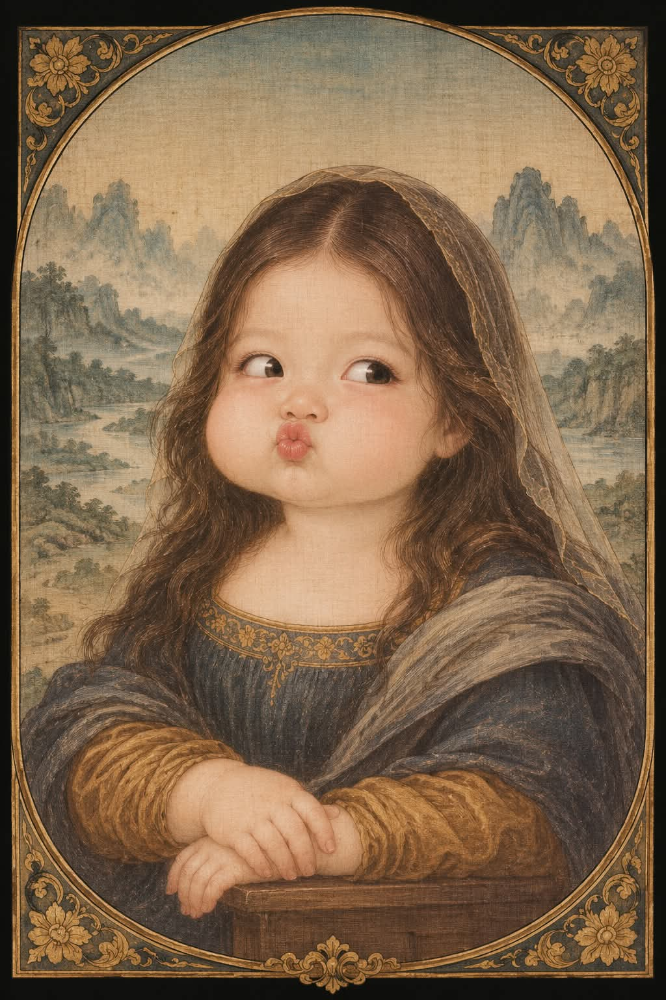

# 명화 아기 초상화, 동양 진채화풍 얼굴 합성 프롬프트

## 1. 개요 및 아트 디렉팅 가이드

- **컨셉**: 사진 속 인물의 인상에 어울리는 명화 한 점을 고르고, 그 명화의 구도·의상·배경은 그대로 둔 채 주인공만 돌 전후의 통통한 아기로 바꿔 동양 진채화 기법으로 다시 그리는 초상
- **1단계 (명화 선택, 7점 중 하나)**:
  - 인상·분위기·성별·얼굴형에서 느껴지는 성격을 분석해 7점 모두와 비교한 뒤 결정하고, 작품 이름은 답변 글로 한 줄만 안내
  - 모나리자 (차분하고 속을 알 수 없는 분위기)
  - 진주 귀걸이를 한 소녀 (맑고 순한 눈, 수줍고 여린 분위기)
  - 흰 담비를 안은 여인 (단정하고 영리한, 새침하고 도도한 분위기)
  - 미인도 (고요하고 단아한 동양적 분위기)
  - 윤두서 자화상 (강직하고 진지한, 눈빛이 매서운 분위기)
  - 펠트 모자를 쓴 자화상 (예민하고 열정적인, 고집 있는 분위기)
  - 1500년 자화상 (위엄 있고 침착한, 반듯하고 대칭적인 얼굴)
  - 작품마다 구도, 포즈, 머리, 의상, 배경을 구체적으로 지정
- **2단계 (실제 아기 얼굴)**:
  - 볼살이 처질 만큼 통통한 둥근 얼굴, 크고 동그란 눈, 작은 단추코, 뽀얀 살구빛 피부와 분홍 홍조
  - 원작의 표정 대신 볼을 빵빵하게 부풀리거나 입술을 쭉 내민 장난기 넘치는 익살스러운 표정으로, 명화의 근엄한 자세와 대비
  - 머리카락과 의상은 원작을 따르되 아기 체형에 맞게 크기만 줄이고, 수염은 옅은 솜털로 표현
- **3단계 (사진 사용 규칙)**:
  - 눈·코·입의 생김새 특징만 참고해 그 특징이 살아 있는 아기 얼굴로 다시 그림
  - 각도와 시선은 선택한 작품을 따르고, 사진에 안경이 있어도 아기는 안경을 쓰지 않음
- **4단계 (화풍)**:
  - 서양 명화도 유화가 아니라 한지나 비단 위의 동양 진채화·공필화 기법으로 표현
  - 얇은 석채 물감을 여러 겹 쌓은 맑은 발색, 가는 세필의 머리카락, 담채 번짐의 옷 주름
  - 풍경 배경은 청록빛 바위산과 안개의 수묵 산수화로 재해석하되 배치는 원작 그대로
- **5단계 (화면 형태)**: 세로로 긴 화면, 작품 분위기에 어울리는 테두리 모양을 직접 정하고 테두리 바깥은 완전한 검정

---

## 2. 프롬프트 전문

```text
[명화 아기 초상화 – 얼굴합성 프롬프트]

업로드한 사진은 얼굴 참고용입니다. 아래 순서대로 판단한 뒤 이미지 한 장을 그려주세요.

■ 1단계 – 명화 선택 (아래 7점 중 하나만)
사진 속 인물의 인상, 분위기, 성별, 얼굴형에서 느껴지는 성격을 분석해서 가장 잘 어울리는 작품 하나를 고르세요. 처음 떠오른 작품으로 바로 정하지 말고, 7점 모두와 인상을 비교한 뒤 결정하세요. 그림 안에는 작품 이름을 넣지 말고, 답변 텍스트로 한 줄만 알려주세요.

1. 모나리자 (레오나르도 다 빈치)

- 어울리는 인상: 차분하고 속을 알 수 없는, 은은한 분위기
- 상반신, 몸은 화면 왼쪽으로 3/4 돌리고 얼굴은 거의 정면, 시선은 정면
- 오른손을 왼손 위에 포개 의자 팔걸이에 올림
- 가운데 가르마의 긴 갈색 웨이브 머리, 이마에 투명한 얇은 베일
- 어두운 회청색 드레스, 목둘레에 금빛 자수, 황갈색 소매, 어깨를 감싼 회색 숄
- 배경: 굽이치는 길과 강이 있는 안개 낀 산악 풍경, 낮은 지평선

2. 진주 귀걸이를 한 소녀 (요하네스 페르메이르)

- 어울리는 인상: 맑고 순한 눈, 수줍고 여린 분위기
- 상반신, 몸은 화면 왼쪽을 향하고 어깨 너머로 고개를 돌려 정면을 바라봄
- 파란 터번과 뒤로 늘어진 노란 천, 왼쪽 귀에 큰 물방울 진주 귀걸이
- 황갈색 재킷, 흰 깃이 살짝 보임
- 배경: 아무것도 없는 매끈한 짙은 어둠

3. 흰 담비를 안은 여인 (레오나르도 다 빈치)

- 어울리는 인상: 단정하고 영리한, 새침하고 도도한 분위기
- 상반신, 몸은 화면 왼쪽, 얼굴과 시선은 화면 오른쪽 바깥을 향함
- 가슴 앞에 흰 담비를 안고 손으로 쓰다듬음
- 턱 아래로 묶은 매끈한 갈색 머리, 이마에 가는 검은 끈
- 파란 망토를 한쪽 어깨에 두르고 붉은 소매 드레스, 목에 긴 검은 구슬 목걸이
- 배경: 매끈한 검은 배경

4. 미인도 (신윤복)

- 어울리는 인상: 고요하고 단아한, 수줍은 동양적 분위기
- 전신 입상, 몸은 살짝 비스듬, 얼굴은 약간 숙이고 시선은 아래
- 크고 풍성하게 얹은 가체 머리
- 짧고 꼭 맞는 흰 저고리, 자주색 고름, 넓게 부푼 옥색 치마
- 두 손으로 노리개를 만짐
- 배경: 무늬 없는 담담한 종이 바탕

5. 윤두서 자화상 (윤두서)

- 어울리는 인상: 강직하고 진지한, 눈빛이 매서운 분위기
- 얼굴만 화면 가득 정면, 몸은 거의 그리지 않음
- 정면을 바라보는 크고 동그란 아기 눈, 탕건을 쓴 머리
- 얼굴 둘레로 부채처럼 퍼진 수염 (아기 얼굴이므로 보송한 솜털처럼 짧고 옅게)
- 배경: 아무것도 없는 바랜 종이 바탕

6. 펠트 모자를 쓴 자화상 (빈센트 반 고흐)

- 어울리는 인상: 예민하고 열정적인, 고집 있는 분위기
- 상반신, 몸은 화면 왼쪽으로 3/4, 시선은 정면
- 회색 펠트 모자, 짙은 남색 재킷과 넥타이
- 붉은 수염 (아기 얼굴이므로 아주 옅은 솜털로)
- 배경: 짧은 붓질이 방사형으로 퍼지는 청회색 배경 (채색화 기법으로 결을 살려 표현)

7. 1500년 자화상 (알브레히트 뒤러)

- 어울리는 인상: 위엄 있고 침착한, 반듯하고 대칭적인 얼굴
- 상반신 완전 정면 대칭, 시선은 정면
- 어깨까지 내려오는 곱슬곱슬한 갈색 긴 머리, 가운데 가르마
- 모피 깃이 달린 짙은 갈색 외투
- 오른손을 가슴 앞에 올려 외투 깃을 살짝 쥠
- 배경: 매끈한 검은 배경

■ 2단계 – 얼굴: 미니미가 아니라 실제 아기 얼굴
얼굴은 돌 전후의 통통한 아기 얼굴로 그립니다.

- 얼굴형: 아주 둥글고 볼살이 아래로 처질 만큼 통통함, 턱선 없이 살짝 겹턱
- 눈: 크고 동그란 짙은 갈색 눈동자, 흰자가 적고 위 눈꺼풀이 두툼함, 작은 하이라이트
- 눈썹: 거의 보이지 않을 만큼 옅고 가는 눈썹
- 코: 아주 작고 낮은 동그란 단추코
- 입: 작고 도톰한 분홍빛 입술
- 피부: 뽀얀 살구빛, 볼과 코끝에 은은한 분홍 홍조
- 표정: 원작 인물의 표정은 따르지 않고, 모든 작품에서 장난기 넘치고 익살스러운 아기 표정으로 그림
· 명화 속 근엄한 자세와 대비되어 보는 순간 웃음이 나는 표정
· 볼에 바람을 잔뜩 넣어 빵빵하게 부풀린 볼
· 입술을 앞으로 쭉 내밀어 오므리거나, 입꼬리 한쪽만 살짝 올린 장난스러운 입
· 눈은 동그랗게 뜬 채 살짝 곁눈질하거나, 무언가 꾸미는 듯 능청스러운 눈빛
· 엉뚱하고 천진난만해서 "얘 뭐야" 싶을 만큼 귀엽고 우스운 얼굴
· 화나거나 무섭거나 기괴해 보이지 않게, 과장은 귀여운 선에서만
- 몸 비율: 머리가 크고 몸은 아기 체형, 손은 짧고 통통한 아기 손에 연분홍 손톱
- 머리카락과 의상: 선택한 작품의 것을 그대로 따르되, 아기에게 맞게 크기만 줄임

■ 3단계 – 사진에서 가져올 것 / 가져오지 말 것

- 사진에서는 눈·코·입의 생김새 특징만 참고해서, 그 특징이 살아 있는 아기 얼굴로 다시 그립니다.
- 얼굴형, 피부, 헤어, 이마·헤어라인, 표정은 사진에서 가져오지 않습니다.
- 사진의 고개 기울기, 얼굴 방향, 시선, 각도는 절대 가져오지 않습니다. 각도와 시선은 선택한 작품을 따릅니다.
- 얼굴 외의 구도, 포즈, 의상, 배경은 선택한 작품에서 바뀌면 안 됩니다.
- 사진 속 인물이 안경, 선글라스, 렌즈 등 눈 위에 쓴 것이 있어도 아기는 절대 안경을 쓰지 않습니다. 안경 없이 맨눈의 아기 눈으로만 그립니다.

■ 4단계 – 화풍

- 서양 명화라도 유화로 그리지 않고, 한지나 비단 위에 그린 동양 진채화·공필화 기법으로 다시 그림
- 얇은 석채 물감을 여러 겹 쌓아 올린 맑고 부드러운 발색, 은은한 종이 결이 보임
- 머리카락은 한 올 한 올 가는 세필로, 옷 주름은 섬세한 선과 담채 번짐으로 표현
- 풍경이 있는 배경은 동양 수묵 산수화처럼 청록빛 바위산과 안개로 재해석하되 배치는 원작 그대로
- 전체 색감은 차분하고 바랜 듯한 고풍스러운 톤

■ 5단계 – 화면 형태

- 세로로 긴 화면
- 화면 테두리 모양은 선택한 작품의 분위기에 어울리는 형태로 직접 정합니다.
- 고양이 귀처럼 위로 솟은 뾰족한 모서리나 동물 귀 모양 실루엣은 절대 넣지 않습니다.
- 테두리 바깥이 생기면 완전한 검정으로 채웁니다.
```

---

## 3. 결과물 비교 갤러리

| 생성 모델 | 생성 결과 이미지 |
| :--- | :--- |
| **제미나이 (Gemini)** |  |
| **ChatGPT (DALL-E 3)** |  |
