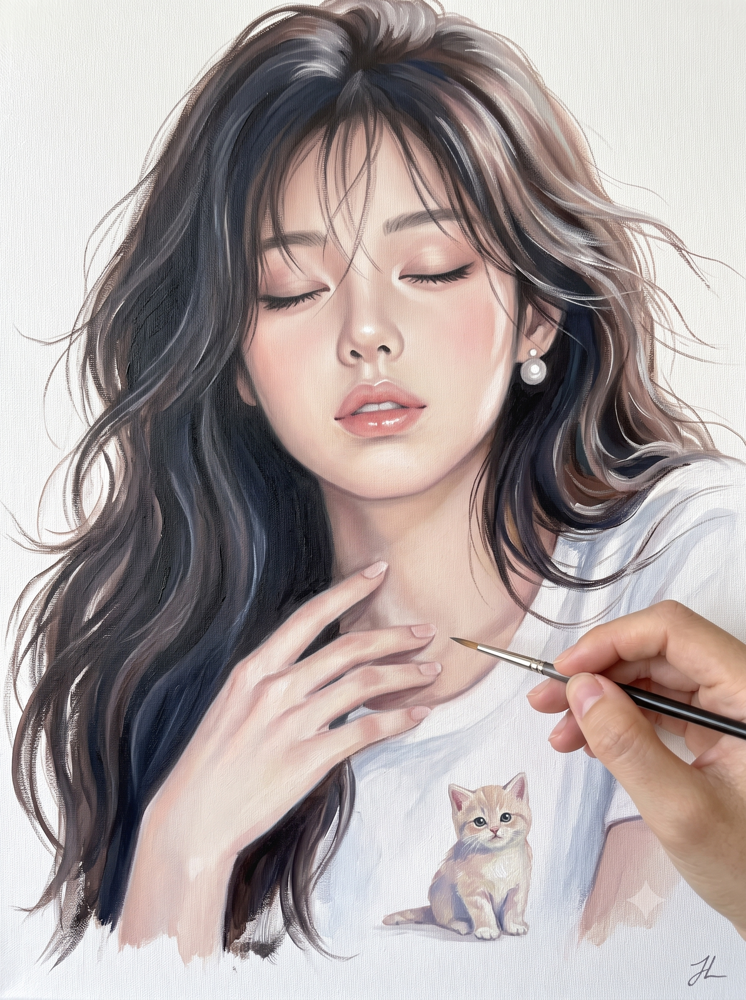
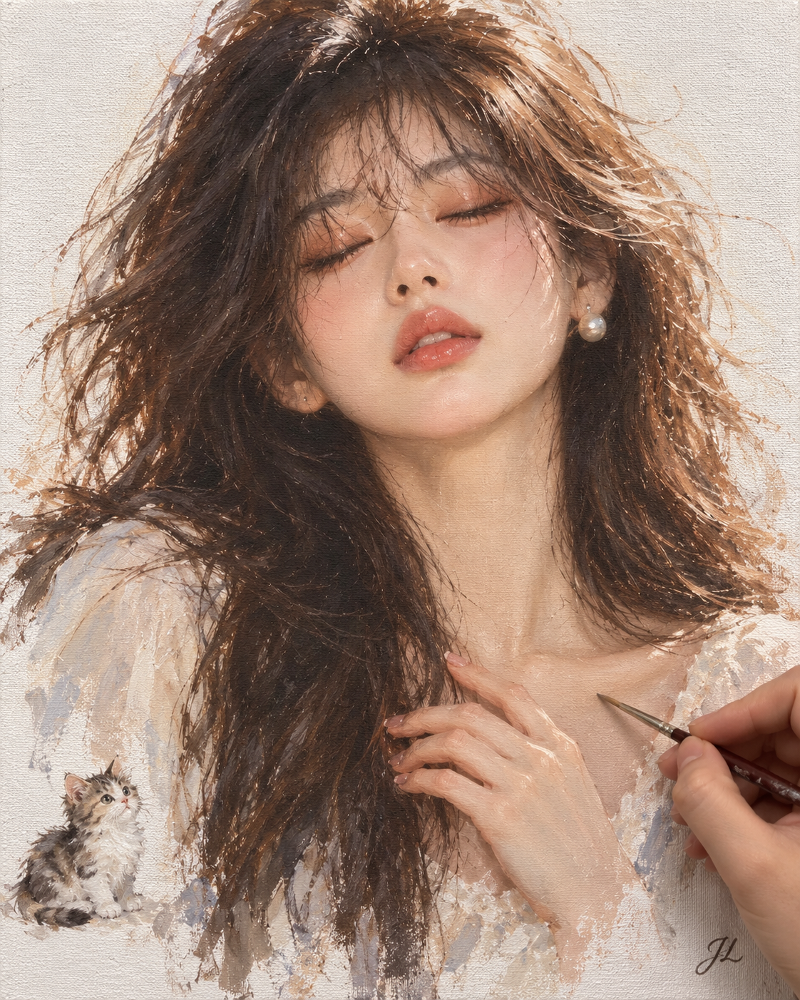

# 사진을 캔버스 아크릴 인물화로 변환하는 프롬프트

## 1. 개요 및 아트 디렉팅 해설
- **콘셉트 테마**: 실사 인물 사진을 캔버스 천 위에 그리는 세미 리얼리즘 아크릴 인물화로 재해석하고, 실제 화가의 손이 캔버스 위를 세필 붓으로 터치하고 있는 '작업 과정 메타 뷰(Work-in-progress Shot)' 연출
- **성별 맞춤 분기 원칙 (Gender-Specific Rules)**:
  - **여성 인물**:
    - 원본 인상을 알아볼 수 있는 선에서 화보 모델처럼 이상적으로 미화.
    - 맑고 결점 없는 도자기 피부, 은은한 피치·코랄 섀도 및 광택 립 메이크업.
    - 눈을 살포시 감고 입술을 살짝 벌린 몽환적인 표정, 쇄골에 부드럽게 얹은 가늘고 긴 손가락 포즈.
  - **남성 인물**:
    - 얼굴형, 이목구비, 헤어스타일의 원형을 완벽히 유지(변형 및 화장 일체 배제).
    - 잡티, 다크서클, 붉은기 등 피부 결점만 건강하고 자연스럽게 정돈.
    - 고개를 살짝 기울여 먼 하늘을 올려다보는 차분하고 담담한 시선 연출.
- **핵심 연출 및 조형 요소**:
  - **캔버스 천 질감 & 자연스러운 번짐**: 
    - 인물 뒤는 채색되지 않은 순백의 캔버스 천 질감이 은은하게 드러나며, 인물 외곽선이 캔버스 여백으로 자연스럽게 스며들듯 마감.
  - **포인트 오브제 (미니 앙증 고양이)**:
    - 인물 어깨 옆 아래쪽에 화면의 약 1/10 크기로 다소곳이 앉아 있는 작은 고양이 배치. 동일한 아크릴 파스텔 붓 터치로 조화롭게 연출.
  - **작업 중인 화가의 실제 손 (메타 연출)**:
    - 화면 우측 하단에서 실사 느낌의 화가의 손이 들어와 가는 세필 붓을 쥐고 인물의 가슴 부근을 터치하는 순간을 근접 촬영 구도로 포착. 그림과 실제 손의 명확한 질감 대비.
  - **시그니처 서명**:
    - 우측 하단 모서리에 차콜 그레이 색상으로 은은하게 흘려 쓴 필기체 **"JL"** 서명 (화가의 손이나 붓에 가려지지 않게 배치).
  - **비율 및 스타일**:
    - 세로 4:5 비율, 매트한 전문가용 아크릴 질감, 부드러운 확산광의 차분한 파스텔 톤.

---

## 2. 프롬프트 전문 (코드 블록)

```text
첨부한 사진 속 인물을 캔버스에 그린 아크릴 인물화로 그려줘.
먼저 사진 속 인물이 여성인지 남성인지 판단해서, 아래 [여성일 경우] 또는 [남성일 경우] 중 해당하는 규칙만 적용해줘.

━━━━━━━━━━━━━━━━━━━━
[여성일 경우]

얼굴:
- 원래 인상을 알아볼 수 있을 정도로 닮게 하되, 더 아름답게 미화
- 잡티, 다크서클, 모공 없이 맑고 투명한 피부
- 갸름한 턱선, 매끄러운 얼굴 윤곽, 오뚝한 코, 균형 잡힌 이목구비
- 화보 모델처럼 미화하되 인형 같은 부자연스러움은 피할 것

표정과 포즈:
- 눈을 살며시 감고, 입술은 살짝 벌린 몽환적이고 평온한 표정
- 고개는 살짝 들어 올린 우아한 각도
- 한 손은 쇄골 근처에 손끝을 부드럽게 올려둔 포즈, 가늘고 긴 손가락

화장:
- 눈두덩에 은은한 피치·코랄 섀도, 길고 자연스러운 속눈썹
- 도톰하고 촉촉한 코랄 핑크 립, 윗입술에 은은한 광택 하이라이트
- 볼과 코끝, 눈가에 은은한 핑크빛 블러셔

머리카락:
- 원본 헤어 길이와 스타일 유지
- 바람에 살짝 날리는 가는 붓결, 앞머리 일부가 한쪽 눈가를 스치듯

━━━━━━━━━━━━━━━━━━━━
[남성일 경우]

얼굴:
- 얼굴 생김새, 이목구비, 얼굴형, 헤어스타일은 원본 사진 그대로 유지
- 얼굴형이나 이목구비는 절대 수정하지 말 것
- 화장은 추가하지 말고 자연스러운 남성 피부 톤 유지

표정과 포즈:
- 고개를 한쪽으로 살짝 기울인 채 턱을 들어 하늘을 올려다보는 포즈
- 시선은 위쪽 먼 곳을 향하게, 눈은 뜬 상태로
- 표정은 차분하고 담담하게, 원본 인물의 분위기 유지
- 목선과 턱선이 자연스럽게 드러나는 각도
- 고개 각도만 바뀌고 얼굴 생김새는 원본과 동일해야 함

피부 보정 (이것만 적용):
- 잡티, 다크서클, 여드름 자국, 붉은기 제거
- 피부결을 깨끗하고 고르게, 자연스러운 건강한 톤으로 정돈
- 수염 자국이나 주름 등 인물의 고유 특징은 과하게 지우지 말고 자연스럽게 정돈

머리카락:
- 가는 붓결로 섬세하게 묘사하되, 원본 머리 색과 스타일 유지

━━━━━━━━━━━━━━━━━━━━
[공통 적용]

구도:
- 얼굴부터 가슴 윗부분까지 보이는 상반신 인물화
- 화면 비율은 세로 4:5

배경:
- 인물 뒤 배경은 하얀 빈 캔버스, 캔버스 천 본연의 질감이 은은하게 드러남
- 인물 가장자리는 흰 캔버스 여백으로 자연스럽게 번지듯 페이드아웃 마감
- 인물 어깨 옆 아래쪽에 작은 고양이 한 마리를 배치 (화면의 약 1/10 크기로 앙증맞게 앉아 있는 모습)
- 고양이도 인물과 동일한 아크릴 붓 터치와 파스텔 톤으로 표현하여 은은한 포인트 역할

스타일 및 색감:
- 세미 리얼리즘 아크릴화
- 피부는 부드럽게 블렌딩하되 외곽 가장자리에는 물감 붓 터치 질감이 살아있게
- 옷은 얼굴보다 느슨하고 자유로운 붓질로 간략하게 표현
- 파스텔 톤 색감, 부드러운 확산광, 차분하고 정적인 무드
- 전문가용 아크릴 물감의 매트하고 보송한 마감 질감

장면 연출 (작업 과정 메타 뷰):
- 화면 오른쪽 아래에서 실제 화가의 손이 들어와 가는 세필 붓을 쥐고 그림을 그리고 있는 모습
- 붓 끝이 캔버스 위 그림 속 인물의 가슴 부근에 가볍게 닿아 있는 작업 중인 찰나의 순간
- 화가의 손은 실제 사진처럼 극사실적으로 묘사하여, 캔버스 위의 그림과 명확히 구분되게 연출
- 캔버스를 정면에서 가깝게 촬영한 작업 스냅샷 느낌

서명:
- 그림 오른쪽 아래 모서리에 "JL" 서명 기재
- 화가가 가는 세필 붓으로 직접 흘려 쓴 듯한 은은한 필기체 스타일
- 짙은 회색 또는 차콜 색 물감으로 작고 단정하게
- 화가의 손이나 붓에 가려지지 않게 눈에 띄도록 배치

[네거티브 가이드 / 피해야 할 요소]
- 3D CG 렌더 느낌, 플라스틱 같은 인공적인 피부, 과도한 채도
- 애니메이션·만화·카툰 스타일
- 손가락 개수 및 관절 기형 (그림 속 손과 화가의 실제 손 모두 정확히 5개 유지)
- 작은 고양이 외의 불필요한 배경 사물, 꽃, 구름 배제
- "JL" 외의 워터마크, 텍스트, 알파벳 생성 금지
- (남성 인물의 경우 추가) 얼굴형/이목구비 변형, 메이크업 추가, 과도한 여성화 절대 금지
```

---

## 3. 결과물 비교 갤러리

| 생성 모델 | 결과 이미지 |
| :--- | :--- |
| **Google Gemini** |  |
| **OpenAI GPT** |  |
