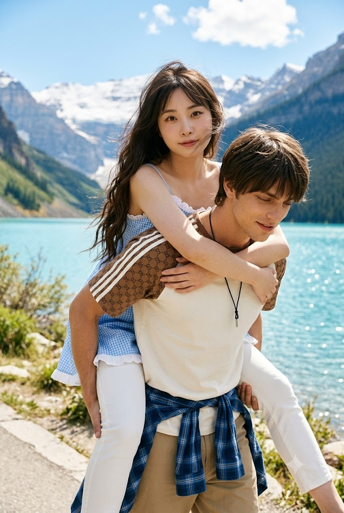
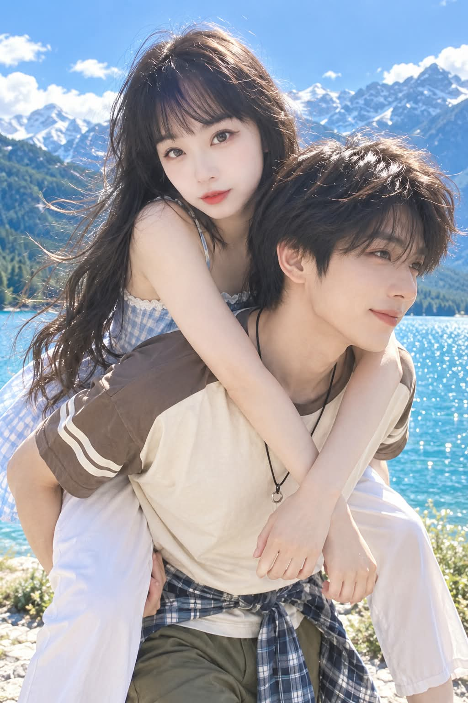

# 풋풋하고 청량한 여름 호숫가 '어부바' 로맨스 라이프스타일 화보 프롬프트

## 1. 개요 및 아트 디렉팅 가이드

- **컨셉**: 눈부시게 맑은 여름날 푸른 호수와 설산을 배경으로, 20대 초반 남성이 여성을 등에 업고 장난치며 걸어가는 풋풋하고 청량한 첫사랑 분위기의 라이프스타일 에디토리얼 화보
- **비율 및 화풍**: 세로 2:3, 초고해상도, 100% 포토리얼 실사 스냅 화보
- **얼굴 정체성 보존 (최우선 / 자동 분기)**:
  - 남성/여성 사진 업로드 시 해당 성별 인물에게 정확히 매칭 (1장일 경우 해당 성별에 적용, 상대방은 자연스러운 20대 초반 성인 임의 생성)
  - 얼굴형, 눈매, 코, 입매, 광대, 턱선 및 전체적인 인상 통합 유지
  - 주름 및 피로감만 완화하여 건강한 20대 초반 모습으로 표현 (미인형으로 임의 재설계 금지)
- **표정 & 시선 & 앵글**:
  - **여성**: 카메라 정면(yaw 0~5°), 머리를 왼쪽으로 8~12° 부드럽게 기울임, 카메라 응시, 입꼬리만 살짝 올라간 자연스러운 미소
  - **남성**: 3/4 방향(오른쪽 25~35°), 턱을 살짝 내리고 오른쪽 아래 진행 방향 응시, 은은한 미소
- **헤어 & 의상 스타일**:
  - **여성**: 허리 아래까지 내려오는 짙은 흑갈색 롱 웨이브 헤어 / 연한 하늘색 체크 슬립 원피스 + 흰색 슬림 팬츠
  - **남성**: 짙은 흑갈색 미디엄 레이어드 헤어 / 아이보리 반팔 티셔츠 + 카키 팬츠 + 허리에 묶은 블루 체크 셔츠
- **구도 및 조명**:
  - 남성이 여성을 업고 앞으로 걷는 자연스러운 체중 전달 자세 (여성은 남성의 목과 어깨를 팔로 감싸고, 남성은 손으로 다리를 안정적으로 지탱)
  - 오른쪽 위에서 비스듬히 비치는 자연 여름 햇살, 얼굴/목/팔 피부톤 및 음영의 완벽한 일체화
  - 코발트블루 호수의 잔물결 반짝임과 원경의 웅장한 설산

---

## 2. 프롬프트 전문

```text
세로 2:3, 초고해상도, 100% 포토리얼 여름 여행 라이프스타일 화보.

눈부시게 맑은 여름날, 푸른 호수와 설산을 배경으로
20대 초반의 성인 남성이 20대 초반의 성인 여성을 등에 업고 걸어가는 순간.

실제 여행 중 자연스럽게 장난치며 걷는 찰나를 가까운 거리에서 촬영한 듯한
풋풋하고 청량하며 생동감 있는 첫사랑 분위기.

━━━━━━━━━━━━━━━━━━━━
[첨부 얼굴 — 자동 분기 / 최우선]
━━━━━━━━━━━━━━━━━━━━

첨부사진은 오직 각 인물의
‘얼굴 정체성 + 고유한 이목구비 특징 + 전체적인 인상’을 위한 참고자료이다.

남성 + 여성 사진이 모두 있으면:
남성 얼굴 → 앞쪽 남성에게만 적용.
여성 얼굴 → 등에 업힌 여성에게만 적용.

사진이 1장뿐이면:
사진 속 성별과 일치하는 캐릭터에게만 얼굴을 적용한다.

상대방은 특정 실존인물을 닮지 않은
풋풋하고 자연스러운 임의의 20대 초반 성인 얼굴로 생성한다.

남녀의 얼굴 특징을 서로 섞거나 교차 적용하지 않는다.

━━━━━━━━━━━━━━━━━━━━
[얼굴 정체성·특징·인상 — 남녀 동일]
━━━━━━━━━━━━━━━━━━━━

남녀 모두 동일한 방식으로 얼굴 정체성을 강하게 유지한다.

참고사진에서 그 사람을 알아보게 만드는:
전체적인 얼굴형과 비율
특징적인 눈매와 눈빛
눈의 모양·간격·눈꼬리에서 느껴지는 특징
눈썹과 눈 주변의 인상
특징적인 코의 형태
입술과 입매의 특징
광대·볼·턱선이 만드는 얼굴 윤곽
이목구비 전체의 조화
자연스러운 좌우 비대칭
그 사람만의 분위기와 전체적인 얼굴 인상
을 하나의 얼굴 정체성으로 통합해서 가져온다.

눈·코·입을 따로따로 기계적으로 복제하거나
새로운 미남·미녀 얼굴로 재조립하지 않는다.

완성된 얼굴은
‘닮은 다른 사람’이 아니라
첨부사진 속 바로 그 사람이라는 인상이 자연스럽게 남아야 한다.

전형적인 AI 미남·미녀 얼굴로 평균화하거나
원본의 개성 있는 특징을 지우지 않는다.

━━━━━━━━━━━━━━━━━━━━
[20대 초반 표현]
━━━━━━━━━━━━━━━━━━━━

첨부 인물의 얼굴 정체성과 고유한 인상을 그대로 유지하면서
자연스러운 20대 초반 성인의 모습으로 표현한다.

새로운 젊은 얼굴로 재설계하지 않는다.

주름, 피부 처짐, 눈 밑 피로감 등
연령감을 만드는 부분만 부드럽게 완화하고
피부를 건강하고 생기 있게 정돈한다.

얼굴형, 눈매, 코, 입매, 광대, 턱선과
그 사람 특유의 인상은 유지한다.

나이를 낮추기 위해
눈을 키우거나 코를 바꾸거나 얼굴을 작게 만들지 않는다.

‘20대처럼 생긴 다른 사람’이 아니라
‘같은 사람의 자연스러운 20대 초반 모습’.

━━━━━━━━━━━━━━━━━━━━
[참고사진에서 가져오지 않을 것]
━━━━━━━━━━━━━━━━━━━━

참고사진에서는 얼굴의 정체성·특징·인상만 가져온다.

참고사진의:
얼굴 각도, 고개 방향과 기울기,
카메라 각도, 시선,
피부 밝기, 피부색, 노출,
조명, 명암, 그림자, 화이트밸런스,
헤어스타일, 머리색, 머리 길이,
가르마, 앞머리, 포즈, 의상, 배경은 가져오지 않는다.

이 요소들은 아래 장면 설정을 따른다.

━━━━━━━━━━━━━━━━━━━━
[남녀 얼굴 각도 / 시선 / 미소 — 고정]
━━━━━━━━━━━━━━━━━━━━

표정 변화 때문에 얼굴 정체성이 달라지지 않도록
남녀 모두 아주 옅고 자연스러운 미소만 적용한다.

■ 여성

얼굴은 카메라를 거의 정면으로 향한다.

yaw 0~5° — 좌우 회전 거의 없음.
pitch 약 +5° — 턱을 아주 살짝 든다.
roll 약 8~12° — 머리를 화면 왼쪽으로 부드럽게 기울인다.

얼굴 자체는 옆으로 돌리지 않는다.
두 눈·코·입이 충분히 보이는 거의 정면 얼굴.
시선은 카메라 렌즈.

첨부사진 속 고유한 눈매와 입매를 유지하면서
입꼬리만 아주 살짝 올라간 부드러운 미소.

입은 거의 닫혀 있으며 치아를 크게 드러내지 않는다.
볼과 눈 모양의 표정 변화도 최소화한다.

■ 남성

얼굴은 카메라 기준 화면 오른쪽으로 약 25~35° 돌아간
자연스러운 3/4 방향.

턱은 살짝 아래로 내리고
시선은 오른쪽 아래 진행 방향.

남성 역시 첨부사진 속 고유한 눈매·입매와 인상을 유지하면서
입꼬리만 아주 살짝 올라간 부드러운 미소.

입은 닫혀 있거나 아주 미세하게만 벌어진다.
치아가 크게 드러나는 웃음은 만들지 않는다.

남녀 모두:
활짝 웃는 표정, 과장된 웃음,
크게 벌어진 입, 눈을 심하게 가늘게 뜨는 표정,
과도하게 올라간 볼 금지.

표정보다 얼굴 정체성과 고유한 인상 보존을 우선한다.

━━━━━━━━━━━━━━━━━━━━
[남녀 헤어스타일 — 고정]
━━━━━━━━━━━━━━━━━━━━

첨부사진의 헤어스타일은 가져오지 않는다.
얼굴 사진이 바뀌어도 아래 헤어스타일은 유지한다.

■ 여성

짙은 흑갈색의 매우 긴 자연스러운 웨이브 헤어.
길이는 허리 아래까지.

중앙에 가까운 자연스러운 가르마.
무거운 일자 앞머리 없음.
얼굴 주변에는 가볍고 긴 페이스 프레이밍 잔머리.

귀 아래부터 크고 느슨한 웨이브가 이어진다.

호숫가 바람에 긴 머리와 잔머리가
화면 왼쪽과 뒤쪽으로 자연스럽게 흩날린다.

머리카락이 얼굴을 과도하게 가리지 않는다.

■ 남성

짙은 흑갈색의 자연스러운 중간 길이 레이어드 헤어.

앞머리는 눈썹 위~눈썹 부근 길이로 자연스럽게 갈라진다.
옆머리는 귀 주변을 부드럽게 감싸고
뒷머리는 지나치게 짧지 않다.

직모와 아주 약한 자연 웨이브의 중간 정도.
호숫가 바람에 살짝 흐트러진 부드러운 질감.

강한 페이드, 스포츠머리, 올백,
포마드, 장발, 강한 컬 금지.

━━━━━━━━━━━━━━━━━━━━
[얼굴 조명·명암 — 매우 중요]
━━━━━━━━━━━━━━━━━━━━

참고사진의 얼굴을 그대로 붙여 넣지 않는다.

얼굴의 정체성·특징·인상만 유지하고
현재 장면의 지정된 각도와 광원에 맞춰 자연스럽게 표현한다.

참고사진의 피부 밝기·피부색·명암·조명은 사용하지 않는다.

남녀 모두 얼굴 → 귀 → 목 → 쇄골 → 어깨 → 팔까지
동일한 환경에서 촬영된 하나의 피부처럼 표현한다.

강한 여름 햇빛은 화면 오른쪽 위에서 비스듬히 들어온다.

빛을 받는 면에는 따뜻한 하이라이트,
반대쪽에는 자연스럽고 충분한 그림자.

눈두덩, 코 옆, 광대 아래, 턱 아래와 목에도
얼굴 방향과 광원에 맞는 입체적인 명암을 만든다.

얼굴 노출을 목과 팔보다 높이지 않는다.
얼굴만 하얗고 뽀얗게 만들지 않는다.
얼굴에 별도의 뷰티 조명이나 정면 필라이트를 적용하지 않는다.

얼굴·목·팔의 피부톤, 노출, 명암, 색온도를 완전히 통합한다.

NO floating face.
NO pasted face.
NO face-only exposure boost.

━━━━━━━━━━━━━━━━━━━━
[구도 / 업어주기 포즈]
━━━━━━━━━━━━━━━━━━━━

가까운 거리에서 촬영한 역동적인 3/4 바디 여행 스냅.

남성은 화면 중앙~오른쪽 전경에 크게 위치하며
여성을 실제로 등에 업고 앞으로 걸어간다.

남성의 상체는 여성의 체중 때문에
자연스럽게 살짝 앞으로 기울어진다.

여성은 남성의 등에 완전히 밀착해 업혀 있으며
얼굴과 상체는 남성보다 화면 왼쪽 위에 위치한다.

두 얼굴을 같은 높이에 나란히 배치하지 않는다.

여성은 양팔로 남성의 목과 어깨를 자연스럽게 감싸고
팔은 남성의 가슴 앞쪽에서 자연스럽게 겹쳐진다.

여성의 골반과 허벅지는 남성의 등과 허리에 연결되고
양다리는 남성 허리 양옆으로 자연스럽게 내려온다.

남성은 팔과 손으로 여성의 다리를 안정적으로 받친다.

두 사람이 실제로 서로의 체중을 주고받는
자연스럽고 물리적으로 정확한 업어주기 자세.

━━━━━━━━━━━━━━━━━━━━
[의상 — 고정]
━━━━━━━━━━━━━━━━━━━━

여성:
연한 하늘색 체크 패턴의 여름 슬립 원피스.
얇은 스파게티 스트랩과 작고 섬세한 흰색 프릴.
가볍고 부드러운 여름 원단.
흰색 슬림 팬츠.

남성:
아이보리/크림색 반팔 티셔츠.
브라운~토프 배색 소매와 흰색 스트라이프.
카키/올리브 캐주얼 팬츠.
허리에 자연스럽게 묶은 블루 체크 셔츠.
얇은 검은 코드 펜던트.

━━━━━━━━━━━━━━━━━━━━
[배경 / 사진 분위기]
━━━━━━━━━━━━━━━━━━━━

광활하고 선명한 청록~코발트블루 호수.
멀리 펼쳐지는 웅장한 회청색 설산.
맑고 깊은 파란 하늘과 자연스러운 흰 구름.

밝고 깨끗한 늦은 오전~한낮의 실제 여름 자연광.

호수에는 햇빛이 반짝이고
바람에 날리는 머리카락 가장자리에는 자연스러운 림라이트가 생긴다.

인물과 배경은 동일한 햇빛과 대기 조건을 공유한다.

100% 실제 카메라로 촬영한 듯한 포토리얼 사진.
고급 여름 여행 라이프스타일 에디토리얼.

풋풋한 첫사랑과 청춘 로맨스 영화의 한 장면 같은 감성.

자연스러운 피부결,
현실적인 직사광과 그림자,
부드러운 필름 느낌의 하이라이트,
청량하지만 과도하지 않은 색감.

호수와 설산은 알아볼 수 있을 정도로 유지하고
배경을 지나치게 흐리지 않는다.

━━━━━━━━━━━━━━━━━━━━
[금지 / 최종 핵심]
━━━━━━━━━━━━━━━━━━━━

추가 팔·손·손가락·다리 금지.
손과 팔의 융합이나 신체 관통 금지.
부자연스러운 업어주기 자세 금지.

전형적인 AI 미남·미녀 얼굴로 변경 금지.
첨부 인물의 특징과 전체적인 인상 제거 금지.
과도한 동안화·성형식 미화 금지.

플라스틱 피부, 얼굴만 밝은 보정,
과도한 피부 미백, 과도한 HDR 금지.

애니메이션, 일러스트, 3D 렌더링 금지.

FACE REFERENCE =
IDENTITY + DISTINCTIVE FEATURES + OVERALL IMPRESSION.

AGE =
NATURAL EARLY-20s APPEARANCE WITHOUT CHANGING IDENTITY.

EXPRESSION =
VERY SUBTLE NATURAL SMILE,
MINIMAL CHANGE TO EYES / MOUTH / CHEEKS.

REFERENCE ANGLE / LIGHTING / HAIR = IGNORE.

FACE ANGLE = LOCKED BY SCENE.
HAIRSTYLE = LOCKED BY SCENE.
LIGHTING + SHADOW + SKIN TONE = SCENE ENVIRONMENT.

가장 중요한 결과:
‘닮은 젊은 사람’이 아니라
‘첨부사진 속 바로 그 사람이 자연스럽게 20대 초반 모습으로
이 장면에서 아주 살짝 미소 짓고 있는 것처럼’ 표현한다.
```

---

## 3. 결과물 비교 갤러리

| 생성 모델 | 생성 결과 이미지 |
| :--- | :--- |
| **제미나이 (Gemini)** |  |
| **ChatGPT (DALL-E 3)** |  |
