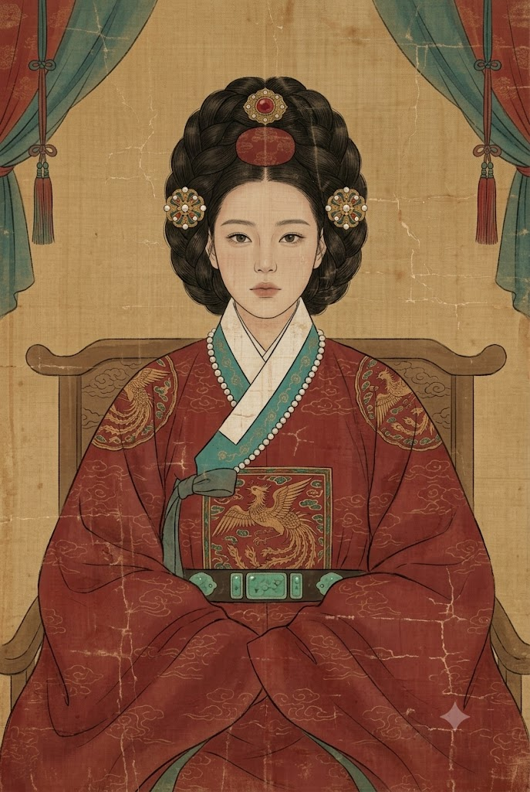
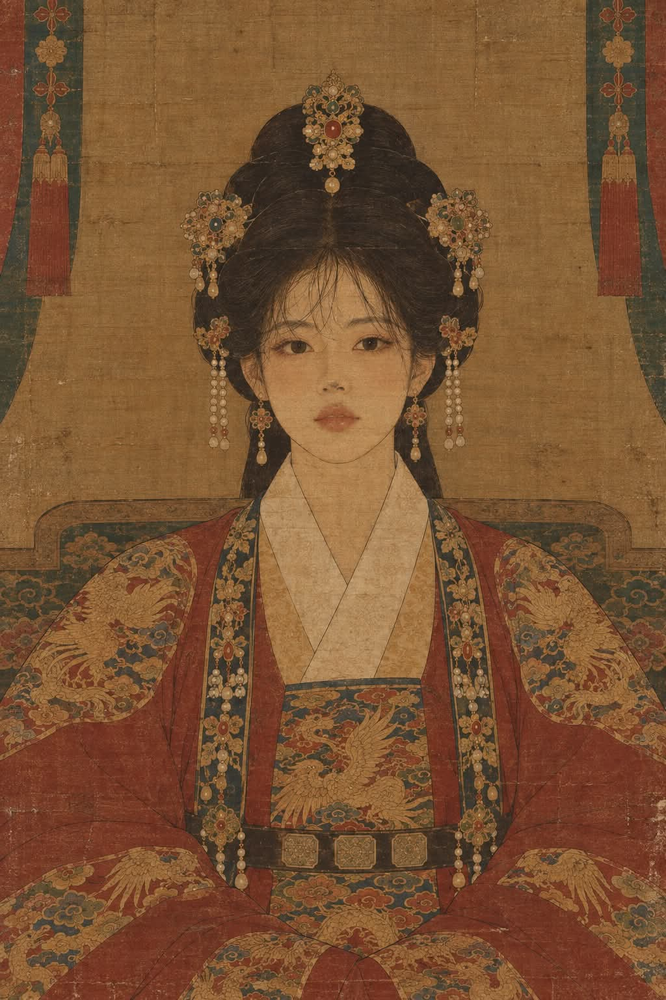

# 조선 왕실 어진(御眞) 양식 전통 비단 채색 초상화 프롬프트

## 1. 개요 및 아트 디렉팅 가이드

- **컨셉**: 수백 년 된 박물관 소장 조선 왕실 어진(御眞) 양식의 비단 채색 초상화 족자
- **비율 및 화풍**: 세로 2:3 (전통 족자 비율), 평면적인 먹선 윤곽과 얇은 전통 채색, 오래된 비단 올·균열·안료 박락 질감
- **최우선 구도 및 얼굴 규칙 (완전 정면 / 동일 질감)**:
  - 고개 돌림이나 기울기 없는 **완전한 정면 대칭 구도** (양쪽 눈·귀·어깨 수평, 코끝이 화면 정중앙, 정면 응시)
  - 원본 사진이 측면/비스듬한 각도여도 동일인의 정면 얼굴로 재구성
  - 입을 다문 위엄 있고 고요한 무표정 (미소/미화/아이돌 화장 절대 금지)
  - 사진을 오려 붙인 듯한 사실적 입체 명암 절대 금지:
    - **인물**: 가는 먹선 윤곽 위에 얇게 채색한 전통 초상화 붓질 (얼굴 위에도 비단 올과 얼룩, 균열이 일체화)
    - **동물**: 조선 영모화(翎毛畵) 기법 (가는 붓으로 털을 한 올씩 결 따라 묘사, 먹점 눈, 평면적 코, 사진 광택 금지)
- **주인공별 복식 규정**:
  - **여성**: 짙은 붉은 비단 대례복, 검은 가체머리(정수리 금 떨잠 + 좌우 대칭 떨잠, 진주 귀걸이), 가슴 봉황 사각 흉배, 깃선 진주 장식
  - **남성**: 붉은 곤룡포, 앞면 민무늬 흑색 익선관(뒤쪽 매미 날개 2장), 옥대, 가슴 용 사각 흉배 (진주 장식 없음)
  - **동물**: 종·털색·무늬 유지, 옥좌에 앉은 정면 포즈, 남성 복식(곤룡포 + 익선관 + 용 흉배) 통일, 깃/소매 밖으로 털 노출
  - **노년 / 아동**: 사진 속 주름·수염·흰머리 등 고유 연령 특징 유지 / 체격에 맞춘 소형 복식
- **배경 및 색감**:
  - 바랜 황토색 비단 바탕, 낮은 옥좌 등받이, 화면 상단 좌우 대칭 청록·붉은 휘장과 술
  - 채도가 낮고 바랜 적갈색, 황토색, 흐린 청록색 중심 (쨍한 금색 배제)

---

## 2. 프롬프트 전문

```text
첨부한 사진은 얼굴 생김새(동물이면 머리 생김새와 털 특징)를 알아보는 용도로만 사용하세요. 사진 속 얼굴 각도, 고개 기울기, 시선 방향, 표정, 조명, 질감, 헤어스타일, 옷, 배경은 전부 무시하고 아래 설명대로 처음부터 새로 그립니다. 결과물은 조선 왕실 어진(御眞) 양식의 오래된 비단 채색 초상화입니다.

[최우선 규칙]

1. 얼굴은 반드시 완전한 정면. 고개를 돌리거나 기울이지 않고, 양쪽 눈·귀·어깨 높이가 같으며 코끝이 화면 정중앙에 오도록. 시선도 정면을 똑바로 봄

2. 사진이 측면이나 비스듬한 각도여도 같은 사람의 정면 얼굴로 재구성. 이목구비 형태, 눈 크기, 얼굴형, 나이는 동일인으로 알아볼 수 있게 유지

3. 표정은 입을 다문 고요하고 위엄 있는 무표정. 웃음 금지

4. 미화 금지. 아이돌 얼굴, 아이라인, 짙은 립, 풀뱅 앞머리 금지

5. 얼굴과 머리는 옷과 완전히 같은 화법·같은 질감으로 그릴 것. 사진을 오려 붙인 듯한 사실적 얼굴 절대 금지

사람: 가는 먹선 윤곽 위에 얇게 채색한 전통 초상화 붓질

동물: 조선 영모화 기법. 가는 붓으로 털을 한 올씩 결 따라 그리고, 눈은 먹점과 옅은 채색으로 단순하게, 코는 먹으로 평면적으로. 사진 같은 눈 반사광, 입체 명암, 털의 사실적 광택 금지

6. 얼굴에도 옷과 똑같이 비단 올, 바랜 색, 얼룩, 미세한 균열이 덮여 있어 화면 전체가 하나의 오래된 그림으로 보일 것

7. 색은 바래고 탁하게. 채도 낮은 적갈색, 바랜 황토색, 흐린 청록색. 번쩍이는 금색 금지

[주인공별 복식]

여성: 짙은 붉은 비단 대례복, 높이 틀어올린 검은 가체머리, 정수리에 붉은 보석 금 떨잠 하나와 좌우 대칭 금·진주 떨잠, 진주 드림 귀걸이

남성: 붉은 곤룡포, 검은 익선관, 옥대

익선관은 장식 없는 무광 검은 비단 모자. 앞면은 민무늬로 아무 장식·보석·십자 문양도 없고, 뒤쪽 위로 매미 날개 모양의 작은 검은 날개 두 장이 솟아 있음

노년: 주름·흰머리·수염 등 사진 속 나이 특징 그대로

아동: 체격에 맞는 작은 복식, 장신구 최소화

동물: 종·털색·무늬를 유지하고 머리와 몸 모두 정면을 향해 옥좌에 앉은 모습. 성별 구분 없이 남성 복식(곤룡포, 익선관, 용 흉배, 진주 장식 없음)으로 통일. 털이 깃과 소매 밖으로 드러남

[복식 공통]

가슴에 사각형 흉배 하나. 여성은 봉황, 남성과 동물은 용

양 어깨에 금사 원형 문양 하나씩(흉배와 같은 동물), 나머지 옷면은 잔잔한 구름 문양

흰색 교차 깃, 청록 깃선

진주 줄 장식은 여성 복식에만. 남성과 동물은 깃선에 진주 없음

짙은 색 허리띠에 청록 옥판 세 개

[구도]

완전한 좌우 대칭, 정면, 옥좌에 단정히 앉은 상반신

넓은 소매가 화면 하단을 채움

세로형 족자 비율 2:3

[배경]

단순한 바랜 황토색 비단 바탕

구름 문양이 새겨진 낮은 옥좌 등받이

화면 상단 좌우 끝에 청록·붉은 휘장과 붉은 술이 대칭으로 살짝

[질감]

수백 년 된 비단 족자를 박물관에서 촬영한 느낌

비단 올이 보이고 얼룩, 미세한 균열, 안료 박락

음영은 거의 없이 평면적으로

[금지]
사진 합성 느낌, 사실적인 얼굴·털 질감, 눈 반사광, 입체 명암, 사진 속 얼굴 각도·표정·조명 반영, 측면·3/4 각도, 고개 기울임, 곁눈질, 미소, 미화된 얼굴, 아이돌 화장, 풀뱅, 매끈한 피부, 쨍한 금색, 원형 흉배, 과한 봉황 반복, 십자가, 십자 문양, 서양 왕관, 주교관, 모자 앞면 장식, 남녀 복식 혼합, 중국 사극풍, 디지털 일러스트 느낌, 텍스트, 워터마크
```

---

## 3. 결과물 비교 갤러리

| 생성 모델 | 생성 결과 이미지 |
| :--- | :--- |
| **제미나이 (Gemini)** |  |
| **ChatGPT (DALL-E 3)** |  |
