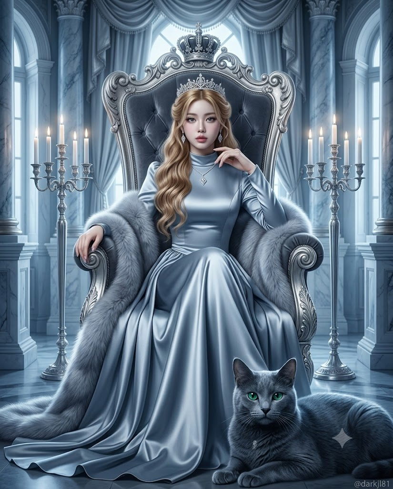
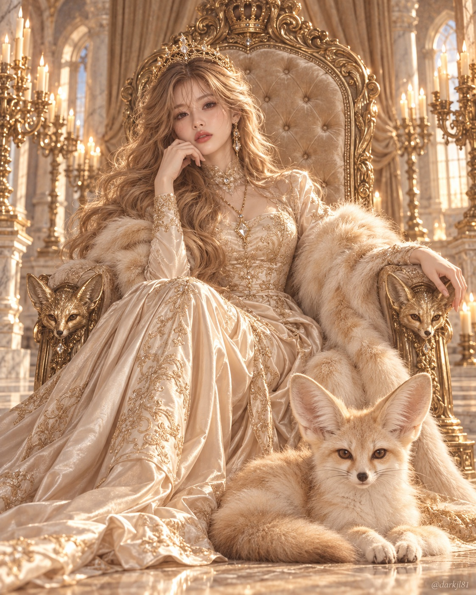

# 관상 기반 여왕과 수호동물 판타지 에디토리얼 화보 프롬프트

## 1. 개요 및 아트 디렉팅 가이드

- **컨셉**: 사진 속 이목구비의 형태와 비율을 정밀 분석하여 도출된 수호동물과, 그 동물의 체색·소재·온도가 옥좌와 의상에 완벽히 동기화된 하이엔드 판타지 여왕 초상화
- **정밀 관상 기반 동물 판정 알고리즘 (4단계)**:
  1. **관상 근거 측정**: 눈(가로/세로 비율, 눈꼬리, 미간), 코(길이, 높이, 코끝, 콧방울), 입(너비, 두께, 입꼬리), 중심부 비율을 형태학적으로 구체적 기술
  2. **서로 다른 목(目)의 후보 5종 선별**: 포유류·조류·파충류 등 목(Order) 중복 없이 다양하게 후보 선정
  3. **부위별 일치도 대조**: 4개 부위 중 다수 일치 여부 대조 (눈 하나만 겹칠 시 즉시 탈락)
  4. **최종 수호동물 확정**: 겹치는 부위가 가장 많은 구체적 종(Species) 선택
- **색감 & 소재 일체화 시스템 (Color & Texture Sync)**:
  - **메인 컬러**: 선택된 동물의 실제 털·깃털·비늘 색상 2~3가지를 드레스, 숄, 옥좌 벨벳, 커튼, 대리석에 동일하게 적용
  - **메탈 컬러**: 동물의 눈동자 색이나 포인트 무늬 색에서 금속 톤(골드, 로즈골드, 실버, 브론즈 등)을 추출하여 티아라, 주얼리, 촛대에 반영
  - **숄 소재**: 동물 표면 질감(털=퍼, 깃털=깃털 숄, 비늘=광택 새틴)과 100% 일치
- **인물 외형 & 옥좌 배치**:
  - **인물**: 20대 여성, 허리까지 내려오는 풍성한 허니 블론드 웨이브, 필리그리 티아라, 하이넥 실크 새틴 롱 드레스, 나른하고 당당한 여왕의 표정
  - **옥좌 & 동물**: 바로크 퀼팅 벨벳 옥좌(팔걸이 끝에 해당 동물 머리 조각), 화면 오른쪽 아래 전경에 거대하게 엎드려 카메라를 똑바로 응시하는 수호동물
- **구도 & 화질**:
  - 세로 4:5 비율, 전신 바로크 옥좌 샷, 소프트 포커스와 은은한 블룸 광채가 감도는 판타지 에디토리얼 화보
- **하단 워터마크**: 우측 하단 작고 은은한 텍스트 `@darkjl81`

---

## 2. 프롬프트 전문

```text
[업로드 이미지 사용 규칙]
업로드한 사진은 얼굴 사진 한 장뿐이며, 두 가지 용도로만 사용한다.
1) 관상 판정: 사진 속 얼굴의 이목구비 특징을 관찰해 이 사람이 어떤 동물을 가장 닮았는지 스스로 판단한다.
2) 이목구비 이식: 사진에서는 눈·코·입의 생김새만 가져온다. 얼굴형, 피부, 헤어, 이마·헤어라인, 머리와 얼굴의 각도(고개 기울기, 방향, 시선), 표정은 절대 가져오지 않는다. 표정과 시선, 고개 각도는 아래 장면 서술대로 새로 그린다. 얼굴 외의 구도·포즈·헤어스타일·의상 디자인·배경 구조는 아래 서술에서 전혀 바뀌면 안 되며, 바뀌는 것은 오직 동물과 그 동물에서 나온 색감·소재뿐이다.

[동물 선택 — 매번 새로 판단]
이미지를 그리기 전에 먼저 채팅에 텍스트로 아래 순서대로 출력한 뒤, 그 결과대로 그린다.
1) 관상 근거: 아래 네 부위를 각각 한 줄씩 구체적으로 관찰해 적는다. 인상·분위기 같은 추상어가 아니라 모양과 비율로 적는다.
- 눈: 가로 길이 대비 세로 높이, 눈꼬리 각도, 눈 사이 간격
- 코: 콧대 길이와 높이, 코끝 모양, 콧방울 폭
- 입: 입 너비, 입술 두께, 입꼬리 방향
- 얼굴 중심부 비율: 눈~코끝~입 사이의 세로 거리, 이목구비가 얼굴 중앙에 모인 정도
2) 후보 5개: 위 관찰과 닮은 동물 후보를 5개 적는다. 5개는 모두 서로 다른 목(目)에서 뽑아야 하며, 같은 목의 동물을 두 개 이상 넣지 않는다.
3) 대조: 각 후보가 눈·코·입·중심부 비율 네 부위 중 몇 부위와 겹치는지 한 줄씩 적는다. 눈 하나만 겹치는 후보는 탈락시킨다.
4) 선택 동물: 겹치는 부위가 가장 많은 후보 하나를 구체적인 종 이름까지 정한다. 동점이면 코와 입이 더 많이 겹치는 쪽을 고른다.
정해진 목록은 없으며 포유류·조류·파충류 등 종류 제한도 없다. 흔히 쓰는 'OO상' 식의 동물상 유형 분류는 사용하지 않고, 오직 위 관찰 결과만으로 판단한다. 동물은 장면 분위기(옥좌·여왕·위엄)가 아니라 얼굴 특징만으로 고른다. 장면에 어울리는지는 판단 기준이 아니며, 어떤 동물이 나와도 그대로 쓴다.

[색감 선택 — 동물의 색에서 그대로 도출]
장면 전체 색감은 선택된 동물의 실제 몸 표면(털·깃털·비늘) 색에서만 뽑는다. 동물 색과 무관한 색은 쓰지 않는다.
- 메인 컬러: 동물 몸의 주된 색 2~3가지를 그대로 가져와 드레스, 숄, 옥좌 쿠션, 커튼, 대리석 톤에 적용한다.
- 메탈 컬러: 동물 눈동자 색이나 무늬의 포인트 색에 가장 가까운 금속 하나(골드, 로즈골드, 실버, 브론즈, 건메탈 등)를 옥좌 조각, 티아라, 주얼리, 촛대에 적용한다.
- 조명: 동물 몸 색의 온도를 따른다. 따뜻한 색이면 촛불·노을빛 계열, 차가운 색이면 달빛·새벽빛 계열, 흰색이면 밝은 하이키 역광.
결과적으로 동물이 장면에서 튀지 않고, 여성의 드레스와 배경이 그 동물의 몸 표면을 확대해 놓은 것처럼 같은 팔레트로 이어져 보여야 한다.

[동물 배치 — 고정]
선택된 동물은 화면 오른쪽 아래 전경, 여성의 발치 앞에 엎드려 앉아(새는 내려앉아) 정면(카메라)을 똑바로 응시한다. 원래 작은 동물이라도 화면 하단 오른쪽 약 절반을 차지할 만큼 크고 존재감 있게 그린다. 차분하고 고귀한 표정, 털·깃털·비늘의 결이 보이는 사실적 디테일.

[인물 — 고정]
20대 여성. 화려한 바로크 옥좌에 몸을 살짝 비스듬히 기대고 편안하게 앉아 있다. 오른손은 손가락을 가볍게 모아 턱과 입술 가까이에 대고 있고, 왼팔은 옥좌 오른쪽 팔걸이 위에 우아하게 올려놓았다. 고개는 아주 살짝 오른쪽으로 기울이고 시선은 정면 카메라를 조용히 바라본다. 표정은 입을 다문 채 신비롭고 나른한 여왕의 무표정, 은은한 자신감.
헤어: 허리까지 내려오는 풍성한 허니 블론드 웨이브 롱헤어, 자연스럽게 뒤로 넘김, 양옆으로 흘러내리는 굵은 컬. (헤어 색은 항상 동일)
머리 장식: 정수리에 섬세한 필리그리 티아라, 작은 보석 장식 (메탈 컬러).
주얼리: 롱 체인 목걸이에 다이아몬드 형태의 크리스털 펜던트, 길게 떨어지는 크리스털 드롭 귀걸이 (메탈 컬러).
메이크업: 투명한 피부 표현, 메인 컬러에 어울리는 은은한 음영과 립 컬러, 자연스러운 속눈썹.
의상: 실크 새틴 롱 드레스 (메인 컬러). 목까지 올라오는 하이넥, 손목까지 덮는 긴 소매, 몸에 맞게 떨어지는 상체, 허리 아래로 여러 겹의 풍성한 드레이프 스커트가 옥좌 아래 바닥까지 흘러내려 퍼진다. 드레스 위로 숄이 팔걸이와 옥좌에 걸쳐 흘러내린다. 숄의 소재는 동물의 몸 표면을 따른다(털이면 퍼, 깃털이면 깃털, 비늘이면 광택 새틴). 숄 색은 동물 몸 색과 같은 톤.

[배경 — 고정 구조]
대리석 바로크 궁전 왕좌의 방. 옥좌는 퀼팅(버튼 터프팅) 벨벳 등받이에 조각 장식이 높은 아치형으로 솟은 형태이며, 꼭대기에 왕관 조각이 있다. 양쪽 팔걸이 끝에 선택된 동물의 머리 모양 조각. 옥좌 뒤로 실크 커튼이 드리워져 있다. 좌우 양쪽에 대형 촛대들이 서 있고 양초 여러 개가 켜져 있다. 뒤편으로 높은 아치형 창문과 조각 기둥. 벨벳·커튼·대리석은 메인 컬러, 조각·촛대는 메탈 컬러.

[화질]
살짝 소프트 포커스와 은은한 광채(블룸 효과)가 있는 몽환적 분위기. 판타지 여왕 초상화, 고급 에디토리얼 화보 느낌의 사실적인 고해상도 사진풍.

[구도]
세로 4:5 비율, 인물 전신이 옥좌와 함께 화면 중앙에서 약간 왼쪽에 위치하고, 동물은 오른쪽 아래 전경. 정면 약간 낮은 아이레벨 시점.

[워터마크]
이미지 우하단 모서리에 작고 은은하게 "@darkjl81" 텍스트.

[금지]
업로드 사진의 머리 각도·시선·표정·헤어·얼굴형 반영 금지. 'OO상' 식 동물상 유형 분류로 판정 금지. 눈매 하나만으로 동물 결정 금지. 장면 분위기에 맞추려고 동물을 고르는 것 금지. 후보 5개 중 같은 목(目) 중복 금지. 두 마리 이상의 동물 금지. 동물 몸 색에 없는 색을 장면에 사용 금지. 동물의 위치·크기·정면 응시 변경 금지. 포즈·드레스 디자인·배경 구조 변경 금지. 이미지 안에 동물 이름 등 텍스트 표기 금지(워터마크 제외, 판정 과정은 채팅 텍스트로만 출력).
```

---

## 3. 결과물 비교 갤러리

| 생성 모델 | 생성 결과 이미지 |
| :--- | :--- |
| **제미나이 (Gemini)** |  |
| **ChatGPT (DALL-E 3)** |  |
