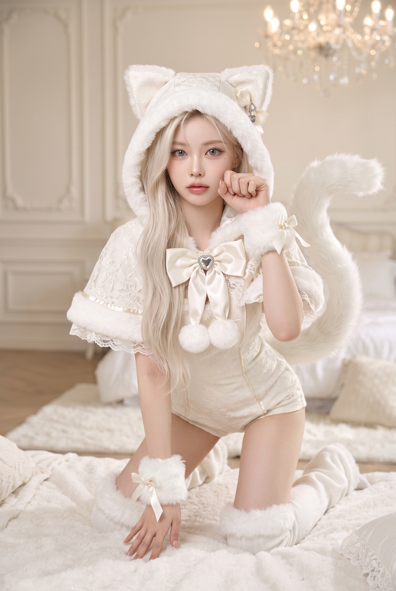
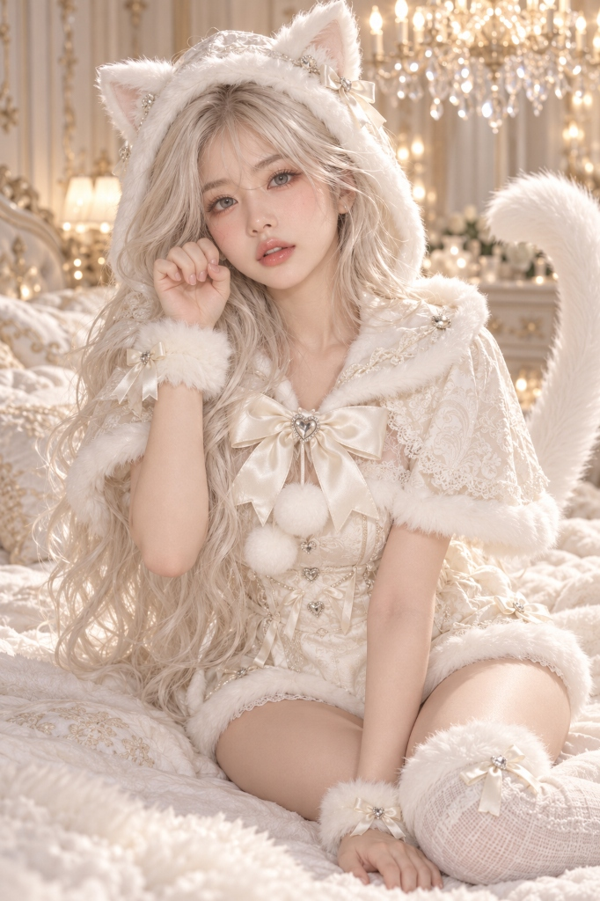

# 로판풍 여우·고양이 코스프레 판타지 패션 화보 프롬프트

## 1. 개요 및 아트 디렉팅 해설
- **콘셉트 테마**: 실사 인물 사진의 '얼굴 정체성(Identity)'과 안경 유무만을 정밀 추출하여 고급 한국 로맨스 판타지 여주인공 수준으로 아름답게 미화하고, 플래티넘 화이트(백금발) 헤어와 아이스 실버 그레이(은회색) 눈동자, 고급스러운 아이보리 화이트 퍼 코스프레 의상을 입고 유럽풍 앤티크 침실에서 촬영한 50mm 화보풍 실사 포트레이트
- **핵심 아트 디렉팅 & 조형 원리**:
  - **얼굴 정체성 보존 & 로판풍 미화 (Identity & Beautification)**:
    - 눈매, 눈 사이 간격, 코, 입술, 얼굴형, 턱선, 볼의 골격을 정확히 유지하여 실제 지인이 누구인지 바로 알아볼 수 있게 연출.
    - 잡티 없는 투명하고 화사한 피부톤, 정돈된 V라인 턱선, 섬세한 아이 메이크업과 긴 속눈썹, 촉촉한 핑크빛 입술로 미화하되 전혀 다른 인물이 되지 않도록 본연의 인상 엄수.
    - 안경 착용자의 경우 안경의 형태와 느낌을 자연스럽게 유지(미착용 시 추가 금지).
  - **시그니처 비주얼 (눈동자 & 헤어)**:
    - 양쪽 눈을 자연스럽게 뜬 채(윙크 금지), 푸른빛이 아닌 명확하고 영롱한 **'아이스 실버 그레이(은회색)'** 홍채와 자연스러운 캐치라이트.
    - 길고 풍성하게 물결치는 부드러운 **백금발(플래티넘 화이트 헤어)**.
  - **고급스러운 아이보리 화이트 코스프레 의상 & 후드**:
    - 퍼 트리밍과 삼각형 귀, 자카드 원단, 새틴 파이핑이 들어간 고급 후드(인형 탈 느낌 배제).
    - 새틴 리본과 은색 하트 보석, 폼폼 방울, 레이스 & 새틴 디테일의 롬퍼 스타일 의상과 폭신한 퍼 커프스, 사이하이 레그워머, 풍성하게 위로 휘어진 꼬리.
  - **자연스러운 3대 포즈 분기 (A / B / C)**:
    - **A (한 손 앞발 포즈)**: 침대 위 무릎 꿇고 상체를 기울여 한 손은 짚고 반대 손은 볼 옆에 부드럽게 앞발 모양으로 올린 포즈.
    - **B (양손 앞발 포즈)**: 상체를 세우고 양손을 얼굴/어깨 양옆에 올려 살짝 오므린 귀여운 양손 앞발 포즈.
    - **C (옆으로 단정히 앉은 포즈)**: 다리를 한쪽으로 가지런히 모으고 우아하게 옆으로 앉아 한 손은 짚고 반대 손은 앞발 모양을 한 차분한 포즈.
  - **인체 해부학 및 자연스러운 손 구조**:
    - 어깨-팔-손목-손가락의 자연스러운 연결, 한 손에 정확히 5개 손가락(기형 및 꺾임 엄격 배제).
  - **배경 미장센 & 스튜디오 조명**:
    - 유럽풍 벽 몰딩, 샹들리에와 따뜻한 보케, 폭신한 흰 침구의 럭셔리 침실.
    - 50mm 렌즈 특유의 자연스러운 원근감, 얼굴 중심의 얕은 심도(Shallow DOF), 의상과 털의 디테일이 살아있는 부드러운 뷰티 조명.

---

## 2. 프롬프트 전문 (코드 블록)

```text
첨부한 현재 사진을 오직 인물의 ‘얼굴 정체성’ 참고용으로만 사용해서 세로 2:3 비율의 고해상도 실사 판타지 패션 사진을 만들어줘.

[얼굴 — 가장 중요]
- 첨부 사진에서는 오직 얼굴의 정체성만 가져온다.
- 눈매와 눈 사이 간격, 코, 입술, 얼굴형, 턱선, 볼의 구조와 전체적인 인상을 충분히 유지해서, 실제 이 사람을 아는 사람이 보면 누구인지 알아볼 수 있어야 한다.
- 단, 얼굴을 그대로 복사하지 말고 고급 한국 로맨스 판타지 여주인공 수준으로 아름답게 미화한다:
  * 맑고 투명한 피부
  * 깨끗하고 화사한 피부톤
  * 세련된 얼굴 윤곽
  * 아름답게 정돈된 턱선
  * 또렷하고 매력적인 눈
  * 섬세한 아이 메이크업
  * 긴 속눈썹
  * 은은한 볼터치
  * 촉촉한 핑크빛 입술
- 원본보다 훨씬 아름답게 표현해도 되지만, 전혀 다른 미인의 얼굴이 되어서는 안 된다.
- 핵심은 ‘누군지 알아볼 수 있는 같은 여성을 로맨스 판타지 여주인공처럼 이상적으로 미화한 모습.’

[안경]
- 사진 속 인물이 안경을 쓰고 있다면 안경의 형태와 느낌까지 자연스럽게 유지한다.
- 안경이 없다면 추가하지 않는다.
- 안경 이외의 액세서리는 사진에서 가져오지 않는다.

[사진에서 가져오지 말 것]
- 원본 사진의 다음 요소는 전부 무시한다:
  헤어스타일 / 머리색 / 앞머리 / 머리 장식 / 귀걸이 / 목걸이 / 기타 액세서리 / 의상 / 몸매 / 자세 / 표정 / 얼굴 방향 / 시선 방향 / 카메라 각도 / 조명과 명암 / 배경
- 사진은 오직 ‘이 사람이 누구인지’를 판단하기 위한 얼굴 정체성 자료로만 사용한다.

[얼굴 각도 / 조명 / 명암]
- 원본 사진의 얼굴 각도와 조명을 그대로 따라 하지 않는다.
- 선택된 포즈와 카메라 구도에 맞춰 같은 사람의 얼굴을 자연스럽게 새로 재구성한다.
- 필요에 따라 고개 방향, 얼굴 각도, 시선과 원근감을 자유롭게 조정한다.
- 얼굴에 떨어지는 빛, 하이라이트, 볼과 턱의 명암, 코 그림자도 새로운 장면의 조명에 맞게 다시 만든다.
- 얼굴과 목, 몸 전체에 동일한 방향의 빛이 자연스럽게 이어져 처음부터 이 장소에서 촬영한 실제 사진처럼 보여야 한다.
- 얼굴을 잘라 붙인 느낌은 절대 없어야 한다.
- 얼굴 각도가 바뀌더라도 본인의 특징과 인식 가능성은 유지한다.

[눈 / 머리]
- 양쪽 눈은 모두 자연스럽게 뜨고 있다. 윙크 금지.
- 양쪽 눈동자는 사실적인 ‘아이스 실버 그레이 / 은회색’으로 변경한다.
- 푸른색 눈이 아니라 명확한 은회색이며, 자연스러운 동공, 홍채 무늬와 캐치라이트를 표현한다.
- 머리는 항상 길고 부드러운 백금발 / 플래티넘 화이트 헤어.
- 원본 사진의 헤어스타일은 사용하지 않는다.

[고양이 후드]
- 얼굴을 예쁘게 감싸는 고급스러운 아이보리 화이트 고양이 후드.
  * 작고 세련된 삼각형 고양이 귀
  * 부드러운 흰색 퍼 테두리
  * 은은한 자카드 원단
  * 얇은 새틴 파이핑
  * 한쪽 귀 근처의 작은 아이보리 리본
  * 작은 은색 장식
- 거대한 동물 탈이나 인형 후드처럼 만들지 않는다.
- 얼굴과 백금발이 충분히 드러나는 세련된 로맨스 판타지 패션 디자인으로 만든다.

[의상]
- 고급스러운 아이보리 화이트 고양이 판타지 의상.
- 짧은 퍼 트리밍 케이프에 레이스와 새틴 디테일을 사용한다.
- 가슴 중앙에는 커다란 아이보리 새틴 리본, 중앙에는 작은 은색 하트 보석, 리본 아래에는 작은 흰색 폼폼 2개.
- 안쪽에는 전체 디자인과 자연스럽게 어울리는 아이보리 화이트 롬퍼 스타일 의상.
- 손목에는 작은 리본이 달린 폭신한 퍼 커프스.
- 다리에는 흰색 퍼 트리밍의 사이하이 레그워머/스타킹.
- 뒤에는 크고 폭신한 흰색 고양이 꼬리 하나가 자연스럽게 위로 휘어져 보인다.
- 성인 여성의 체형은 볼륨감 있고 건강하며 균형 잡힌 아름다운 체형으로 표현한다.
- 머리와 몸의 비율은 현실적인 성인 여성의 비율을 유지한다.

[포즈 — 매번 3가지 중 하나]
- 생성할 때마다 A / B / C 중 정확히 하나만 선택한다.
- 포즈를 서로 섞지 않는다.
- 반복 생성할 때는 가능한 한 같은 포즈만 반복하지 말고 세 가지가 다양하게 나오도록 선택한다.

* A — 한 손 고양이 앞발 포즈:
  폭신한 침대 위에 무릎을 꿇고 상체를 카메라 쪽으로 살짝 기울인다.
  한 손은 침대를 자연스럽게 짚고, 반대 손은 얼굴 옆으로 들어 올린다.
  손목을 부드럽게 굽히고 손가락을 살짝 오므려 귀여운 고양이 앞발 모양을 만든다.
  고개를 앞발을 든 쪽으로 살짝 기울이고 양쪽 눈을 뜬 채 카메라를 바라본다.

* B — 양손 고양이 앞발 포즈:
  침대 위에 무릎을 꿇고 상체를 자연스럽게 세운다.
  양손을 얼굴 또는 어깨 양옆으로 올려 두 손 모두 부드러운 고양이 앞발 포즈를 만든다.
  손목은 가볍게 안쪽으로 굽히고 손가락은 자연스럽게 오므린다.
  손으로 얼굴을 가리지 않는다.
  고개를 한쪽으로 살짝 기울이고 양쪽 눈을 뜬 채 카메라를 바라본다.

* C — 옆으로 앉은 고양이 포즈:
  폭신한 침대 위에 두 다리를 한쪽으로 가지런히 모아 단정하게 옆으로 앉는다.
  상체는 자연스럽게 세우고 한쪽으로 아주 살짝 기울인다.
  한 손은 몸 옆의 침대를 편안하게 짚는다.
  반대 손은 얼굴 옆으로 들어 손목을 부드럽게 굽히고 손가락을 살짝 오므린 귀여운 고양이 앞발 포즈를 만든다.
  고개를 살짝 기울이고 얼굴을 카메라 방향으로 자연스럽게 돌린다.
  양쪽 눈을 모두 뜬 채 밝고 장난스러운 표정으로 카메라를 바라본다.
  다리는 자연스럽게 모은 상태를 유지한다.
- 과도하게 허리나 골반을 강조하거나 선정적으로 보일 수 있는 자세는 사용하지 않는다.
- 귀엽고 우아한 ‘얌전히 앉아 있는 고양이’를 연상시키는 판타지 패션 화보 포즈로 표현한다.

[자세 / 손]
- 모든 포즈에서 실제 사람의 신체 구조를 따른다.
- 어깨 → 팔 → 팔꿈치 → 손목 → 손가락이 자연스럽게 연결되어야 한다.
- 팔을 뒤로 비틀거나 손목을 비현실적으로 꺾지 않는다.
- 손가락은 한 손에 정확히 5개.
- 추가 팔, 추가 손가락, 붙은 손가락, 비정상적인 관절과 신체 왜곡 금지.
- 귀여운 고양이 포즈보다 자연스러운 인체 구조를 우선한다.

[표정]
- 부드럽고 밝으며 장난기 있는 표정.
- 고급 로맨스 판타지 여주인공의 분위기를 유지하면서 귀엽고 사랑스러운 고양이 콘셉트를 표현한다.
- 과도하게 유혹적이거나 선정적인 표정은 사용하지 않는다.
- 양쪽 눈은 항상 뜨고 있다. 윙크 금지.

[배경 / 촬영]
- 고급스러운 아이보리 화이트 침실.
  * 화려한 유럽풍 벽 몰딩
  * 폭신한 흰색 침구
  * 부드러운 러그와 쿠션
  * 크리스털 샹들리에
  * 따뜻하고 부드러운 샹들리에 보케
- 세로 2:3 구도.
- 50mm 인물 사진 느낌의 자연스러운 원근감.
- 얼굴이 충분히 크게 보여 업로드한 인물을 알아볼 수 있어야 한다.
- 적당히 얕은 심도를 사용하고 얼굴과 은회색 눈동자는 매우 선명하게 초점을 맞춘다.
- 부드러운 정면 상단 뷰티 조명과 따뜻한 주변 조명을 사용한다.
- 얼굴에는 입체적인 명암을 남기고, 흰색 퍼와 의상은 과노출시키지 않아 털, 레이스, 새틴의 질감이 선명하게 보여야 한다.
- 전체 결과는 일러스트나 3D가 아니라 실제 성인 여성을 전문 사진가가 촬영한 듯한 고급 로맨스 판타지 패션 화보여야 한다.

[핵심 / 피해야 할 요소]
- 사진 = 얼굴 정체성 + 안경(있는 경우)만 사용. 템플릿 = 그 외 모든 요소.
- 얼굴 각도, 고개 방향, 시선, 조명과 명암은 원본 사진에 고정하지 않고 선택된 포즈와 새로운 장면에 맞게 자연스럽게 변경한다.
- 얼굴이 어떤 각도로 바뀌더라도 누구인지 알아볼 수 있는 정체성은 반드시 유지한다.
- 윙크 금지. 파란 눈 금지. 원본 헤어스타일 복사 금지. 원본 액세서리 복사 금지. 원본 의상/몸/포즈 복사 금지.
- 거대한 동물 탈 후드 금지. 얼굴 붙여넣기 느낌 금지. 과도하게 선정적인 포즈 금지. 비현실적인 신체 비율 금지. 손과 팔 왜곡 금지. 플라스틱 피부 금지. CG/3D 느낌 금지.
```

---

## 3. 결과물 비교 갤러리

| 생성 모델 | 결과 이미지 |
| :--- | :--- |
| **Google Gemini** |  |
| **OpenAI GPT** |  |
