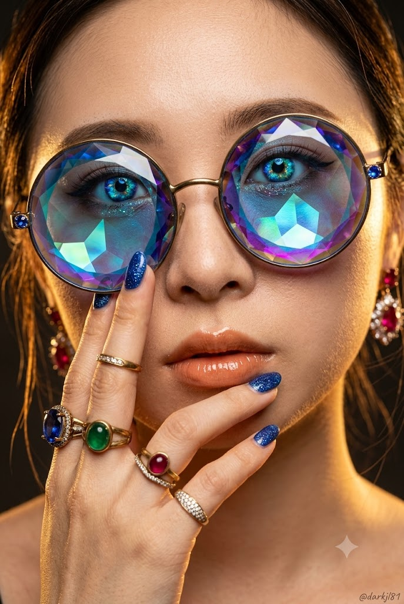
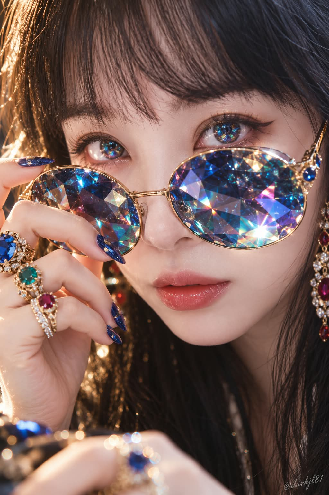

# 하이엔드 주얼리 뷰티 에디토리얼 '오팔 아이 & 프리즘 선글라스' 프롬프트

## 1. 개요 및 아트 디렉팅 가이드
- **콘셉트 테마**: 참조 사진의 인물 고유 형태와 인상만 가져와 극도로 정밀한 실사 매크로 뷰티 매거진 화보로 구현한 '갤럭시 오팔(코스믹 주얼) 홍채'와 '다각 페이싯 컷 프리즘 보석 선글라스'의 100% 포토리얼 실사 초근접 에디토리얼 (세로 2:3)
- **핵심 아트 디렉팅 & 조형 원리**:
  - **인물 인상 보존 & 초근접 매크로 실사 (Macro Beauty Realism)**:
    - 참조 사진의 눈매, 눈 사이 간격, 콧대, 입술선, 턱선 등 고유한 이목구비 정체성을 엄격히 유지.
    - 플라스틱 피부 보정 없이 미세한 모공, 솜털, 잔주름과 실제 사람 피부결을 생생하게 살린 85mm 렌즈의 초근접 타이트 매크로 샷.
  - **갤럭시 오팔 / 코스믹 주얼 홍채 (Cosmic Jewel Iris)**:
    - 단순 레인보우 띠가 아닌, 사파이어·코발트 블루 심연 속에 시안, 터콰이즈, 에메랄드, 골드, 바이올렛이 불규칙한 우주 성운처럼 뒤섞인 형태.
    - 실제 방사형 홍채 섬유와 오팔 원석의 다색 결정광, 투명한 각막과 촉촉한 눈물막의 리얼한 스페큘러 캐치라이트.
  - **다면 페이싯 컷 프리즘 보석 선글라스 (Faceted Prism Gem Sunglasses)**:
    - 평평한 컬러 렌즈가 아닌 거대한 투명 원석을 수많은 다각형으로 정교하게 커팅한 형태.
    - 각 면마다 사파이어, 에메랄드, 마젠타, 골드 등 각도에 따라 서로 다른 빛을 굴절·분산시키는 강렬한 레인보우 파이어 렌즈와 얇은 앤틱 골드 와이어 테.
  - **럭셔리 주얼리 핸드 & 네일 스타일링**:
    - 선글라스 곁에 우아하게 배치된 손가락마다 착용한 페이싯 컷 사파이어, 에메랄드, 루비 카보숑, 파베 다이아몬드 골드 링.
    - 세련된 아몬드형 사파이어 블루 글리터 젤네일, 누드 오렌지빛의 촉촉한 글로시 립.
  - **골든 림라이트 대비 & 은은한 워터마크**:
    - 따뜻한 골든 키/림라이트와 차가운 블루·오팔 프리즘 반사의 고급스러운 색채 대비.
    - 우측 하단에 낮은 불투명도의 은은한 손글씨체 **"@darkjl81"** 워터마크 배치.

---

## 2. 프롬프트 전문 (코드 블록)

```text
세로 2:3, 고해상도, 100% 포토리얼 실사 초근접 뷰티 에디토리얼.
실제 전문 사진작가가 85mm 렌즈와 매우 얕은 심도로 촬영한
하이엔드 주얼리·뷰티 매거진 화보처럼 표현한다.
애니메이션, 일러스트, 페인팅, 3D/CGI 느낌은 전혀 없어야 한다.

━━━━━━━━━━━━━━━━━━━━
[참조사진 — 얼굴 특징과 인상만 / 최우선]
━━━━━━━━━━━━━━━━━━━━

사용자가 어떤 인물 사진을 첨부하더라도,
사진에서는 오직 그 사람임을 알아보게 만드는
얼굴의 형태적 특징과 고유한 인상만 가져온다.

눈의 실제 형태·기울기·눈 사이 간격·눈꼬리,
눈썹, 코의 형태와 비율, 입술, 얼굴형,
광대·볼·턱선, 눈·코·입의 상대적인 위치와
그 사람 특유의 전체적인 인상을 유지한다.

완성 결과에서도 원본을 아는 사람이
동일인이라고 알아볼 수 있어야 한다.

참조사진의 피부색, 피부 밝기, 노출, 명암, 그림자,
하이라이트, 색온도, 화이트밸런스, 조명 방향, 색감,
얼굴 각도, 시선, 표정, 헤어스타일, 카메라 원근과 배경은
절대 가져오지 않는다.

얼굴을 그대로 복사하거나 붙여 넣지 않는다.
얼굴의 각도·피부색·밝기·조명·명암은
모두 현재 화보 장면에 맞춰 새롭게 적용한다.
얼굴만 하얗거나 따로 떠 보이는 합성 느낌은 금지한다.

━━━━━━━━━━━━━━━━━━━━
[구도 / 피부]
━━━━━━━━━━━━━━━━━━━━

젊은 성인 여성의 얼굴을 이마부터 입술까지
아주 타이트하게 담은 초근접 매크로 뷰티 샷.

카메라는 정면에서 살짝 비스듬한 각도.
눈과 선글라스가 화면에서 가장 강하게 보인다.

피부는 실제 사람처럼 미세한 모공, 솜털,
잔주름과 자연스러운 피부결이 살아 있다.
플라스틱처럼 매끈한 피부 보정은 하지 않는다.

━━━━━━━━━━━━━━━━━━━━
[눈동자 — 최우선]
━━━━━━━━━━━━━━━━━━━━

눈동자는 매우 화려하고 신비로운
‘갤럭시 오팔 / 코스믹 주얼’ 홍채.

홍채의 중심색은 깊고 투명한
사파이어 블루와 코발트 블루.

그 안에 시안, 터콰이즈, 에메랄드 그린,
골드와 바이올렛이 불규칙한 우주 성운처럼 섞여 있다.

단순한 무지개 띠나 균일한 레인보우 그라디언트가 아니다.

짙은 블루 우주 안에 청록·에메랄드·골드빛 성운과
미세한 별빛 같은 색점이 떠 있는 것처럼 표현한다.

동공 주변에는 깊은 네이비와 블루가 집중되고,
바깥쪽으로 청록·에메랄드·골드가 불규칙하게 퍼진다.

홍채의 실제 방사형 섬유 사이사이에
오팔 원석 같은 다색 결정광과
미세한 프리즘 하이라이트가 반짝인다.

색은 매우 선명하고 화려하지만
눈 자체가 네온처럼 발광하지 않는다.

정상적인 검은 동공,
실제 사람의 홍채 섬유,
투명한 각막,
촉촉한 눈물막,
유리 같은 깊이감과 강한 캐치라이트를 표현한다.

전체적으로
‘사파이어 블루 우주 + 에메랄드/골드 성운 + 오팔 프리즘’을
실제 사람의 눈 속에 담은 듯한 모습.

날카롭고 정교한 윙 아이라인,
한 올씩 선명한 실제 인조속눈썹.

━━━━━━━━━━━━━━━━━━━━
[보석 선글라스 — 핵심]
━━━━━━━━━━━━━━━━━━━━

오버사이즈 원형 선글라스.

렌즈는 일반 유리나 플라스틱이 아니라
거대한 투명 원석 자체를 수많은 면으로 정교하게
페이싯 커팅한 프리즘 보석 렌즈처럼 표현한다.

기본색은 깊은 사파이어·코발트 블루지만
절대 파란색 단색 렌즈가 아니다.

각 커팅면마다
로열 블루, 시안, 터콰이즈, 에메랄드,
바이올렛, 마젠타, 핑크, 골드, 오렌지가
서로 다른 각도로 화려하게 반사된다.

큰 삼각형과 다각형의 보석 커팅면이 명확하게 보이며,
면마다 색과 밝기가 달라져 실제 거대한 보석처럼 느껴진다.

강렬한 레인보우 파이어,
프리즘 분산광,
별처럼 날카로운 스펙큘러 하이라이트,
보석 내부의 깊은 굴절과 투명감을 표현한다.

주변 얼굴과 스튜디오 조명도 커팅면에
미세하게 반사되고 굴절되어야 한다.

네온이나 홀로그램처럼 자체 발광하지 않는다.

프레임은 매우 얇은 앤틱 골드 와이어.
실제 금속의 미세한 브러시 질감과 반사광이 있으며,
힌지에는 작은 아쿠아 블루 보석이 세팅되어 있다.

━━━━━━━━━━━━━━━━━━━━
[손 / 반지 / 네일]
━━━━━━━━━━━━━━━━━━━━

얼굴 옆으로 한쪽 손을 우아하게 들어
선글라스 가까이에 위치시킨다.

가까운 손에도 선명하게 초점을 맞추며,
손가락 수와 관절 구조가 정확하고
피부 주름과 미세한 그림자까지 실제 사람처럼 표현한다.

손가락마다 서로 다른 화려한 앤틱 골드 반지를 착용한다.

큰 페이싯 컷 블루 사파이어/토파즈,
에메랄드 카보숑,
루비 카보숑,
파베 다이아몬드 밴드.

각 원석에는 실제 보석의 깊이,
굴절, 투명감, 커팅면과 강한 반사광이 존재한다.

손톱은 길고 세련된 아몬드형.
사파이어 블루 글리터 젤네일이며
유리 같은 실제 젤네일 광택이 보인다.

반대쪽 손은 화면 하단 가장자리에
살짝 아웃포커스로 보이며 역시 보석 반지를 착용한다.

━━━━━━━━━━━━━━━━━━━━
[입술 / 헤어 / 귀걸이]
━━━━━━━━━━━━━━━━━━━━

입술은 은은한 누드 오렌지 톤의 촉촉한 글로시 립.
실제 립글로스의 투명한 광택과 입술결이 살아 있다.

이마 주변에는 자연스러운 잔머리와
몇 가닥의 흩어진 머리카락이 있으며
뒤쪽 골든 림라이트를 받아 가늘게 빛난다.

귀 근처 프레임 가장자리에는
루비와 다이아몬드 클러스터 드롭 귀걸이가
얕은 심도로 살짝 흐릿하게 보인다.

━━━━━━━━━━━━━━━━━━━━
[조명 / 카메라]
━━━━━━━━━━━━━━━━━━━━

한쪽에서 들어오는 따뜻한 골든 키/림라이트.
얼굴에는 실제 광원 방향에 맞는 자연스러운 명암과 그림자를 만든다.

따뜻한 피부의 골든 톤과
차가운 사파이어 블루·에메랄드·오팔·프리즘 반사가
화려하게 대비된다.

배경은 거의 블랙에 가까운 어두운 아웃포커스 스튜디오.

85mm portrait lens,
extremely shallow depth of field,
high-end beauty editorial photography.

눈과 갤럭시 오팔 홍채,
보석 선글라스와 가까운 손은 칼같이 선명하고,
나머지는 부드럽고 자연스러운 보케.

실제 카메라 센서로 촬영한 듯한
자연스러운 다이내믹 레인지와 필름 같은 콘트라스트.

화면 우측 하단에 작은 손글씨체
“@darkjl81” 워터마크를
흰색 또는 밝은 회색의 낮은 불투명도로 은은하게 넣는다.

━━━━━━━━━━━━━━━━━━━━
[절대 금지]
━━━━━━━━━━━━━━━━━━━━

참조사진의 피부색·밝기·조명·명암 복제,
참조 인상 소실,
다른 사람의 얼굴로 변경,
얼굴만 하얗게 떠 보이는 합성 느낌,
갈색/검정 단색 홍채,
단순 레인보우 그라디언트 홍채,
네온 발광 눈,
단색 블루 선글라스,
평평한 컬러 렌즈,
플라스틱 피부,
과도한 뽀샵,
손가락 개수 오류,
손과 관절 왜곡,
뭉개진 보석 커팅면,
플라스틱 같은 가짜 보석,
평평한 조명,
애니메이션, 일러스트, 페인팅, 3D, CGI 느낌.
```

---

## 3. 결과물 비교 갤러리

| 생성 모델 | 결과 이미지 |
| :--- | :--- |
| **Google Gemini** |  |
| **OpenAI GPT** |  |
