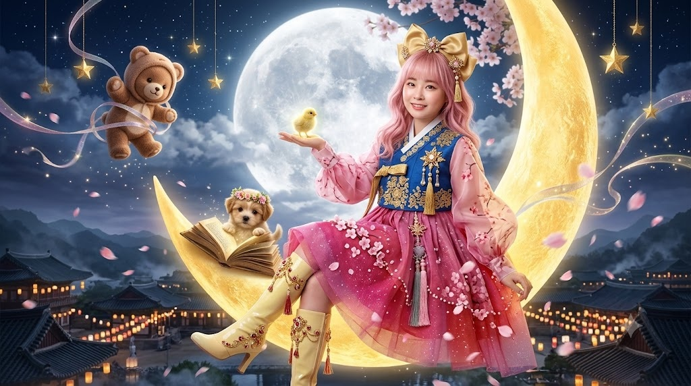
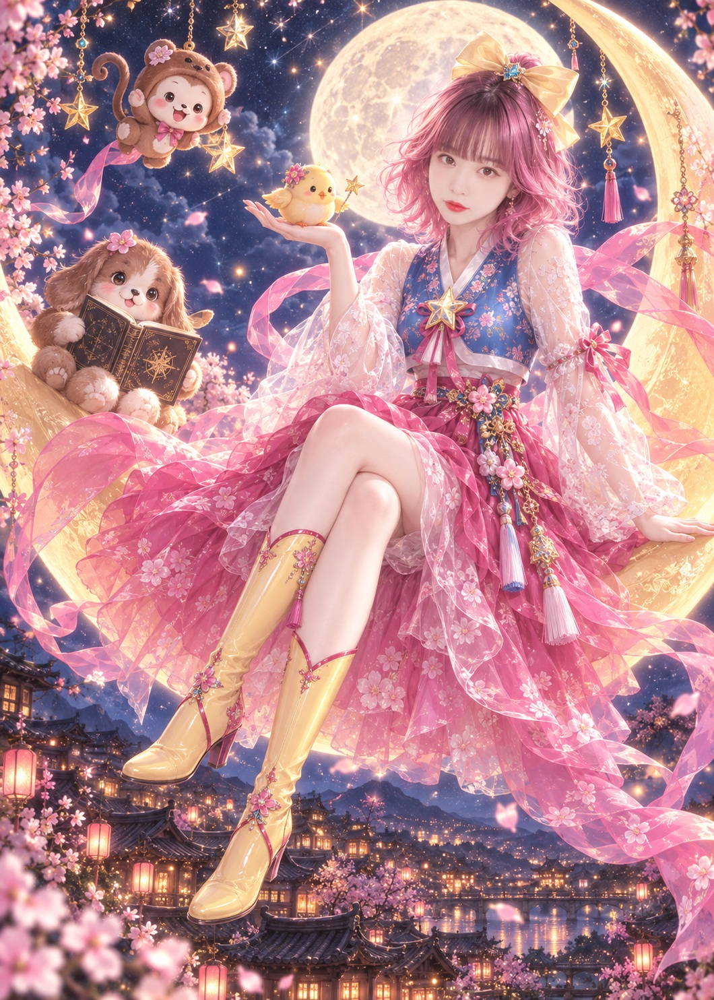

# 로판풍 요술공주 밍키 마법소녀 한복 일러스트 프롬프트

## 1. 개요 및 아트 디렉팅 해설
- **콘셉트 테마**: 추억의 마법소녀 **'요술공주 밍키(Minky Momo)'**의 시그니처 비주얼을 한국 로맨스 판타지 웹소설 표지 수준의 **8등신 마법소녀 한복 일러스트**로 하이엔드 재해석
- **핵심 아트 디렉팅 & 조형 원리**:
  - **얼굴 조형 (닮음 50% + 로판 미화 50%)**:
    - **절대 보존 요소**: 인물을 특정할 수 있는 본래의 눈 모양과 눈꼬리 각도, 미간 간격, 기본 얼굴형, 입술 가로 너비 보존.
    - **로판풍 극상 미화**: 잡티 없는 도자기 투명 피부, 깊은 안구 광채와 다층 하이라이트/홍채 묘사, 풍성한 속눈썹, 정돈된 콧대와 입꼬리 윤기, 화보 수준의 입체적 음영 메이크업.
  - **신체 비율 & 화풍 (선 없는 명암 페인팅)**:
    - 검은 외곽선(라인아트)을 배제하고 부드러운 에어브러시 명암과 빛 번짐(Bloom), 보케로 형태를 구축하는 디지털 페인팅.
    - 치비/SD/아동 체형을 철저히 금지하고, 머리 크기가 전신의 1/8에 해당하는 이상적인 8등신 성인 여성 패션 일러스트 프로포션.
  - **마법소녀 한복 복식 디자인**:
    - **헤어 & 액세서리**: 풍성한 핑크빛 웨이브 단발, 정수리의 거대한 옐로우 리본과 중앙의 푸른 보석 장식.
    - **당의 & 치마**: 코발트 블루 당의 상의, 흉배 위치의 금색 별 브로치, 진분홍·자홍색 그라데이션의 다층 시스루 오간자(Organza) 한복 치마와 플로럴 은사 자수, 반투명 시스루 소매, 화려한 전통 노리개와 바람에 날리는 분홍 비단 리본.
    - **신발**: 무릎까지 올라오는 에나멜 옐로우 부츠와 붉은 라인/플라워 디테일.
  - **포즈 & 마스코트 3총사 연출**:
    - 밤하늘 거대한 황금빛 초승달에 비스듬히 다리를 꼬고 걸터앉은 우아한 전신 구도.
    - 레트로 80~90년대 감성을 담은 세 마스코트 배치:
      1. **강아지**: 달 표면에 앉아 금테 마법책을 펼치고 조언하는 현명한 리더.
      2. **병아리**: 뻗은 손바닥 위에서 날개를 펴고 지저귀는 정찰병 마스코트.
      3. **원숭이**: 허공에 떠서 장난스럽게 손을 흔드는 재주꾼 아기 원숭이.
  - **배경 & 조네이션**:
    - 남색 밤하늘과 별무리, 달빛 역광 림라이트(Rim light).
    - 화면 하단에는 따뜻한 주황빛 창문과 청사초롱 불빛이 반짝이는 한옥 기와마을 야경과 흩날리는 벚꽃잎.
  - **전통 전서체 낙관 (朱文方印)**:
    - 우측 하단에 자연스러운 인주 번짐 질감을 살린 정사각 붉은 바탕에 음각 흰색 전서체 한자 **「在琳」** (위 在, 아래 琳) 배치.

---

## 2. 프롬프트 전문 (코드 블록)

```text
첨부한 사진 속 인물의 얼굴을 주인공으로 하여,
아래 장면을 하나의 고품질 일러스트로 새로 그려 줘.

■ 얼굴 (다른 모든 지시보다 우선)
- 첨부 사진의 인물을 기준으로 그릴 것.
닮음 50%, 미화 50% 비율을 지킨다.
- 반드시 유지 (이것만은 건드리지 말 것):
· 눈 모양과 눈꼬리 방향 (올라갔는지 내려갔는지)
· 두 눈 사이의 간격
· 얼굴형의 기본 인상 (둥근형인지 갸름한형인지)
· 입의 가로 너비
→ 이 네 가지가 인물을 알아보는 핵심이다.
- 미화 허용 (이 범위에서 과감하게):
· 피부를 잡티 없이 매끄럽게, 은은한 광채와 투명감
· 눈을 조금 더 크고 또렷하게, 눈동자에 여러 겹
하이라이트와 홍채 디테일
· 속눈썹을 길고 풍성하게, 쌍꺼풀 라인을 또렷하게
· 콧대를 살짝 높이고 코끝을 정돈
· 턱선을 부드럽게 다듬어 갸름하게
· 입술에 윤기와 화사한 톤, 입꼬리를 살짝 정돈
· 볼터치와 음영 메이크업으로 입체감 강화
· 전체적으로 잡지 화보 수준의 보정과 광채
- 기준선: "본인인데 인생샷 + 메이크업 + 보정 풀로 받은 버전".
예쁘게 다듬되 남이 되면 안 된다.
- 완성된 얼굴을 지인이 보고
"오 이 사람 맞네, 엄청 예쁘게 나왔다" 하면 성공.
"이거 누구야?" 하면 실패.
- 얼굴이 작게 보이더라도 이목구비는 선명하고 정교하게 그릴 것.
- 나이대는 사진 그대로.
- 표정: 입을 살짝 벌린 채 정면을 보는 차분한 표정.
※ 금지: 이목구비를 통째로 전형적인 AI 미인 얼굴로
교체하는 것. 눈 모양과 눈 간격이 바뀌면 실패.

■ 화풍
- 굵은 검은 외곽선이 없는 고급 디지털 페인팅 일러스트.
- 한국 로맨스 판타지 소설 표지 / 라이트노벨 표지 퀄리티.
- 부드러운 에어브러시 그라데이션, 입체적인 명암,
피부와 천의 질감 표현, 빛 번짐(bloom)과 보케가 살아있는
시네마틱 라이팅.
- 선이 아닌 명암으로 형태를 표현할 것.
※ 웹툰체, 스티커풍, 평면 채색, 두꺼운 라인아트 금지.

■ 신체 비율 (중요)
- 8등신 비율의 늘씬한 성인 여성 체형.
- 머리를 작게 그릴 것. 머리 세로 길이가 전신 키의
1/8 정도가 되도록 한다.
- 목은 가늘고 길게, 어깨는 머리 너비의 약 2배.
- 다리를 길게, 허리 위치를 높게.
- 패션 일러스트 / 로판 표지의 이상적인 프로포션.
※ 금지: 머리가 큰 SD 캐릭터 비율,
2~5등신의 치비/아동 체형, 어깨가 좁고 머리가 큰 구도.

■ 캐릭터
- 풍성한 웨이브 핑크색 단발머리, 정수리에 큰 노란 리본,
리본 중앙에 작은 푸른 보석 장식.
- 의상: 마법소녀풍으로 재해석한 한복.
파란색 당의 상의, 가슴 중앙에 금색 테두리의 별 브로치,
진분홍·자홍색 그라데이션의 겹겹 시스루 오간자 치마,
치마에 흰 꽃무늬 자수, 반투명 흰색 시스루 소매에 꽃무늬,
허리에 화려한 매듭 노리개와 술 장식,
바람에 길게 흩날리는 분홍 비단 리본.
- 신발: 무릎까지 오는 에나멜 노란색 부츠,
붉은 라인과 꽃 장식.

■ 포즈 / 구도
- 거대한 노란 초승달 위에 다리를 꼬고 옆으로 걸터앉은 자세.
- 한 손은 위로 뻗어 손바닥 위에 작은 병아리 마스코트를 올려둠.
- 다른 손은 뒤쪽 달 표면을 짚고 몸을 지탱.
- 전신이 다 보이는 세로 구도, 인물은 화면 오른쪽 중앙.

■ 주변 마스코트 (원본 창작 캐릭터, 세 마리)
1) 강아지 — 왼쪽 달 표면에 앉아 있음.
복슬복슬한 갈색 털의 둥근 강아지, 축 늘어진 귀,
까맣고 큰 눈, 작은 갈색 코.
앞발로 금테 두른 낡은 마법책을 펼쳐 들고 조언하는 자세.
현명하고 든든한 리더 같은 표정.
2) 병아리 — 주인공의 뻗은 손바닥 위.
작고 동그란 노란 병아리, 주황색 부리와 다리,
등에 작고 반투명한 날개.
고개를 들고 지저귀는 활기찬 모습. 정찰병 느낌.
3) 원숭이 — 왼쪽 위 공중에 떠 있음.
작고 동그란 분홍빛 얼굴의 아기 원숭이,
갈색 털 후드를 뒤집어쓴 듯한 실루엣, 긴 꼬리,
장난기 가득한 표정으로 손을 흔듦. 재주꾼 느낌.
- 세 마리 모두 1980~90년대 레트로 TV 만화풍의
단순화된 형태와 부드러운 음영.
- 주인공보다 시선을 끌지 않도록 톤 다운.

■ 배경 / 조명
- 짙은 남색 밤하늘, 무수한 별과 노란 별 장식,
거대한 달이 인물 뒤에서 빛나는 강한 역광.
- 머리카락과 어깨 윤곽에 달빛 림라이트.
- 화면 하단: 기와지붕 한옥 마을의 야경,
창문마다 따뜻한 주황빛, 청사초롱 불빛,
흩날리는 벚꽃잎, 멀리 보이는 산 능선.
- 배경은 얕은 심도로 부드럽게 블러 처리.

■ 낙관 (서명 도장)
- 화면 우측 하단 모서리에 전통 낙관을 넣을 것.
- 형태: 정사각형 주문방인(朱文方印) — 붉은 인주 색
바탕에 한자를 흰색으로 음각한 형태.
- 글자: 세로 2자 배치로 「在琳」 (위 在, 아래 琳).
- 서체: 전서체(篆書體) 느낌의 각진 인장 글씨.
- 크기: 전체 화면 높이의 약 5% 정도로 작게.
- 질감: 종이에 도장을 찍은 듯 가장자리가 살짝 번지고
일부 끊긴 자연스러운 인주 자국.
- 위치: 우측 하단 여백, 배경 위에 겹쳐지되
주요 요소를 가리지 않게.
※ 글자는 반드시 「在琳」 두 글자만. 다른 한자나
글자 변형 금지. 오탈자 없이 정확하게.

■ 전체 톤
- 동화적이고 몽환적인 분위기,
따뜻한 노랑과 선명한 핑크의 대비, 세밀한 디테일.
- 세로 비율 5:7, 고해상도.

■ 금지
- 얼굴만 실사처럼 붕 뜨는 합성 느낌
- 여분의 손가락
- 낙관 외의 모든 텍스트, 워터마크, 서명
```

---

## 3. 결과물 비교 갤러리

| 생성 모델 | 결과 이미지 |
| :--- | :--- |
| **Google Gemini** |  |
| **OpenAI GPT** |  |
