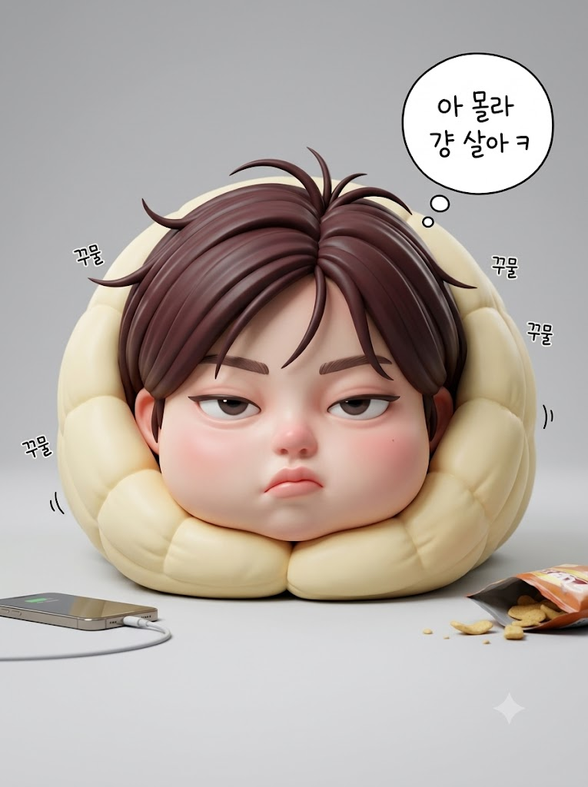
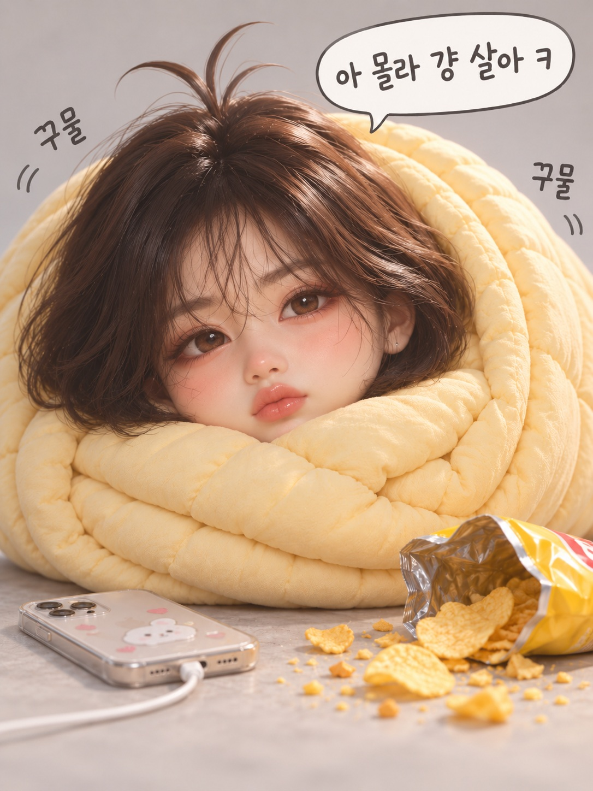

# 3D 스타일라이즈드 이불 김밥 미니미 캐리커처 프롬프트

## 1. 개요 및 아트 디렉팅 가이드

- **컨셉**: 크림 옐로 솜이불에 온몸이 김밥처럼 돌돌 말려 바닥에 누워 있는 귀엽고 나른한 3D 스타일라이즈드 빅헤드 미니미 캐리커처 아트토이
- **닮음 최우선 캐리커처 원칙**:
  - 지인이 한눈에 알아볼 수 있도록 사진 속 인물의 가장 두드러진 고유 특징 2~3가지(눈매 기울기, 눈꺼풀, 코끝 모양, 입술 두께/입꼬리 등)를 포착해 귀엽게 과장
  - 눈·코·입·눈썹의 형태와 상대적 배치 비율은 그대로 보존하고, 크기와 입체감만 3D 토이 스타일로 귀엽게 확대
  - 사진의 얼굴 방향, 시선, 고개 기울기는 배제하고 프롬프트의 구도 지침 준수
- **캐릭터 비율 & 표정 연출**:
  - 머리가 몸보다 훨씬 큰 빅헤드 미니미 비율, 볼이 통통하게 부푼 둥근 얼굴
  - 눈매를 해치지 않으면서 귀찮은 듯 반쯤 뜬 눈으로 빤히 올려다보는 시선, 살짝 삐죽 내민 입술과 볼·코끝의 옅은 핑크 홍조
- **화풍 & 질감**:
  - 매끈한 비닐·레진 피규어 질감, 서브서피스 스캐터링(SSS)으로 구현된 말랑한 도자기 피부
  - 얕은 피사계 심도와 부드러운 스튜디오 조명의 하이엔드 3D 렌더링
- **이불, 소품 & 구도**:
  - **이불**: 두툼한 크림 옐로 퀼팅 솜이불에 턱밑까지 감싸인 롤 형태 (소용돌이치는 단면 층과 부드러운 주름)
  - **구도**: 세로 3:4 비율, 바닥에 누운 이불 롤을 바닥 높이에서 정면으로 마주하는 로우 앵글
  - **소품 & 만화 효과**: 충전 케이블이 꽂힌 스마트폰, 뜯겨 흘린 과자 봉지와 부스러기, "아 몰라 걍 살아 ㅋ" 손글씨 말풍선, 이불 주변 "꾸물" 효과음 텍스트

---

## 2. 프롬프트 전문

```text
[얼굴 사진 사용 규칙 — 닮음 최우선]
- 이 캐릭터는 업로드한 사진 속 인물을 본뜬 캐리커처다. 결과물을 본 지인이 누구인지 한눈에 알아볼 수 있어야 한다.
- 사진에서 그 사람만의 가장 두드러진 특징 2~3가지(예: 눈매의 기울기, 눈꺼풀 형태, 눈 사이 간격, 코의 길이와 코끝 모양, 입술 두께와 입꼬리 모양, 눈썹 모양)를 찾아, 그 특징을 더 강조하는 방향으로만 과장한다. 없는 특징을 새로 만들지 않는다.
- 눈·코·입·눈썹의 형태와 서로 간의 배치 비율은 사진 그대로 유지한 채, 크기와 입체감만 3D 인형 화풍으로 귀엽게 키운다.
- 사진의 고개 기울기, 얼굴 방향, 시선 방향은 반영하지 않는다. 각도와 시선은 아래 구도를 따른다.
- 얼굴 외의 구도·이불·소품·배경·화풍은 바뀌면 안 된다.

[화풍]
3D 스타일라이즈드 캐리커처 아트토이. 매끈한 비닐·레진 피규어 질감, 서브서피스 스캐터링으로 말랑한 피부, 부드러운 스튜디오 조명, 얕은 심도, 고급 3D 애니메이션 렌더링, 초고해상도.

[캐릭터 비율]
- 머리가 몸보다 훨씬 큰 빅헤드 미니미 비율, 볼이 통통하게 부푼 둥근 얼굴. 몸은 이불 속에 있어 보이지 않는다.

[헤어]
- 짙은 흑갈색의 부드러운 단발, 조각처럼 매끈한 덩어리 질감, 정수리에 잠버릇으로 삐죽 솟은 머리카락 두세 가닥.

[표정 — 눈·입 모양을 해치지 않는 가벼운 불퉁함]
- 양쪽 눈은 모두 뜨고, 눈꺼풀만 살짝 내려 귀찮은 듯 반쯤 뜬 눈으로 보는 사람을 빤히 올려다본다. 눈 모양 자체는 바꾸지 않는다.
- 미간에 아주 약한 찡그림.
- 입은 원래 입술 모양을 유지한 채 입꼬리만 살짝 삐죽 내민다.
- 메이크업 없이 양 볼과 코끝에만 옅은 핑크 홍조.

[이불 & 구도]
- 두툼한 크림 옐로 솜이불에 몸 전체가 김밥처럼 돌돌 말려 있고, 이불 끝이 턱 바로 아래를 감싼다. 큰 머리만 쏙 나와 있다.
- 이불 롤 단면에 겹겹이 말린 소용돌이 층, 부드러운 주름과 퀼팅 질감.
- 이불 롤은 바닥에 옆으로 누워 있고, 카메라는 바닥 높이에서 얼굴을 정면으로 본다. 얼굴이 화면 중앙에서 약간 왼쪽.

[소품 & 배경]
- 얼굴 앞 왼쪽: 충전 케이블이 꽂힌 스마트폰. 오른쪽: 흘린 과자 봉지와 과자 부스러기.
- 밝은 연회색 무지 배경, 바닥에 부드러운 그림자.

[만화 효과]
- 머리 위 둥근 흰 말풍선에 손글씨로 "아 몰라 걍 살아 ㅋ", 이불 주변에 손글씨 "꾸물" 2~3개. 그 외 텍스트 없음.

[비율] 세로 3:4
```

---

## 3. 결과물 비교 갤러리

| 생성 모델 | 생성 결과 이미지 |
| :--- | :--- |
| **제미나이 (Gemini)** |  |
| **ChatGPT (DALL-E 3)** |  |
