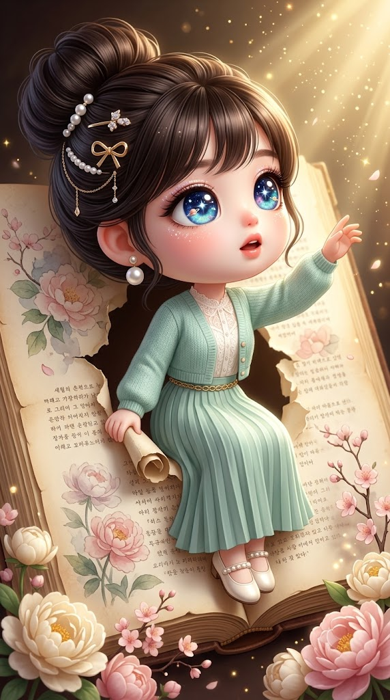
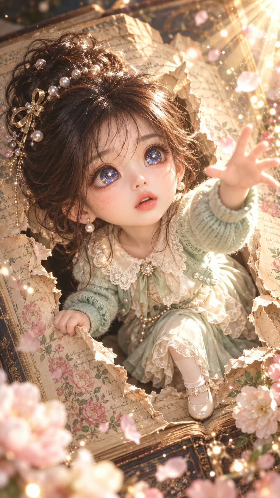

# 이야기에서 빠져나온 순간, 우주 은하 눈 치비 아트토이 일러스트 프롬프트

## 1. 개요 및 아트 디렉팅 가이드

- **컨셉**: 거대한 고서의 찢어진 페이지 틈에서 막 빠져나와 빛을 향해 손을 뻗는, 우주 은하가 담긴 눈동자의 치비 아트토이 인형 일러스트 (세로 9:16). 업로드한 사진의 대상이 사람인지 동물인지, 성별과 연령대가 무엇인지 판별해 맞는 버전 하나만 적용
- **업로드 이미지 판별 & 사용 규칙**:
  - **사람**: 성별과 연령대(어린이 / 청년·중년 / 노년)를 판단하고, 눈·코·입의 생김새와 얼굴에 착용한 액세서리만 가져옴. 눈은 눈매만 가져오고 눈동자는 프롬프트 서술을 따름
  - **동물**: 종류·품종, 털 색과 무늬, 귀 모양, 코·입 모양을 그대로 유지한 채 두 발로 앉은 치비 인형으로 의인화
  - 안경·귀걸이·목걸이 등 액세서리는 형태와 색을 유지하고, 사진에 없는 것은 추가하지 않음
- **스타일**: 초고해상도 3D 렌더 질감, 2.5~3등신 치비 비율, 매끈한 도자기 인형 피부와 복숭아빛 볼. 노년은 주름 없이 은빛 머리색과 온화한 분위기로만 표현
- **눈동자 (우주 은하 눈)**:
  - 홍채 전체가 짙은 남색 바탕의 밤하늘 우주, 그 위로 청록·연보라·핑크·주황빛 성운이 수채화처럼 번짐
  - 동공 자리에 하얗게 폭발하듯 빛나는 별과 사방으로 퍼지는 빛줄기, 촘촘한 별가루와 고리 달린 작은 행성
  - 은은하게 자체 발광하며 그림의 시선 포인트가 되도록 선명하게 표현, 동물도 같은 은하 눈으로 통일
- **구도 & 포즈**:
  - 위에서 비스듬히 내려다보는 하이앵글, 얼굴이 화면의 1/3 이상
  - 한 손으로 찢어진 종이 가장자리를 잡고 다른 손은 오른쪽 위의 빛을 향해 뻗은 자세, 놀라움과 설렘이 섞인 표정
- **헤어 & 의상 (판별 결과에 맞는 버전 하나만)**:
  - 민트·아이보리·연한 골드 톤의 현대 패션, 니트와 레이스 소재
  - 여성(어린이 / 청년·중년 / 노년), 남성(어린이 / 청년·중년 / 노년), 동물까지 일곱 버전으로 헤어와 의상을 각각 지정
- **책 & 배경**: 누렇게 바랜 두꺼운 고서와 수채화풍 작약·벚꽃 일러스트, 피어난 꽃가지, 오른쪽 위에서 쏟아지는 황금빛 광선과 흩날리는 꽃잎·금빛 입자, 가장자리 비네팅
- **주요 금지**: 텍스트·로고·워터마크, 고전 의상, 일반적인 검은 동공과 동물의 세로·가로 동공, 버전 간 헤어·의상 혼용

---

## 2. 프롬프트 전문

```text
[업로드 이미지 판별]
첨부한 사진의 대상을 먼저 판별한다.

사람이면: 성별(남/여)과 연령대(어린이 / 청년·중년 / 노년)를 판단한다.

동물이면: 동물 종류와 품종을 판단한다.
판별 결과에 따라 아래 [헤어] [의상] 항목에서 해당 버전 하나만 적용한다.

[업로드 이미지 사용 규칙 – 사람]
사진에서 가져오는 것은 눈·코·입의 생김새, 그리고 얼굴에 착용한 액세서리뿐이다.
단, 눈은 눈매·눈꺼풀 모양만 가져오고 눈동자 색과 질감은 아래 [눈동자] 서술을 따른다.
얼굴형, 피부, 헤어, 이마·헤어라인, 표정, 머리 각도, 고개 기울기, 시선 방향, 조명, 배경, 의상은 사진에서 절대 가져오지 않는다.
표정·각도·시선은 아래 서술대로 새로 그린다.

[업로드 이미지 사용 규칙 – 동물]
사진의 동물을 두 발로 앉은 치비 아트토이 인형으로 의인화한다.
사진에서 가져오는 것은 동물 종류·품종, 털 색과 무늬, 얼굴 무늬 위치, 귀 모양, 코·입 모양뿐이다.
품종과 털 무늬는 사진 그대로 정확히 유지하고 다른 품종으로 바꾸지 않는다.
머리 각도, 자세, 표정, 배경, 조명은 사진에서 가져오지 않고 아래 서술대로 새로 그린다.
털은 부드럽고 보송한 인형 털 질감, 손은 동물 앞발 형태를 유지한 채 종이를 잡고 빛을 향해 뻗는다.

[액세서리 유지]
사진 속 대상이 얼굴에 착용한 액세서리(안경, 선글라스, 귀걸이, 피어싱, 코걸이, 동물의 경우 목걸이·방울·리본 등)가 있다면
형태·색상·소재·크기를 그대로 유지해 치비 인형 비율에 맞게 자연스럽게 그린다.
안경·선글라스를 쓴 경우 렌즈는 투명하게 처리해 눈동자가 선명하게 보이게 한다.
사진에 없는 액세서리는 새로 추가하지 않는다(아래 의상·헤어 항목에 적힌 것 제외).
사진의 귀걸이와 의상 항목의 진주 귀걸이가 겹치면 사진의 귀걸이를 우선한다.
모자·머리띠처럼 머리를 덮는 아이템은 가져오지 않고, 헤어 항목의 서술을 따른다.

[스타일]
초고해상도 3D 렌더 질감의 치비(chibi) 아트토이 인형 일러스트.
머리가 크고 몸이 작은 2.5~3등신 비율. 연령과 관계없이 모두 같은 치비 비율로 그린다.
사람의 피부는 매끈한 도자기 인형 질감에 볼은 은은한 복숭아빛.
노년은 주름을 그리지 않고, 은빛 머리색과 온화한 분위기로만 나이를 표현한다.
섬세하고 사랑스러운 판타지 동화 분위기, 따뜻한 골드·크림·민트 톤.

[눈동자 – 우주 은하 눈]
사람·동물 모두 양쪽 눈의 크고 둥근 홍채 전체가 깊은 밤하늘 우주로 채워져 있다.
홍채 바탕은 짙은 남색·검푸른색, 그 위로 청록·하늘색·연보라·핑크·주황빛 성운 구름이 수채화처럼 번져 있다.
홍채 중앙(동공 자리)에는 검은 동공 대신 하얗게 폭발하듯 빛나는 별이 있고, 사방으로 가느다란 빛줄기가 퍼져 나간다.
홍채 곳곳에 크고 작은 반짝이는 별, 십자 모양 별빛, 미세한 별가루가 촘촘히 박혀 있다.
홍채 한쪽 가장자리에 고리 달린 작은 행성 하나가 떠 있다.
홍채 테두리는 또렷한 어두운 윤곽선으로 마감.
눈동자 안의 빛은 자체 발광하듯 은은하게 빛나 주변 흰자와 속눈썹(동물은 눈가 털)에 살짝 빛이 번진다.
사람은 속눈썹이 길고 짙으며, 눈두덩에 오팔빛 무지개 글리터가 은은하게 반짝인다.
동물은 세로 동공·가로 동공을 그리지 않고, 동일한 우주 은하 눈으로 크고 둥글게 그린다.
눈동자가 이 그림의 시선 포인트가 되도록 선명하고 디테일하게 표현한다.

[구도]
위에서 비스듬히 내려다보는 하이앵글, 세로 9:16 화면.
얼굴이 화면의 1/3 이상 차지하도록 인물 쪽으로 가깝게.
화면 전체를 거대한 펼쳐진 고서가 채운다.
책 페이지가 종이처럼 찢겨 구멍이 나 있고, 인물이 그 찢어진 틈에서 막 빠져나오는 순간.
인물은 한 손으로 찢어진 종이 가장자리를 잡고, 다른 한 손은 화면 오른쪽 위의 빛을 향해 뻗고 있다.
한쪽 무릎을 세우고 책 안쪽에 걸터앉은 듯한 자세.
표정은 놀라움과 설렘이 섞인 얼굴, 입을 살짝 벌리고 빛 쪽을 올려다본다.

[헤어 – 판별 결과에 맞는 버전 하나만 적용]
여성 어린이·청년·중년: 풍성하게 부풀린 흑갈색 하이 번(올림머리), 볼륨이 커서 머리 뒤로 둥근 실루엣. 진주 헤어핀 여러 개, 골드 메탈 리본 핀, 작은 크리스탈 비즈 장식, 얇은 골드 체인 드롭 장식. 시스루 뱅, 귀 옆으로 잔머리 몇 가닥.
여성 노년: 은빛 백발을 둥글고 풍성한 로우 번으로 단정하게 올림. 진주 헤어핀 몇 개와 작은 골드 리본 핀. 부드러운 웨이브 앞머리.
남성 어린이·청년·중년: 흑갈색의 볼륨 있는 짧은 컬 헤어, 골드 진주 헤어핀 하나.
남성 노년: 은빛 백발의 부드럽게 넘긴 짧은 헤어, 골드 진주 헤어핀 하나.
동물: 헤어 대신 머리 위 털에 작은 진주 헤어핀 하나와 골드 메탈 리본 핀 하나만 꽂는다.

[의상 – 현대 패션, 판별 결과에 맞는 버전 하나만 적용]
전체 색감은 민트·아이보리·연한 골드. 소재감은 부드러운 니트 결, 레이스 디테일, 은은한 광택.
여성 어린이: 아이보리 레이스 칼라 원피스 위에 연민트 니트 볼레로, 아이보리 니삭스, 진주 장식 메리제인 슈즈.
여성 청년·중년: 아이보리 레이스 칼라 블라우스 위에 연민트 크롭 니트 가디건, 얇은 골드 체인 벨트, 발목 위로 떨어지는 민트 플리츠 롱스커트, 진주 장식 아이보리 메리제인 슈즈, 작은 진주 귀걸이.
여성 노년: 아이보리 블라우스 위에 연민트 롱 니트 카디건, 진주 브로치, 크림색 롱스커트, 아이보리 로퍼, 작은 진주 귀걸이.
남성 어린이: 아이보리 피터팬 칼라 셔츠, 연민트 니트 베스트, 크림색 반바지, 아이보리 니삭스와 로퍼.
남성 청년·중년: 아이보리 셔츠 위에 연민트 니트 베스트, 크림색 와이드 슬랙스, 아이보리 로퍼, 가슴에 작은 골드 브로치.
남성 노년: 아이보리 셔츠 위에 연민트 니트 카디건, 크림색 슬랙스, 아이보리 로퍼, 가슴에 골드 회중시계 체인.
동물: 몸에 맞는 연민트 크롭 니트 가디건과 아이보리 레이스 칼라만 착용, 하의와 신발은 입히지 않는다.

[책·배경]
오래되어 누렇게 바랜 두꺼운 고서, 페이지 가장자리가 찢기고 말려 있다.
페이지에는 수채화풍 작약·벚꽃 일러스트와 흐릿한 손글씨 문장이 인쇄되어 있다(읽을 수 있는 글자로 강조하지 않는다).
책 아래쪽과 오른쪽에 크림색·연핑크 작약과 벚꽃 가지가 피어나 있다.
오른쪽 위에서 따뜻한 황금빛 광선이 쏟아지고, 꽃잎과 금빛 반짝이 입자가 공중에 흩날린다.
배경 가장자리는 어둡게 떨어지는 비네팅, 얕은 피사계 심도로 앞쪽 꽃은 살짝 보케 처리.

[금지]
로고, 워터마크, 서명, 화면 위 텍스트 넣지 않기.
고전 의상(한복·한푸·전통 머리장식) 사용 금지.
업로드 사진의 머리 각도·표정·헤어·배경·눈동자 색 반영 금지.
일반적인 검은 동공, 단색 홍채, 동물의 세로·가로 동공으로 그리기 금지.
노년 인물에 주름·처진 피부 표현 금지.
동물을 사람 얼굴로 바꾸거나 다른 품종으로 바꾸기 금지.
사진에 없는 안경·액세서리 임의 추가 금지.
판별된 버전 외의 헤어·의상을 섞어 쓰기 금지.
```

---

## 3. 결과물 비교 갤러리

| 생성 모델 | 생성 결과 이미지 |
| :--- | :--- |
| **제미나이 (Gemini)** |  |
| **ChatGPT (DALL-E 3)** |  |
