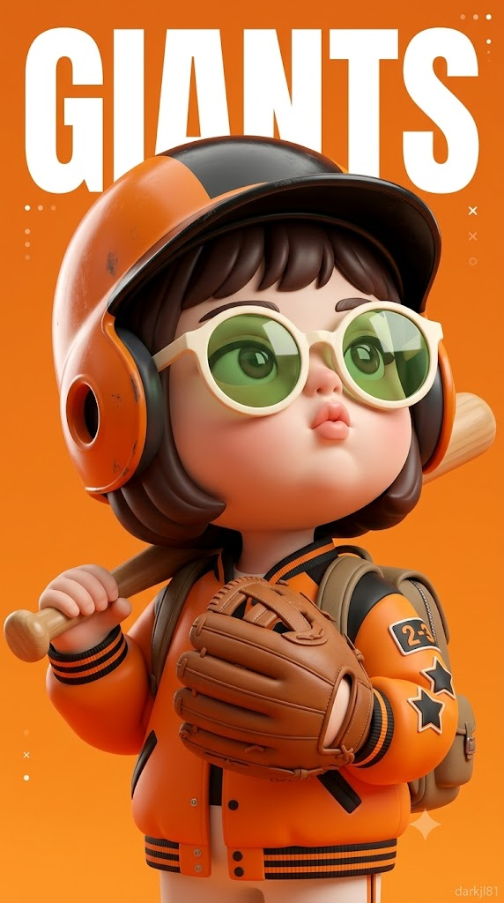
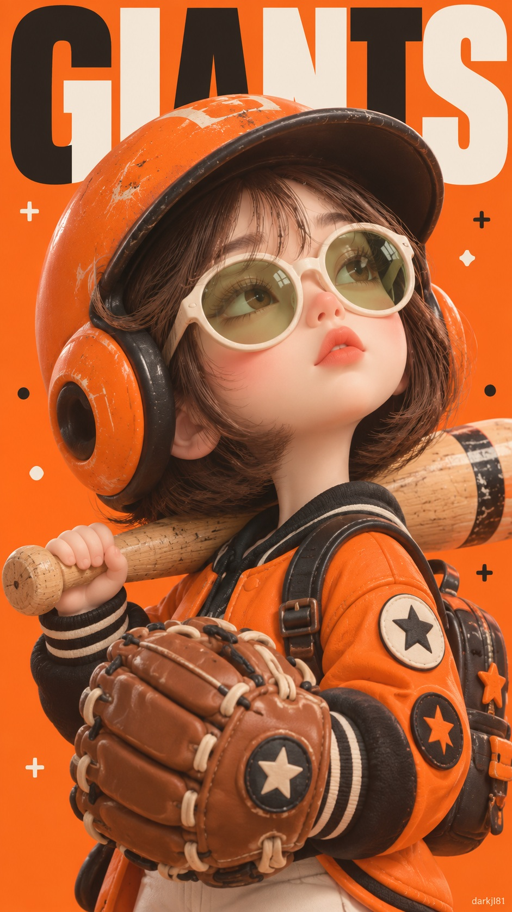

# NPB 일본 프로야구 구단별 미니미 3D 아트토이 캐릭터 포스터 프롬프트

## 1. 개요 및 아트 디렉팅 가이드
- **컨셉/장르**: NPB 일본 프로야구(센트럴 리그 6팀, 퍼시픽 리그 6팀 총 12개 구단)의 고유 상징과 컬러를 반영한 3D 아트토이 미니미 야구 캐릭터 스포츠 매거진 표지 포스터.
- **캐릭터 조형 & 얼굴**:
  - 무광 도자기·점토를 빚은 듯한 매끈한 아이보리빛 새틴 피부, 아기처럼 통통한 볼과 둥근 턱, 단추형 작은 코(복숭아빛 코끝), 도톰하게 오므린 코랄 핑크 입술.
  - 내리깐 차분한 눈꺼풀과 길고 짙은 속눈썹, 인물의 고유 이목구비와 표식을 인형 비율로 재구성하여 투영.
  - 턱을 살짝 든 45도 측면, 허공을 응시하는 도도하고 몽환적인 무심한 표정.
- **선글라스 연출**:
  - 원본 사진에 선글라스가 있을 경우: 해당 디자인 유지 + 젤리 하이라이트 추가.
  - 선글라스가 없을 경우: 오버사이즈 라운드 아이보리 화이트 프레임 + 반투명 청사과(그린애플) 젤리 렌즈(창문 모양 반사광, 눈매 투영).
- **헬멧 & 유니폼 & 구단별 상징 (총 12개 구단)**:
  - 둥근 이어가드가 달린 배팅 헬멧, 오버핏 야구 점퍼 및 와펜 패치, 소형 백팩.
  - **센트럴 리그**:
    - 요미우리(거대 배트·거대 글러브)
    - 한신(호랑이 귀·줄무늬·응원용 제트풍선)
    - 요코하마 DeNA(별 장식·잔잔한 파도무늬)
    - 히로시마(붉은 잉어 인형·코이노보리 깃발)
    - 주니치(동양 용 뿔/수염·용 인형)
    - 야쿠르트(제비 날개/인형·응원용 미니 비닐우산)
  - **퍼시픽 리그**:
    - 오릭스(버팔로 뿔·인형)
    - 치바 롯데(세일러 칼라 점퍼·닻 장식·갈매기 인형)
    - 소프트뱅크(매 날개·글러브 위 매 인형)
    - 라쿠텐(빛나는 황금 독수리 날개·인형)
    - 세이부(풍성한 사자 갈기·인형)
    - 닛폰햄(단단히 묶은 흰 머리띠·챔피언 벨트)
- **구도 & 타이포그래피**:
  - 세로 9:16 반신샷, 배트를 메고 글러브를 든 포즈.
  - 화면 상단 1/3을 꽉 채우는 굵은 산세리프 영문 구단명(GIANTS, TIGERS, BAYSTARS 등)과 헬멧이 겹쳐지는 깊이감 있는 매거진 레이아웃.
  - 그림자가 거의 없는 부드럽고 화사한 스튜디오 라이팅과 팝 컬러 단색 배경.

## 2. 프롬프트 전문

```text
[⚠️ ステップ1 - 必ず最初に実行]
この返信では絶対に画像を生成しないでください。
下の[応援球団]の球団名が「[球団名を入力]」のまま、または空欄の場合は、絵を描かずに次の質問だけをテキストで出力して止まってください。

「どの球団で作りますか？
セ・リーグ：読売ジャイアンツ / 阪神タイガース / 横浜DeNAベイスターズ / 広島東洋カープ / 中日ドラゴンズ / 東京ヤクルトスワローズ
パ・リーグ：オリックス・バファローズ / 千葉ロッテマリーンズ / 福岡ソフトバンクホークス / 東北楽天ゴールデンイーグルス / 埼玉西武ライオンズ / 北海道日本ハムファイターズ」

ユーザーが球団を答えたら、そのとき下のステップ2の内容どおりに画像を生成してください。
球団名がすでに入力されている場合は、ステップ1を飛ばしてすぐステップ2に進んでください。

[ステップ2 - 画像生成]

アップロードした写真の人物を「この人だ」とわかる3Dアートトイのミニキャラにしてください。顔の構造と比率は下の[顔の比率と造形]どおりに人形のように再構成しつつ、[本人らしさの特徴]に書かれた項目はアップロード写真から正確に取り入れ、必ず似せて表現してください。まったく別人にはせず、人形の比率の中でも本人の個性が生きているようにしてください。写真の頭の角度、顔の向き、視線、表情は真似せず、下の[視線と表情]どおりに新しく描いてください。顔以外のヘア、衣装、背景、ポーズは参考にせず、下の説明どおりにだけ新しく構成してください。

[応援球団]
球団：[球団名を入力]

[本人らしさの特徴 - アップロード写真からそのまま取り入れること]
- 目元：目尻が上がっているか下がっているか、目の形（丸型・切れ長）、二重の有無と形、瞳の色
- 眉：太さ、角度、濃さ
- 鼻：鼻筋の高さ、鼻先の形（丸い・とがった）、小鼻の大きさ
- 唇：上唇と下唇の厚みのバランス、口角の向き、唇の山の形
- 顔の上の固有の特徴：ほくろ、そばかす、えくぼ、八重歯など目立つ特徴があれば同じ位置にそのまま表現
- 肌のトーンと血色
- その人特有の印象（シャープ、やさしい、ツンとしている など）
上の項目は人形の比率に縮小されても、形と印象をそのまま保つこと。

[顔の比率と造形 - 最重要]
- 実写の人形やメイクをした人の顔ではなく、なめらかに形づくったマットな陶器・粘土の彫刻のような3Dアートトイの顔。
- 顔は画面の中で大きく、頬とあごの下側がふっくらと丸く膨らんだ赤ちゃんのような丸いボリューム。あごは小さく丸い。
- 鼻は小さく丸いボタン型で、小鼻と鼻の穴がかわいらしく少し見え、鼻先は桃色に色づく。
- 唇は小さいけれどぷっくりと前に突き出たすぼめた形、マットなコーラルピンク。テカテカしたグロス感は禁止。
- 目は誇張されたアニメの目ではなく、少し伏し目がちな落ち着いたまぶたに、長く濃いまつげが強調された形。瞳はサングラスのレンズ越しに透けて見える。
- 眉は細く淡く、肌の色に近いトーンでほのかに表現。
- 肌は毛穴・くすみ・実写の肌のきめがまったくない、アイボリーのなめらかな表面。サテンのようなほのかなツヤとやわらかいグラデーションの陰影。
- 頬、鼻先、耳に、コーラルピーチの血色。特に耳は光が透けたようにほんのり赤みを帯びる。
- アイライン、濃いアイメイク、実写メイクの表現は禁止。
- ただし、上の[本人らしさの特徴]の目元・眉・鼻・唇の形と顔の上の固有の特徴は、この造形の中でそのまま生かすこと。

[画風]
ハイエンドな3Dデザイナートイのキャラクターレンダー。マットな陶器とやわらかい粘土で形づくったような彫刻的な質感。線を使わず、やわらかい陰影と色面だけで形をつくる3Dレンダー。写真や実写ではなく、完成度の高いコレクタブルフィギュアのポスタークオリティ。彩度が高くクリアなポップカラー。

[コンセプト]
応援球団のチーム名が意味するものをヘルメットの装飾と小物で表現したミニキャラが、バットとグローブを持っている野球キャラクターポスター。画面上部にチーム名の英字が大きく敷かれたスポーツ雑誌の表紙のような雰囲気。

[視線と表情]
頭を少し後ろに反らしてあごを上げ、顔は斜め45度の横向き、視線は上の空中を見ている。ぷっくりした唇を少しすぼめて開いた、ツンとしていて夢見るような、無関心な表情。

[ヘア]
ダークブラウンのあごラインのボブ。バッティングヘルメットの下から前髪が額を少し覆い、両サイドの髪が頬の横に丸く落ちる。一本一本の毛束ではなく、粘土でまとめて形づくったようになめらかに固まった彫刻的な髪質と、やわらかいハイライト。

[サングラス]
- アップロード写真にサングラスがある場合：そのサングラスをそのまま残し、レンズにゼリーのようなハイライトだけを加えてください。レンズ越しに目元の特徴がはっきり見えるように。
- アップロード写真にサングラスがない場合：顔の半分近くを覆うオーバーサイズのラウンドサングラス。厚みのあるアイボリーホワイトのフレームに、半透明の青りんごグリーンのゼリーレンズ。レンズ越しに目元と瞳の特徴がはっきり透けて見え、窓の形の反射光が映る。

[ヘルメットと基本の衣装 - 全球団共通]
- 両耳を覆う大きく丸いイヤーガードが付いた、ぽってりしたバッティングヘルメット。ヘルメットとイヤーガードは球団のメインカラー、縁取りはポイントカラー。ところどころ軽く擦れたヴィンテージな使用感。
- 球団カラーのオーバーサイズの野球ジャンパー、袖口にストライプのリブ。腕に丸いワッペンが2〜3枚（ワッペンの中は文字なしで、星柄やシンプルな図形）。
- 背中には小さな道具用リュックを背負っている。
- 実在の球団ロゴ、エンブレム、企業名、選手名・背番号、公式マスコットキャラクターは入れない。

[チーム名の表現 - 選んだ球団のみ適用]
セ・リーグ
- YOMIURI GIANTS | オレンジ、ポイント ブラック | 巨人コンセプト。体よりはるかに大きい巨大なバットと巨大なグローブを持ち、いたずらっぽいサイズのギャップが生まれる
- HANSHIN TIGERS | イエロー、ポイント ブラック | ヘルメットに虎の耳と黒い虎の縞模様、リュックに細長い応援用ジェット風船が何本か刺さっている
- YOKOHAMA DeNA BAYSTARS | ブルー、ポイント ホワイト | 港の星コンセプト。ヘルメットの上に小さな星飾りがきらめき、イヤーガードにおだやかな波模様
- HIROSHIMA CARP | レッド、ポイント ホワイト | 鯉コンセプト。ヘルメットのてっぺんにぷっくりした赤い鯉のぬいぐるみ、リュックに小さな鯉のぼりがはためいている
- CHUNICHI DRAGONS | ブルー、ポイント ホワイト | 東洋の龍コンセプト。ヘルメットに小さな龍の角が2本と長い龍のひげの飾り、肩に小さな龍のぬいぐるみ
- TOKYO YAKULT SWALLOWS | ネイビー、ポイント グリーン | ツバメコンセプト。ヘルメットの両側にツバメの翼の飾り、肩に小さなツバメのぬいぐるみ、手首に小さな応援用ビニール傘がかかっている

パ・リーグ
- ORIX BUFFALOES | ネイビー、ポイント ゴールド | ヘルメットの両側に丸く曲がったバッファローの角が2本、リュックに小さなバッファローのぬいぐるみ
- CHIBA LOTTE MARINES | ブラック、ポイント ホワイト | 海コンセプト。セーラーカラーのジャンパー、胸に小さないかりの飾り、肩に小さなカモメのぬいぐるみ
- FUKUOKA SOFTBANK HAWKS | ブラック、ポイント イエロー | ヘルメットの両側に鷹の羽の翼飾り、グローブの上に小さな鷹のぬいぐるみがとまっている
- TOHOKU RAKUTEN GOLDEN EAGLES | クリムゾンレッド、ポイント ゴールド | ヘルメットの両側に輝く黄金のワシの翼飾り、肩に小さな金色のワシのぬいぐるみ
- SAITAMA SEIBU LIONS | ブルー、ポイント ホワイト | ヘルメットのまわりにふさふさ의ライ온의たてがみ飾り、ヘルメットのてっぺんに小さなライオンのぬいぐるみ
- HOKKAIDO NIPPON-HAM FIGHTERS | ネイビー、ポイント ゴールド | ファイターコンセプト。ヘルメットの上にきゅっと結んだ白いハチマキ、肩に小さなチャンピオンベルトの飾り

[ポーズと小物]
体を少し斜めにして立ち、片手で木製の野球バットを肩に担いでいる。もう片方の手には茶色い革の野球グローブをはめて胸の前に置いている。手は小さくぷっくりした人形の手。バットとグローブはおもちゃのようにぽってりした比率（YOMIURI GIANTSは上の説明どおり巨大に）。

[背景とタイポグラフィ]
- 質感のない、なめらかで彩度の高い球団メインカラーの単色背景。メインカラーがブラックやネイビーのように暗い場合、背景は同系色の明るいトーンに。
- 画面上部に、選んだ球団のチーム名英字1語（GIANTS、TIGERS、BAYSTARS、CARP、DRAGONS、SWALLOWS、BUFFALOES、MARINES、HAWKS、EAGLES、LIONS、FIGHTERSのうち1つ）だけを、画面幅いっぱいの極太サンセリフ大文字で大きく配置。文字色はホワイトまたは球団のポイントカラー。
- キャラクターのヘルメットが文字の一部を前から隠すように重ねて配置し、雑誌の表紙のような奥行きを出す。
- 端に小さな装飾ドットと十字マークをさりげなく散らす。チーム名以外の文字は入れない。

[構図とカメラ]
縦9:16。ヘルメットの先から腰の下まで見えるバストアップ〜半身ショット。顔が画面中央で大きく占め、チーム名のタイポは画面上部1/3。正面より少し下から見上げるアングルで、上げたあごとふっくらした頬の下のラインが見えるように。

[ライティングと色彩]
影がほとんどない、やわらかく華やかなスタジオライティング。球団のメインカラーとポイントカラーに、ホワイトとクリームを加えたパレット。ヘルメット、ゼリーレンズ、バットにほのかな反射光。透明感がありクリアで、彩度が少し高めの色彩。

[右下ウォーターマーク]
右下の隅に小さくさりげなく「darkjl81」のテキストウォーターマーク。
```

## 3. 결과물 비교 갤러리

| 제미나이 (Gemini) | GPT (DALL-E 3) |
| :---: | :---: |
|  |  |
