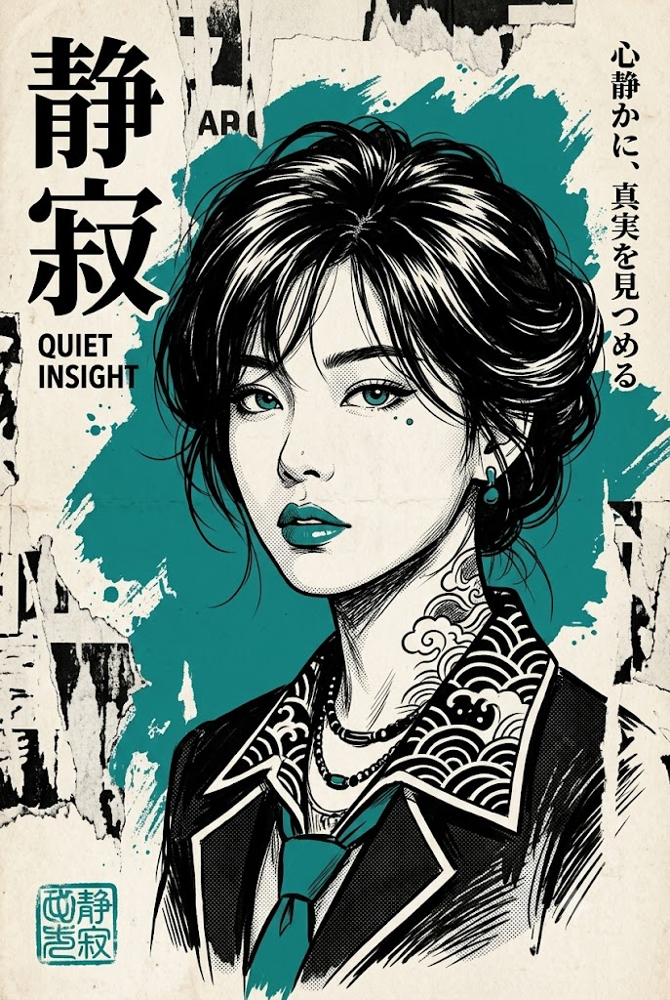
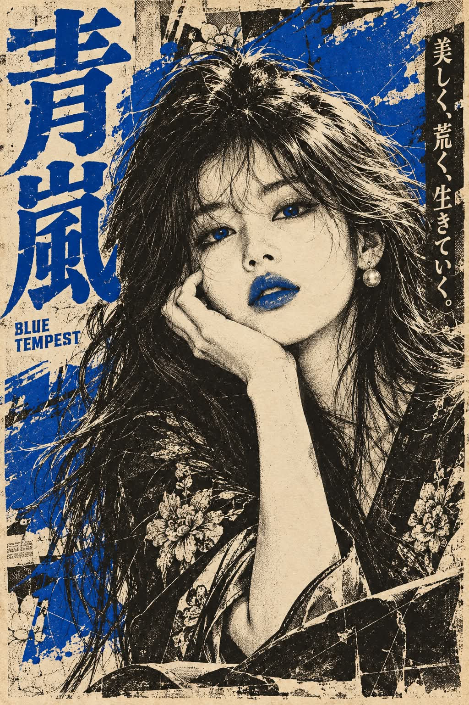

# 1970~80년대 일본 쇼와 실크스크린 영화 포스터 초상화 프롬프트

## 1. 개요 및 아트 디렉팅 가이드
- **컨셉/장르**: 1970~80년대 일본 쇼와(昭和) 시대 실크스크린 판화 및 B급 시네마 포스터 감성의 세로형 레트로 인물 초상화.
- **화풍 & 질감**:
  - 먹색 검정 잉크 펜화와 오래되어 누렇게 바랜 아이보리 종이 바탕.
  - 섬세한 펜 선 해칭(빗금), 크로스해칭, 대담한 블랙 면 대비, 하프톤 망점(도트) 텍스처.
  - 실크스크린 인쇄 특유의 미세한 색판 어긋남, 잉크 번짐과 스크래치 질감.
- **단 하나의 포인트 컬러 규칙 (핵심)**:
  - 인물 관상 분석을 통해 선정된 단 하나의 고채도 유채색만을 포인트 컬러로 제한적 사용.
  - 적용 위치: 배경의 거친 붓 터치 얼룩, 눈(안경 착용 시 반투명 컬러 렌즈 / 미착용 시 홍채), 입술, 의상/소품 1~2곳, 메인 타이틀 또는 사각 낙관. 그 외는 완전한 흑백 유지(그라데이션 금지).
- **구도 & 스타일링**:
  - 세로 2:3 비율 바스트샷(단체 시 앞뒤 레이어드 구도), 턱을 살짝 들어 무심하고 도도하게 응시하는 시선.
  - 스트리트 펑크 감성과 동양 전통 문양의 믹스매치, 목과 쇄골의 섬세한 흑백 잉크 타투와 메탈 액세서리.
- **타이포그래피 (쇼와 70년대 간판 레터링 풍)**:
  - 일본어 한자 2~4자 세로쓰기 메인 타이틀, 영문 대문자 가로쓰기 서브 타이틀, 감각적인 일본어 카피 태그라인.
  - 찢어진 흑백 판화 조각과 거친 붓질이 겹쳐진 낡은 콜라주 벽 배경.

## 2. 프롬프트 전문

```text
[목적]
첨부한 사진(한 장 또는 여러 장) 속 대상을, 흑백 잉크 일러스트 위에 단 하나의 포인트 컬러만 얹은 1970~80년대 일본 쇼와 시대 실크스크린 영화 포스터 스타일의 세로형 초상화 한 장으로 새로 그려줘. 사진은 대상의 특징 참고용과 관상 분석용으로만 사용하고, 그 외 모든 요소는 아래 서술대로 새로 그린다.

[대상 판별 — 모든 사진 속 모두를 그린다]

첨부한 사진이 여러 장이면, 모든 사진에 나온 대상을 한 장의 포스터 안에 함께 모아 그린다.

각 사진에 나온 사람과 동물은 성별, 나이, 종에 관계없이 한 명(한 마리)도 빠짐없이 전부 그린다.

같은 사람이나 동물이 여러 사진에 반복해서 나오면 한 명(한 마리)으로 판단해 한 번만 그리고, 그 사진들을 모두 생김새 참고용으로 함께 활용해 특징을 더 정확하게 잡는다.

사람은 사진 속 성별과 대략적인 나이대를 그대로 유지한다. 나이를 더 젊게 또는 더 늙게 바꾸지 않는다.

동물은 사진 속 종, 품종, 털 색과 무늬 배치, 귀 모양을 그대로 유지한다. 의인화하거나 사람처럼 옷을 입혀 서 있게 하지 않는다.

대상이 여러 명(마리)이면 한 장의 포스터 안에 함께 배치하고, 누구의 얼굴도 다른 대상이나 글자에 가려지지 않게 한다.

이미지를 생성하기 전에, 사진별로 몇 명(마리)을 찾았고 최종적으로 몇 명(마리)을 그릴지, 안경을 쓴 대상이 누구인지 먼저 짧게 알려준다.

[사진 사용 규칙 — 반드시 지킬 것]

사람: 사진에서 가져오는 것은 눈·코·입의 생김새(모양, 크기, 비율, 간격)와 안경 착용 여부, 안경테 모양뿐이다. 얼굴형, 피부 질감과 톤, 헤어스타일, 이마와 헤어라인, 메이크업, 의상, 배경은 사진에서 가져오지 않는다.

동물: 사진에서 가져오는 것은 얼굴 생김새(눈, 코, 주둥이, 입 모양)와 위의 [대상 판별]에 적은 종·털 정보뿐이다.

사진 속 고개 기울기, 얼굴 방향, 시선, 표정, 포즈, 대상들의 배치는 절대 따라 하지 않는다. 각도와 표정, 배치는 아래 [구도]와 [표정] 서술대로 새로 그린다.

사진마다 조명, 화질, 색감이 달라도 결과물에서는 모든 대상이 같은 화풍, 같은 선 굵기, 같은 명암 처리로 통일되어야 한다. 따로 찍은 사진을 붙인 느낌이 나면 안 된다.

결과물은 사진 합성처럼 보이면 안 되고, 처음부터 손으로 그린 판화 일러스트처럼 보여야 한다.

[눈 컬러 규칙 — 안경 유무에 따라 다르게]

안경이나 선글라스를 쓴 대상:
· 안경은 반드시 씌우고, 안경테는 사진 속 모양을 유지하되 흑백 잉크 선으로 그린다.
· 안경 렌즈를 1단계에서 고른 포인트 컬러로 칠한다. 렌즈는 반투명한 컬러 필름처럼 평평한 단색으로 채우고, 렌즈 너머로 눈이 흑백 잉크 선으로 비쳐 보이게 한다.
· 렌즈 위에 실크스크린 판 어긋남처럼 컬러가 테 밖으로 살짝 비껴 찍힌 느낌과 가는 흰 반사 선 한두 개를 넣는다.
· 이 경우 눈동자 자체에는 색을 넣지 않는다.

안경을 쓰지 않은 대상 (모든 동물 포함):
· 눈동자의 홍채를 1단계에서 고른 포인트 컬러로 칠한다. 동공은 검정으로 두고, 홍채만 평평한 단색으로 채운다.
· 홍채 가장자리는 가는 검정 잉크 선으로 감싸고, 작은 흰 하이라이트 점을 하나 남긴다.
· 흰자와 속눈썹, 눈꺼풀은 흑백으로 유지한다.

대상이 여럿이면 안경 유무에 따라 각자 위 규칙을 따르되, 모두 같은 포인트 컬러를 쓴다.

사진에서 안경을 쓰지 않은 대상에게는 안경을 새로 씌우지 않는다.

[1단계 — 관상 분석, 포인트 컬러와 포스터 문구 결정]

그림을 그리기 전에 먼저 대상의 관상을 분석한다. 사람은 눈매, 눈썹, 코, 입매, 얼굴 전체에서, 동물은 눈빛과 얼굴 생김새, 분위기에서 풍기는 기운과 성향을 읽어낸다. 대상이 여럿이면 각자를 분석한 뒤, 함께 있을 때의 관계와 분위기도 읽어낸다.

포인트 컬러는 반드시 아래 절차대로 정한다:

1. 관상 분석에서 이 대상만의 핵심 키워드 3개를 뽑는다.

2. 키워드에 어울리는 색 후보 3개를 뽑되, 세 후보는 색상환에서 서로 멀리 떨어진 서로 다른 색상 계열이어야 한다.

3. 세 후보를 키워드와 하나씩 대조해, 이 대상의 관상에 가장 정확하게 맞는 하나를 고른다.

포인트 컬러는 화풍, 시대, 일본풍이라는 이유로 정하지 않는다. 오직 관상 분석 결과만으로 정한다.

빨강 계열도 후보가 될 수 있지만, 이 화풍에서 흔히 쓰인다는 이유로 기본값처럼 고르지 않는다. 빨강 계열은 후보 3개를 비교한 결과 관상상 가장 정확할 때만 고른다.

이전 대화나 이전 결과물에서 쓴 색은 참고하지 않는다. 매번 이 사진의 대상만 보고 처음부터 정한다.

포인트 컬러는 흑백 바탕 위에서 한눈에 튀어 보이는 채도 높은 유채색이어야 한다. 검정, 흰색, 회색, 아이보리·베이지·크림·누런 종이색 계열, 그리고 이 색들에 가까운 무채색이나 탁한 저채도 색은 포인트 컬러로 고를 수 없다.

대상이 여럿이어도 색은 하나만 고른다. 이 색 하나가 그림 전체의 유일한 포인트 컬러가 된다.

같은 분석을 바탕으로 포스터에 들어갈 문구를 AI가 직접 정한다.
· 메인 타이틀(일본어): 대상의 기운을 압축한 일본어 한자 2~4자. 실제 일본어에서 자연스럽게 쓰이는 단어로 정한다.
· 서브 타이틀(영어): 메인 타이틀의 뜻을 담은 2~4단어의 짧은 영어 구절
· 태그라인(일본어): 대상의 성향을 영화 포스터 카피처럼 표현한 짧은 일본어 한 문장(15자 이내), 한자와 히라가나·가타카나를 자연스럽게 섞는다.

이미지를 생성하기 전에, 관상 키워드 3개, 색 후보 3개와 최종 선택한 색 및 그 이유, 정한 문구와 각 문구의 한국어 뜻을 짧게 먼저 알려준다.

[전체 화풍]

1970~80년대 일본 영화 포스터와 실크스크린 판화를 섞은 레트로 포스터 일러스트.

대상과 배경의 기본은 흑백(먹색 검정 + 바랜 아이보리 종이색)의 잉크 펜화. 가는 펜 선, 해칭(빗금), 크로스해칭으로 명암을 표현하고, 그림자는 평평한 검정 덩어리로 대담하게 처리한다.

사람의 얼굴 피부는 거의 하얗게 비워두고, 최소한의 선과 옅은 회색 톤으로만 입체를 표현한다. 나이에 따른 주름이나 볼살은 가는 선 몇 개로만 절제해서 표현한다.

동물의 털은 결 방향을 따라 그은 가는 펜 선 다발과 평평한 검정 덩어리로 표현하고, 털 무늬는 흑백 명암으로 구분한다.

망점(하프톤 도트) 질감을 그림자와 중간 톤 부분에 은은하게 깔아 인쇄물 느낌을 낸다.

실크스크린 인쇄 특유의 판 어긋남(색판이 선에서 1~2mm 살짝 비껴 찍힌 느낌), 잉크 번짐, 긁힘, 잉크가 덜 묻은 거친 자국을 곳곳에 넣는다.

종이는 오래되어 누렇게 바랜 포스터 용지, 미세한 섬유 질감과 얼룩, 모서리 마모가 있다.

[컬러 규칙 — 이 스타일의 핵심]

화면 전체는 흑백 + 종이색이고, 색은 1단계에서 관상 분석으로 고른 포인트 컬러 단 하나만 사용한다.

포인트 컬러는 아래 위치에만 제한적으로 쓴다:

1. 대상 뒤의 큰 붓 터치 얼룩 — 넓은 붓으로 거칠게 몇 번 휘둘러 칠한 불규칙한 형태로, 가장자리가 찢기고 튀고 번져 있다. 매끈한 원, 정원형, 동그란 태양 모양이 되지 않게 한다.

2. 눈 — 안경을 쓴 대상은 렌즈, 안경을 쓰지 않은 대상은 홍채 ([눈 컬러 규칙] 참고)

3. 사람은 입술 — 입술도 반드시 1단계의 포인트 컬러로만 칠하고, 입술이라는 이유로 빨간색을 따로 쓰지 않는다. 포인트 컬러가 입술에 어색하면 입술은 흑백으로 둔다. 동물은 이 항목을 생략한다.

4. 의상, 소품, 목줄 등 중 딱 한두 군데의 작은 포인트

5. 메인 타이틀 또는 화면 구석의 무늬 없는 사각 낙관(도장) 형태 중 한 곳 — 낙관도 인주색이 아닌 포인트 컬러로 찍는다.

그 외 피부, 머리카락, 털, 안경테, 의상, 문신, 소품은 전부 흑백으로 유지한다. 포인트 컬러를 넓게 칠하지 않는다.

포인트 컬러 영역은 평평한 단색 판으로 찍힌 느낌이며, 그라데이션을 쓰지 않는다.

[구도]

세로 2:3 비율.

대상이 하나일 때: 머리 위부터 가슴 아래까지 오는 바스트샷, 화면 중앙 배치. 얼굴은 정면에서 아주 살짝 비튼 각도, 턱을 약간 들어 내려다보는 듯한 시선 높이.

대상이 여럿일 때: 모두 얼굴이 잘 보이도록 앞뒤로 살짝 겹치게 모은 단체 포스터 구도. 키와 크기 차이를 자연스럽게 살리되, 모두 정면에서 아주 살짝 비튼 각도로 보는 사람을 향한다. 인원이 많아도 모두 같은 공간에 함께 서 있는 한 장면으로 그린다.

시선은 보는 사람을 향하되 무심하고 차갑게. 컬러 눈동자나 렌즈가 화면의 시선을 끄는 중심이 되도록 눈 부분이 잘 보이게 한다.

대상 뒤에 포인트 컬러의 불규칙한 붓 터치 얼룩이 비대칭으로 걸쳐 있고, 대상 실루엣이 그 일부를 가린다. 얼룩이 머리를 중심으로 대칭적인 후광처럼 보이지 않게 한다.

[표정]

사람: 감정을 드러내지 않는 시크하고 도도한 무표정. 입술은 아주 살짝 벌어져 있고 힘이 빠진 상태. 웃지 않는다. 어린아이는 같은 분위기로 새침하고 시큰둥한 표정.

동물: 입을 다물고 정면을 응시하는 무심하고 도도한 표정. 혀를 내밀거나 웃는 얼굴로 그리지 않는다.

[헤어와 털]

사람의 헤어스타일은 대상의 성별, 나이, 인상에 어울리게 AI가 정하되, 짙은 먹색 머리카락을 굵은 검정 면과 가는 펜 선 다발로 그려 흩날리는 잔머리를 살린다. 머리숱이 적거나 없는 인상에 어울리면 그대로 살린다. 머리카락이 눈을 가리지 않게 한다.

동물의 털은 사진 속 색과 무늬 배치를 유지한 채 흑백 명암으로 바꿔 그린다.

[스타일링]

성인: 스트리트 펑크 감성과 동양 전통 문양이 섞인 스타일링을 대상의 성별, 나이, 인상에 맞춰 AI가 자유롭게 구성한다. 목과 쇄골, 어깨에는 섬세한 흑백 잉크 문신을 넣고, 액세서리는 흑백 금속 질감으로 그린다.

미성년자(어린이·청소년): 문신, 담배, 피어싱, 초커, 펑크 소품은 넣지 않는다. 동양 전통 문양이 들어간 단정한 레트로 의상으로 AI가 구성한다.

동물: 옷은 입히지 않는다. 필요하면 목줄이나 목에 두른 천 정도의 소품만 하나 허용한다.

대상이 여럿이면 각자 개성은 살리되, 한 편의 영화 포스터 출연진처럼 전체 스타일링이 하나의 톤으로 어울리게 한다.

[배경]

포인트 컬러 붓 터치 얼룩 주변은 낡은 포스터를 여러 겹 덧붙인 콜라주 벽. 찢어진 종이 조각, 흑백 판화 조각, 거친 붓질, 잉크 튐을 겹친다.

콜라주 조각에는 글자를 넣지 않고 판화 문양과 붓 터치 질감만 남긴다.

배경도 흑백 + 같은 포인트 컬러 외의 색은 쓰지 않는다.

[타이포그래피 — 일본어 + 영어, 서체는 ADS Showwa70]

모든 글자는 ADS Showwa70 서체 스타일로 쓴다: 1970년대 일본 쇼와 시대 간판과 포스터의 손으로 그린 레터링 느낌, 획 끝(특히 오른쪽 삐침)이 멈추지 않고 부드럽게 휘어지며 쓸어내리는 곡선, 굵고 납작한 붓펜 획, 약간 기울어진 리듬감 있는 레트로 표정. 한자, 가나, 영문 모두 이 서체 느낌으로 통일한다.

메인 타이틀(일본어 한자): 화면 한쪽 가장자리에 세로쓰기로 크게 배치. 실크스크린으로 찍힌 듯 잉크가 갈라지고 번진 질감.

서브 타이틀(영어): 메인 타이틀 옆이나 화면 위쪽에 대문자로 작게 가로 배치.

태그라인(일본어): 메인 타이틀 반대편 가장자리에 작게 세로쓰기 한 줄, 또는 화면 아래쪽에 작게 가로쓰기 한 줄.

글자 색은 검정, 또는 포인트 컬러 중 하나만 쓴다.

모든 글자는 대상의 얼굴을 가리지 않는다.

일본어 한자와 가나는 획이 빠지거나 틀린 글자 없이, 영어는 철자가 틀리지 않게 정확하게 쓴다. 존재하지 않는 가짜 한자를 만들지 않는다.

1단계에서 정한 세 문구 외의 다른 글자는 넣지 않는다.

[금지 사항]

화풍이나 일본풍을 이유로 색을 정하는 것, 후보 비교 없이 빨강 계열을 기본값으로 고르는 것, 이전 결과물의 색을 반복하는 것 금지

포인트 컬러로 검정, 흰색, 회색, 아이보리·베이지·크림·종이색 계열, 탁한 무채색 계열을 고르는 것 금지

어느 사진의 대상이든 빼거나, 사진에 없는 사람·동물을 추가하는 것 금지

같은 대상을 중복해서 두 번 그리는 것 금지

사진 속 안경을 빼거나, 안경을 쓰지 않은 대상에게 안경을 새로 씌우는 것 금지

안경 렌즈를 불투명하게 칠해 눈이 안 보이게 하는 것 금지

안경을 쓴 대상의 눈동자에 색을 넣는 것, 안경을 쓰지 않은 대상의 눈동자를 흑백으로 두는 것 금지

흰자, 눈 전체, 눈 주변 피부까지 포인트 컬러가 번지는 것 금지

사진별로 화풍·선·명암이 다르게 그려지는 것 금지

사람의 성별·나이대, 동물의 종·털 색과 무늬를 바꾸는 것 금지

일장기, 욱일기를 비롯한 모든 국기·군기·깃발 문양 금지

둥근 해·태양 원반 모양, 중심에서 사방으로 뻗어 나가는 방사선·빛줄기 문양 금지 (배경, 의상, 문신, 소품 전부 포함)

군복, 군 계급장, 전범기·군국주의를 연상시키는 상징과 문구 금지

일본어와 영어 외의 문자(한글, 중국어 간체 등) 사용 금지

관상 분석으로 고른 포인트 컬러 외의 두 번째 색 사용 금지

사실적인 사진 질감, 3D 렌더 느낌, 매끈한 디지털 에어브러시 금지

1단계에서 정한 문구 외의 글자, 로고, 워터마크, 서명 금지

사진 속 얼굴 각도·표정·포즈·배치·헤어·피부톤 반영 금지

그라데이션 컬러, 네온 발광 효과 금지
```

## 3. 결과물 비교 갤러리

| 제미나이 (Gemini) | GPT (DALL-E 3) |
| :---: | :---: |
|  |  |
