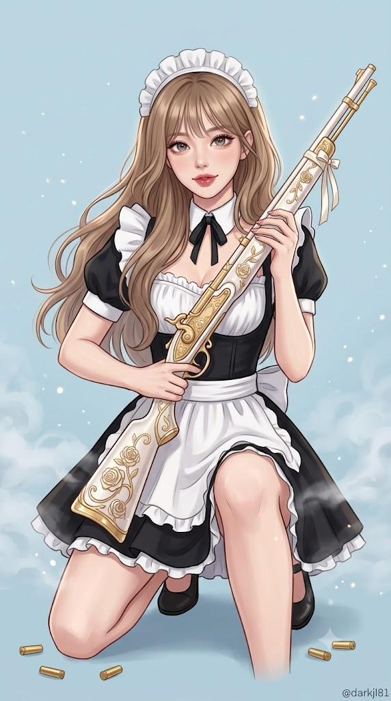
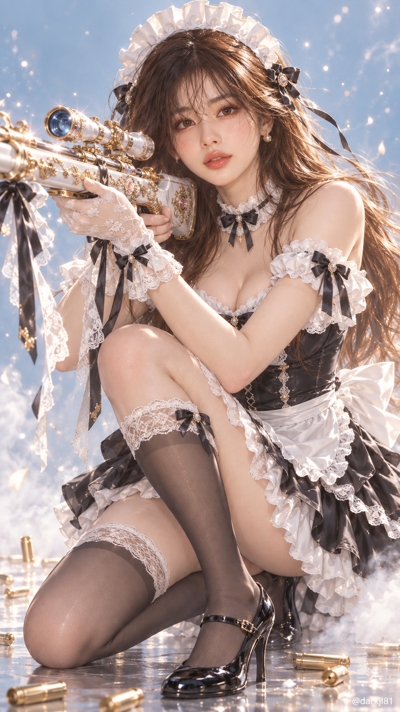

# 로맨스 판타지 전투 메이드 라이플 표지 일러스트 프롬프트

## 1. 개요 및 아트 디렉팅 가이드

- **컨셉**: 화려한 귀족풍 장식 라이플을 겨눈 세련된 미니 메이드복 차림의 여전사, 로맨스 판타지 웹소설 표지급 고퀄리티 디지털 일러스트
- **화풍 및 장르**:
  - 매끄러운 페인팅 질감, 부드러운 그라데이션 채색, 선명한 윤곽과 화사한 림라이트·블룸 광원
  - 거친 실사 질감이나 평면적인 셀 애니메이션, 3D 렌더 느낌을 배제한 하이엔드 2D 그래픽 페인팅
- **얼굴 합성 규칙 (최우선)**:
  - 사진에서는 눈, 코, 입 생김새와 고유 비율만 가져와 로판 여주인공급으로 정제·미화
  - 얼굴 전체 윤곽, 피부톤, 헤어, 머리 각도, 시선, 표정은 사진을 따르지 않고 프롬프트 지침 준수
- **구도 & 자세 (무릎쏴 사격 자세)**:
  - **구도**: 세로 9:16 비율, 가슴 높이 로우 앵글의 타이트한 전신 샷 (무릎 꿇은 인물이 화면 세로 90%를 채움)
  - **자세**: 화면 왼쪽 45도 무릎쏴(Kneeling shooting) 자세, 오른쪽 무릎은 바닥에 대고 왼쪽 무릎을 세워 팔꿈치로 총신 지탱
  - **표정 & 시선**: 총을 겨눈 채 고개만 돌려 카메라 정면 응시, 침착하고 날카로운 눈매와 입꼬리를 살짝 올린 자신만만한 미소
- **헤어 & 의상 (세련된 미니 메이드복)**:
  - **헤어**: 윤기 나는 밝은 갈색 시스루뱅 긴 생머리, 흰색 프릴 메이드 헤드드레스
  - **의상**: 쇄골이 드러나는 코르셋 스타일 오프숄더 보디스, 짧은 하프 에이프런, 플레어 미니스커트와 프릴 페티코트
  - **액세서리**: 흰색 레이스 장갑, 레이스 단 검은색 니삭스 스타킹, 유광 메리제인 스트랩 하이힐 (먼지나 찢김 없는 완벽한 새 옷)
- **시그니처 소품 (로판풍 장식 라이플)**:
  - 키의 2/3에 달하는 진주빛 화이트 총신, 샴페인 골드 넝쿨·장미 음각, 로즈 핑크 보석 개머리판, 꽃잎 형태의 금색 총구, 묶인 새틴/레이스 리본
- **배경 & 조명**:
  - 채도 낮은 연한 하늘색 단색 배경, 바닥에 깔린 옅은 연기와 공기 중 빛 입자, 바닥에 흩어진 금빛 탄피
- **하단 워터마크**: 우측 하단 작은 흰색 글씨 `@darkjl81`

---

## 2. 프롬프트 전문

```text
첨부한 얼굴 사진의 인물을 이 이미지의 주인공으로 만들어줘. 이 지시가 가장 중요하고 최우선입니다.

[얼굴 합성 규칙 - 최우선]
첨부한 사진에서는 오직 눈, 코, 입의 생김새만 가져옵니다. 눈의 모양, 눈매, 눈 사이 간격, 쌍꺼풀 유무, 코의 길이와 코끝·콧대·콧망울 모양, 입술의 두께·윤곽·입 크기의 특징을 반영해, 로맨스 판타지 웹소설 표지 화풍으로 미화된 상태에서도 사진 속 인물임을 알아볼 수 있게 합니다.
미화는 특징을 지우지 않는 선에서만 합니다. 눈은 더 크고 맑게, 속눈썹은 더 길고 풍성하게, 콧대는 더 매끈하게, 입술은 더 선명하고 촉촉하게 다듬되, 사진 속 눈·코·입의 고유한 형태와 비율은 유지합니다.
사진에서 절대 가져오지 않는 것은 얼굴 전체 윤곽, 얼굴형, 피부톤, 헤어스타일, 이마와 헤어라인, 고개 각도, 머리 기울기, 시선 방향, 표정입니다. 고개 방향과 시선, 표정은 사진이 아니라 아래 서술대로 새로 만듭니다.
얼굴 외의 구도, 각도, 헤어, 의상, 소품, 배경은 아래 서술 그대로 유지하고 조금도 바뀌면 안 됩니다.
눈·코·입은 나머지 얼굴과 자연스럽게 어우러져 합성한 티가 전혀 나지 않아야 합니다.

[장르]
로맨스 판타지 웹소설 표지급의 고퀄리티 디지털 일러스트입니다. 반실사보다 한층 더 그래픽적인 화풍으로, 매끄러운 페인팅 질감, 부드러운 그라데이션 채색, 선명하고 정돈된 윤곽, 화사한 림라이트와 은은한 블룸 광원이 특징입니다. 입체감과 재질 표현은 풍부하게 살리되 실제 사진 같은 느낌은 없어야 합니다. 거친 사진 질감, 모공 같은 실사 피부 디테일, 평면적인 셀 애니메이션, 과장된 SD 비율, 플라스틱 같은 3D 렌더 느낌은 금지합니다.

[구도]
인물의 가슴 높이에 맞춘 낮은 눈높이 앵글로 가까이 다가가 그린 타이트한 전신 구도입니다. 세로 9:16 비율이고, 무릎을 꿇고 앉은 인물이 화면 세로 높이의 약 90%를 채울 만큼 크게 확대되어 있습니다. 헤드드레스 바로 위에 약간의 여백만 두고, 아래는 바닥에 닿은 무릎과 구두 끝이 화면 하단 가장자리에 딱 맞게 들어옵니다. 얼굴이 화면 상단 3분의 1 지점에 크고 또렷하게 위치해 표정과 눈·코·입이 선명하게 보입니다. 라이플의 총구 끝은 화면 왼쪽 가장자리에 걸쳐 살짝 잘려도 괜찮습니다. 배경 여백은 최소화합니다. 정면에서 부드럽고 균일한 빛이 비추고, 가장자리에 은은한 림라이트가 돌며 그림자는 옅게 떨어집니다.

[인물 묘사]
성인 여성이며, 얼굴은 로판 표지 여주인공급으로 미화된 아름다운 얼굴입니다. 갸름하고 매끄러운 V라인 턱선, 도자기처럼 흠 없이 매끈하고 은은하게 빛나는 피부, 볼과 콧등에 도는 연한 복숭앗빛 혈색이 있습니다. 눈동자는 투명하고 깊으며 여러 겹의 반짝이는 하이라이트가 맺혀 있습니다. 입술은 촉촉한 광택이 도는 로즈 컬러입니다. 체형은 잘록한 허리와 곧고 긴 다리가 돋보이는 늘씬하고 우아한 비율이며, 목선과 쇄골 라인이 길고 곱습니다. 머리카락은 가닥이 섬세하게 표현되고 빛을 받아 비단처럼 반짝이는 하이라이트가 흐릅니다.

[자세와 표정 - 무릎쏴 자세]
몸은 화면 왼쪽을 향해 45도 비스듬히 돌아 있고, 무릎쏴 자세로 앉아 있습니다. 오른쪽 무릎은 바닥에 대고 오른발 끝은 세워 발뒤꿈치 위에 엉덩이를 가볍게 얹었으며, 왼쪽 무릎은 세워 왼발바닥 전체가 바닥에 단단히 닿아 있습니다. 왼쪽 팔꿈치는 세운 왼쪽 무릎 위에 얹어 총신 아래 앞부분을 받치고, 오른손은 손잡이 근처를 쥐고 있으며 손가락은 방아쇠에 걸지 않고 곧게 뻗어 있습니다. 개머리판은 오른쪽 어깨에 밀착되어 있고, 총구는 화면 왼쪽 바깥을 향해 수평으로 겨누고 있습니다. 상체는 곧게 세우고 등은 살짝 앞으로 기울여 안정감 있는 사격 자세를 취합니다.
얼굴은 스코프에서 살짝 떼어 들고 있으며, 고개는 기울이지 않은 채 카메라 쪽으로 돌려 시선만 화면 정면의 보는 사람을 응시합니다. 라이플이 얼굴과 가슴 리본을 가리지 않습니다. 표정은 입꼬리 한쪽이 살짝 올라간 차분하고 자신만만한 미소이고, 눈매는 침착하고 날카롭습니다.
치마 밑단은 무릎을 꿇은 자세에서 허벅지 위로 자연스럽게 퍼져 흘러내립니다.

[헤어]
윤기 있는 밝은 갈색 긴 생머리입니다. 이마를 살짝 덮는 시스루 뱅이 있고, 양옆 머리카락은 가슴 앞과 어깨 위로 자연스럽게 흘러내립니다. 끝은 안쪽으로 가볍게 말려 있습니다.

[의상 - 세련된 미니 메이드복]
클래식 메이드복의 흑백 배색과 프릴 디테일을 살린, 몸에 잘 맞는 세련되고 매력적인 미니 메이드복입니다. 의상은 갓 새로 맞춘 듯 깨끗하고 완벽한 상태이며, 수선한 자국, 덧댄 천, 얼룩, 먼지, 구김, 긁힘, 찢김, 올 나감이 전혀 없습니다. 금속 장갑, 가죽 벨트, 탄띠, 칼집, 보호대 같은 전투용 장비는 일절 착용하지 않습니다.
- 머리에는 흰색 주름 프릴 메이드 헤드드레스를 썼습니다.
- 상의는 허리 라인이 살아나는 검은색 코르셋 스타일 보디스이고, 쇄골과 어깨선이 드러나는 스위트하트 네크라인에 흰색 레이스 프릴이 둘러져 있습니다. 중앙에 작은 검은 새틴 리본 보우가 달려 있고, 목에는 흰색 프릴 초커와 작은 검은 리본을 둘렀습니다.
- 소매는 어깨를 드러낸 오프숄더 형태의 짧은 흰색 퍼프 소매입니다.
- 허리에는 가장자리가 흰색 프릴로 된 짧은 새하얀 하프 에이프런을 둘러 허리 뒤에서 큰 나비 리본으로 묶었습니다.
- 양손에는 손목 위까지 오는 흰색 레이스 장갑을 끼었습니다.
- 치마는 짧은 검은색 플레어 미니스커트이고, 밑단 아래로 흰색 프릴 페티코트가 살짝 겹쳐 보입니다.
- 다리에는 윗단이 흰색 레이스로 된 검은색 니삭스 스타킹을 신었습니다. 스타킹은 매끈하고 손상이 없습니다.
- 신발은 광택 있는 검은색 메리제인 스트랩 하이힐입니다.

[소품 - 로판풍 장식 라이플]
자기 키의 3분의 2에 달하는 길고 우아한 판타지풍 라이플로, 실제 총기라기보다 귀족 영애의 소지품 같은 예술품 느낌입니다.
- 총신은 광택 나는 진주빛 화이트이고, 표면 전체에 샴페인 골드 넝쿨과 장미 문양이 섬세하게 음각되어 있습니다.
- 개머리판은 흰 에나멜 바탕에 금색 테두리가 둘러져 있고, 중앙에 작은 로즈 핑크 보석이 박혀 있습니다.
- 총구 끝은 꽃잎이 펼쳐진 듯한 금색 장식으로 마감되어 있습니다.
- 스코프는 금색 테두리의 가늘고 긴 형태이며, 렌즈가 연한 하늘빛으로 반짝입니다.
- 총신 중간과 개머리판에 검은 새틴 리본과 흰색 레이스 리본이 묶여 있어 메이드복과 색을 맞춥니다.
- 표면은 은은하게 반짝이고 작은 빛 입자가 주변에 맺혀, 무기보다는 마법 도구처럼 화사하게 보입니다.

[배경]
채도가 낮은 연한 하늘색 단색 배경입니다. 바닥에는 무릎 높이의 옅은 연기가 깔려 있고, 공기 중에 작은 빛 입자가 반짝이며 떠 있습니다. 무릎 옆 바닥에는 금빛으로 반짝이는 빈 탄피 몇 개가 흩어져 있습니다.

[워터마크]
이미지 우하단에 작은 흰색 글씨로 @darkjl81을 넣어줍니다.
```

---

## 3. 결과물 비교 갤러리

| 생성 모델 | 생성 결과 이미지 |
| :--- | :--- |
| **제미나이 (Gemini)** |  |
| **ChatGPT (DALL-E 3)** |  |
