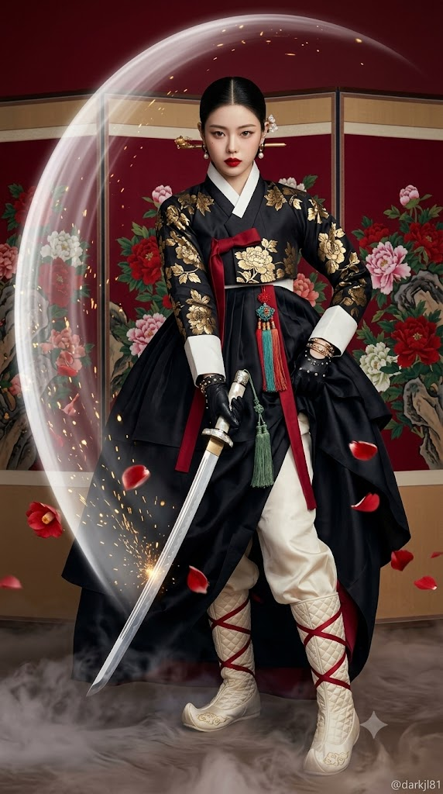
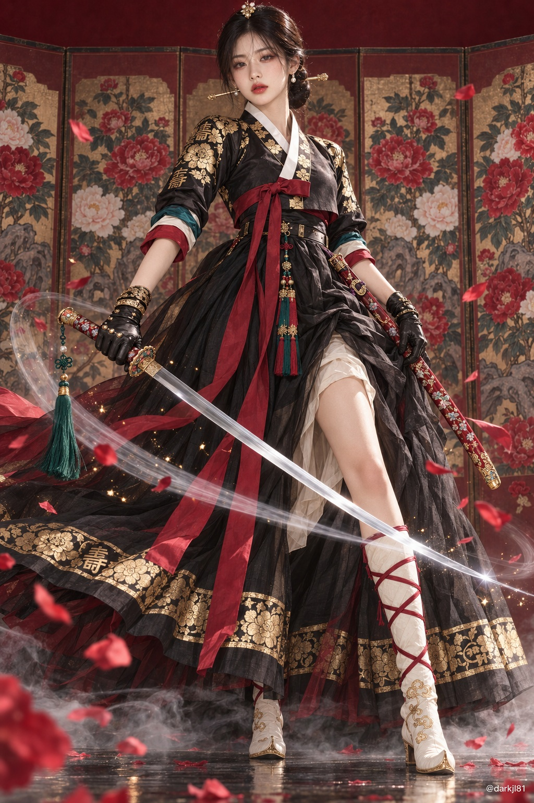

# 오뜨 쿠튀르 흑적 금박 검무복 조선 여검사 화보 프롬프트

## 1. 개요 및 아트 디렉팅 가이드
- **장르/컨셉**: 조선 전통 한복의 고증된 실루엣과 오뜨 쿠튀르 하이엔드 패션 매거진 화보의 극사실적 결합, 절제된 시네마틱 판타지 이펙트.
- **의상 (흑적 금박 검무복)**:
  - 칠흑색 무광 실크의 짧은 저고리(조선 후기 실루엣), 흰 동정과 깃의 V자 교차, 어깨/소매/깃에 전통 금박 모란·수(壽)자 문양.
  - 소매를 팔꿈치까지 걷어올려 드러나는 짙은 청록색 & 아이보리 안감 및 진홍색 끝동.
  - 바닥까지 길게 휘날리는 진홍색 실크 고름과 삼작노리개, 가슴 높이에서 묶여 풍성하게 퍼지는 흑색 다층 실크 치마(단자락 금박 띠).
  - 치마 한쪽을 여며 드러나는 아이보리 비단 속바지와 버선코를 살린 하이패션 퀼팅 버선 부츠(진홍색 X자 끈).
  - 허리의 가느다란 검은 가죽 벨트와 금 띠돈.
- **인물 & 헤어 메이크업**:
  - 20대 후반 한국 여성 모델, 도도하고 차가운 카리스마 눈빛.
  - 정갈하게 빗어 넘긴 조선 정통 쪽머리, 가로로 꽂힌 금 비녀와 은은하게 떨리는 앞머리 떨잠, 단정한 진주 귀걸이, 또렷한 진홍색 립.
- **무기 (조선 환도 & 띠돈 패용 고증)**:
  - 약 90cm(칼날 69cm)의 완만한 곡선을 가진 단정한 외날 직도 형태, 은빛 미러 폴리싱 표면.
  - 진홍색 옻칠 위 영롱한 자개(모란·넝쿨) 상감과 금 투각 덮개, 진주/산호 장식 자루, 국화매듭과 비취 구슬이 달린 녹색 유소(술).
  - 띠돈에 연결되어 칼자루가 등 뒤를 향하고 칼끝이 앞쪽 아래를 향하는 조선 후기 전통 역방향 띠돈 패용 완벽 반영.
- **이펙트 & 배경**:
  - 칼날을 따르는 가느다란 은빛 섬광과 스타 글린트, 미세한 금빛 불티 입자, 허공에 흩날리는 진홍색 동백 꽃잎, 바닥의 옅은 안개.
  - 짙은 진홍색 벽과 은은하게 바랜 조선 궁중 모란도 병풍, 부드러운 키라이트와 림라이트가 강조된 시네마틱 톤.

## 2. 프롬프트 전문

```text
업로드한 사진은 얼굴 정보 추출용으로만 사용한다. 사진에서는 눈, 코, 입의 생김새만 가져온다. 얼굴형, 피부, 헤어, 이마와 헤어라인, 표정은 사진에서 가져오지 않는다. 사진 속 머리 각도, 고개 기울기, 얼굴 방향, 시선도 절대 가져오지 않는다. 얼굴 각도, 표정, 헤어, 의상, 포즈, 구도, 배경은 아래 서술대로만 새로 그린다.

[장면 개요]
오뜨 쿠튀르 한복을 입은 한국 여성 검객의 전신 패션 화보. 조선 한복의 실루엣을 정확히 지키면서 런웨이 작품처럼 재해석한 의상을 입고 조선 환도를 든 장면. 하이엔드 패션 매거진 퀄리티의 극사실 사진에 절제된 판타지 이펙트가 더해진 이미지. 중국 한푸나 중국 고장극 느낌이 아니라 누가 봐도 한국 한복으로 보여야 한다.

[의상 — 흑적 금박 검무복] (고정, 변경 금지)
- 저고리: 칠흑색 무광 실크 저고리. 길이가 아주 짧아 가슴 아래에서 끝나는 조선 후기 짧은 저고리 실루엣. 넓은 흰 동정과 흰 깃이 V자로 교차한다. 어깨, 소매, 깃 둘레에 한국 전통 금박(얇은 금박을 찍어 붙인 문양) 기법으로 모란과 수(壽)자 문양이 찍혀 있다. 자수가 아니라 평평하고 반짝이는 금박이다.
- 소매: 몸에 맞게 떨어지는 검정 소매를 팔꿈치까지 걷어 올려, 안쪽에 짙은 청록색과 아이보리색 소맷단이 두 겹으로 드러난다. 소맷부리 끝동은 진홍색.
- 고름: 짧은 저고리 앞에 크게 묶은 진홍색 실크 고름이 치마 위로 바닥 가까이까지 길게 늘어지며 휘날린다.
- 치마: 가슴 높이(저고리 바로 아래)에서 치마끈으로 묶어 아래로 크게 퍼지는 조선 한복 치마. 검은 실크를 여러 겹 겹친 거대한 볼륨이며, 치마 아랫단에 넓은 금박 띠 문양. 치마 한쪽 자락을 걷어 올려 끈으로 여민 형태이며, 그 틈으로 속바지와 버선 부츠가 보인다. 다리가 드러나는 정도는 선택된 포즈에 따라 자연스럽게 정한다. 치마 앞에 따로 늘어진 장식 천은 없다.
- 칼 벨트: 치마 위 허리 높이에 가느다란 검은 가죽 벨트 하나만 둘렀고, 옆구리와 등 사이 위치에 금 띠돈이 달려 있다. 넓은 허리띠나 오비 형태 띠는 없다.
- 노리개: 고름 아래에 한국 전통 삼작노리개(진홍·청록·금빛 매듭과 술)를 단다.
- 속바지: 치마 틈으로 보이는 다리에는 아이보리색 비단 속바지를 입었다. 몸에 붙지 않고 살짝 여유 있게 떨어지며, 종아리 아래에서 버선 부츠 안으로 주름지게 접혀 들어간다.
- 버선 부츠: 전통 버선의 형태를 그대로 살린 무릎 아래 길이의 하이패션 부츠. 아이보리 비단을 누빔 처리한 매끈한 표면에, 발끝은 버선코처럼 위로 부드럽게 들린 곡선. 종아리를 진홍색 비단 끈으로 X자로 감아 묶고, 발목에는 금사로 작은 구름 문양 자수. 굽은 낮고 납작하며, 밑창 가장자리는 금빛으로 마감.
- 손: 양손에 금속 리벳이 박힌 검은 가죽 장갑, 손목에 금 팔찌 여러 줄.

[인물]
20대 후반 한국 여성, 마르고 길쭉한 모델 체형, 긴 목선. 맑고 매끈한 피부. 표정은 차갑고 도도하며 입술을 다문 채 카메라를 응시하는 날카로운 눈빛.

[헤어 & 메이크업]
- 헤어: 정수리에서 가르마를 타고 검은 머리를 잔머리 없이 매끈하게 빗어 넘겨, 뒷목 아래 정중앙에 낮게 쪽진 조선 여인의 쪽머리. 쪽에는 금으로 된 긴 비녀를 가로로 꽂아 비녀 양끝이 좌우로 보인다. 앞머리 위에는 작은 떨잠(용수철 위에 진주와 칠보 꽃이 달려 미세하게 떨리는 한국 머리 장식) 하나. 옆머리에 꽂는 장식이나 길게 늘어지는 머리 장식은 없다.
- 귀걸이: 작은 금 고리에 진주 한 알이 달린 단정한 귀걸이.
- 메이크업: 맑고 깨끗한 피부 표현, 결이 정돈된 일자형 눈썹, 날렵하지만 얇은 블랙 아이라인. 눈가에 붉은 섀도는 쓰지 않는다. 입술은 진홍색으로 또렷하게.

[검 — 여성 검객을 위한 장신구급 조선 환도]
조선 환도 한 자루. 칼날은 실제 유물 고증 그대로 단정하게, 자루·코등이·칼집·술은 왕실 여인의 장신구처럼 섬세하고 화려하게 그린다.
- 전체 비율: 전체 길이 약 90cm. 칼날 약 69cm, 자루 약 21cm. 인물의 키에 비해 과하게 길거나 크지 않다.
- 칼날 (고증 고정): 외날. 일본도보다 폭이 약간 좁은 가늘고 날렵한 칼날로, 손잡이 쪽 폭은 손가락 두 개 정도. 휨은 아주 완만해서 거의 곧은 직도에 가깝고, 칼등 쪽으로 살짝만 휘어 있다. 칼끝은 자연스럽게 좁아지며, 칼끝과 칼날 사이에 일본도 같은 세로 경계선(요코테)이 없다. 표면은 은빛으로 거울처럼 맑게 연마되어 있고, 칼날을 따라 희미한 직선형 담금질 무늬가 은은하게 보인다. 칼날 자체에는 장식이 없다.
- 동호인: 칼날 뿌리를 감싼 짧은 금 띠, 표면에 아주 가는 넝쿨 선각.
- 코등이: 작고 납작한 원형. 지름은 손바닥보다 작다. 금 바탕에 가장자리를 따라 작은 꽃잎 모양 테두리를 두르고, 표면에 진홍색과 청록색 칠보 에나멜로 작은 모란 문양을 넣었다.
- 자루: 가운데가 오목하지 않은 곧은 일자형. 진홍색 옻칠 바탕에 영롱한 자개(진주빛 조개껍데기)를 박아 넣은 모란과 넝쿨 문양이 자루 전체를 감싸고, 빛에 따라 무지갯빛으로 반짝인다. 자루 앞쪽과 끝에는 금으로 투각 세공한 넝쿨 문양 덮개를 씌웠고, 끝 덮개 중앙에는 둥근 진주 한 알과 작은 산호 알이 박혀 있다.
- 술(유소): 자루 중간의 작은 금 구멍에 짙은 녹색 비단 끈을 꿰어, 끈 중간에 정교한 한국 전통 매듭(국화매듭)을 짓고 그 위에 작은 비취 구슬과 금 구슬을 꿰었다. 끝에는 풍성하고 긴 녹색 실 술을 늘어뜨렸으며, 술 윗부분은 금실로 감쌌다. 술은 동작에 따라 공중에서 우아하게 흔들린다.
- 칼집: 칼을 뽑은 상태라 빈 칼집이 허리에 걸려 있다. 칼집 길이는 칼날이 완전히 들어가야 하므로 칼날(약 69cm)보다 살짝 긴 약 72cm다. 화면 속에서 칼집은 손에 든 칼날과 같은 길이이거나 조금 더 길게 보여야 하며, 칼날보다 짧거나 뭉툭하게 그리지 않는다. 칼날과 같은 완만한 휨을 가진 가늘고 긴 형태. 깊은 진홍색 옻칠 바탕에 자개로 박아 넣은 모란, 나비, 넝쿨 문양이 칼집 전체를 따라 흐르고, 문양 사이사이에 가는 금선이 이어진다. 칼집 입구와 끝은 금으로 투각 세공한 넝쿨 마감 장식, 끝 장식에는 작은 칠보 꽃이 붙어 있다. 칼집 위쪽에 금 고리(가락지) 두 개가 감겨 있고, 고리에 자주색 비단 끈목이 걸려 벨트의 금 띠돈에 연결된다.

[환도 패용 방식 — 조선 후기 띠돈 패용 고증]
- 칼집은 띠돈에 매달려 옆구리와 등 사이의 허리춤에 비스듬히 걸려 있다.
- 칼집 입구(칼자루가 들어가는 쪽)는 등 뒤쪽을 향하고, 칼집 끝은 몸 앞쪽 아래로 비스듬히 나와 있다. 즉 칼을 꽂았을 때 칼자루가 뒤로 가고 칼끝이 앞으로 오는 방향이다.
- 일본도처럼 칼자루가 배 앞쪽을 향하도록 허리띠에 꽂거나, 칼집을 등에 메는 방식은 쓰지 않는다.

[이펙트]
- 칼날을 따라 가느다란 은빛 빛줄기가 흐르고, 칼끝에서 작은 빛 반짝임(스타 글린트)이 맺힌다.
- 선택된 포즈가 실제 베기 동작일 경우에만 칼의 이동 방향을 따라 짧은 반투명 빛 잔상을 넣는다. 정지 자세나 준비 자세에서는 잔상을 넣지 않는다.
- 칼날 주변에 금빛 불티와 미세한 빛 입자가 흩날린다.
- 인물 주위로 진홍색 동백 꽃잎 몇 장이 흩어지며, 일부 꽃잎은 반으로 갈라진 채 떠 있다. 꽃이 핀 나뭇가지는 화면에 넣지 않는다.
- 바닥에 옅은 안개가 낮게 깔려 있다.
- 이펙트는 고급스럽고 절제되게 표현하며 얼굴, 의상, 칼의 형태를 가리거나 바꾸지 않는다. 과한 불꽃, 번개, 게임풍 네온 효과는 사용하지 않는다.

[포즈 — 생성 시 1개를 임의 선택]
아래 6종 중 정확히 하나의 자세를 생성할 때마다 임의로 선택한다. 선택 결과나 이유는 출력하지 않고 바로 이미지만 생성한다.
1. 검을 한 손으로 몸 옆 아래에 내리고 정면에 가깝게 선 정적인 자세
2. 검을 머리 뒤쪽으로 크게 젖혀 다음 베기를 준비하는 자세
3. 검을 몸 뒤쪽으로 뺀 채 상체를 비틀어 어깨 너머로 뒤돌아보는 자세
4. 한쪽 무릎을 낮추고 검을 지면 가까이 수평으로 뻗은 자세
5. 검을 세로에 가깝게 얼굴 옆에 세운 방어 자세
6. 한 발을 뒤로 뺀 채 검을 몸 옆 바깥쪽으로 길게 뻗은 자세
- 한쪽 다리를 앞으로 크게 내밀고 칼날이 몸 앞을 대각선으로 가로지르는 전형적인 베기 자세는 사용하지 않는다.
- 어떤 자세든 얼굴은 또렷이 보여야 한다.

[구도 — 타이트한 전신]
- 세로형 프레임. 머리부터 발끝까지 전신이 모두 들어오되, 주변 여백 없이 인물이 프레임 위아래를 거의 꽉 채우도록 카메라를 가까이 붙인 타이트한 전신 구도.
- 머리 위 여백은 아주 조금만, 발끝은 프레임 하단에 거의 닿게 배치한다. 넓게 퍼지는 치마와 칼끝은 프레임 가장자리에서 일부 잘려도 된다.
- 얼굴은 화면 상단 3분의 1 지점에 크고 선명하게 위치하며, 이목구비와 눈빛, 메이크업 디테일이 클로즈업처럼 또렷이 보여야 한다. 초점은 얼굴에 가장 정확히 맞춘다.
- 카메라는 가슴 높이에서 살짝 올려다보는 각도로, 다리를 길어 보이게 하면서 얼굴이 작아지지 않게 한다.

[배경]
짙은 진홍색 벽 앞에 조선 궁중 모란도 병풍(여러 폭에 걸쳐 바위 위로 큼직한 붉은·분홍·흰 모란이 좌우 대칭으로 반복되는 한국 궁중 장식화)이 펼쳐져 있다. 병풍은 오래되어 색이 살짝 바랜 질감. 바닥과 벽의 경계는 보이지 않는 심플한 구성. 중국식 산수화, 높은 봉우리와 폭포 그림은 쓰지 않는다.

[조명 & 톤]
얼굴에 부드럽고 선명한 키라이트가 떨어져 얼굴이 이미지에서 가장 먼저 눈에 들어오게 한다. 뒤에서 의상 윤곽을 살리는 림라이트, 칼날에는 별도의 차가운 하이라이트가 길게 맺혀 금속감이 돋보이고, 자루와 칼집의 자개가 빛을 받아 은은한 무지갯빛으로 반짝인다. 원단의 결, 금박 문양, 옻칠의 광택이 선명하게 보이는 시네마틱 고급 화보 톤. 색감은 검정·진홍·금색 중심에 청록색과 아이보리 포인트.

[워터마크]
우측 하단 구석에 작은 흰색 글씨로 "@darkjl81".

[금지 사항]
사진 속 얼굴 각도·표정·헤어·배경 반영 금지, 의상 디자인 변경 금지, 가죽 바지·레깅스·하이힐 금지.
중국풍 금지: 엉덩이까지 내려오는 긴 포 형태 저고리, 넓은 허리띠 아래에서 시작하는 치마, 치마 앞 중앙에 늘어진 자수 장식 천, 촘촘한 중국식 금사 브로케이드, 옆머리에 꽂는 보요형 머리 장식과 늘어진 머리 장식, 잔머리 내린 고장극 헤어, 눈가 전체에 붉은 기를 펼친 도화 화장, 중국 산수화 배경, 매화 가지.
칼 관련 금지: 시미터·사브르처럼 크게 휜 칼날, 폭이 넓은 칼날, 칼날 자체의 문양·상감·보석 장식, 손바닥보다 큰 코등이, 용머리 등 입체 조각상이 달린 자루 끝, 일본도식 마름모 끈감기와 가운데가 오목한 자루, 칼끝의 요코테 경계선, 지나치게 긴 칼, 칼날보다 짧은 칼집, 칼자루가 앞을 향하도록 허리에 꽂은 일본식 패용, 칼날이 휘거나 끊기거나 두 자루로 분리되는 왜곡.
포즈 금지: 한쪽 다리를 앞으로 크게 내밀고 칼날이 몸 앞을 대각선으로 가로지르는 베기 자세.
인물이 작게 나오는 원거리 구도 금지, 얼굴 흐림 금지, 기계 팔·다리 금지, 여러 명 등장 금지, 워터마크 외 텍스트·로고 금지, 손가락 왜곡 금지.
```

## 3. 결과물 비교 갤러리

| 제미나이 (Gemini) | GPT (DALL-E 3) |
| :---: | :---: |
|  |  |
