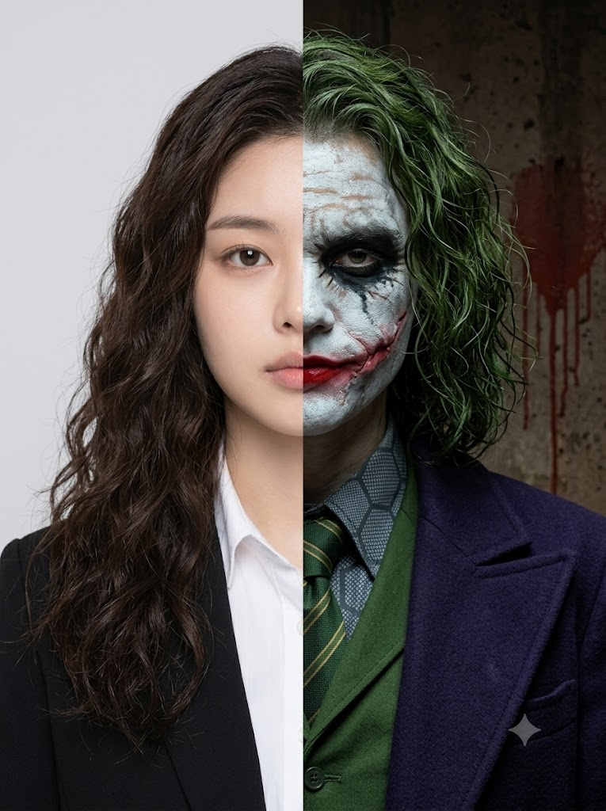
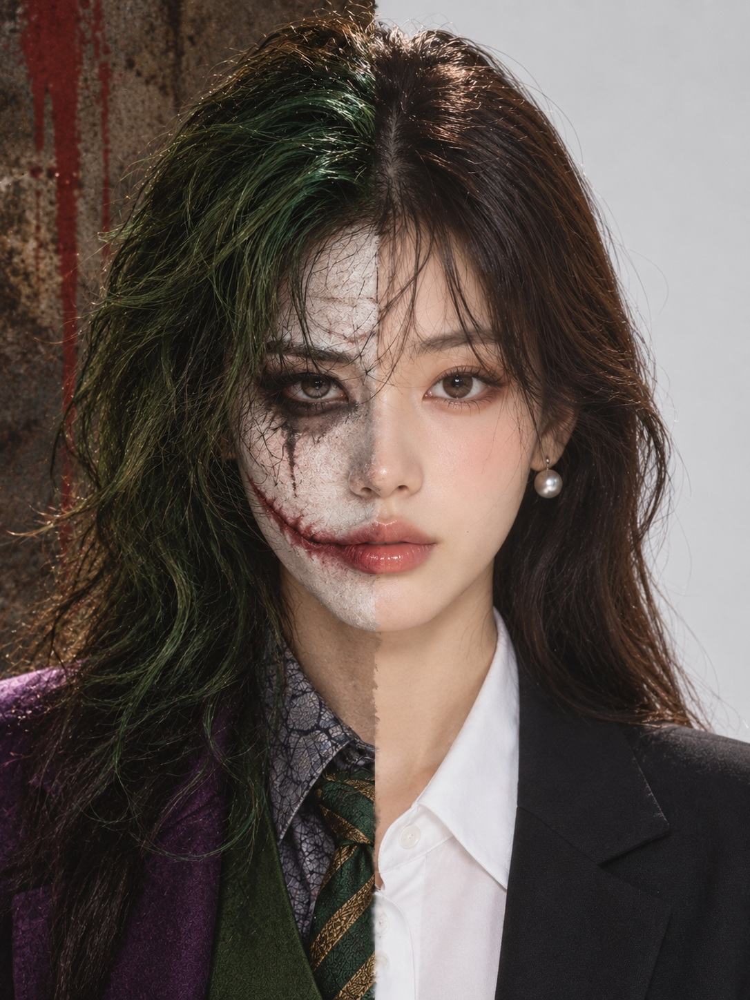

# 반쪽 광대 증명사진, 숫자로 정하는 하프 스플릿 광대 악당 프롬프트

## 1. 개요 및 아트 디렉팅 가이드

- **컨셉**: 얼굴 정중앙의 세로선을 기준으로 한쪽은 평범한 증명사진, 다른 쪽은 광대 악당 분장으로 나눈 하프 스플릿 실사 증명사진 (세로 3:4). 광대 분장은 입력한 숫자로 네 가지 버전 중 하나가 정해짐
- **진행 방식**:
  - 먼저 아무 숫자나 하나 입력해 달라고 요청하고, 숫자를 받기 전에는 그리지 않음
  - 계산 과정과 최종 버전, 적용할 블록의 핵심 요소(머리·분장·배경)를 정해진 형식의 글로 먼저 출력한 뒤 생성
- **버전 결정 (최우선 규칙)**:
  - A = 입력 숫자의 각 자릿수 합
  - B = (A × 7 + 자릿수 개수) mod 4
  - B값 0~3이 각각 버전 1~4에 대응하며, 숫자가 버전을 정하는 유일한 기준
  - 확정된 블록 하나만 적용하고 나머지 세 블록은 완전히 무시
- **구도 (증명사진)**: 얼굴과 몸이 완전한 정면, 카메라를 보는 시선, 머리 위 여백부터 가슴 윗부분까지. 사진에서는 눈·코·입의 생김새와 얼굴 인상만 가져옴
- **하프 스플릿 규칙**:
  - **인물의 왼쪽 절반 (화면 오른쪽)**: 화장 없는 맨얼굴과 무표정, 흰 셔츠에 검은 재킷, 밝은 연회색 단색 배경
  - **인물의 오른쪽 절반 (화면 왼쪽)**: 같은 얼굴 위에 선택된 버전의 분장·표정·머리·옷·배경·조명을 적용
  - 한 얼굴에 두 가지 표정이 공존하는 비대칭 얼굴, 배경도 같은 세로선에서 깔끔하게 나뉨
  - 특정 배우의 얼굴로 바꾸지 않고 반드시 사진 속 인물로 표현
- **네 가지 광대 버전**:
  - **버전 1 (2008 다크 무정부주의자)**: 갈라지고 얼룩진 흰 분장과 검게 번진 눈, 헝클어진 칙칙한 녹색 곱슬머리, 어두운 보라 코트, 얼룩진 콘크리트 벽
  - **버전 2 (2019 계단 위의 광대)**: 깨끗한 하얀 페이스페인트에 빨간 아치 눈썹과 파란 역삼각형 눈 분장, 지치고 슬픈 눈, 와인빛 빨간 정장, 청록색 단색 배경
  - **버전 3 (2016 갱스터 광대)**: 창백한 흰 피부와 이마의 작은 문신, 웃는 입 문신이 있는 손등으로 입을 가린 포즈, 형광 녹색 슬릭백, 나이트클럽의 앰버색 보케
  - **버전 4 (1989 고전 쇼맨 광대)**: 분필처럼 새하얀 피부와 높이 치켜올린 눈썹, 크게 당긴 반쪽 미소, 보라색 정장과 중절모, 밝은 보라·회색 배경
- **금지**: 선택되지 않은 버전의 요소 혼용, 맨얼굴 쪽 절반에 분장이나 표정 변화, 고개 기울임과 비스듬한 구도, 피·상처·고어 표현

---

## 2. 프롬프트 전문

```text
먼저 나에게 아무 숫자나 하나 입력해 달라고 요청해. 숫자를 받기 전에는 절대 그림을 그리지 마.

[버전 결정 — 최우선 절대 규칙]
숫자를 받으면 반드시 다음 순서대로 처리한다.
1) 입력 숫자의 각 자릿수를 모두 더해 A를 계산한다.
2) B = (A × 7 + 입력 숫자의 자릿수 개수) mod 4 를 계산한다.
3) B값으로 생성할 버전을 단 하나만 확정한다.
B=0 → 버전1 / B=1 → 버전2 / B=2 → 버전3 / B=3 → 버전4

이미지 생성 전에 반드시 아래 형식 그대로 글로 출력한다.
입력 숫자: ○○
A = (자릿수 덧셈 과정) = ○
B = (○ × 7 + ○) mod 4 = ○
최종 버전: 버전○
적용 블록: [B=○ 전용 — 버전○]
핵심 요소 확인: (해당 블록에 적힌 머리, 분장, 배경을 각각 한 줄씩 옮겨 적기)

- 사용자의 숫자는 장식이나 랜덤 시드가 아니라 버전을 결정하는 유일한 기준이다.
분위기, 사진, 취향 등을 근거로 다른 버전을 임의 선택해서는 안 된다.
- 최종 버전이 확정되면 해당 블록 하나만 활성화하고, 나머지 세 블록은 존재하지 않는 것처럼 완전히 무시한다.
- 출력한 "핵심 요소 확인" 내용과 실제 이미지가 다르면 생성하지 말고 올바른 블록으로 수정한 뒤 생성한다.

계산 예:
- 1111 → A=1+1+1+1=4 → (4×7+4) mod 4 = 32 mod 4 = 0 → 버전1
- 25 → A=2+5=7 → (7×7+2) mod 4 = 51 mod 4 = 3 → 버전4
예시는 계산 방법 설명일 뿐이다. 반드시 사용자가 입력한 숫자로 새로 계산한다.

[구도 - 증명사진]
- 실사 증명사진. 3:4 세로 비율.
- 얼굴과 몸이 완전한 정면. 고개 기울임, 회전 없음. 시선은 카메라 정면.
- 머리 위 약간의 여백부터 어깨 아래 가슴 윗부분까지. 얼굴이 화면 정중앙.
- 업로드 사진의 구도, 각도, 고개 기울기, 시선, 포즈, 표정, 조명, 배경은 절대 가져오지 마.
사진에서는 눈·코·입의 생김새와 얼굴 인상만 가져온다.

[하프 스플릿 - 얼굴, 표정, 배경 모두 반으로 나눈다]
얼굴 정중앙(이마 중앙 - 콧대 - 인중 - 턱 중앙)을 지나는 세로선을 기준으로 정확히 반으로 나눈다.
이 세로선은 화면 위에서 아래까지 그대로 이어져 배경도 같은 선에서 나뉜다.

■ 인물의 왼쪽 절반(화면 오른쪽) - 평범한 증명사진
- 화장 없는 맨얼굴. 머리카락은 사진 속 머리 색과 길이를 단정하게 정리.
- 표정: 입을 다문 무표정. 눈썹, 눈, 입꼬리 모두 힘을 뺀 차분한 상태.
- 옷: 흰 셔츠에 검은 재킷.
- 배경: 아무것도 없는 밝은 연회색 단색. 그림자 없는 균일한 정면 스튜디오 조명.

■ 인물의 오른쪽 절반(화면 왼쪽) - 광대 악당
- 같은 얼굴 위에 활성화된 버전 블록의 분장. 눈·코·입의 생김새와 위치는 왼쪽과 같고 분장만 덧입힌다.
- 표정: 활성화된 버전의 표정을 얼굴 오른쪽 절반에만 짓는다.
눈썹, 눈꺼풀, 볼, 입꼬리가 오른쪽만 움직여서 한 얼굴에 두 가지 표정이 공존하는 비대칭 얼굴.
- 머리카락, 옷, 배경, 조명도 활성화된 버전 블록 스타일.

- 얼굴 경계선은 흰 분장이 살짝 번진 자연스러운 경계, 배경 경계선은 깔끔한 직선.
- 특정 배우의 얼굴로 바꾸지 말 것. 얼굴은 반드시 사진 속 인물.

[B=0 전용 — 버전1: 2008 다크 무정부주의자]
- 피부: 갈라지고 얼룩진 칙칙한 흰 분장, 군데군데 피부가 비침
- 눈: 눈두덩부터 눈 아래까지 검은색이 거칠게 번지고 흘러내린 자국
- 입: 입꼬리에서 광대뼈 방향으로 비스듬히 올라가는, 오래전에 아문 흉터 하나.
살짝 솟은 분홍빛 피부 결로 표현하고, 그 위를 탁한 빨간 립스틱이
입술에서 흉터 끝까지 지저분하게 번져 덮고 있다. 피, 열린 상처 없음.
- 표정: 눈썹을 낮게 깔고 눈을 위로 치켜뜬 위협적인 시선. 입꼬리는 살짝 비틀려 올라간 냉소.
- 머리: 기름지고 헝클어진 칙칙한 녹색 곱슬머리, 어깨 근처 길이
- 옷: 이끼색 녹색 조끼, 회색 기하학 패턴 셔츠, 녹색·금색 사선 패턴 넥타이, 어두운 보라 코트
- 배경: 얼룩진 어두운 갈색 콘크리트 벽, 빨간 페인트가 흘러내린 자국. 어둡고 차가운 로우키 조명.

[B=1 전용 — 버전2: 2019 계단 위의 광대]
- 피부: 깨끗하게 바른 하얀 페이스페인트
- 눈썹 위: 빨간색으로 크게 그린 뾰족한 아치 눈썹
- 눈: 파란색 뾰족한 역삼각형이 눈 위아래로 길게 그려짐
- 코: 코의 오른쪽 절반만 빨간색
- 입: 입술 바깥으로 볼까지 크게 그린 빨간 미소 선
- 표정: 눈꺼풀이 무겁게 처진 지치고 슬픈 눈. 입은 다물었고 입꼬리가 아주 살짝만 올라간 공허한 미소.
그려진 웃음과 슬픈 눈이 대비된다.
- 머리: 기름져 뒤로 넘긴 짙은 녹색 머리, 귀를 덮는 길이
- 옷: 와인빛 빨간 정장 재킷, 청록 셔츠, 머스타드 조끼
- 배경: 짙은 청록색 단색 배경. 부드럽고 차분한 스튜디오 조명.

[B=2 전용 — 버전3: 2016 갱스터 광대]
- 피부: 창백하고 매끈한 흰 피부, 눈가가 붉음
- 이마: 오른쪽 절반 이마에 작은 필기체 글씨 문신 하나
- 손 포즈: 오른손을 펴서 손등이 정면을 향하게 하고, 코 아래부터 턱까지 입 전체를 가로로 가린다.
손 중앙이 얼굴 중앙선에 오도록 놓는다. 실제 입은 양쪽 모두 보이지 않는다.
- 손등 문신: 크게 웃는 입 모양 문신. 빨간 입술 윤곽과 하얀 이.
문신은 얼굴 중앙선을 기준으로 분장한 쪽(인물의 오른쪽 절반) 위에 있는 손등 부분에만 있다.
즉 웃는 입의 오른쪽 절반만 문신으로 보이고, 중앙선에서 딱 잘린다.
맨얼굴 쪽(인물의 왼쪽 절반) 위의 손등은 문신 없는 깨끗한 맨살.
- 표정: 손 위로 보이는 오른쪽 눈이 가늘게 휘어 웃고 있고, 눈썹이 장난스럽게 치켜올라감.
손등 문신 입과 합쳐져 손 뒤에서 킥킥 웃는 듯한 느낌.
- 손: 분장 쪽 손가락에만 굵은 금반지, 손목에 금시계
- 머리: 짧고 광택 나는 형광 녹색 슬릭백
- 옷: 단추를 풀어헤친 흰 실크 셔츠, 굵은 금 체인 목걸이
- 배경: 흐릿하게 날아간 고급 나이트클럽 실내, 따뜻한 앰버색 조명 보케.

[B=3 전용 — 버전4: 1989 고전 쇼맨 광대]
- 피부: 분필처럼 새하얀 피부
- 눈썹: 짙고 높이 치켜올린 아치 눈썹
- 입: 빨간 입술
- 표정: 눈을 크게 부릅뜬 광기 어린 시선, 눈썹을 이마 끝까지 치켜올림.
오른쪽 입꼬리를 볼 끝까지 크게 당겨 하얀 이가 드러나는 반쪽 미소.
왼쪽(맨얼굴) 입은 다문 무표정 그대로라 입이 비대칭으로 갈라져 보인다.
- 머리: 짧은 녹색 머리, 머리의 오른쪽 절반에만 걸친 짙은 보라색 중절모
- 옷: 보라색 정장, 주황색 셔츠, 청록색 큰 리본 타이
- 배경: 보라·회색 계열 단색 배경. 밝고 화사한 스튜디오 조명.

[금지]
- 활성화되지 않은 버전 블록의 분장, 머리, 의상, 배경, 표정, 소품은 하나도 사용하지 말 것
- 왼쪽 절반(맨얼굴 쪽)에 분장, 색, 문신, 표정 변화를 넣지 말 것. 왼쪽 입꼬리와 왼쪽 눈썹은 절대 움직이지 않는다
- 왼쪽 절반 배경에 버전 배경 요소 넣지 말 것
- 고개 기울임, 손으로 턱 괴기, 비스듬한 구도 금지
(B=2 전용 버전3의 입 가리는 손 포즈는 예외, 손도 얼굴 중앙선 기준 스플릿 규칙을 따른다)
- 피, 상처, 고어 표현 금지
```

---

## 3. 결과물 비교 갤러리

| 생성 모델 | 생성 결과 이미지 |
| :--- | :--- |
| **제미나이 (Gemini)** |  |
| **ChatGPT (DALL-E 3)** |  |
