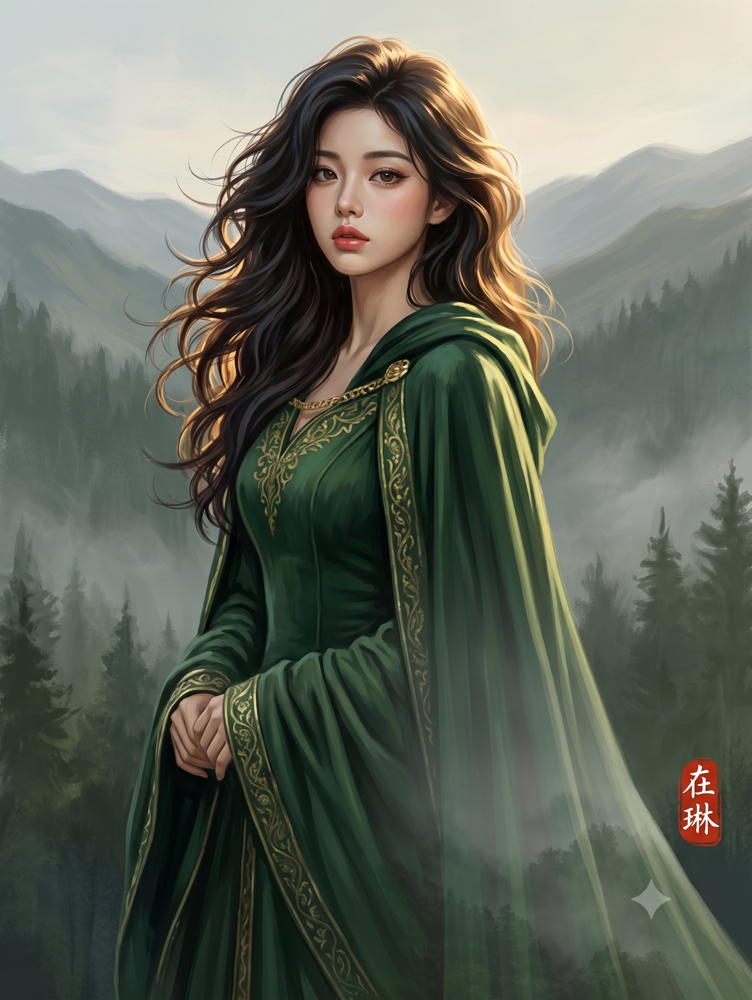
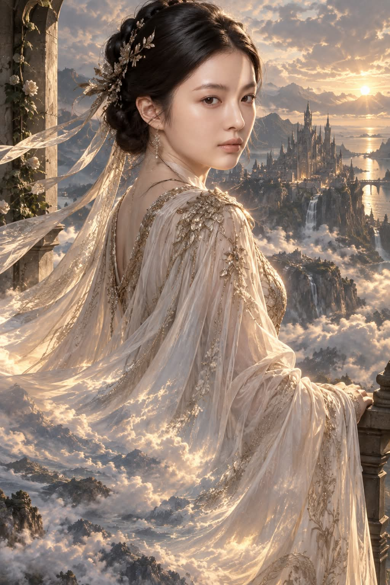

# 에픽 중세 판타지 초상화 (그라디언트 디졸브) 프롬프트

## 1. 개요 및 연출 분석
- **장르/테마**: 에픽 중세 판타지 초상화 (Epic Medieval Fantasy Portrait)
- **핵심 시각 효과 — 그라디언트 디졸브 (Gradient Dissolve)**:
  - 어깨 부분은 직조감과 주름이 선명한 단단하고 불투명한 직물(망토/드레스)로 시작.
  - 아래로 내려올수록 점점 반투명해지며, 옷감의 결이 배경의 질감으로 자연스럽게 치환됨.
  - 옷자락 끝단은 완전히 배경 그 자체(부서지는 파도, 흩날리는 구름과 하늘, 안개 낀 숲의 수관)로 녹아들어 직물과 자연의 경계가 사라지는 소프트 알파 그라데이션 연출.
  - 옷의 주름선이 파도의 물결, 뭉게구름의 결, 나뭇가지 실루엣으로 연속되듯 이어지는 환상적인 분위기.
- **인물 및 복식**:
  - 남성: 화려하게 세공된 중세 풀 플레이트 판금 갑옷(Ornate Plate Armor)과 길게 늘어지는 망토.
  - 여성: 긴 트레일과 소매가 우아하게 흐르는 중세 고딕/판타지풍 드레스 가운.
  - 원본 인물의 얼굴 골격, 이목구비, 피부톤을 성형이나 과도한 미화 없이 그대로 보존.
- **포인트 낙관**:
  - 화면 하단 구석에 붉은색 동양풍 주문방인(朱文方印) 낙관 **「在琳」**을 섬세하고 작게 배치.
- **아트 스타일**: 웅장한 시네마틱 라이팅, 회화적 깊이감의 디지털 페인팅(Painterly Digital Art), 8K 고화질.

---

## 2. 프롬프트 전문 (코드 블록)

```text
Using the uploaded photo as the reference, transform this person into
an epic medieval fantasy portrait.

IDENTITY (most important): Keep the exact same face. Same bone
structure, same eye shape, same nose, same jawline, same skin tone,
same age. Only minimal retouching — even out skin tone and add soft
cinematic lighting. Do NOT beautify, do NOT slim the face, do NOT
smooth the skin into plastic, do NOT replace it with a generic model
or doll face. Anyone who knows this person must recognize them
instantly.

OUTFIT: If the subject is male, dress him in ornate medieval plate
armor with a long flowing cloak. If the subject is female, dress her
in an elegant medieval gown with long trailing fabric and sleeves.
Decide based on the person in the photo.

KEY EFFECT — GRADIENT DISSOLVE: The cloak or gown transitions into
the background as a smooth vertical gradient. At the shoulders it is
solid, opaque fabric with clear weave, stitching and folds. Moving
downward it becomes progressively more translucent, the fabric
texture gradually giving way to the environment's texture, until the
hem is fully the background itself — ocean waves, open sky and
clouds, or a misty forest canopy. The blend is continuous, like a
soft alpha gradient: no hard edge, no cut line, no sudden switch
between cloth and world. Fabric folds flow onward as wave crests,
cloud streaks and treetop silhouettes, and the garment's colors
shift to match the environment as they descend.

POSE: Choose a pose at random — three-quarter turn, glancing back
over the shoulder, arms raised, wind-swept, or standing in quiet
contemplation.

SEAL: In a lower corner of the image, place a traditional East Asian
artist's seal (낙관 / hanko) — a small vermilion red square stamp
containing exactly the two Chinese characters 在琳, carved in white
seal script on a red ground. Render it small and subtle, like an
authentic ink-stamp pressed onto the artwork, slightly textured and
imperfect. Exactly these two characters, no other text.

STYLE: Cinematic lighting, epic atmosphere, painterly digital art,
highly detailed, sharp, 8k. Clean anatomy, correct number of limbs
and fingers. No watermark, no logo, no frame, no text other than the
seal. Keep the exact same face as the reference photo.
```

---

## 3. 생성 예제

| Gemini | GPT |
| :---: | :---: |
|  |  |


