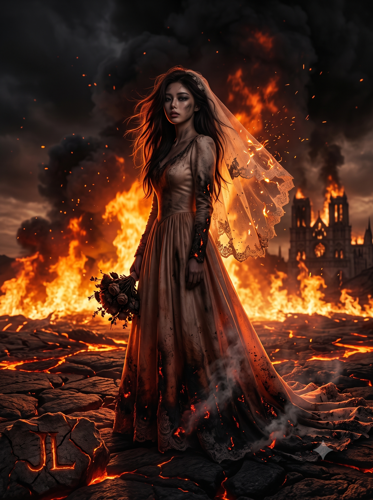
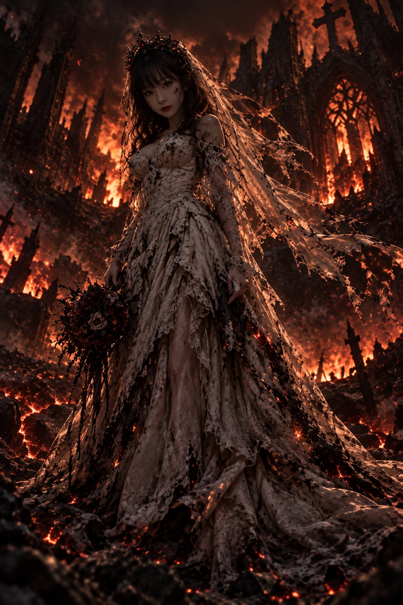

# 지옥의 신부 다크 판타지 시네마틱 프롬프트

## 1. 개요 및 아트 디렉팅 해설
- **콘셉트 테마**: 붉은 불길과 용암이 소용돌이치는 지옥 한가운데에서 소름 끼치도록 고요하게 서 있는 **'지옥의 신부(Bride of Hell)'**를 극사실적 실사 영화 스틸컷처럼 담아낸 다크 판타지 시네마틱 전신 포트레이트
- **핵심 아트 디렉팅 & 조형 원리**:
  - **얼굴 특징 보존 & 로판풍 미화 (Face Identity & Beautification)**:
    - 원본 인물의 눈매(쌍꺼풀, 눈꼬리 각도, 눈 간격), 눈썹 짙기, 콧대와 코끝, 입술 두께와 입꼬리 등 고유의 식별 포인트를 확실히 살려 지인이 즉시 알아볼 수 있게 연출.
    - 로맨스 판타지 웹툰 주인공 수준의 맑은 눈망울, 가녀린 목선, 정돈된 턱선으로 미화하되 다른 인물로의 변형을 철저히 금지.
  - **초연한 표정 & 리얼리스틱 로우키 조명 (Low-Key Lighting)**:
    - 두려움이나 슬픔이 아닌 소름 끼칠 정도로 차분하고 초연한 무표정, 번진 딥 스모키 메이크업과 뺨에 스친 그을음/재 자국.
    - **정면 인공광을 배제하고 뒤쪽 화염만을 유일한 광원으로 설정**: 인물 앞면 전체가 깊은 그림자에 잠기며, 광대뼈 바깥선·콧대 옆면·턱선에만 가느다란 주황빛 림라이트(Rim Light)가 맺히는 일관된 암부 톤.
  - **타들어가는 웨딩드레스 & 베일 디테일**:
    - 밑단과 소매가 시커멓게 그을리고 주황색 불씨가 타오르며 연기를 뿜어내는 웨딩드레스.
    - 바닥에 끌리는 긴 트레인 끝이 재가 되어 바스러지고, 열기에 의해 위로 부유하는 찢어진 레이스 베일과 불티, 한 손에 쥔 반쯤 타버린 부케.
  - **지옥의 파괴된 대지 배경**:
    - 붉은 마그마가 흐르는 갈라진 용암 대지, 솟구치는 화염과 검은 연기, 흩날리는 불티(Embers), 저 멀리 보이는 무너진 고딕 양식 성당 실루엣.
  - **로우 앵글 전신 구도**:
    - 바닥에서 신부를 우러러보는 웅장한 로우 앵글(Low-angle) 세로 2:3 전신 프레임.
  - **용암 낙인 서명 (Branded Signature)**:
    - 화면 **좌측 하단** 용암 대지 바닥에 불에 달군 쇠로 지진 듯한 투박한 각인체 **"JL"**.
    - 갈라진 대지 균열 사이에서 새어나오는 붉은 용암 잔광만으로 어두운 글자 윤곽이 은은하게 드러나도록 연출.

---

## 2. 프롬프트 전문 (코드 블록)

```text
첨부한 인물 사진 속 인물을 "지옥의 신부"로 그려줘.

[1단계 - 얼굴 특징 파악]
먼저 사진에서 이 사람만의 식별 포인트를 잡아. 눈매(쌍꺼풀 유무, 눈꼬리 각도, 눈 간격), 눈썹 모양과 짙기, 콧대 높이와 코끝 모양, 입술 두께와 입꼬리 각도, 얼굴 윤곽과 턱 끝, 점이나 보조개 같은 결정적 디테일. 이 특징들은 절대 지우지 말고, 오히려 더 또렷하게 과장해서 살려줘.

[2단계 - 로판 미화]
그 특징들을 유지한 채 로맨스 판타지 웹툰 주인공 수준으로 미화해. 도자기 같은 무결점 피부, 눈은 더 크고 맑게, 턱선은 더 갸름한 V라인으로, 목선은 가녀리게. 단 원래 얼굴을 다른 얼굴로 바꾸지는 말고, 아는 사람이 보면 바로 알아볼 정도는 유지해줘.

[3단계 - 장면]
지옥 한가운데 선 신부의 전신 시네마틱 세로 포트레이트. 표정은 울거나 두려워하는 게 아니라 소름 끼치도록 고요하고 초연해. 짙게 번진 스모키 아이메이크업, 뺨에 재가 스친 자국.

얼굴 톤은 전체 장면의 어두운 명암에 맞춰줘. 인물 앞면은 역광 때문에 깊은 그림자 안에 잠겨 있고, 얼굴 밝기는 몸통·드레스와 같은 노출 단계로 어둡게 떨어뜨려. 얼굴만 따로 밝게 띄우거나 정면 보정광을 넣지 말고, 유일한 광원은 뒤쪽 불길이라 광대뼈 바깥선, 콧대 옆면, 턱선, 이마 가장자리에만 가느다란 주황색 림라이트가 걸리고 나머지는 어둠에 묻혀. 피부는 창백하게 빛나는 게 아니라 붉은 화염 반사광이 살짝 물든 어두운 톤. 눈과 입술 주변은 특히 그늘지게.

웨딩드레스는 밑단과 소매가 새까맣게 그을렸고, 타들어간 가장자리가 아직 주황색 불씨로 빛나며 연기가 피어올라. 긴 트레인이 바닥에 끌리며 끝은 재가 되어 부스러지는 중. 찢어진 레이스 베일은 열기에 위로 떠올라 나부끼고 불티가 걸려 있어. 한 손엔 절반쯤 타버린 부케.

배경은 갈라진 용암 대지, 치솟는 화염, 검은 연기. 공중엔 불티가 흩날리고 멀리 무너진 성당 실루엣.

[연출]
머리끝부터 드레스 자락까지 전신이 프레임에 들어오게. 낮은 앵글로 올려다보는 구도. 뒤쪽 불길의 강한 역광으로 윤곽선이 빛나고 앞면은 깊은 그림자에. 다크 판타지, 실사 영화 스틸컷처럼 극사실적으로. 만화체나 애니메이션 스타일은 피해줘. 세로 2:3 비율. 전체적으로 로우키 조명, 어두운 노출, 얼굴 포함 모든 면이 그림자 기준으로 통일.

[서명]
좌측 하단 용암 대지 바닥에 "JL" 두 글자를 쇠로 지진 낙인처럼 새겨줘. 갈라진 지면의 균열 사이에서 붉은 용암빛이 글자 윤곽을 타고 올라오는 느낌. 거칠고 투박한 각인체, 크기는 화면 높이의 5% 이하로 작고 절제되게. 인물의 드레스 트레인이나 주요 실루엣을 가리지 말 것. 글자 자체는 어둡고, 균열에서 새어나오는 잔광만으로 형태가 드러나게.
```

---

## 3. 결과물 비교 갤러리

| 생성 모델 | 결과 이미지 |
| :--- | :--- |
| **Google Gemini** |  |
| **OpenAI GPT** |  |
