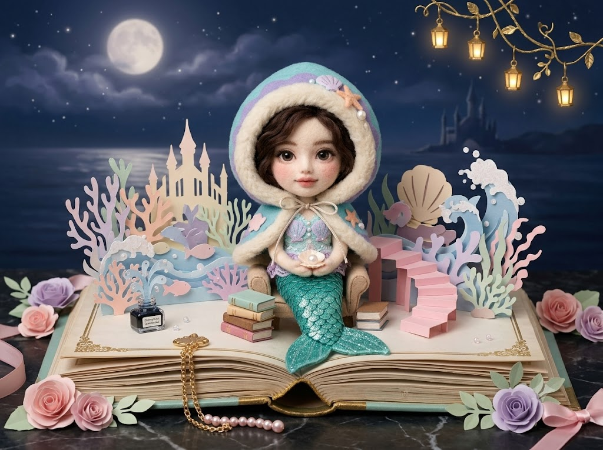
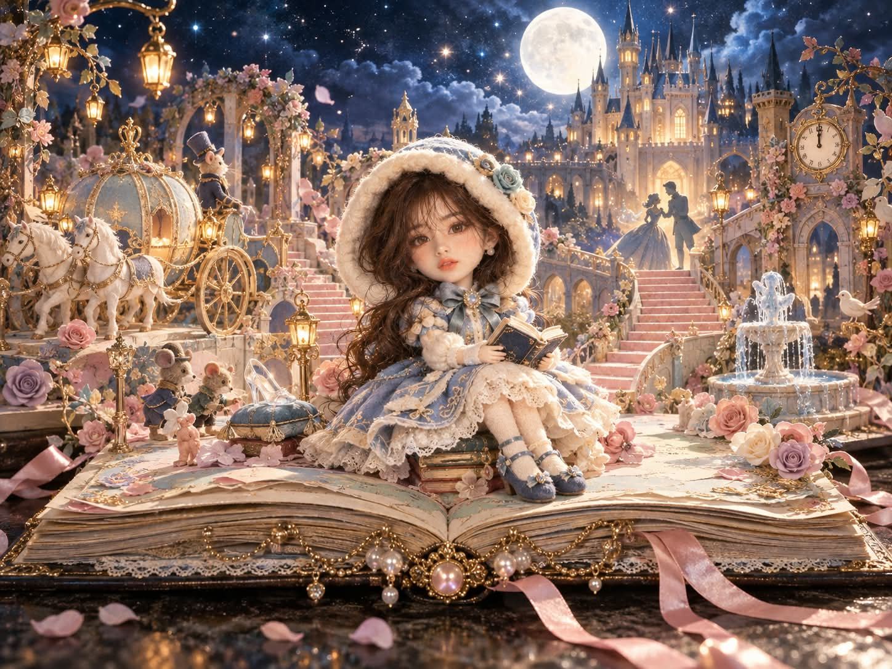

# 관상 매칭 동화 팝업북 니들펠트 아트돌 미니어처 디오라마 프롬프트

## 1. 개요 및 아트 디렉팅 가이드

- **컨셉**: 얼굴 사진의 관상을 분석해 가장 어울리는 동화 한 편을 AI가 직접 고르고, 펼쳐진 앤틱 책 위로 솟아오른 팝업 동화 세계 한가운데에 그 동화 주인공 차림의 니들펠트 아트돌을 앉힌 미니어처 디오라마 사진 (가로 4:3)
- **동화 선택 순서**:
  1. 후드·의상·배경 묘사는 무시하고 오직 얼굴 관상만 분석
  2. 눈매·코·입·전체 인상에서 느껴지는 성격과 분위기 정리
  3. 후보 여러 편 중 그 얼굴에 특히 잘 맞는 한 편 선정 (후드가 있다는 이유로 빨간망토를 고르지 않음)
  4. 동화를 정한 뒤에 의상과 후드를 그 동화에 맞춰 디자인하고, 고른 동화를 이미지 아래에 한 줄로 안내
- **사진 사용 규칙**:
  - 눈·코·입의 생김새만 가져와 인형 얼굴에 충실하게 옮기고, 아는 사람이 바로 알아볼 만큼 닮게 만드는 것이 최우선 목표
  - 얼굴형·피부·헤어·표정·각도·시선은 가져오지 않으며, 안경은 같은 테 모양의 작은 안경으로 유지
  - 성별에 따라 소년 인형 또는 소녀 인형으로 표현
- **카메라 & 구도 (최우선)**:
  - 펼쳐진 책 전체가 잘리지 않고 들어오는 와이드 풀샷, 책보다 약간 위에서 살짝 내려다보는 각도
  - 하단 45%는 책과 장식, 중간 35%는 팝업 동화 세계, 상단 20%는 보름달 밤하늘
  - 인형은 책 페이지 중앙 앞쪽에 전신이 보이게 앉히고(화면 높이의 약 40%), 클로즈업은 금지
- **주인공 (니들펠트 아트돌)**:
  - 2.5등신 비율, 아이보리색 무광 도자기 같은 얼굴에 유리구슬 눈과 장밋빛 블러셔, 잔잔한 옅은 미소
  - 고른 동화 주인공의 대표 의상을 펠트·양모·니트·레이스·자수로 재현
  - 크림색 양모 퍼 트림의 둥글고 큼직한 펠트 후드를 항상 씌우고, 색은 동화 주인공의 대표 색 계열로 맞춤
- **책과 무대**:
  - 금장 테두리와 연민트색 페이지, 레이스와 금색 걸쇠가 달린 거대한 앤틱 하드커버 책, 책을 쌓아 만든 의자
  - 동화의 명장면·상징 건물·핵심 소품·조연 캐릭터가 종이 공예 팝업으로 솟아오르고, 분홍 종이 계단과 잉크병 분수, 종이 장미와 새틴 리본으로 장식
- **배경 & 색감**:
  - 보름달과 별가루의 어두운 밤하늘, 금색 넝쿨에 매달린 작은 랜턴의 따뜻한 빛
  - 파스텔 핑크·라벤더·민트·크림·앤틱 골드와 어두운 남색의 대비

---

## 2. 프롬프트 전문

```text
[역할]
업로드한 얼굴 사진의 관상을 먼저 분석한 뒤, 그 인상에 가장 어울리는 동화 한 편을 직접 골라서 아래 장면을 그려줘. 유명한 동화든 덜 알려진 동화든 상관없이, 동화 선택은 전적으로 너의 판단에 맡긴다. 어떤 동화를 골랐는지 이미지 아래에 한 줄로 알려줘.

[동화 선택 순서 – 반드시 이 순서대로]

1. 이 프롬프트의 후드, 망토, 의상, 배경 묘사는 전부 무시하고 오직 얼굴 관상만 본다.

2. 눈매, 코, 입, 전체 인상에서 느껴지는 성격과 분위기를 분석한다.

3. 그 분위기에 맞는 동화 후보를 마음속으로 여러 개 떠올리고, 그중 이 얼굴에만 특히 잘 맞는 한 편을 고른다.

4. 동화를 다 정한 뒤에야 아래 의상과 후드를 그 동화에 맞춰 디자인한다.

이 프롬프트에 나오는 후드는 인형 디자인의 고정 형태일 뿐이며 동화 선택의 힌트가 아니다. 후드나 망토가 있다는 이유로 빨간망토를 고르지 마라.

빨간망토는 관상이 다른 어떤 동화보다 압도적으로 잘 맞을 때만 고른다.

[사진 사용 규칙 – 엄격]

업로드 사진에서는 눈·코·입의 생김새만 가져온다: 눈의 크기와 모양, 쌍꺼풀 유무와 라인, 눈꼬리 각도, 눈 사이 간격, 콧대와 코끝 모양, 입술 두께와 입꼬리 모양.

이 눈·코·입 특징을 인형 얼굴에 최대한 충실하게 옮겨서, 사진 속 인물을 아는 사람이 보면 바로 "이 사람이다"라고 알아볼 수 있을 만큼 닮게 만든다. 이것이 이 이미지의 가장 중요한 목표다.

얼굴형, 피부, 헤어, 이마·헤어라인, 표정, 고개 기울기, 얼굴 방향, 시선은 사진에서 절대 가져오지 않는다.

표정·각도·포즈·구도는 오직 이 프롬프트의 서술대로 새로 그린다.

사진 속 인물이 안경을 썼다면 같은 테 모양과 색의 작은 안경으로 반드시 유지한다.

사진으로 성별을 판단해 남자면 소년 인형, 여자면 소녀 인형으로 그린다.

[카메라와 구도 – 최우선]

가로 4:3 와이드 풀샷. 카메라를 충분히 뒤로 빼서 펼쳐진 책 전체가 양쪽 페이지 끝, 책등, 책 아래 테이블 면까지 화면 안에 모두 들어오게 한다. 책의 어느 부분도 프레임 밖으로 잘리면 안 된다.

카메라 높이는 책보다 약간 위, 정면에서 살짝 내려다보는 각도.

화면 구성: 하단 45%는 펼쳐진 책과 책 앞 장식, 중간 35%는 책 위로 솟은 팝업 동화 세계, 상단 20%는 보름달 밤하늘. 책은 화면 가로폭의 약 90%를 차지하며 좌우 끝이 잘리지 않게.

주인공 인형은 책 페이지 중앙 앞쪽, 가장 눈에 띄는 자리에 앉는다. 인형 전체 키는 화면 높이의 약 40%로, 머리부터 신발까지 전신이 다 보이게.

인형 얼굴은 정면에 가깝게 카메라를 향하고, 얼굴에 부드러운 키라이트를 비춰 이목구비가 선명하게 보이게 한다. 초점은 인형 얼굴에 맞춘다.

인물 클로즈업, 바스트샷, 인형이 화면을 가득 채우는 구도는 절대 금지.

[주인공 캐릭터 – 니들펠트 아트돌]

양모 니들펠트와 천으로 만든 수제 아트돌. 머리가 크고 몸이 작은 2.5등신 비율.

얼굴은 매끈한 아이보리색 도자기 같은 무광 피부.

눈은 뜨고 있다. 사진 속 눈 모양과 눈꼬리, 쌍꺼풀 라인을 그대로 살린 유리구슬 같은 인형 눈, 섬세하게 그린 속눈썹. 눈동자는 카메라를 바라본다.

코와 입도 사진 속 형태를 살려 작지만 또렷하게 조형한다. 이목구비를 지나치게 단순화하거나 점으로 처리하지 않는다.

표정은 잔잔하고 포근한 옅은 미소.

볼에는 은은한 장밋빛 블러셔.

머리카락은 부드러운 양모 섬유 질감. 헤어 색은 고른 동화 주인공의 대표 헤어 색을 따르고, 후드 안쪽으로 앞머리와 옆머리가 살짝 보이는 짧은 길이.

[의상 – 동화 주인공 대표 의상]

고른 동화 주인공의 가장 상징적인 대표 의상을 입힌다. 누가 봐도 어떤 동화 주인공인지 바로 알아볼 수 있도록 대표 색상, 실루엣, 상징 디테일(리본·단추·앞치마·벨트·신발 등)을 정확히 재현한다.

소재는 펠트, 양모, 니트, 레이스, 작은 자수로 표현해 수제 인형 옷처럼 만든다. 옷 밑단은 레이스나 양모 퍼 트림으로 포근하게 마무리.

주인공이 가진 상징 소품이 있다면 손이나 옆에 함께 둔다. 없다면 무릎 위에 작은 책을 펼쳐 들고 있되 얼굴은 카메라를 향한다.

[후드 – 반드시 유지]

머리 전체를 감싸는 둥글고 큼직한 펠트 후드를 항상 씌운다. 얼굴을 동그랗게 감싸되 이목구비는 가리지 않는다.

후드 테두리는 두툼하고 복슬복슬한 크림색 양모 퍼 트림, 목 앞에서 가는 끈 리본으로 묶는다.

후드 색은 고른 동화 주인공 의상의 대표 색과 같은 계열로 맞춘다. 원작 주인공이 빨간 옷이 아니라면 후드도 빨간색으로 만들지 않는다.

원작 의상에 모자나 머리 장식이 있다면 그 요소를 후드 위에 펠트 장식으로 얹어 표현한다.

후드 위에 그 동화를 상징하는 작은 펠트 장식(꽃, 리본, 귀, 소품 미니어처 등)을 한두 개 단다.

[책과 무대]

화면 하단에 거대한 앤틱 하드커버 책이 활짝 펼쳐져 있다. 페이지가 여러 겹 물결치듯 두툼하게 쌓여 있고, 낡은 금장 테두리, 바랜 연민트색 페이지, 페이지 가장자리에 흰 레이스.

책 앞면 가운데에 금색 장식 걸쇠와 늘어진 체인, 분홍 진주 구슬 하나. 책은 어두운 대리석 테이블 위에 놓여 있다.

주인공 인형은 작은 책을 몇 권 쌓아 만든 의자 위에 앉아 있다. 몸은 정면에서 살짝 3/4 방향, 얼굴은 정면.

책 페이지에서 고른 동화의 세계가 팝업북처럼 종이로 솟아오른다: 그 동화를 바로 떠올릴 수 있는 가장 유명한 명장면, 상징 건물, 핵심 소품, 대표 조연 캐릭터들을 책 의자 주변에 둥글게 배치하고, 가로로 넓은 화면을 살려 책 좌우 페이지 전체에 고르게 펼친다. 팝업 요소가 인형 얼굴을 가리지 않게 한다. 모든 팝업 요소는 종이 공예·펠트·도자기 미니어처 질감.

페이지 사이로 곡선형 분홍 종이 계단과 다리가 이어지고, 작은 잉크병 분수에서 물줄기가 솟는다.

책 가장자리와 주변에 파스텔 핑크·라벤더·세이지그린 종이 장미와 꽃, 종이 잎사귀, 테이블까지 늘어진 분홍 새틴 리본.

[배경과 분위기]

어두운 밤하늘에 크고 은은한 보름달, 부드러운 구름, 반짝이는 작은 별가루.

뒤쪽 멀리 고른 동화와 어울리는 실루엣 건물이 희미하게.

금색 넝쿨 가지에 매달린 작은 랜턴들이 따뜻한 빛을 낸다.

색감: 파스텔 핑크, 더스티 로즈, 라벤더, 민트, 크림, 앤틱 골드 + 어두운 남색 밤하늘의 대비. 단, 주인공 의상과 후드는 동화 원작의 대표 색을 우선한다.

[화풍과 품질]

정교한 미니어처 디오라마 사진 스타일, 깊은 심도로 책 전체와 팝업 요소가 선명하게, 부드러운 확산광, 따뜻한 랜턴 하이라이트.

양모 섬유 한 올 한 올, 종이 결, 레이스 구멍까지 보이는 초고해상도 디테일.

동화책 삽화처럼 몽환적이고 포근한 분위기.

가로 4:3 비율.

[금지]

책이 잘리는 구도, 인형 클로즈업 금지.

인형 눈을 감기거나 이목구비를 점처럼 단순화하는 것 금지.

후드를 벗기거나 생략하는 것 금지.

후드 때문에 빨간망토를 고르는 것 금지.

실사 인간 얼굴, 사진 같은 피부 질감 금지.

사진의 표정·각도·헤어·얼굴형을 옮기는 것 금지.

글자·로고·워터마크 생성 금지.
```

---

## 3. 결과물 비교 갤러리

| 생성 모델 | 생성 결과 이미지 |
| :--- | :--- |
| **제미나이 (Gemini)** |  |
| **ChatGPT (DALL-E 3)** |  |
