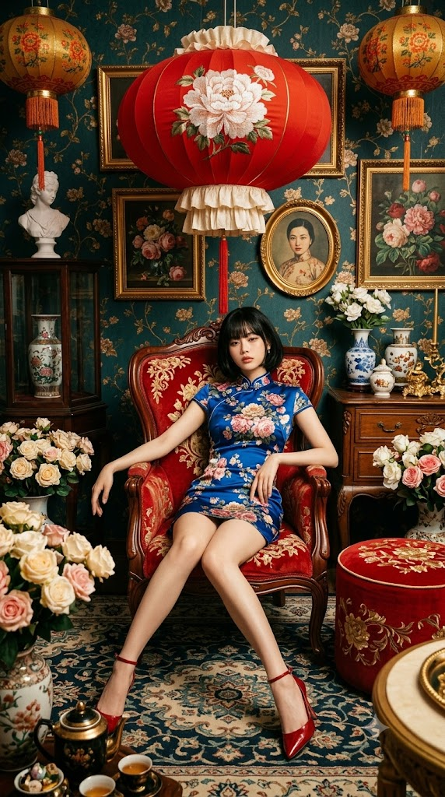
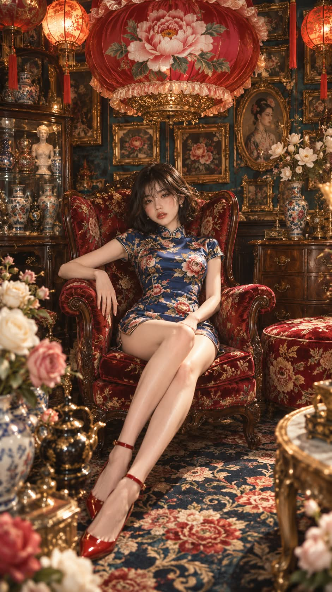

# 시누아즈리 빅토리안 맥시멀리즘 치파오 하이패션 화보 프롬프트

## 1. 개요 및 아트 디렉팅 가이드

- **컨셉**: 시누아즈리(Chinoiserie)와 빅토리안 맥시멀리즘 인테리어가 결합된 빽빽하고 화려한 하이패션 에디토리얼 시네마틱 화보
- **얼굴 사진 참조 규칙 (최우선 원칙)**:
  - 사진에서는 눈·코·입 생김새만 가져와 인물의 정체성만 유지
  - 얼굴형, 피부, 헤어, 표정, 머리 각도, 시선 등은 원본 사진을 철저히 배제하고 아래 디렉팅 지침만 반영
- **인물 외형 & 포즈**:
  - **헤어 & 메이크업**: 윤기 나는 흑단색 턱선 보브컷, 눈썹을 덮는 일자 앞머리, 맑은 도자기 피부, 차분한 로즈 레드 립
  - **표정 & 시선**: 무표정에 가까운 나른하고 도도한 눈빛, 살짝 기울인 고개로 카메라 정면 응시
  - **포즈**: 선홍색 벨벳 윙백 암체어에 등을 기대고 비스듬히 느슨하게 늘어져 앉은 자세, 앞으로 길게 뻗어 사선으로 교차된 다리
- **의상 & 슈즈**:
  - **의상**: 허벅지 중간까지 오는 로열 블루 실크 미니 치파오(스탠드 칼라, 캡 소매, 모란·장미·초록 잎 플로럴 프린트 / 롱·미디 기장 금지)
  - **슈즈**: 광택 있는 레드 포인티드토 펌프스 하이힐, 얇은 발목 스트랩
- **소품 & 맥시멀리즘 공간 구성**:
  - **머리 위 대형 등**: 인물 상체보다 큰 붉은 실크 주름 등(커다란 흰 모란 자수, 금빛 바로크 받침)
  - **인테리어 & 갤러리 월**: 짙은 틸 그린 덩굴 벽지, 벽면을 가득 채운 금박 액자(보태니컬 그림 & 동양 여성 초상화만 허용, 유럽 귀부인 초상화 금지), 도자기 화병, 석고상, 앤틱 원목 수납장
  - **바닥**: 네이비·청록 바탕에 크림·붉은 대형 모란 문양이 새겨진 화려한 카펫
- **색감 & 조명**:
  - 레드/오렌지 대 틸 그린/네이비의 강렬한 보색 대비, 곳곳의 앤틱 골드 포인트
  - 부드러운 실내광과 외곽 비네팅 그림자, 채도 깊은 빈티지 필름 그레인 질감

---

## 2. 프롬프트 전문

```text
[업로드 사진 사용 규칙 — 최우선]
업로드된 사진은 얼굴 참고용 1장뿐이다. 사진에서는 눈·코·입의 생김새만 가져와 같은 사람으로 확실히 알아볼 수 있게 한다.
얼굴형, 피부, 헤어, 이마·헤어라인, 표정은 사진에서 가져오지 않는다.
사진 속 머리 각도, 고개 기울기, 얼굴 방향, 시선은 절대 따르지 않는다.
표정·각도·헤어·의상·포즈·구도·배경은 아래 서술대로만 새로 그리며, 얼굴 외 요소는 하나도 바뀌면 안 된다.

[비율·구도]
세로 9:16. 인물 정면, 눈높이보다 약간 위에서 내려다보는 전신 와이드샷.
인물은 화면 중앙보다 조금 아래에 앉아 있고, 머리 바로 위에 거대한 붉은 등이 떠 있어 수직 중심축을 이룬다.
빈 공간 없이 소품이 빽빽한 맥시멀리즘 구성.

[인물]
마르고 팔다리가 가늘고 긴 20대 동양 여성.
헤어: 윤기 나는 흑단색 턱선 보브컷, 눈썹을 살짝 덮는 일자 앞머리, 끝은 안쪽으로 살짝 말림.
메이크업: 맑은 도자기 피부, 은은한 코랄 블러셔, 차분한 로즈 레드 립.
표정: 무표정에 가까운 나른하고 도도한 얼굴, 입술은 다물고 카메라를 정면 응시, 고개는 아주 살짝 기울임.

[의상]
로열 블루 실크 치파오, 기장은 반드시 허벅지 중간까지 오는 짧은 미니 기장(롱·미디 기장 금지).
스탠드 칼라, 짧은 캡 소매, 전체에 핑크·크림색 모란과 장미, 초록 잎 프린트.
광택 있는 레드 포인티드토 하이힐 펌프스, 가는 발목 스트랩.

[포즈]
암체어에 등을 기대고 비스듬히 느슨하게 늘어져 앉음.
한쪽 팔은 팔걸이 위에 걸쳐 손목이 힘없이 늘어지고, 다른 손은 허벅지 위에 가볍게 올림.
두 다리는 앞으로 길게 뻗어 발목에서 교차, 화면 왼쪽 아래로 향하는 사선.

[암체어]
곡선 조각 마호가니 원목 프레임의 빅토리안 윙백 암체어, 둥글게 말린 두툼한 팔걸이.
선홍색 벨벳 위에 금색·크림색 꽃무늬 자수가 전체에 덮여 있음.

[머리 위 대형 등]
인물 상체보다 지름이 큰 붉은 실크 주름 등.
정면에 커다란 흰 모란 자수 하나, 가장자리 크림색 프릴, 아래에 금빛 바로크 장식 받침(술 장식 없음).

[소품 배치]

좌상단·우상단: 붉은·주황 문양의 둥근 황동 중국식 등, 붉은 술 장식.

인물 오른쪽 바닥: 금색 꽃가지 자수가 들어간 둥근 레드 벨벳 오토만.

왼쪽 벽: 도자기 꽃병과 흰 석고 흉상이 든 어두운 원목 유리 진열장.

오른쪽 벽: 서랍 달린 앤틱 원목 수납장, 위에 도자기 꽃병·흰 꽃·금빛 장식품.

좌하단·우하단 전경: 크림·연핑크 장미가 넘치는 꽃병이 프레임 가장자리를 가림.

좌하단 최전경: 흑색·황동 광택 찻주전자와 작은 금속 소품.

우하단 최전경: 금색 테두리 원형 사이드 테이블 일부.

[벽·바닥]
짙은 틸 그린 벽지에 은은한 금빛 꽃 덩굴 문양.
벽 가득 금박 액자 갤러리 월: 붉은 장미·모란 보태니컬 그림, 청록 꽃 그림 위주.
타원형 금빛 로코코 액자 하나에만 동양 여성 초상화. 유럽 귀부인 초상화 금지.
바닥: 네이비·청록 바탕에 크림·붉은 대형 모란과 소용돌이 덩굴 문양 카펫.

[색감·조명]
레드 오렌지 대 청록·네이비의 강한 보색 대비, 곳곳에 금색 포인트.
따뜻하고 부드러운 실내광이 얼굴과 다리를 은은하게 비추고, 벽과 가장자리는 짙은 그림자로 비네팅.
채도 깊은 빈티지 톤, 약간의 필름 그레인, 회화적인 시네마틱 질감.

[스타일]
시누아즈리 × 빅토리안 맥시멀리즘 하이패션 에디토리얼 사진.
초고해상도, 실크·벨벳·자수·조각 목재 질감까지 섬세하게, 얼굴에 선명한 초점.

[금지]
롱·미디 기장 치마, 빈 벽 공간, 유럽 초상화 액자, 텍스트, 로고, 워터마크, 추가 인물, 얼굴 사진의 각도·표정·헤어 반영.
```

---

## 3. 결과물 비교 갤러리

| 생성 모델 | 생성 결과 이미지 |
| :--- | :--- |
| **제미나이 (Gemini)** |  |
| **ChatGPT (DALL-E 3)** |  |
