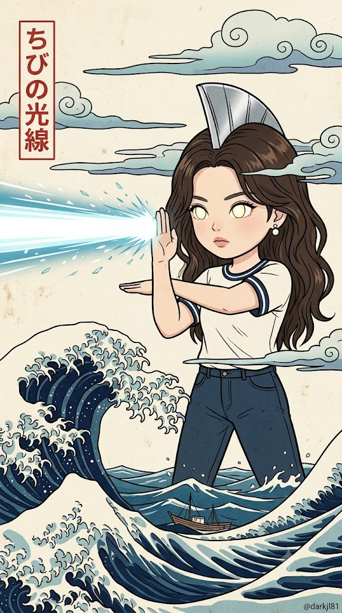
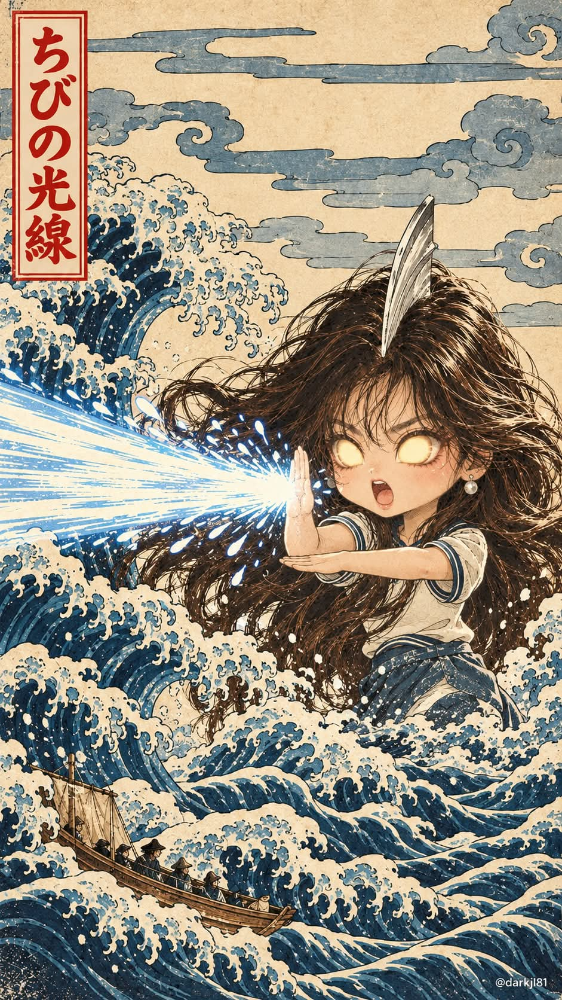

# 캣질라, 파도 위 반려동물 괴수 우키요에 목판화 프롬프트

## 1. 개요 및 아트 디렉팅 가이드

- **컨셉**: 거대한 파도 위의 귀여운 괴수 또는 미니미 히어로를 에도 시대 우키요에 목판화 스타일로 그리는 프롬프트 (세로 9:16). 사진의 주인공이 고양이·강아지인지 사람인지 판별해 맞는 버전을 적용
- **사진 사용 규칙**: 주인공의 생김새만 참고하고, 사진 속 각도·시선·포즈·표정·배경은 가져오지 않음. 여러 명·여러 마리면 각자의 규칙대로 나란히 배치
- **A. 고양이·강아지 (파도 괴수 버전)**:
  - 털 색·무늬·눈 색·귀 모양·품종·체형을 그대로 살린 거대한 괴수, 화면 세로의 2/3 크기
  - 화면 왼쪽을 향해 몸을 3/4 튼 측면 시점, 파도 꼭대기 위에 엉덩이를 깔고 앉아 통통한 배와 접힌 뒷다리가 보이는 자세
  - 한쪽 앞발은 파도를 툭 치려는 듯 내밀고 다른 앞발은 가슴 앞에 모은 포즈, 눈을 크게 뜨고 입을 벌린 깜짝 놀란 표정
  - 등을 따라 꼬리까지 이어지는 톱니 모양의 회백색 등지느러미 가시
  - 제목 박스: 고양이는 「猫のジラ」, 강아지는 「犬のジラ」
- **B. 사람 (미니미 광선 히어로 버전)**:
  - 인상을 살린 2~2.5등신의 귀여운 미니미 거대 히어로, 사진 속 옷차림을 단순화해 착용하고 안경은 유지
  - 정수리의 은색 금속 볏과 동공 없이 은은하게 빛나는 타원형 발광 눈
  - 하반신은 파도에 잠긴 채 두 팔을 '+' 자로 교차해 화면 왼쪽 끝까지 굵은 광선을 발사
  - 제목 박스: 「ちびの光線」
- **공통 구도 & 배경**:
  - 화면 왼쪽 아래에서 말려 올라오는 거대한 파도와 발톱처럼 갈라진 흰 물보라, 파도 사이의 작은 목조 어선
  - 바랜 크림색 한지 톤 바탕, 끝이 소용돌이처럼 말린 띠 모양 구름 2~3겹
  - 왼쪽 위에 붉은 가는 테두리의 세로 제목 박스와 붉은 일본어 세로쓰기
  - 하늘에 붉은 원형 태양이나 햇살 방사선 문양은 그리지 않음
- **공통 화풍**: 굵고 일정한 먹선 윤곽, 가는 평행선으로 표현한 털 결, 프러시안 블루·남색·청회색과 크림색의 제한된 팔레트, 평면 채색과 바랜 종이 질감. 사실적 3D·광택·그라데이션 금지
- **워터마크**: 우하단 구석에 작은 흰색 텍스트 `@darkjl81`

---

## 2. 프롬프트 전문

```text
첨부한 사진을 분석해 주인공을 먼저 판별하고, 아래 규칙대로 새 그림을 처음부터 그려줘.
사진은 주인공의 생김새(털 색·무늬·품종 / 사람은 눈·코·입 인상, 헤어, 안경 유무, 옷차림) 참고용으로만 쓰고,
사진 속 각도·고개 기울기·시선·포즈·표정·배경은 절대 가져오지 마. 포즈와 표정은 아래 서술대로 새로 그려.
여러 명/여러 마리면 각자 자기 유형 규칙대로 나란히 배치해.

━━━━━━━━━━━━━━━━━━
[A. 고양이 또는 강아지일 때 – 파도 괴수 버전]

사진 속 동물의 털 색·무늬·눈 색·귀 모양·품종·체형을 그대로 살린 거대한 괴수

몸 방향: 정면이 아니라 화면 왼쪽을 향해 몸을 3/4 정도 튼 측면 시점, 얼굴도 왼쪽의 큰 파도를 바라봄

자세: 뒷다리를 접고 엉덩이를 깔고 앉은 자세 (서 있지 않음), 통통하고 둥근 배와 접힌 뒷다리·엉덩이가 전부 보이게

위치: 파도 속에 잠기지 않고 파도 꼭대기 위에 올라앉은 듯 전신이 드러남, 발밑만 파도에 살짝 걸침

앞발: 만세처럼 위로 크게 벌리지 말 것
· 왼쪽(화면 앞쪽) 앞발은 얼굴 높이로 앞으로 내밀어 파도를 툭 치려는 모양
· 오른쪽(화면 안쪽) 앞발은 팔꿈치를 굽혀 가슴 앞에 모음
· 두 앞발 모두 발가락을 둥글게 오므린 상태, 발톱은 끝만 살짝 보임 (발바닥을 활짝 펴서 보여주지 말 것)

표정: 눈을 동그랗게 크게 뜨고 깜짝 놀라며 입을 크게 벌린 '꺄악' 하는 표정, 송곳니와 혀가 보임

수염은 가늘고 길게 사방으로 뻗음

등을 따라 톱니처럼 솟은 회백색 등지느러미 가시가 꼬리까지 이어지고, 뒤쪽 구름 앞으로 겹쳐 보임

배와 가슴은 밝은 크림색 털

몸 크기: 화면 세로의 2/3 정도

왼쪽 위 붉은 세로 박스 제목: 고양이면 「猫のジラ」, 강아지면 「犬のジラ」

━━━━━━━━━━━━━━━━━━
[B. 사람일 때 – 미니미 광선 히어로 버전]

사진 속 인물의 인상을 살린 2~2.5등신 귀여운 미니미 거대 히어로 (얼굴은 귀엽게 살짝 미화, 안경이 있으면 유지)

사진 속 옷차림을 미니미 비율로 단순화해서 입힘 (색과 주요 디자인은 유지, 디테일은 판화 선으로 간결하게)

머리 정수리 중앙에 앞에서 뒤로 길게 뻗은 매끈한 은색 금속 볏(지느러미 모양 크레스트), 헤어 위로 솟아 있음

두 눈은 동공 없이 크고 갸름한 타원형, 안쪽에서 연노랑·흰빛으로 은은하게 빛나는 발광 눈

하반신은 파도 속에 잠긴 채 서 있음

화면 왼쪽을 향해 몸을 살짝 틀고, 오른팔을 세로로 세우고 왼팔을 가로로 대어 '+' 자로 교차

세로로 세운 팔의 바깥쪽 날에서 하얗고 푸른 빛의 굵은 광선이 화면 왼쪽 끝까지 직선으로 발사됨

광선은 우키요에 판화 선으로 그린 빛줄기 + 주변에 작은 빛 파편, 광선이 지나가는 자리의 구름은 살짝 갈라짐

표정은 진지하게 기합을 넣으면서도 귀여운 느낌

왼쪽 위 붉은 세로 박스 제목: 「ちびの光線」

━━━━━━━━━━━━━━━━━━
[공통 구도와 배경]

세로형 9:16, 주인공은 화면 중앙~우측에 크게 배치

화면 왼쪽 아래에서 거대한 파도가 말려 올라오고, 파도 끝은 발톱처럼 갈라진 흰 물보라

화면 아래쪽에 겹겹이 이어지는 파도, 파도 사이에 작은 목조 어선 한 척

배경은 바랜 크림색 한지 톤

하늘: 우키요에 목판화식 양식화된 구름
· 가로로 길게 늘어진 띠 모양 구름(안개띠)이 2~3겹, 주인공 머리 뒤와 화면 위쪽을 가로지름
· 구름 끝은 둥글게 말린 소용돌이 모양, 윤곽은 가는 먹선
· 색은 연한 청회색·옅은 남색 그라데이션 없이 평면 채색, 구름 사이로 크림색 바탕이 비침

하늘에 붉은 원형 태양·붉은 원·햇살 방사선 문양은 절대 그리지 말 것

왼쪽 위 제목 박스는 붉은 가는 테두리 세로 직사각형, 글자는 붉은 일본어 세로쓰기, 구름에 가려지지 않게

[공통 화풍]

에도 시대 우키요에 목판화 스타일, 굵고 일정한 먹선 윤곽

털은 가는 평행 선으로 결을 표현, 줄무늬는 진한 먹선

색은 프러시안 블루·남색·청회색 파도와 구름, 크림색 바탕, 흰 물보라로 제한된 팔레트 (붉은색은 제목 박스에만 사용, 사람 옷 색은 이 팔레트 톤에 맞춰 살짝 바래게)

평면적인 채색, 약간 바랜 종이 질감과 미세한 인쇄 얼룩

사실적 3D·광택·그라데이션 금지

[마무리]

우하단 구석에 작은 흰색 텍스트로 @darkjl81
```

---

## 3. 결과물 비교 갤러리

| 생성 모델 | 생성 결과 이미지 |
| :--- | :--- |
| **제미나이 (Gemini)** |  |
| **ChatGPT (DALL-E 3)** |  |
