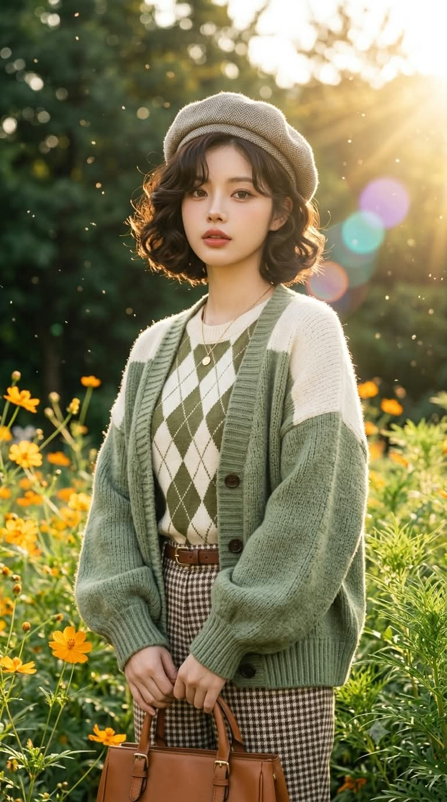
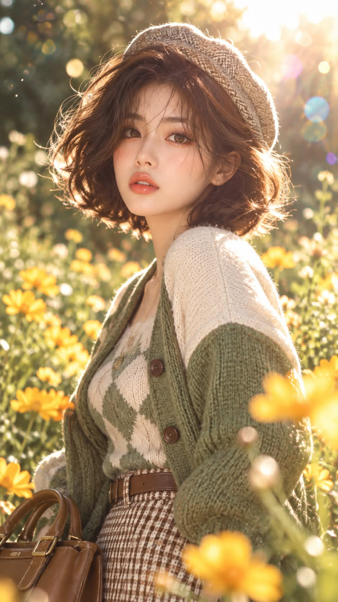

# 코스모스 꽃밭에서, 황금빛 역광 빈티지 레트로 실사 화보 프롬프트

## 1. 개요 및 아트 디렉팅 가이드

- **컨셉**: 황금빛 역광이 쏟아지는 늦여름 아침의 노란 코스모스 정원에서, 1940년대풍 컬 단발과 빈티지 레트로 니트 코디로 어깨 너머 뒤돌아보는 실사 인물 화보 (세로 9:16). GPT용과 Gemini용 두 버전으로 작성
- **버전별 차이**:
  - **GPT 버전**: 인상과 고유한 특징은 유지하되 패션 화보 모델처럼 확실하게 미화하는 항목형 프롬프트. 신발(브라운 스웨이드 펌프스)과 금지 항목까지 명시
  - **Gemini 버전**: 얼굴형과 이목구비의 비율·간격을 그대로 유지하고 리터칭 수준으로만 보정하는 서술형 프롬프트
- **사진에서 가져올 것**:
  - 머리색은 원래 머리색 그대로 사용하고, 길이와 스타일은 프롬프트대로 새로 연출
  - 안경이나 점 같은 특징은 유지하고, 헤어스타일·복장·자세·각도·시선·표정은 가져오지 않음
- **헤어**: 턱선 길이의 빈티지 단발 보브, 옆가르마와 풍성한 뿌리 볼륨, 머리 전체에 층층이 들어간 1940년대 레트로 스타일의 굵은 컬, 앞머리 없이 이마 옆으로 흘러내린 옆머리
- **의상 (빈티지 레트로 코디)**:
  - 비스듬히 얹은 베이지·그레이 헤링본 트위드 베레모
  - 어깨와 윗팔이 크림 화이트로 컬러 블록 처리된 세이지·올리브 그린 청키 니트 오버사이즈 카디건, 풍성한 벌룬 소매와 진한 브라운 단추
  - 크림 화이트 바탕에 올리브 그린 아가일 패턴의 라운드넥 니트, 얇은 골드 체인 목걸이
  - 브라운·화이트 깅엄 체크 트위드 하이웨이스트 와이드 크롭 팬츠와 브라운 가죽 벨트, 카라멜 브라운 가죽 토트백
- **포즈**: 가슴부터 허리 위까지의 상반신 구도, 몸통은 화면 오른쪽을 향하고 고개만 돌려 어깨 너머로 카메라를 똑바로 보는 자세, 웃지 않는 차분하고 신비로운 무표정
- **배경**:
  - 화면 오른쪽 위에서 쏟아지는 강한 황금빛 역광과 하얗게 번진 하늘
  - 주황빛 꽃술의 노란 코스모스와 깃털처럼 가는 초록 잎, 흐릿한 짙은 초록 나무 그늘
  - 공기 중에 떠 있는 물방울과 빛 입자의 보케, 대각선으로 이어지는 보라·청록·주황색 렌즈 플레어
- **포커스 & 조명**: 얼굴과 눈에 정확히 맞춘 초점, 85mm f/1.8 느낌의 얕은 심도, 컬과 베레모·어깨 윤곽의 황금빛 림라이트, 인물과 배경의 빛 방향과 색온도를 맞춰 합성 티가 나지 않게 처리

---

## 2. 프롬프트 전문

### GPT 버전

```text
업로드한 사진 속 인물을 주인공으로 한 세로 9:16 실사 인물 사진을 만들어줘.

[인물 – 사진에서 가져올 것]

- 머리색만 사진 속 인물의 원래 머리색을 그대로 사용 (헤어 길이·스타일은 사진을 따르지 말고 아래 [헤어]대로)
- 얼굴은 사진 속 인물의 인상과 고유한 특징(눈매 모양, 코 모양, 입 모양, 전체 분위기)은 유지해서 같은 사람으로 알아볼 수 있게 하되, 패션 화보 모델처럼 확실하게 미화할 것
· 피부: 모공·잡티·주름·다크서클 없이 도자기처럼 맑고 촉촉한 피부, 볼에 은은한 혈색, 빛을 받아 은은하게 빛나는 광채
· 눈: 크고 또렷하게, 맑은 눈동자에 반짝이는 캐치라이트, 길고 풍성한 속눈썹, 쌍꺼풀 라인은 원래 눈매 느낌을 살려 깔끔하게
· 눈썹: 결이 살아 있는 자연스럽고 정돈된 눈썹
· 코: 콧대는 곧고 매끈하게, 코끝은 작고 정돈되게
· 입술: 도톰하고 생기 있는 입술, 코랄·로즈 계열의 촉촉한 립
· 얼굴형: 턱선은 갸름하고 매끈하게, 작은 얼굴, 균형 잡힌 이목구비 비율
· 메이크업: 따뜻한 햇살에 어울리는 투명한 골드·피치 톤 화보 메이크업
- 미화는 강하게 하되 원래 인상이 사라지거나 전혀 다른 사람이 되는 것은 금지, 인형·만화처럼 부자연스러운 얼굴 금지
- 안경, 점 등 사진 속 특징이 있으면 유지
- 사진 속 헤어스타일, 복장, 자세, 고개 각도, 시선, 표정은 가져오지 말고 아래 헤어·의상·포즈대로 새로 연출

[헤어 – 색은 본인 머리색, 스타일은 아래대로]

- 턱선 길이의 짧은 빈티지 단발 보브
- 옆가르마, 뿌리부터 볼륨이 풍성하게 살아 있음
- 1940년대 레트로 스타일의 탱글탱글한 굵은 컬과 웨이브가 머리 전체에 층층이 들어가 있음
- 양옆 머리끝은 바깥과 안쪽으로 자연스럽게 말려 둥글고 풍성한 실루엣
- 앞머리는 없고, 옆머리 일부가 이마 옆으로 부드럽게 흘러내림
- 머리카락에 윤기가 돌고, 역광에 컬 끝이 반짝이게

[체형]

- 날씬한 체형을 기본으로, 가슴과 골반 라인에 살짝 볼륨감을 주어 여성스러운 곡선이 은은하게 드러나게
- 허리는 잘록하게, 과하게 글래머러스하거나 노출되는 느낌은 금지, 오버핏 니트 위로 자연스럽게 실루엣이 느껴지는 정도

[의상 – 빈티지 레트로 코디]

- 모자: 베이지·그레이 헤링본 트위드 베레모를 머리 위에 살짝 비스듬히 얹어 씀 (컬 단발이 베레모 아래로 풍성하게 보이게)
- 카디건: 세이지·올리브 그린 컬러의 두툼한 청키 니트 오버사이즈 카디건, 어깨와 윗팔 부분은 크림 화이트로 컬러 블록 처리, 드롭숄더에 풍성한 벌룬 소매, 소매 끝과 밑단·앞여밈은 골지 니트, 진한 브라운 단추
- 이너: 크림 화이트 바탕에 올리브 그린 아가일(다이아몬드) 패턴이 들어간 라운드넥 니트
- 목걸이: 얇은 골드 체인에 작은 동그란 펜던트가 달린 목걸이
- 하의: 브라운과 화이트 깅엄 체크의 트위드 소재 하이웨이스트 와이드 크롭 팬츠
- 벨트: 브라운 가죽 벨트에 작은 버클
- 가방: 카라멜 브라운 가죽의 각진 토트백, 짧은 손잡이 두 개와 버클 장식
- 신발: 브라운 스웨이드 뾰족코 펌프스 힐
- 전체 컬러: 세이지 그린, 크림, 브라운의 따뜻한 빈티지 톤

[포즈]

- 가슴~허리 위까지 보이는 상반신 프레이밍, 얼굴은 화면 위쪽 1/3 지점 중앙
- 몸통은 화면 오른쪽을 향해 비스듬히 돌아서 있고, 화면 오른쪽 어깨가 앞으로 나와 있음
- 고개만 카메라 쪽으로 돌려 어깨 너머로 뒤돌아보는 자세, 얼굴은 정면에 가까운 3/4 각도
- 턱은 살짝 당기고 고개는 아주 조금 기울임
- 시선은 카메라 렌즈를 정면으로 똑바로 응시
- 표정은 웃지 않는 차분하고 신비로운 무표정, 입술은 살짝 벌어진 듯 자연스럽게
- 팔은 몸 옆으로 자연스럽게 내리고, 토트백은 아래로 내린 손에 들어 화면 아래쪽에 살짝 걸치게
- 단발 컬이 턱선과 목 주변에서 풍성하게 흔들리듯 자연스럽게

[배경 – 사진 속 배경은 쓰지 말고 아래 장면으로 교체]

- 늦여름 아침, 햇살 가득한 들꽃 정원
- 화면 오른쪽 위에서 강한 황금빛 역광 햇살이 쏟아지고, 하늘 부분은 하얗게 번져 빛이 넘치는 느낌
- 주황빛 꽃술을 가진 노란 코스모스(데이지형) 꽃들이 화면 아래쪽과 왼쪽에 흩어져 피어 있음
- 깃털처럼 가늘고 촘촘한 초록 잎이 오른쪽 아래를 풍성하게 채움
- 뒤쪽은 짙은 초록 나무 그늘이 부드럽게 흐려져 있음
- 공기 중에 반짝이는 물방울과 빛 입자가 화면 전체에 떠 있고, 동그란 보케로 맺힘
- 보라색, 청록색, 주황색의 동그란 렌즈 플레어가 햇빛 방향에서 대각선으로 이어짐
- 전체 색감: 따뜻한 골드·노랑·연두, 밝고 몽환적이며 살짝 뿌연 필름 톤

[포커스 – 인물 중심]

- 초점은 인물의 얼굴과 눈에 정확히 맞추고, 인물과 의상의 니트 질감, 헤어 컬은 선명하게
- 배경의 꽃·잎·빛 입자는 얕은 심도로 부드럽게 흐려진 보케 처리 (85mm, f/1.8 느낌)
- 인물 앞쪽에도 흐릿한 꽃잎과 빛 입자가 살짝 걸쳐 깊이감을 줄 것
- 역광 때문에 컬 단발, 베레모, 니트 어깨 윤곽에 황금빛 림라이트가 생기고, 얼굴은 부드러운 반사광으로 밝게
- 배경 빛이 인물 가장자리에 자연스럽게 번져서 합성티가 나지 않게, 인물과 배경의 조명 방향·색온도를 일치시킬 것

[금지]

- 원본 사진의 배경, 실내 요소, 헤어스타일, 복장, 자세 사용 금지
- 머리색을 원래 머리색과 다르게 바꾸는 것 금지
- 인물을 다른 사람으로 바꾸는 것 금지
- 텍스트, 워터마크, 로고 금지
```

### Gemini 버전

```text
첨부한 사진 속 인물을 그대로 사용해서 새로운 세로 9:16 실사 화보 사진을 만들어줘. 가장 중요한 것은 얼굴이야. 사진 속 인물의 얼굴 생김새, 눈·코·입의 모양과 크기, 얼굴형, 이목구비의 비율과 간격을 그대로 유지해서 본인이 보면 바로 자기 얼굴이라고 알아볼 수 있어야 해. 얼굴을 새로 그리거나 다른 모델 얼굴로 바꾸지 마. 안경이나 점이 있으면 그대로 둬.

얼굴의 구조는 바꾸지 말고, 화보 촬영 후 리터칭한 것처럼만 예쁘게 보정해 줘. 모공과 잡티, 다크서클을 정리해서 맑고 촉촉하게 빛나는 피부로 만들고, 볼에는 은은한 혈색을 줘. 눈동자는 맑게, 캐치라이트가 반짝이게, 속눈썹은 길고 풍성하게. 눈썹은 결이 살아 있게 정돈하고, 입술은 코랄·로즈 톤의 촉촉한 립으로. 전체 메이크업은 따뜻한 골드·피치 톤의 투명한 화보 메이크업이야.

머리색은 사진 속 원래 머리색 그대로 두고, 헤어스타일만 바꿔 줘. 턱선 길이의 짧은 빈티지 단발 보브에 옆가르마, 뿌리부터 볼륨이 풍성하고, 1940년대 레트로 스타일의 탱글탱글한 굵은 컬과 웨이브가 머리 전체에 층층이 들어가 둥글고 풍성한 실루엣이야. 앞머리는 없고, 옆머리 일부가 이마 옆으로 부드럽게 흘러내려. 머리 위에는 베이지·그레이 헤링본 트위드 베레모를 살짝 비스듬히 얹었고, 컬 단발이 베레모 아래로 풍성하게 보여.

체형은 날씬하고 허리가 잘록하며, 가슴과 골반 라인에 살짝 볼륨이 있어 오버핏 니트 위로 여성스러운 곡선이 은은하게 느껴지는 정도야. 노출은 없어.

의상은 사진 속 옷 대신 빈티지 레트로 코디로 바꿔 줘. 세이지·올리브 그린의 두툼한 청키 니트 오버사이즈 카디건인데, 어깨와 윗팔 부분은 크림 화이트로 컬러 블록 처리되어 있고, 드롭숄더에 풍성한 벌룬 소매, 소매 끝과 밑단·앞여밈은 골지 니트, 진한 브라운 단추가 달려 있어. 안에는 크림 화이트 바탕에 올리브 그린 아가일 다이아몬드 패턴의 라운드넥 니트를 입고, 얇은 골드 체인에 작은 동그란 펜던트 목걸이를 했어. 하의는 브라운·화이트 깅엄 체크 트위드 하이웨이스트 와이드 크롭 팬츠에 작은 버클의 브라운 가죽 벨트, 손에는 짧은 손잡이 두 개와 버클 장식이 있는 카라멜 브라운 가죽 토트백을 들고 있어.

포즈는 가슴부터 허리 위까지 보이는 상반신 구도로, 얼굴이 화면 위쪽 1/3 지점 중앙에 크고 선명하게 들어와야 해. 몸통은 화면 오른쪽을 향해 비스듬히 돌아서 있고 오른쪽 어깨가 앞으로 나와 있으며, 고개만 카메라 쪽으로 돌려 어깨 너머로 뒤돌아보는 자세야. 얼굴은 정면에 가까운 3/4 각도, 턱은 살짝 당기고 고개는 아주 조금 기울였어. 시선은 카메라를 똑바로 바라보고, 표정은 웃지 않는 차분하고 신비로운 무표정에 입술은 살짝 벌어진 듯 자연스러워. 팔은 몸 옆으로 내리고 토트백은 아래 손에 들려 화면 아래쪽에 살짝 걸쳐 있어.

배경은 사진 속 배경을 쓰지 말고 늦여름 아침의 햇살 가득한 들꽃 정원으로 바꿔 줘. 화면 오른쪽 위에서 강한 황금빛 역광 햇살이 쏟아져 하늘 부분은 하얗게 번져 있어. 주황빛 꽃술을 가진 노란 코스모스 꽃들이 화면 아래와 왼쪽에 흩어져 피어 있고, 깃털처럼 가늘고 촘촘한 초록 잎이 오른쪽 아래를 풍성하게 채우고 있어. 뒤쪽은 짙은 초록 나무 그늘이 흐릿하고, 공기 중에는 반짝이는 물방울과 빛 입자가 떠다니며 동그란 보케로 맺혀 있어. 햇빛 방향에서 보라·청록·주황색의 동그란 렌즈 플레어가 대각선으로 이어져. 전체 색감은 따뜻한 골드·노랑·연두의 밝고 몽환적인, 살짝 뿌연 필름 톤이야.

초점은 인물의 얼굴과 눈에 정확히 맞추고, 니트 질감과 헤어 컬까지 선명하게 보여 줘. 배경의 꽃과 잎, 빛 입자는 85mm f/1.8 렌즈로 찍은 것처럼 얕은 심도로 부드럽게 흐려지고, 인물 앞에도 흐릿한 꽃잎과 빛 입자가 살짝 걸쳐 깊이감이 있어. 역광으로 컬 단발, 베레모, 니트 어깨 윤곽에 황금빛 림라이트가 생기고, 얼굴은 부드러운 반사광으로 밝아. 인물과 배경의 빛 방향과 색온도가 맞아서 합성한 티가 전혀 나지 않아야 해.

텍스트, 워터마크, 로고는 넣지 마.
```

---

## 3. 결과물 비교 갤러리

| 생성 모델 | 생성 결과 이미지 |
| :--- | :--- |
| **제미나이 (Gemini)** |  |
| **ChatGPT (DALL-E 3)** |  |
