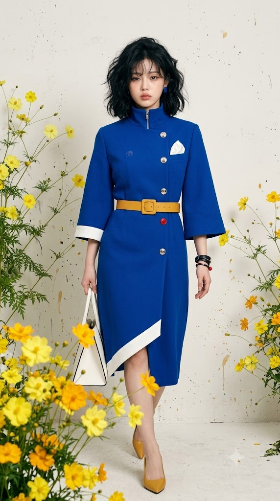
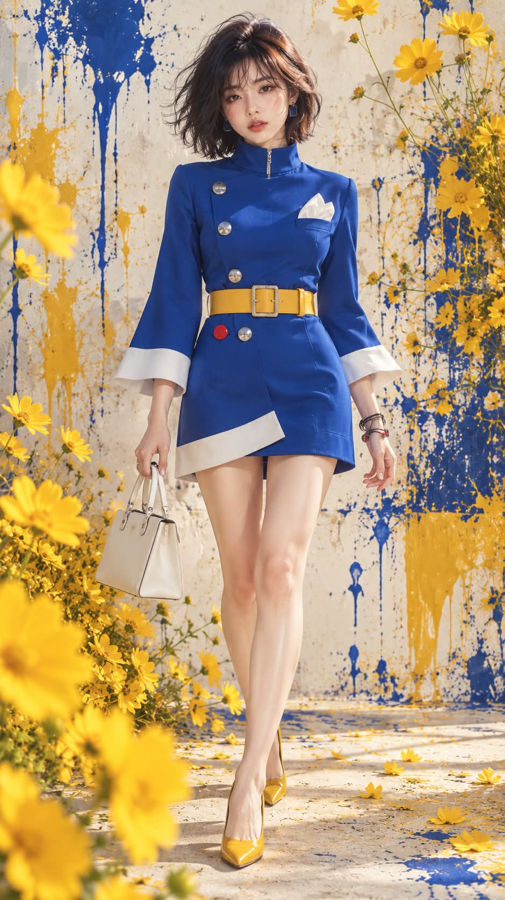

# 60년대 모드 스타일 황화코스모스 런웨이 실사 패션 화보 프롬프트

## 1. 개요 및 아트 디렉팅 가이드

- **컨셉**: 60년대 모드(Mod) 스타일의 코발트 블루 코트 원피스를 입고 생화 황화코스모스가 가득한 스튜디오 세트에서 걸어 나오는 보그 스타일 패션 에디토리얼
- **촬영 스펙**: 세로 9:16 비율, Canon EOS R5 + 85mm f/4 렌즈 RAW 원본 실사 (모공, 솜털, 원단 섬유 질감이 보이는 100% 포토리얼, CG/일러스트/3D 렌더 절대 배제)
- **얼굴 인상 보존 (최우선 절대 원칙)**:
  - 모든 스타일링 지시보다 원본 얼굴 인상 보존이 1순위
  - 눈 크기/모양/각도/간격, 코 높이/형태, 입술 두께/모양, 피부톤, 점, 좌우 비대칭 등 원본 그대로 100% 복제
  - 임의의 미화, 동안화, 턱 깎기, 눈 키우기 절대 금지 ("본인이 화보를 찍은 사진"이어야 함)
- **신체 비율 & 표정**:
  - 얼굴 크기를 바꾸지 않고 목·몸통·다리를 늘린 자연스러운 8등신 모델 비율
  - 입을 다물고 아랫입술을 살짝 내민 채 미세하게 뾰로통하고 새침한 표정 (턱을 살짝 당기고 고개 2~3도 기울임)
- **헤어 & 메이크업**:
  - 귀 아래~턱선 길이의 볼륨 웨이브 흑발 쇼트 보브컷 (바깥 뻗침, 흩어진 앞머리)
  - 로즈/코랄 핑크 블러셔, 촉촉한 그라데이션 코랄 레드 립, 내추럴 피치 아이섀도
- **의상 디렉팅 (코발트 블루 모드 드레스)**:
  - 퍼넬 넥 하이 칼라(앞면 은색 지퍼) + 나팔형 벨 슬리브(8cm 화이트 접힌 커프스)
  - 비대칭 5개 단추 (은색 4개 + 벨트 아래 빨간색 단추 1개)
  - 가슴 포켓 스퀘어(흰 실크 손수건) + 머스타드 옐로우 가죽 벨트
  - 앞면이 완전히 닫힌 랩 스커트 (화면 왼쪽 자락 밑단에만 화이트 밴드 사선 배치)
- **세트 & 소품 & 조명**:
  - 블루/옐로우 페인트가 튄 오프화이트 석고 벽면
  - 실제 생화 황화코스모스 (전경 왼쪽 대형 꽃송이 아웃포커스 보케, 벽면 및 어깨 주변 배치)
  - 화이트 토트백(왼손), 머스타드 옐로우 포인티드 토 에나멜 펌프스
  - 대형 소프트박스 하이키 스튜디오 조명

---

## 2. 프롬프트 전문

```text
[실사 패션 화보 프롬프트 v8]

★ 최우선: 이것은 일러스트나 그림이 아니라 실제 사람 모델을 스튜디오에서 촬영한 원본 사진입니다.
Canon EOS R5, 85mm f/4 렌즈로 촬영한 RAW 사진. 실제 피부 모공, 솜털, 잔머리, 미세한 피부 요철, 원단 섬유 질감이 보이는 사실적인 사진. 애니메이션, 반실사, 3D 렌더, 디지털 페인팅, 에어브러시 보정 느낌이 전혀 없어야 합니다.

※ 이 프롬프트에서 좌우는 모두 "화면에 보이는 기준"입니다. 화면 왼쪽 = 사진을 볼 때 왼쪽.

━━━━━━━━━━━━━━━━━━
★ 얼굴 인상 보존 (모든 지시보다 우선)
━━━━━━━━━━━━━━━━━━
[우선순위 규칙]

이 프롬프트의 모든 지시 중 업로드한 얼굴의 인상 유지가 1순위입니다

헤어, 메이크업, 표정, 체형 지시가 얼굴 인상과 충돌하면 무조건 업로드한 얼굴을 따릅니다

헤어, 메이크업, 표정, 체형은 업로드한 얼굴 위에 덧입히는 것이지, 새 모델의 얼굴을 설계하라는 뜻이 아닙니다

결과물은 "이 사람이 이 옷을 입고 화보를 찍은 사진"이어야 하며, "비슷한 분위기의 다른 모델"이 되면 실패입니다

턱선과 얼굴 윤곽은 체형에 맞게 자연스럽게 조정해도 되지만, 눈·코·입과 전체 인상은 업로드한 얼굴 그대로

[업로드한 얼굴에서 그대로 복제할 것]

눈: 크기, 모양, 눈꼬리 각도, 눈꺼풀 라인, 눈동자 크기와 색, 두 눈 사이 간격, 눈매가 주는 분위기

코: 콧대 높이, 코 길이, 콧볼 너비, 코끝 모양

입: 입 크기, 입술 두께, 윗입술과 아랫입술 비율, 입꼬리 모양

피부톤과 얼굴 고유의 특징(점 등)

이목구비 사이 간격과 배치, 미세한 좌우 비대칭

사진 속 인물이 가진 전체적인 인상과 분위기

가족이나 지인이 보고 바로 본인이라고 알아볼 수 있어야 함

[절대 하지 말 것]

눈을 키우거나, 눈매를 더 또렷하고 강하게 바꾸지 않음

콧대를 높이거나 코끝 모양을 바꾸지 않음

입술 모양과 크기를 바꾸지 않음

얼굴을 더 예쁘게, 더 모델처럼 보정하지 않음

메이크업과 표정은 색과 미세한 근육 움직임만 더할 뿐, 눈·코·입의 형태를 바꾸지 않음

사진의 헤어, 의상, 배경, 조명, 포즈, 체형은 가져오지 않음. 가져오는 것은 얼굴뿐

━━━━━━━━━━━━━━━━━━
신체 비율: 8등신
━━━━━━━━━━━━━━━━━━

전체 키가 머리 길이의 8배인 8등신 패션모델 비율

비율은 얼굴 이목구비를 바꾸지 않고, 목·몸통·다리를 길게 해서 맞춤

가늘고 긴 목, 반듯한 어깨

허리선이 높고 다리가 길어 하체가 상체보다 확연히 긴 비율

길고 곧은 다리, 가는 발목, 슬림한 팔

실제 사람의 자연스러운 8등신. 과장된 만화 비율 아님

━━━━━━━━━━━━━━━━━━
표정
━━━━━━━━━━━━━━━━━━

업로드한 얼굴의 인상을 해치지 않는 범위에서, 아주 미세하게 뾰로통하고 새침한 느낌만 더함

입은 다물고 아랫입술이 아주 살짝 앞으로 나온 정도

눈은 편하게 뜨고 카메라를 정면으로 바라봄

턱을 아주 살짝 당기고, 고개를 화면 오른쪽으로 2~3도 미세하게 기울임

━━━━━━━━━━━━━━━━━━
메이크업 (실제 뷰티 화보 메이크업)
━━━━━━━━━━━━━━━━━━

업로드한 얼굴의 피부톤 그대로, 모공과 피부결이 보이는 세미 글로우 베이스

양 볼 중앙부터 광대까지 번진 로즈 핑크~코랄 핑크 블러셔. 실제 파우더 블러셔 질감

코끝과 콧등에 핑크 블러셔를 살짝 얹음

립: 선명한 코랄 레드~토마토 레드. 원래 입술 라인 그대로, 중앙이 진한 그라데이션, 촉촉한 광택

눈: 원래 눈 모양 그대로, 풍성한 속눈썹, 점막을 채운 자연스러운 아이라인, 옅은 피치 브라운 섀도

눈썹: 원래 눈썹 모양 그대로 자연스러운 흑갈색으로 결 정리

━━━━━━━━━━━━━━━━━━
헤어
━━━━━━━━━━━━━━━━━━

칠흑 같은 새까만 흑발, 실제 모발의 윤기와 잔머리

귀 아래~턱선 길이의 짧은 보브

정수리와 옆머리에 볼륨이 들어간 부스스한 웨이브. 머리끝이 바깥과 위로 뻗침

볼륨은 화면 왼쪽으로 더 쏠림

눈썹을 살짝 덮는 가볍게 흩어진 앞머리

앞머리와 옆머리가 눈·코·입을 가리거나 인상을 바꾸지 않게 자연스럽게 떨어짐

━━━━━━━━━━━━━━━━━━
의상 (실제 옷)
━━━━━━━━━━━━━━━━━━
[전체 실루엣]

60년대 모드 스타일의 코발트 블루 / 울트라마린 블루 코트 원피스

부드러운 크레이프 울 소재. 실제 원단의 섬유 질감, 봉제선, 자연스러운 주름

어깨 패드 없는 둥근 드롭 숄더, 몸에 딱 붙지 않는 부드러운 핏

[칼라]

목을 높게 감싸는 깔때기 모양 퍼넬 넥 하이 칼라

칼라 앞 중앙에 얇은 은색 지퍼가 세로로 짧게 보임

[소매]

팔꿈치 아래부터 나팔처럼 넓게 퍼지는 벨 슬리브

소매 끝은 손목 위에서 끝나 손목이 보임

소매 끝에 폭 약 8cm의 흰색 커프스가 밖으로 접혀 있음

[단추 - 비대칭 배치]

지름 약 2cm의 둥근 은색 메탈 단추, 화면 왼쪽으로 쏠린 배치:
· 가슴 위쪽 화면 왼쪽에 은색 단추 1개
· 그 아래 가슴 중간 화면 왼쪽에 은색 단추 1개
· 가슴 중앙, 포켓 스퀘어 아래에 은색 단추 1개
· 벨트 아래 화면 왼쪽에 빨간색 단추 1개, 그 바로 오른쪽에 은색 단추 1개

총 5개, 빨간 단추는 하나뿐

[포켓 스퀘어]

화면 오른쪽 가슴에 부드럽게 부풀어 접힌 흰색 실크 손수건

[벨트]

폭 약 6cm의 머스타드 옐로우 가죽 벨트, 사각형 금속 버클, 높은 허리선

벨트 끝은 버클 옆으로 짧게만 남음. 길게 늘어지지 않음

[치마 부분 - 매우 중요]

벨트 아래 앞면은 완전히 닫혀 있음. 가운데가 벌어지거나 트여 있지 않음

화면 왼쪽 자락이 화면 오른쪽 자락 위로 넓게 겹쳐 덮여 있음

치마 아래나 자락 사이로 속옷, 안감, 검은 천이 전혀 보이지 않음

허벅지를 따라 슬림하게 떨어지는 라인, 기장은 허벅지 윗부분

흰색 천 밴드(폭 약 8~10cm)는 화면 왼쪽 자락의 밑단에만 있음. 바깥쪽으로 갈수록 살짝 내려가는 사선

화면 오른쪽 자락의 밑단은 흰색 없이 코발트 블루 원단 그대로 끝남

━━━━━━━━━━━━━━━━━━
액세서리 / 소품
━━━━━━━━━━━━━━━━━━

양쪽 귀에 작은 코발트 블루 사각형 스터드 귀걸이

가방: 화면 왼쪽에 있는 손으로 든 화이트~라이트 그레이 가죽 사다리꼴 토트백, 짧은 손잡이 두 개, 몸 옆에 늘어뜨림

화면 오른쪽 손은 빈손으로 몸 옆에 힘을 빼고 늘어뜨림. 이 손목에 얇은 블랙 가죽 끈 팔찌 여러 줄, 그중 하나에 작은 빨간 구슬

머스타드 옐로우 앞코가 뾰족한 로우힐 에나멜 펌프스

━━━━━━━━━━━━━━━━━━
포즈 / 구도
━━━━━━━━━━━━━━━━━━

세로 9:16, 머리부터 발끝까지 전신샷, 인물은 중앙

인물이 화면 세로 높이의 약 85%를 차지

정면으로 걸어오는 캣워크. 한 발은 앞, 뒷발은 발끝으로 막 떨어지는 순간

허리 높이보다 살짝 낮은 앵글로 다리가 길어 보이게 촬영

━━━━━━━━━━━━━━━━━━
배경 / 조명 (실제 촬영 세트)
━━━━━━━━━━━━━━━━━━

실제 스튜디오에 세운 오프화이트 석고 벽 세트. 벽면에 실제 코발트 블루와 머스타드 옐로우 페인트가 튀기고 흘러내린 자국, 굳은 페인트의 두께감과 벽 질감

배경 꽃은 종이꽃이나 조화가 아닌 실제 생화 코스모스(황화코스모스)
· 꽃잎 8장이 둥글게 펼쳐진 코스모스 모양, 꽃잎 끝이 톱니처럼 살짝 갈라짐
· 선명한 레몬 옐로우~골든 옐로우, 중앙은 진한 주황빛 노란 꽃술
· 가늘고 긴 초록 줄기와 실처럼 가느다란 깃털 모양 잎
· 얇고 반투명한 꽃잎 결, 조명에 비치는 꽃잎 맥, 자연스러운 휘어짐

코스모스 배치:
· 화면 왼쪽 아래, 카메라 가까이에 코스모스 꽃송이 여러 개가 큰 덩어리로 모여 크게 채움. 가장 앞쪽 꽃은 얼굴보다 큼
· 화면 오른쪽 허리와 팔 옆에 긴 줄기의 코스모스 무리가 벽을 타고 솟아오름
· 화면 오른쪽 어깨 위쪽에 코스모스 몇 송이가 줄기 끝에서 흔들림
· 카메라에 가장 가까운 꽃은 살짝 아웃포커스로 흐려져 깊이감을 줌

바닥에 떨어진 노란 코스모스 꽃잎 몇 장과 페인트 얼룩

대형 소프트박스를 쓴 밝은 하이키 스튜디오 조명. 얼굴은 정면에서 고르게 밝게 비춰 이목구비가 선명하게 보임

인물 발밑과 벽에 실제 그림자가 약하게 생김

보그 매거진 화보 톤, 미세한 필름 그레인

━━━━━━━━━━━━━━━━━━
제외할 것
━━━━━━━━━━━━━━━━━━
업로드한 얼굴과 다른 인상, 다른 사람 얼굴, 커진 눈, 바뀐 눈매, 높아진 콧대, 바뀐 코 모양, 바뀐 입술 모양, 얼굴 성형 보정, 전형적인 AI 모델 얼굴, 일러스트, 애니메이션, 반실사, 웹툰, 3D 렌더, 디지털 페인팅, 그림 같은 배경, 붓터치 화풍, 인형 같은 얼굴, 에어브러시 피부, 짧은 다리, 낮은 허리선, 과장된 만화 비율, 갈색 머리, 앞이 벌어진 치마, 가운데 트임, 치마 아래로 보이는 속옷·안감·검은 천, 화면 오른쪽 자락의 흰 밑단, 양쪽 모두 흰 밑단, 화면 오른쪽 손에 든 가방, 길게 늘어진 벨트, 각진 어깨 패드, 테일러드 정장 재킷, 양귀비, 종이꽃, 조화, 그려진 꽃, 분홍·흰색 코스모스, 손가락·다리 변형, 텍스트, 로고, 워터마크
```

---

## 3. 결과물 비교 갤러리

| 생성 모델 | 생성 결과 이미지 |
| :--- | :--- |
| **제미나이 (Gemini)** |  |
| **ChatGPT (DALL-E 3)** |  |
