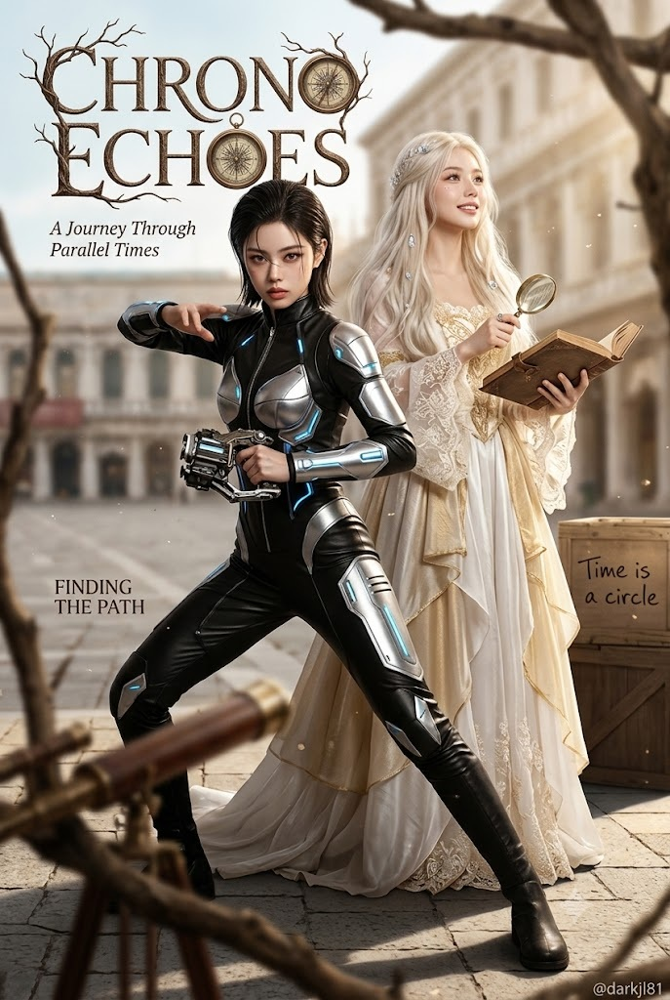
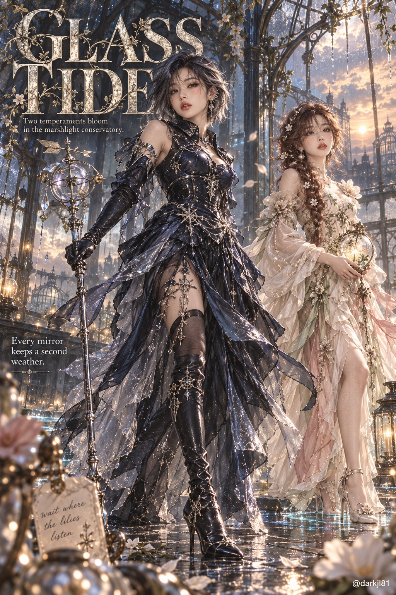

# 도플갱어 듀얼 페르소나 판타지 패션 매거진 표지 프롬프트

## 1. 개요 및 아트 디렉팅 가이드

- **컨셉**: 한 사람의 얼굴 골격을 기반으로 극명하게 대비되는 두 가지 상반된 페르소나를 연출한 '도플갱어 매거진 커버' 스타일의 하이패션 판타지 에디토리얼
- **얼굴 참조 & 착용물 예외 규칙 (핵심)**:
  - 사진에서는 오직 눈·코·입 생김새만 가져와 두 모델 모두 동일 인물임을 명확히 인지할 수 있게 유지
  - **얼굴 착용물 예외 규칙**: 안경, 선글라스, 피어싱 등 원본 사진 속 얼굴 착용물은 형태·색상·소재를 그대로 보존하여 두 페르소나 모두에게 자연스럽게 착용 (사진에 없을 시 추가 금지)
  - 헤어, 메이크업, 표정, 포즈, 의상은 두 인물이 완벽히 대조되도록 독립적으로 디자인
- **구도 & 공간 배치**:
  - 세로 2:3 비율, 인물이 길고 우아하게 돋보이는 약한 로우 앵글
  - **전경 (1st 페르소나)**: 발끝까지 온전히 담긴 역동적인 전신 캣워크 포즈
  - **중경 (2nd 페르소나)**: 한 걸음 뒤에서 첫 번째 인물을 받쳐주며 시선 방향을 달리한 우아한 포즈
  - **최전경**: 테마 오브제를 얕은 심도로 흐릿하게 배치해 극적인 공간감 형성
- **스타일링, 화풍 & 조명**:
  - 하이패션 쿠튀르 의상, 정반대의 컬러 팔레트와 실루엣 대비
  - 세미리얼 판타지 일러스트와 하이엔드 실사 화보 사이의 도자기 피부 및 머릿결 디테일
  - 드라마틱한 자연광, 공기 중 빛 입자(Dust particles), 부드러운 빈티지 필름 그레인
- **매거진 타이포그래피**:
  - 좌상단: 세계관에 맞춘 영문 2단어 대형 잡지 로고 타이틀 (테마 장식 서체 결합)
  - 타이틀 하단 부제, 감성 영문 카피 문구, 배경 사물에 얹힌 손글씨
- **하단 워터마크**: 우측 하단 작은 흰색 텍스트 `@darkjl81`

---

## 2. 프롬프트 전문

```text
[즉시 생성] 질문, 콘셉트 설명, 계획 설명 없이 바로 이미지 1장을 생성한다. 테마와 페르소나는 내부적으로 즉석에서 정하고 텍스트로 출력하지 않는다.

업로드한 사진은 얼굴 정체성 추출 전용이다. 사진의 머리·얼굴 각도, 고개 기울기, 방향, 시선, 표정, 헤어, 얼굴형, 피부, 이마/헤어라인, 의상, 배경, 조명은 절대 가져오지 않는다. 사진에서는 눈·코·입의 생김새만 가져온다. 표정과 각도는 아래 서술대로 새로 그린다.

■ 얼굴 착용물 예외
단, 업로드 사진 속 인물이 얼굴에 착용한 안경, 선글라스, 피어싱 같은 착용물은 예외로 그대로 가져온다. 테의 모양, 두께, 색, 재질, 렌즈 색과 크기, 피어싱의 위치와 모양을 원본과 동일하게 유지하고, 두 페르소나 모두 똑같이 착용시킨다. 의상이나 세계관에 맞춰 디자인을 바꾸지 않는다. 새 각도에 맞게 자연스럽게 얼굴에 얹히도록 그린다.
사진에 착용물이 없으면 새로 추가하지 않는다.

■ 핵심 콘셉트: "도플갱어 매거진 표지"
한 장의 세로형(2:3) 판타지 패션 잡지 표지에 두 명의 모델이 등장한다. 두 모델은 모두 업로드 사진 속 '같은 사람'이다. 서로 정반대 성격의 두 페르소나를 연기한다. 눈·코·입의 생김새는 두 명 모두 원본과 동일하게 유지하고, 두 사람끼리도 같은 사람으로 알아볼 수 있어야 한다. 헤어 색·길이·스타일, 메이크업, 표정, 포즈, 의상은 서로 완전히 다르게 해서 복제 사진처럼 보이지 않게 한다.

■ 콘셉트 결정
세계관 테마 하나와 그 안에서 극명하게 대비되는 두 페르소나를 AI가 즉석에서 창작한다. 흔하거나 뻔한 조합은 피한다. 장소, 계절, 시간대, 날씨, 문화권, 시대감을 자유롭게 조합한다. 두 페르소나는 성격, 분위기, 색감, 실루엣이 서로 반대가 되게 한다.

■ 구도
- 한 명은 전경에서 전신으로 보인다. 역동적인 포즈를 취하고, 발끝까지 잘리지 않게 한다.
- 다른 한 명은 한 걸음 뒤 중경에서 첫 번째 인물을 받쳐 주는 포즈를 취한다. 두 사람의 시선 방향은 서로 다르게 한다.
- 약한 로우앵글로, 인물이 길고 우아하게 보이게 한다.
- 전경에는 테마에 맞는 소품을 흐릿하게 배치해 깊이감을 준다.

■ 스타일링
- 두 페르소나 모두 테마와 성격에 맞게 새로 디자인한 하이패션 쿠튀르 의상을 입는다. 원단, 장식, 레이어, 액세서리, 신발까지 디테일을 촘촘하게 넣는다.
- 두 사람의 색 팔레트는 같은 세계관 안에서 서로 대비되게 한다.
- 액세서리와 손에 든 소품은 각 페르소나의 성격을 드러내게 서로 다르게 한다. 단, 얼굴 착용물은 위 예외 규칙을 따른다.

■ 화풍·조명
- 세미리얼 판타지 일러스트와 실사 사이의 고급 화보 질감. 도자기 같은 피부, 섬세한 머리카락 결을 표현한다.
- 테마에 맞는 드라마틱한 자연광과 공기 중의 빛 입자를 쓴다. 배경은 얕은 심도로 흐리게 한다.
- 전체적으로 부드러운 필름 톤의 빈티지 색감을 쓴다.

■ 잡지 타이포그래피
- 좌상단에 세계관에 어울리는 영문 2단어 잡지 제목을 새로 지어 크게 넣는다. 테마에 맞는 장식 서체를 쓰고, 테마 소품 장식을 글자에 얽는다.
- 제목 아래에 세계관을 한 줄로 설명하는 작은 영문 부제를 넣는다.
- 여백에 짧은 영문 감성 카피 한 줄을 넣고, 배경 속 사물에 손글씨 문구를 하나 넣는다.
- 모든 글자는 철자가 정확해야 한다.

■ 워터마크
- 우하단에 작은 흰색 텍스트로 "@darkjl81"을 넣는다.

■ 금지
- 두 모델의 얼굴이 서로 다른 사람처럼 보이는 것
- 두 모델이 같은 헤어·같은 표정·같은 포즈로 복제된 것처럼 보이는 것
- 업로드 사진의 각도·표정·헤어·배경을 가져오는 것
- 사진 속 안경·피어싱 등 얼굴 착용물을 빼거나 디자인을 바꾸는 것, 사진에 없는 착용물을 추가하는 것
- 손가락 왜곡, 잘린 발, 깨진 글자
```

---

## 3. 결과물 비교 갤러리

| 생성 모델 | 생성 결과 이미지 |
| :--- | :--- |
| **제미나이 (Gemini)** |  |
| **ChatGPT (DALL-E 3)** |  |
