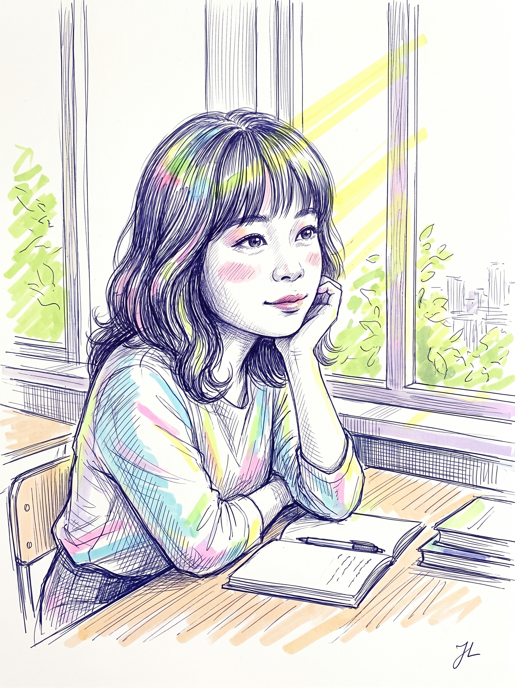
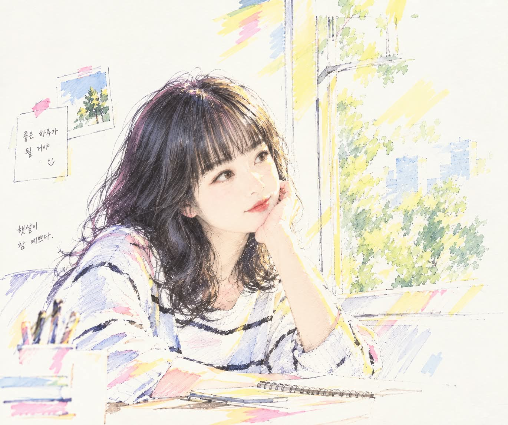

# 볼펜 드로잉 & 형광펜 청춘 드라마 스케치 프롬프트

## 1. 개요 및 아트 디렉팅 해설
- **콘셉트 테마**: 개인 스케치북에 섬세한 볼펜 해칭으로 인물을 그리고, 형광펜 마커로 햇살과 색감을 감각적으로 터치한 **노스탤직 청춘 드라마의 한 장면**
- **핵심 조형 원리 및 화풍**:
  - **볼펜 드로잉 (Main Medium)**:
    - 흑색 또는 짙은 네이비색 볼펜의 정밀하고 미세한 선, 섬세한 크로스해칭(Cross-hatching)과 평행선 해칭.
    - 완벽하게 깔끔한 디지털 선이 아닌, 자연스러운 펜의 긁힘, 겹친 스케치 선, 여백으로 서서히 사라지는 손그림 감성.
  - **형광펜 하이라이터 포인트 (Key Style)**:
    - 수채화가 아닌, 실제 문구용 형광펜(레몬 옐로우, 라임 그린, 페일 핑크, 라이트 시안 블루, 라벤더)의 반투명하고 넓은 마커 스트로크.
    - 선 밖으로 살짝 삐져나가거나 툭툭 얹어낸 듯한 무심하고 즉흥적인 핸드메이드 터치.
  - **자연광과 여백의 미 (Negative Space 40%+)**:
    - 창가로 쏟아져 들어오는 따스한 오후 햇살을 레몬 옐로우 형광펜과 **손대지 않은 순백색 종이 여백**의 조화로 표현.
    - 배경 전체를 칠하지 않고 책상, 창틀, 바깥 풍경이 하얀 종이 여백 속으로 자연스럽게 사라지도록(Fade-out) 미완성의 여운을 남김.
  - **인물 연출 및 구도**:
    - 창가 책상에서 한 손으로 턱을 괴고 밖을 응시하며 짓는 은은하고 몽환적인 미소 (캔디드 스냅샷 구도).
    - 얼굴 이목구비와 헤어스타일의 본래 아이덴티티를 정밀하게 보존.
  - **시그니처 서명**:
    - 우측 하단 여백에 볼펜으로 자연스럽게 휘갈겨 쓴 2~3% 크기의 작고 우아한 필기체 서명 **"JL"**.

---

## 2. 프롬프트 전문 (코드 블록)

```text
Transform the person in the uploaded photo into a delicate,
semi-realistic ballpoint-pen portrait with selective fluorescent
highlighter coloring, like a beautiful still from a nostalgic youth drama.

────────────────────────────
[SUBJECT — HIGHEST PRIORITY]
────────────────────────────

Preserve the recognizable identity of the person in the uploaded photo.

Keep their distinctive:
- face shape
- eye shape and spacing
- eyebrows
- nose
- lips
- jawline
- hairstyle and bangs
- overall facial impression

The finished portrait must still clearly look like the same person.

Do not replace the subject with a generic beautiful face.
Do not exaggerate or redesign the facial features.

Reinterpret the person as a refined hand-drawn portrait rather than
a photorealistic copy.

Keep realistic human proportions and a natural, portrait-like face.
The result should feel closer to portrait drawing than manga,
anime, or character illustration.

────────────────────────────
[SCENE — YOUTH DRAMA MOMENT]
────────────────────────────

The subject is sitting at a desk beside a large sunlit window.

One elbow rests naturally on the desk, with one hand gently supporting
the cheek.

The head is slightly turned toward the window.
The eyes are looking outside rather than toward the viewer.

The subject has a soft, natural smile — peaceful, warm, and slightly
dreamy, as if quietly enjoying the sunlight and the view outside.

The pose should feel completely candid rather than staged,
like a fleeting beautiful moment captured from a youth drama.

Bright afternoon sunlight pours through the window and softly surrounds
the face, hair, shoulders, and desk.

On the desk are only a few simple objects:
an open notebook, a ballpoint pen, and several casually stacked books.

Outside the window, loosely suggest sunlit green leaves and a distant,
indistinct cityscape.

Keep the environment simple and atmospheric.

────────────────────────────
[BALLPOINT-PEN DRAWING]
────────────────────────────

The main medium is ballpoint pen.

Draw the face, hair, body, clothing, desk, and environment primarily
with very fine black or dark navy ballpoint-pen lines.

Use:
- delicate cross-hatching
- fine parallel strokes
- overlapping strokes
- broken lines
- repeated sketch lines
- spontaneous hand-drawn marks

Hair should contain many fine individual pen strokes.

Clothing folds should be suggested with loose hatching rather than
smooth digital shading.

Facial features should be drawn especially delicately and precisely,
preserving the subject's likeness.

Do NOT make the linework perfectly clean.

Allow slightly shaky lines, repeated strokes, unfinished contours,
and areas where the drawing gradually disappears into the white paper.

It must genuinely resemble a portrait drawn by hand in a real sketchbook.

────────────────────────────
[FLUORESCENT HIGHLIGHTER — KEY STYLE]
────────────────────────────

NO watercolor.

After the ballpoint-pen drawing, add selective color using the appearance
of real fluorescent highlighter markers.

Use approximately:

60% selectively colored areas
40% untouched white paper / uncolored drawing

Do NOT color the entire illustration.

Use a restrained palette of:
- soft fluorescent lemon yellow
- lime green
- pale fluorescent pink
- light cyan blue
- subtle lavender

The highlighter coloring must NOT perfectly stay inside the outlines.

It should look manually applied with real markers.

Show:
- quick highlighter swipes
- broad translucent strokes
- visible marker direction
- uneven overlaps
- occasional strokes extending beyond the outlines
- isolated blocks of color
- areas receiving only one or two casual strokes

Some pen drawings should remain completely uncolored.

The final result should look as though an artist first completed
a beautiful ballpoint-pen portrait and then spontaneously added
fluorescent highlighter accents by hand.

Do NOT make the highlighter colors too dense or saturated.

────────────────────────────
[SUNLIGHT — MAJOR VISUAL ELEMENT]
────────────────────────────

Sunlight pouring through the window is one of the most important
elements of the composition.

Represent the sunlight partly with broad, translucent
lemon-yellow highlighter strokes.

Let these yellow strokes loosely cross:
- the window
- parts of the hair
- shoulders and clothing
- desk surface
- notebook
- surrounding empty paper

Do not completely fill the illuminated areas.

The untouched white paper itself should become the brightest sunlight.

The combination of yellow highlighter and untouched paper should create
the impression of warm afternoon light flooding into the room.

────────────────────────────
[COLOR PLACEMENT]
────────────────────────────

HAIR:
Keep most of the hair as dense dark ballpoint-pen hatching.
Add only occasional lavender, blue, or warm-yellow highlighter accents.

FACE:
Keep most of the skin as untouched white paper.

Do NOT completely color the skin.

Use only extremely subtle pale pink accents on:
- cheeks
- lips
- very small areas around the face

The face should remain primarily a delicate ballpoint-pen portrait
surrounded by white paper.

CLOTHING:
Use scattered cyan, pale pink, lavender, and yellow highlighter strokes.
Large portions of the clothing should remain uncolored.

WINDOW / OUTDOORS:
Suggest leaves using scattered lime-green and yellow marker strokes.

Do not paint individual leaves realistically.
Allow the foliage to dissolve into abstract marker gestures.

DESK / OBJECTS:
Use only occasional muted highlighter accents.
Do not fully render every object.

────────────────────────────
[NEGATIVE SPACE — EXTREMELY IMPORTANT]
────────────────────────────

Strongly emphasize the beauty of empty space.

Approximately 40% of the overall image should remain visibly white
or nearly untouched.

Large portions around the figure, window, furniture, and background
should remain pure white paper.

Do NOT feel obligated to complete every object.

Some parts of:
- the room
- desk
- books
- window frame
- outdoor scenery
- clothing edges

may simply disappear into white space.

Some contours may stop halfway.

Some background objects may consist of only three or four loose
ballpoint-pen lines.

Other areas may be represented by a single highlighter stroke.

The empty paper must feel intentional.

It represents:
sunlight,
air,
silence,
memory,
and atmosphere.

The composition should feel spacious, bright, delicate, and breathable.

Avoid filling every corner of the image.

────────────────────────────
[COMPOSITION]
────────────────────────────

Create a natural medium portrait showing the subject seated at the desk.

The face should remain the visual focal point,
while the bright window occupies a significant portion of the composition.

Leave generous open white areas around the subject.

Avoid a busy background.

The scene should feel like a single remembered moment rather than
a fully rendered room.

────────────────────────────
[MOOD]
────────────────────────────

Warm afternoon sunlight.

Youthful nostalgia.

A quiet first-love drama.

A peaceful school or college-age memory.

A gentle moment of looking out the window while smiling.

Fresh air, sunlight, quiet happiness, and a slight sense of nostalgia.

The finished artwork should feel like a sophisticated portrait
discovered inside someone's personal sketchbook:

carefully drawn in ballpoint pen,
loosely touched with fluorescent highlighters,
with large areas deliberately left unfinished.

────────────────────────────
[SIGNATURE — REQUIRED]
────────────────────────────

Add a small handwritten artist signature reading exactly:

"JL"

Place the signature in the bottom-right corner of the artwork.

The signature should look naturally handwritten using the same
dark navy or black ballpoint pen used for the portrait.

It should look as though the artist personally signed the sketch
after finishing it.

Keep the signature:
- small
- elegant
- subtle
- slightly imperfect
- clearly readable

The signature should occupy approximately 2–3% of the image width.

Leave a small natural margin between the signature and the
bottom-right edges.

The signature must contain exactly the two Latin letters:

JL

Do not add a date.
Do not add a full name.
Do not add other initials.
Do not add symbols.
Do not add additional text.

The "JL" signature is mandatory and must remain visible.

────────────────────────────
[AVOID]
────────────────────────────

NO watercolor.
NO watercolor washes.
NO oil painting.
NO fully colored image.
NO fully colored background.
NO fully colored skin.
NO anime face.
NO manga face.
NO cartoon proportions.
NO oversized anime eyes.
NO thick cartoon outlines.
NO digital airbrush coloring.
NO smooth digital painting.
NO plastic-looking skin.
NO photorealistic rendering.
NO overly polished digital illustration.
NO dense background.
NO filling every empty area.
NO text, captions, handwriting, or lettering anywhere
except for the required "JL" signature in the bottom-right corner.
```

---

## 3. 생성 예제

| Gemini | GPT |
| :---: | :---: |
|  |  |
