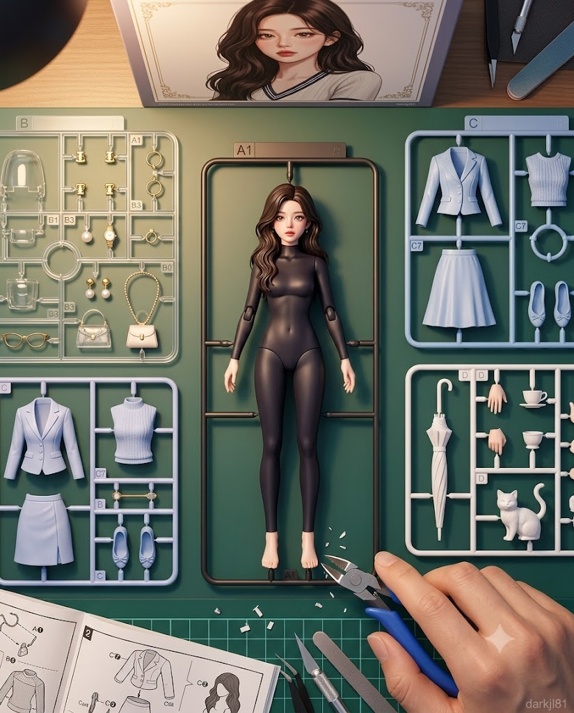
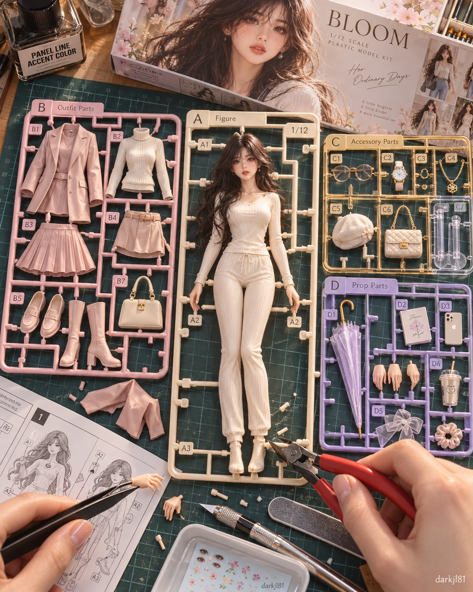

# 건프라 스타일 런너 미조립 피규어 키트 프롬프트

## 1. 개요 및 아트 디렉팅 가이드

- **컨셉**: 작업 책상 위에 조립 직전 건프라 스타일 런너들이 펼쳐져 있고, 니퍼로 피규어 게이트를 자르려는 찰나를 포착한 초고화질 매크로 제품 컨셉 아트워크
- **대상 판별 및 정체성 고증**:
  - 원본 사진 속 대상의 성별/종(사람 또는 동물) 및 고유 특징(얼굴형, 이목구비, 헤어/털 색, 눈동자, 체형 등)을 유지
  - **사람**: 8등신 비율의 1/12 스케일 어덜트 피규어 규격(가분수/SD/치비 절대 금지), 단정한 라운드넥 긴팔·긴바지 이너웨어 일체형 몰드, 로판급 미인/미남으로 정제된 외모
  - **동물**: 고유 품종 비율과 털 질감 몰드 유지, 기품 있는 고급 애완동물 화보 인상
- **런너 구성 (조립 전 4종 분할 넓게 배치)**:
  - **피규어 본체 런너 (중앙 최대)**: 게이트로 프레임에 고정된 일체형 성형 사출물(사출색: 화이트/스킨톤), 데칼 인쇄 이목구비, 파츠 번호 각인(A1 등)
  - **의상 런너 (파스텔 플라스틱)**: 대상의 무드에 맞춘 분리형 의상 파츠(재킷, 셔츠, 슬랙스/스커트 또는 동물용 하네스/망토 등)
  - **액세서리 런너 (클리어 & 메탈릭 파츠)**: 모자, 가방, 안경, 목걸이/방울 등
  - **소품 런너 (투명 파스텔)**: 손 파츠, 우산, 간식, 완구 등
- **손 연출 & 조립 현장감**:
  - 정밀 니퍼를 쥔 손이 게이트를 자르는 순간(튀어오르는 미세 플라스틱 조각, 백화 스트레스 자국), 핀셋을 쥔 다른 손
  - 정밀 커터, 사포 스틱, 수조, 초록색 격자 커팅 매트, 조립 설명서, 패키지 키트 박스 아트
- **카메라 & 조명**:
  - 4:5 비율 탑다운 플랫레이(Flat-lay) 구도, 50mm 렌즈 팬포커스 선명도
  - 따뜻한 스탠드 림라이트, 사출 플라스틱 특유의 은은한 광택과 반사
- **하단 워터마크**: 우측 하단 미세 워터마크 (`darkjl81`)

---

## 2. 프롬프트 전문

```text
업로드한 사진은 정체성 참고용으로만 사용해줘. 사진 속 대상이 사람(여성 또는 남성)인지 동물인지 먼저 판별하고, 그 대상의 성별 또는 종, 그리고 알아볼 수 있는 고유 특징을 프라모델 피규어에 살려서 표현해줘. 사람이면 성별, 얼굴형, 이목구비 배치, 피부톤, 헤어 색을, 동물이면 종과 품종, 털색과 무늬, 눈 색, 귀·코·꼬리 모양, 체형을 그대로 유지해줘. 성별과 종은 사진 그대로 유지하고 바꾸지 마. 사진 외의 배경, 의상, 포즈는 참고하지 말고 아래 설명대로만 새로 구성해줘.

[장면]
작업 책상 위에 프라모델(건프라 스타일 조립식 키트)의 런너들이 전부 펼쳐져 있는 조립 직전의 장면. 사진 속 대상은 팔다리(동물은 네 다리)까지 하나로 성형된 서 있는 피규어 형태로 런너 프레임에 게이트로 고정되어 있고, 의상과 액세서리는 각각 별도 런너에 파츠로 붙어 있음. 화면에 사람은 니퍼를 쥔 손과 손목까지만 보이며, 그 손이 피규어를 런너에서 떼어내기 위해 게이트를 자르려는 순간.

[외모 미화 - 대상별 분기]
- 공통: 본인 또는 그 아이라고 알아볼 수 있는 고유 특징은 유지하면서, 전체를 한 단계 정제해 균형 잡히고 아름답게 표현.
- 여성인 경우: 크고 또렷한 눈매에 별빛 같은 눈동자 하이라이트, 길고 풍성한 속눈썹, 곧고 섬세한 콧대, 촉촉한 로즈 톤 입술, 갸름한 V라인 턱선, 잡티 없는 맑은 피부. 고귀하고 청순하며 우아한 공작가 영애 같은 분위기의 로판급 미인.
- 남성인 경우: 또렷하고 서늘한 눈매에 짙은 속눈썹, 단정하고 곧은 눈썹, 매끈한 턱선과 목선, 잡티 없는 맑은 피부. 고결하고 기품 있는 공작가 귀공자·황태자 같은 로판급 미남. 남성적인 윤곽은 유지. 헤어스타일은 얼굴형과 인상을 분석해 가장 잘 어울리는 스타일을 AI가 추천해서 적용하고, 본래 헤어 색은 유지.
- 동물인 경우: 털색과 무늬, 눈 색, 귀와 꼬리 모양, 코와 입 주변 무늬를 정확히 재현하고, 눈은 맑고 깊은 눈동자에 별빛 하이라이트, 털은 윤기 나고 결이 살아 있게 다듬어 사랑스럽고 기품 있는 고급 애완동물 화보 같은 인상. 표정은 순하고 영리해 보이게.
- 사람은 얼굴 크기를 과장하지 말고 8등신 비율의 작은 얼굴로. 동물은 그 종의 실제 체형 비율을 유지하고 치비나 과장된 큰 머리로 만들지 말 것.
- 데칼과 도색으로 이 얼굴(또는 동물의 눈과 코, 털 무늬)을 정교하게 재현한 프라모델 피규어.

[피규어 런너 - 화면 중앙, 가장 크게]
- 사진 속 대상을 닮은 프라모델 피규어 한 개가 몸 전체가 하나로 이어진 서 있는 자세(동물은 네 발로 서 있거나 앉은 자세) 그대로 런너 프레임 안에 고정되어 있음. 조립할 필요 없는 완성 형태의 피규어를 사출 성형한 모습.
- 피규어의 발목(동물은 발과 꼬리, 등), 손목, 머리 뒤 등 여러 곳에서 가느다란 게이트가 런너 프레임과 연결되어 있고 게이트 자국이 선명함. 피규어 주변을 사각형 런너 프레임이 둘러싸고 파츠 번호 각인(A1 등)이 새겨져 있음.
- 소재는 화이트 또는 스킨톤(동물은 화이트 또는 크림 계열) 단색 플라스틱 사출물 느낌이며, 눈·눈썹·입술(동물은 눈·코·입 주변 무늬)이 데칼과 인쇄로 또렷하게 표현되어 알아볼 수 있음. 헤어와 털 색과 결이 재현된 일체형 성형.
- 사람은 이너웨어(목부터 손목, 발목까지 덮는 단정한 라운드넥 긴팔 이너와 긴바지)가 몰드로 표현되어 노출이 없고 건전한 인상. 팔은 자연스럽게 살짝 벌리고 서 있는 자세. 동물은 기본 상태로 털 질감이 몰드로 표현됨.
- 사람 비율: 머리가 전체 키의 1/8인 8등신 실제 인체 비율의 1/12 스케일 어덜트 피규어 규격, 다리가 전체 키의 절반 가까이 되는 긴 다리 비율, 성별에 맞는 균형 잡힌 체형(여성은 슬림하고 우아하게, 남성은 어깨가 넓고 슬림하게). 절대 금지: 가분수, 치비, SD, 넨도로이드, 아기 인형 같은 큰 머리, 짧은 팔다리.

[나머지 런너 - 전부 조립 전, 총 4장이 화면에 완전히 보이게]
1. 의상 런너 (파스텔 컬러 플라스틱): 사진 속 대상의 성별 또는 종, 인상, 분위기를 분석해 가장 잘 어울리는 단정한 코디를 AI가 직접 추천해 구성. 사람이면 재킷·코트, 니트나 셔츠, 슬랙스(여성은 스커트도 가능), 신발. 동물이면 체형에 맞는 하네스, 조끼, 망토, 리본, 작은 코트 등. 각각 분리된 파츠로 붙어 있고 옷 주름과 디테일이 몰드로 새겨져 있음.
2. 액세서리 런너 (투명 클리어 파츠와 메탈릭 골드·실버 파츠 혼합): 위 코디에 어울리는 액세서리를 AI가 추천해 구성. 사람이면 가방, 모자, 안경 또는 선글라스, 시계, 반지, 목걸이 또는 넥타이 등. 동물이면 방울 목걸이, 이름표, 작은 왕관이나 모자, 리본, 스카프 등.
3. 소품 런너 (투명 파스텔): 우산, 손에 들 소품, 교체용 손 파츠 등 작은 파츠. 동물이면 간식, 장난감 공, 작은 쿠션, 밥그릇 등 그 대상에게 어울리는 소품.
- 모든 런너의 프레임에 파츠 번호 각인(A1, B3, C7 등)과 게이트가 선명하게 보이고, 런너마다 색이 달라 종류가 구분됨.
- 피규어 런너를 포함한 모든 런너가 서로 겹치지 않고 전부 프레임 안에 완전히 보이도록 넓게 펼쳐 배치.
- 이미 뜯어낸 파츠 두세 개가 런너 옆 매트 위에 놓여 있고, 뜯긴 자리에는 게이트 흔적이 남아 있음.

[손 & 연출]
니퍼를 쥔 한 손(손톱이 정리된 자연스러운 손, 손목 위로는 프레임 밖)이 화면 한쪽에서 들어와 피규어의 발목 또는 손목(동물은 발이나 꼬리) 게이트를 자르려는 찰나. 니퍼 날이 게이트에 닿아 있고, 잘려 나가는 작은 플라스틱 조각이 살짝 튀어오름. 다른 손은 핀셋으로 작은 파츠를 집고 있음. 사람의 얼굴은 나오지 않음.

[소품 & 작업 환경]
- 니퍼(예리한 날, 손잡이는 빨간색 또는 파란색), 핀셋, 정밀 커터, 사포 스틱, 데칼 수조
- 녹색 격자 컷팅 매트, 펼쳐진 조립 설명서(조립 순서 도면 포함)
- 잘려나간 게이트 부스러기와 작은 플라스틱 조각이 매트 위에 흩어져 있음
- 화면 위쪽에 세워진 키트 박스에는 완성된 모습의 박스 아트(미형으로 다듬어진 피규어)가 프라모델 패키지 스타일로 인쇄되어 있음

[구도 & 카메라]
세로 4:5. 책상 위를 거의 수직으로 내려다보는 탑다운 플랫레이 구도. 피규어 런너를 중앙에 크게 두고, 나머지 런너 3장과 키트 박스, 니퍼를 쥔 손이 모두 프레임 안에 들어오도록 넓게 담음. 50mm 느낌, 조리개를 조여 런너 전체에 선명하게 초점, 피규어의 얼굴과 니퍼 끝은 특히 또렷하게.

[조명 & 색감]
작업 책상 스탠드 조명이 만드는 따뜻하고 부드러운 하이라이트. 피규어의 얼굴에는 부드러운 림라이트로 이목구비가 또렷하게. 플라스틱 특유의 은은한 광택과 반사, 표면의 미세한 사출 자국까지 사실적으로 표현. 전체적으로 밝고 깨끗한 톤에 파스텔 계열 포인트 컬러.

[화질 & 화풍]
초고화질 실사 사진 느낌의 매크로 제품 사진. 플라스틱 질감, 니퍼 금속의 반사, 게이트 절단면의 흰 스트레스 자국, 데칼의 미세한 광택까지 정교하게 표현. 유쾌한 크리에이티브 콘셉트 사진.

[하단 워터마크]
오른쪽 아래 구석에 작고 은은하게 "darkjl81" 텍스트 워터마크.
```

---

## 3. 결과물 비교 갤러리

| 생성 모델 | 생성 결과 이미지 |
| :--- | :--- |
| **제미나이 (Gemini)** |  |
| **ChatGPT (DALL-E 3)** |  |
