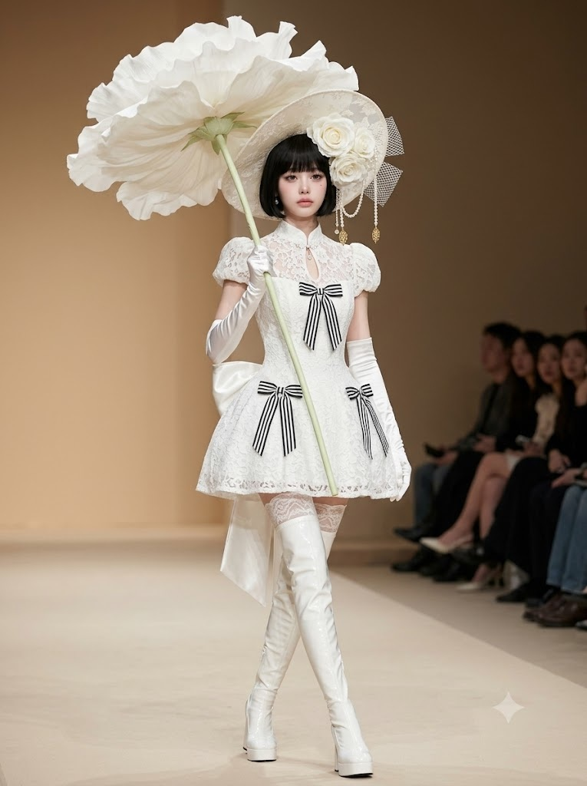
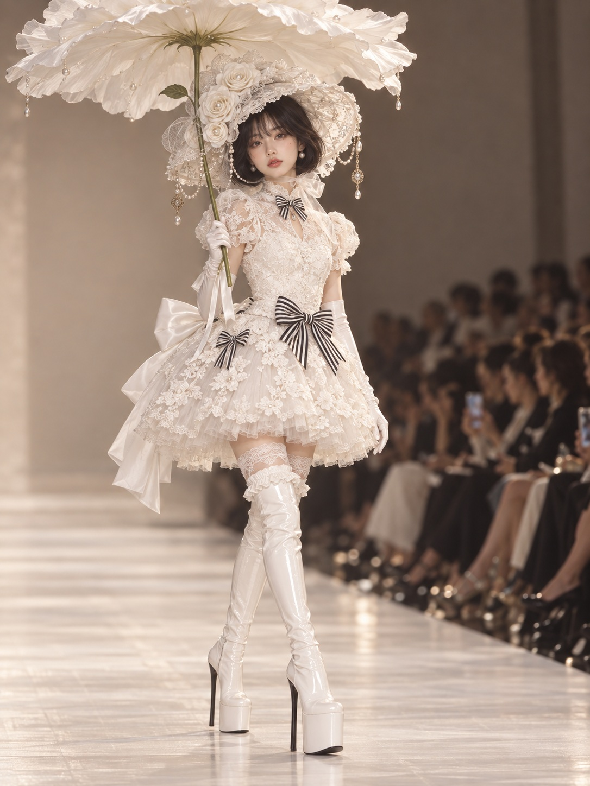

# 오트 쿠튀르 플라워 파라솔 런웨이 패션 에디토리얼 프롬프트

## 1. 개요 및 아트 디렉팅 가이드

- **컨셉**: 머리 위로 펼쳐진 거대한 순백의 생화 파라솔을 받쳐 들고 당당하게 캣워크를 걷는 하이패션 오트 쿠튀르 런웨이 에디토리얼
- **신체 비율 & 모델 스펙**:
  - 9등신의 늘씬한 런웨이 성인 패션 모델 비율 (가분수, 치비, 인형 비율 배제)
  - 긴 목선, 좁은 어깨, 슬림한 팔, 신장의 절반 이상을 차지하는 긴 다리
- **카메라 & 앵글 (전면 촬영 금지, 3/4 측면 포착)**:
  - 200mm 망원 렌즈로 원거리에서 포착한 왜곡 없는 압축 원근감, 세로 3:4 프레임
  - 런웨이 측면에서 모델의 전진 방향 기준 약 25도 비스듬한 앵글로 촬영
  - 몸의 우측(어깨, 골반, 스커트 측면, 허리 뒤 새틴 리본)이 화면 좌측 전경에 가깝게 드러나고, 좌측 몸선은 화면 우측으로 살짝 물러선 입체적 구도
- **헤드 & 시선 연출**:
  - 몸은 전진 방향(3/4 측면)을 유지하되, 고개만 카메라 렌즈 쪽으로 돌려 거의 정면에 가깝게 응시
  - 턱을 살짝 당기고 고개를 오른쪽 어깨 쪽으로 살짝 기울인 채, 앞머리 아래에서 올려다보는 아련하고 차분한 무표정(멜랑콜리 무드)
- **핵심 시그니처 소품 (플라워 파라솔)**:
  - 일반 우산/양산이 아닌, 하늘을 향해 수평으로 만개한 거대한 순백의 생화 자체를 파라솔 캐노피로 활용
  - 모자보다 넓게 펼쳐진 반투명 실키 꽃잎, 끝부분에 맺힌 진주 이슬, 우산대 역할을 하는 연녹색 꽃대 줄기와 늘어진 실크 리본
- **의상 & 스타일링**:
  - **드레스**: 단정한 하이넥 스탠드 칼라의 화이트 레이스 쿠튀르 미니 드레스, 허벅지 중간 기장의 풍성한 돔형 튜튜 미니스커트 (롱 트레인 금지)
  - **리본 포인트**: 칼라와 전면 허리, 우측 골반의 블랙&화이트 스트라이프 리본, 등 뒤 허리의 대형 화이트 새틴 리본
  - **모자 & 슈즈**: 진주 스트랜드가 드리워진 와이드 챙 레이스 보닛 모자, 오페라 글러브, 화이트 에나멜 싸이하이 플랫폼 부츠
- **배경 & 조명**:
  - 크림색 런웨이 바닥과 웜 베이지 백월, 화면 우측으로 블러 처리된 관객석, 부드러운 확산 조명과 섬세한 레이스/새틴 텍스처

---

## 2. 프롬프트 전문

```text
[FACE INSERTION RULES — apply only to the face]
Use the uploaded photo ONLY as a reference for the shape of the eyes, nose, and lips. Take nothing else from the photo: do not copy the face outline, face shape, jawline, skin tone, skin texture, hair, hairline, forehead, eyebrow position, or any accessories. Do NOT copy the head angle, head tilt, face direction, body pose, or gaze direction from the photo — they are defined only by this prompt. Do NOT copy the facial expression from the photo; draw the expression fresh exactly as described below. Everything outside the eyes, nose, and lips must stay exactly as written in this prompt and must not change because of the photo.

[BODY PROPORTIONS — fixed, very important]
Tall, slender adult runway model with realistic fashion-model proportions: about 9 heads tall. The head is SMALL relative to the body; the face is small and narrow. Long neck, narrow shoulders, slim arms, very long legs — the legs from hip to sole make up more than half of her total height. No chibi, no big-head doll proportions, no childlike body. The hat is large, but the head under it stays small.

[CAMERA — fixed, NOT a frontal shot]
Vertical 3:4 frame. Shot from far away with a 200mm telephoto lens, compressed perspective, no distortion.
The camera is NOT in front of her. It stands beside the runway, off to her right side, so it sees her at a three-quarter angle: the line between camera and model is about 25 degrees away from her walking direction.
Result in the image: her right shoulder, right hip and right side of the skirt are nearer to the camera and appear on the left side of the frame; the large white satin bow at the back of her waist is visible behind her on the left side of the frame. Her left side is slightly turned away on the right side of the frame.
Camera height at her waist, lens horizontal, no dutch tilt. The runway floor in front of her feet is visible.
Framing: the model slightly left of center. The top of the flower umbrella touches the top edge of the frame, the boot soles are just above the bottom edge. The runway continues diagonally behind her, and the blurred seated audience lines the right edge of the frame, receding into the background.

[HEAD, GAZE AND EXPRESSION — fixed]
Her body faces her walking direction (three-quarter to the camera), but her head turns back toward the camera so the face is seen almost frontally, only slightly three-quarter. Chin lowered slightly, head tilted gently toward her right shoulder.
Eyes looking straight into the camera lens, gazing slightly upward from under the bangs.
Expression: blank, wistful, melancholic. No smile. Lips closed, softly pouted, mouth corners neutral. Eyebrows relaxed and faintly lifted at the inner ends. Face completely still, calm and porcelain-like.

[FIXED POSE — runway cross-step walk]
Walking in a classic catwalk cross-step, torso upright, shoulders level, hips slightly shifted to her left.
Her left leg is the front leg: it crosses slightly in front of the right leg toward her center line, straight knee, boot planted flat.
Her right leg is behind, knee softly bent, heel slightly lifted. The two boots are one after the other on a single line, not side by side.
Right arm bent, the right gloved hand holds the flower stem exactly like a parasol handle, close to her body at upper-chest height, just in front of her right shoulder; the stem runs straight up past the side of her face, nearly vertical and slightly tilted toward her right shoulder. The open flower sits high above her head, slightly to her right, shading the top of the hat like a parasol.
Left arm hangs beside her body, slightly away from the hip, gloved fingers lightly touching the edge of the skirt at hip level.

[FLOWER UMBRELLA — replaces the parasol, very important]
She holds one gigantic white flower above her head as a parasol. The flower is fully open and spread wide like an opened umbrella: the bloom faces upward to the sky, its petals opened out flat and radiating horizontally from the center in several overlapping layers, forming a wide round canopy wider than her hat.
Petals: large, pure white, silky and slightly translucent, softly ruffled at the edges, the outer ring of petals curving gently downward at the rim like the edge of a parasol. From the camera's low side view, the soft ivory undersides of the petals and the round canopy shape are clearly visible.
A few tiny pearl beads rest on the petals like dew drops.
The long slender pale green stem is the umbrella shaft: it rises from her hand straight up to the center of the flower's underside, with one or two small green leaves on it. A few thin white satin ribbon streamers hang from the stem just above her hand.
No fabric umbrella, no regular parasol — the open flower itself is the umbrella. The flower is held high overhead, NOT beside her face like a bouquet, and NOT upside down.

[OUTFIT — fixed, follow exactly]
Dress: white lace couture mini dress, modest and fully covered chest. High stand-up lace collar closed around the neck. Flat, fitted white lace bodice with no corset boning, no sweetheart neckline, no cleavage; only a tiny keyhole opening below the collar with a small delicate crystal pendant. Short puffed cap sleeves with ruffled lace edges.
Skirt: a short, dome-shaped, puffy tutu mini skirt of tulle with white floral lace overlay, ending at mid-thigh, the SAME short length all the way around, front, sides and back. NO train, no long back panel, no fabric trailing on the floor.
Bows (black-and-white vertical stripe satin, only these): one small bow tie at the collar, one large bow at the center front waist, one small bow at her right hip.
Back: a large plain white satin bow at the back of her waist, its tails ending at the skirt hem, not reaching the floor.
Gloves: long white satin opera gloves reaching above the elbows.
Legs: white lace thigh-high stockings visible only as a short band between the skirt hem and the boots.
Boots: glossy white patent over-the-knee platform boots, top edge at lower thigh finished with a white ruffled lace cuff, chunky white platform soles, black stiletto heels.

[HAT — fixed]
Large ivory-white bonnet-style wide-brim hat made of sheer embroidered floral lace over silk, the brim gently wavy and curving down around both sides of the face, the edge finished with a narrow ruffled lace trim and dotted with small pearl beads.
On her right side of the crown: a cluster of three large white cabbage roses with pearl-bead centers, with stiff sheer white mesh-net ribbon loops rising behind them.
From the brim edge on both sides hang draped strands of small pearls in several loops, ending in antique gold filigree ornaments with pearl drops; a single pearl drop dangles from the far edge of the brim.
Tied under the chin with a sheer white organza ribbon forming a soft bow at the side of her neck.
Worn slightly tilted toward her left side. No black parts, no striped ribbons on the hat.

[HAIR AND MAKEUP]
Hair: neat glossy black chin-length bob with thick blunt bangs covering the eyebrows, softly curled inward at the ends.
Makeup: pale porcelain skin, soft pink blush on the cheeks, pale rosy-pink lips (no red lipstick), a small beauty mark under the eye, small pearl drop earrings.

[SCENE]
Haute couture fashion show runway, plain warm beige wall behind her, soft cream runway floor, blurred seated audience along the right edge. Real runway photograph, ultra detailed lace textures, satin reflections, realistic fabric folds, soft diffused runway lighting, shallow depth of field, photorealistic skin texture, delicate refined facial features, Vogue runway editorial, ultra realistic, masterpiece quality, 8k.
```

---

## 3. 결과물 비교 갤러리

| 생성 모델 | 생성 결과 이미지 |
| :--- | :--- |
| **제미나이 (Gemini)** |  |
| **ChatGPT (DALL-E 3)** |  |
