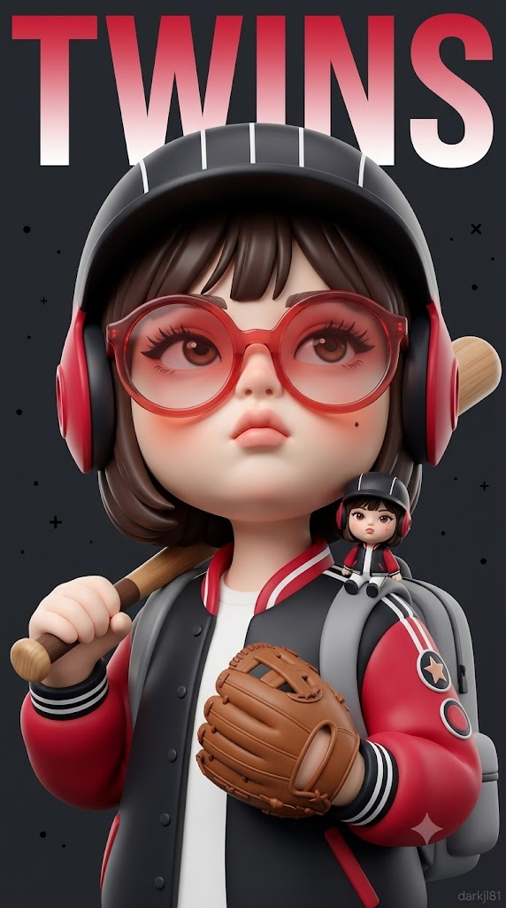
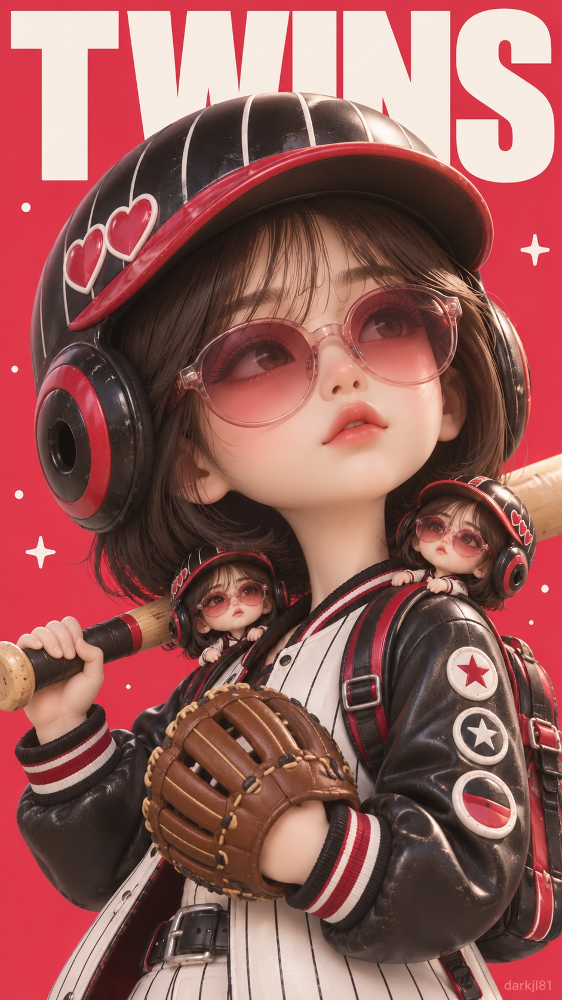

# KBO 구단별 미니미 3D 아트토이 야구 캐릭터 포스터 프롬프트

## 1. 개요 및 아트 디렉팅 가이드
- **컨셉/장르**: KBO 10개 구단별 고유 상징과 컬러를 반영한 오버사이즈 젤리 선글라스 착용 3D 아트토이 미니미 야구 캐릭터 스포츠 매거진 표지 포스터.
- **캐릭터 조형 & 얼굴**:
  - 무광 도자기·점토를 빚은 듯한 매끈한 아이보리빛 새틴 피부, 통통한 볼과 둥근 턱, 단추형 작은 코(코랄 피치 홍조), 도톰하게 오므린 코랄 핑크 입술.
  - 내리깐 차분한 눈꺼풀과 긴 속눈썹, 인물의 고유 이목구비 특징을 조형화하여 렌즈 너머로 투영.
  - 턱을 살짝 치켜든 3/4 측면, 허공을 응시하는 도도하고 무심한 몽환적 표정.
- **시그니처 소품 (선글라스 & 헬멧 & 장비)**:
  - **오버사이즈 젤리 선글라스 (필수)**: 얼굴 절반을 덮는 반투명 젤리 프레임 및 그라데이션 렌즈, 헬멧 이어가드 안쪽으로 고정.
  - **배팅 헬멧 & 유니폼**: 큰 이어가드가 달린 배팅 헬멧, 빈티지 스크래치, 구단 컬러 오버핏 야구 점퍼 및 와펜 패치, 장비 백팩.
  - **구단별 고유 상징 연출**:
    - LG(쌍둥이 인형), 두산(곰 귀·곰 인형), 키움(히어로 망토·고글), SSG(우주 착륙선·산소통), KT(마법사 모자·별빛), 한화(독수리 날개·인형), 삼성(사자 갈기·인형), KIA(호랑이 귀·줄무늬), 롯데(거대 배트·거대 글러브), NC(공룡 등가시·꼬리).
- **구도 & 타이포그래피**:
  - 세로 9:16 반신샷 구도, 배트를 어깨에 걸치고 글러브를 든 포즈.
  - 화면 상단 1/3을 꽉 채우는 굵은 산세리프 영문 구단명(TWINS, BEARS, HEROES 등)과 헬멧이 겹쳐지는 깊이감 있는 매거진 레이아웃.
  - 부드러운 스튜디오 조명, 깔끔하고 채도 높은 팝 컬러 단색 배경.

## 2. 프롬프트 전문

```text
[⚠️ 1단계 - 반드시 먼저 실행]
이번 응답에서는 절대 이미지를 생성하지 마.
아래 [응원 구단]의 구단명이 "[구단명 입력]" 그대로이거나 비어 있으면, 그림을 그리지 말고 아래 질문만 텍스트로 출력한 뒤 멈춰.

"어느 구단으로 만들까요?
LG 트윈스 / 두산 베어스 / 키움 히어로즈 / SSG 랜더스 / KT 위즈 / 한화 이글스 / 삼성 라이온즈 / KIA 타이거즈 / 롯데 자이언츠 / NC 다이노스"

사용자가 구단을 답하면, 그때 아래 2단계 내용대로 이미지를 생성해.
구단명이 이미 입력되어 있다면 1단계는 건너뛰고 바로 2단계로 진행해.

[2단계 - 이미지 생성]

업로드한 사진 속 인물을 "이 사람이다"라고 알아볼 수 있는 3D 아트토이 미니미 캐릭터로 만들어줘. 얼굴 구조와 비율은 아래 [얼굴 비율 & 조형]대로 인형처럼 재구성하되, [정체성 특징 유지]에 적힌 항목은 업로드 사진에서 정확히 가져와 반드시 닮게 표현해줘. 완전히 다른 사람으로 그리지 말고, 인형 비율 안에서도 본인의 개성이 살아 있어야 해. 사진 속 고개 각도, 얼굴 방향, 시선, 표정은 따라 하지 말고 아래 [시선 & 표정]대로 새로 그려줘. 얼굴 외의 헤어, 의상, 배경, 포즈는 참고하지 말고 아래 설명대로만 새로 구성해줘.
⚠️ 이 캐릭터는 반드시 젤리 선글라스를 쓰고 있어야 해. 업로드 사진에 안경이 없어도 선글라스를 생략하지 말고 꼭 씌워줘. 선글라스는 이 캐릭터의 핵심 시그니처 소품이야.

[응원 구단]
구단: [구단명 입력]

[정체성 특징 유지 - 업로드 사진에서 그대로 가져올 것]
- 눈매: 눈꼬리가 올라갔는지 내려갔는지, 눈의 모양(둥근형·긴형), 쌍꺼풀 유무와 모양, 눈동자 색
- 눈썹: 눈썹의 굵기, 각도, 진하기
- 코: 콧대의 높이감, 코끝의 모양(둥근·뾰족), 콧망울 크기
- 입술: 입술의 두께 비율(윗입술과 아랫입술), 입꼬리의 방향, 입술 산의 모양
- 얼굴 위 고유 표식: 점, 주근깨, 보조개, 덧니 등 눈에 띄는 특징이 있으면 같은 위치에 그대로 표현
- 피부톤과 혈색
- 그 사람 특유의 인상(날카로운지, 순한지, 도도한지)
위 항목은 인형 비율로 축소되더라도 모양과 인상을 그대로 유지할 것.
눈매는 선글라스 렌즈 너머로 비쳐 보이는 형태로 표현할 것. 사진에 안경이 없다고 맨눈으로 그리지 말 것.

[얼굴 비율 & 조형 - 가장 중요]
- 실사 인형이나 메이크업한 사람 얼굴이 아니라, 매끈하게 빚은 무광 도자기·점토 조각 같은 3D 아트토이 얼굴.
- 얼굴은 화면에서 크고, 볼과 턱 아래쪽이 통통하게 볼록한 아기 같은 동그란 볼륨. 턱은 작고 둥긂.
- 코는 작고 둥근 단추형으로 콧망울과 콧구멍이 귀엽게 살짝 보이며, 코끝은 복숭아빛으로 물듦. 선글라스 브릿지가 이 작은 코 위에 얹혀 있음.
- 입술은 작지만 도톰하고 볼록하게 튀어나온 오므린 모양, 매트한 코랄 핑크. 번들거리는 립글로스 느낌 금지.
- 눈은 과장된 애니메이션 눈이 아니라, 살짝 내리깐 듯 차분한 눈꺼풀에 길고 짙은 속눈썹이 강조된 형태. 눈동자는 항상 선글라스 렌즈 너머로 비쳐 보임.
- 눈썹은 얇고 연하게, 피부톤에 가깝게 은은하게 표현. 선글라스 프레임 위로 살짝 보임.
- 피부는 모공·잡티·실사 피부 결이 전혀 없는 아이보리빛 매끈한 표면, 새틴처럼 은은한 광택과 부드러운 그라데이션 명암.
- 볼, 코끝에 코랄 피치 홍조.
- 아이라인, 진한 눈화장, 실사 메이크업 표현 금지.
- 단, 위 [정체성 특징]의 눈매·눈썹·코·입술 모양과 얼굴 위 고유 표식은 이 조형 안에서 그대로 살릴 것.

[화풍]
하이엔드 3D 디자이너 토이 캐릭터 렌더. 무광 도자기와 부드러운 점토를 빚은 듯한 조각적인 질감. 선 없이 부드러운 명암과 색면으로 형태를 만든 3D 렌더. 사진이나 실사가 아닌 완성도 높은 컬렉터블 피규어 포스터 퀄리티. 채도 높고 깨끗한 팝 컬러.

[콘셉트]
오버사이즈 젤리 선글라스를 쓴 미니미가, 응원 구단의 팀 이름이 뜻하는 것을 헬멧 장식과 소품으로 표현한 차림으로 배트와 글러브를 들고 있는 야구 캐릭터 포스터. 화면 상단에 팀 이름 영문이 크게 깔린 스포츠 매거진 표지 느낌.

[시선 & 표정]
고개를 살짝 뒤로 젖혀 턱을 들고, 얼굴은 4분의 3 측면으로 돌린 채 시선은 위쪽 허공을 향함. 선글라스는 고개를 젖혀도 얼굴에 그대로 걸쳐져 있고 렌즈 두 개가 모두 보임. 도톰한 입술을 살짝 오므려 벌린, 도도하고 몽환적이며 무심한 표정.

[헤어]
짙은 브라운 컬러의 턱선 길이 단발. 배팅 헬멧 아래로 앞머리가 이마를 살짝 덮고 양옆 머리가 볼 옆으로 둥글게 떨어짐. 앞머리는 선글라스 프레임 위쪽에서 멈춰 렌즈를 가리지 않음. 가닥 하나하나가 아니라 점토로 덩어리지게 빚은 듯 매끈하게 뭉친 조각적인 머리결과 부드러운 하이라이트.

[선글라스 - 필수, 절대 생략 금지]
- 모든 경우에 반드시 선글라스를 착용함. 업로드 사진에 안경이 있든 없든 상관없음.
- 기본 형태: 얼굴 절반 가까이 덮는 오버사이즈 라운드 선글라스. 반투명한 젤리 프레임과 젤리 렌즈, 색은 구단 포인트 컬러에서 흰빛으로 번지는 그라데이션.
- 업로드 사진에 안경이나 선글라스가 있으면, 프레임 모양만 그 안경 형태를 따르고 질감·색·크기는 위 기본 형태(오버사이즈 젤리 선글라스)로 적용.
- 장착 방식: 선글라스 다리가 헬멧 이어가드 앞쪽 가장자리 안으로 쏙 들어가 고정된 모습. 이어가드가 귀를 덮어도 선글라스는 그대로 얼굴에 씌워져 있음.
- 렌즈 너머로 눈매와 긴 속눈썹이 또렷이 비쳐 보이고, 렌즈 색이 볼 위에 은은한 컬러 그림자로 떨어짐. 렌즈 표면에 젤리 같은 하이라이트 반사.

[헬멧 & 기본 의상 - 모든 구단 공통]
- 양쪽 귀를 덮는 크고 둥근 이어가드가 달린 통통한 배팅 헬멧. 헬멧과 이어가드는 구단 메인 컬러, 테두리는 포인트 컬러. 군데군데 살짝 긁힌 빈티지한 사용감.
- 헬멧 챙은 이마 위에 있고 선글라스를 가리지 않음.
- 구단 컬러의 오버핏 야구 점퍼, 소매 끝에 줄무늬 립 밴드. 팔에 동그란 와펜 패치 두세 개(패치 안은 글자 없이 별 무늬나 단순한 도형).
- 등에는 작은 장비 백팩을 메고 있음.
- 실제 구단 로고, 엠블럼, 기업명, 선수 이름·등번호, 공식 마스코트 캐릭터는 넣지 않음.

[팀 이름 표현 - 선택한 구단만 적용]
- LG TWINS | 블랙, 포인트 레드, 흰 핀스트라이프 | 어깨 위에 미니미와 똑같이 생긴 손바닥만 한 쌍둥이 인형이 같은 헬멧·선글라스·옷차림으로 앉아 있음
- DOOSAN BEARS | 네이비, 포인트 화이트 | 헬멧 위에 둥근 곰 귀 두 개, 이어가드 위에 작은 곰 인형이 매달려 있음
- KIWOOM HEROES | 버건디, 포인트 골드 | 헬멧 이마 위쪽에 올려 둔 히어로 고글(선글라스와 별개로, 선글라스는 그대로 착용), 등 뒤로 짧은 히어로 망토가 펄럭임
- SSG LANDERS | 레드, 포인트 화이트 | 우주 착륙 탐사대 콘셉트. 헬멧에 작은 안테나와 우주선 패널 디테일, 백팩은 산소통 모양
- KT WIZ | 블랙, 포인트 레드 | 헬멧 위에 끝이 휘어진 작은 마법사 모자를 얹고, 배트 끝에서 별빛 반짝이가 피어오름
- HANWHA EAGLES | 오렌지, 포인트 블랙 | 헬멧 양옆에 독수리 깃털 날개 장식, 어깨에 작은 독수리 인형이 앉아 있음
- SAMSUNG LIONS | 블루, 포인트 화이트 | 헬멧 둘레에 풍성한 사자 갈기 장식, 헬멧 꼭대기에 작은 사자 인형
- KIA TIGERS | 레드, 포인트 블랙 | 헬멧에 호랑이 귀와 검은 호랑이 줄무늬, 이어가드 위에 작은 호랑이 인형
- LOTTE GIANTS | 네이비, 포인트 레드 | 거인 콘셉트. 몸집보다 훨씬 큰 거대한 배트와 거대한 글러브를 들고 있어 장난스러운 크기 대비가 생김
- NC DINOS | 네이비, 포인트 골드 | 헬멧 위에 공룡 등가시가 줄지어 솟아 있고, 짧고 통통한 공룡 꼬리, 백팩에 작은 아기 공룡 인형

[포즈 & 소품]
몸은 살짝 비스듬히 서서 한 손으로 나무 야구 배트를 어깨에 걸쳐 듦. 다른 손에는 갈색 가죽 야구 글러브를 끼고 가슴 앞쪽에 둠. 손은 작고 통통한 인형 손. 배트와 글러브는 장난감처럼 통통한 비율(LOTTE GIANTS는 위 설명대로 거대하게). 손과 소품이 얼굴과 선글라스를 가리지 않음.

[배경 & 타이포]
- 질감 없이 매끈하고 채도 높은 구단 메인 컬러 단색 배경. 메인 컬러가 블랙이나 네이비처럼 어두우면 배경은 같은 계열의 밝은 톤으로.
- 화면 상단에 선택한 구단의 팀 이름 영문 한 단어(TWINS, BEARS, HEROES, LANDERS, WIZ, EAGLES, LIONS, TIGERS, GIANTS, DINOS 중 하나)만 화면 폭을 꽉 채우는 아주 굵은 산세리프 대문자로 크게 배치. 글자 색은 흰색 또는 구단 포인트 컬러.
- 캐릭터의 헬멧이 글자 일부를 앞에서 가리도록 겹쳐 배치해 잡지 표지 같은 깊이감.
- 가장자리에 작은 장식 도트와 십자 기호를 은은하게 흩뿌림. 팀 이름 외의 다른 글자는 넣지 않음.

[구도 & 카메라]
세로 9:16. 헬멧 끝부터 허리 아래까지 보이는 반신샷. 선글라스를 쓴 얼굴이 화면 중앙에서 크게 차지하고, 팀 이름 타이포는 화면 상단 1/3. 정면보다 살짝 아래에서 올려다보는 각도로, 들어 올린 턱과 통통한 볼 아래 라인이 보이게.

[조명 & 색감]
그림자가 거의 없는 부드럽고 화사한 스튜디오 조명. 구단 메인·포인트 컬러에 화이트와 크림을 더한 팔레트. 헬멧, 젤리 선글라스 렌즈, 배트에 은은한 반사광. 맑고 깨끗하며 채도가 살짝 높은 색감.

[하단 워터마크]
오른쪽 아래 구석에 작고 은은하게 "darkjl81" 텍스트 워터마크.

[최종 확인 - 생성 전 반드시 체크]
1. 캐릭터가 오버사이즈 젤리 선글라스를 쓰고 있는가? (없으면 다시 그릴 것)
2. 렌즈 너머로 눈매와 속눈썹이 비쳐 보이는가?
3. 상단 팀 이름 영문 한 단어와 "darkjl81" 외에 다른 글자가 없는가?
```

## 3. 결과물 비교 갤러리

| 제미나이 (Gemini) | GPT (DALL-E 3) |
| :---: | :---: |
|  |  |
