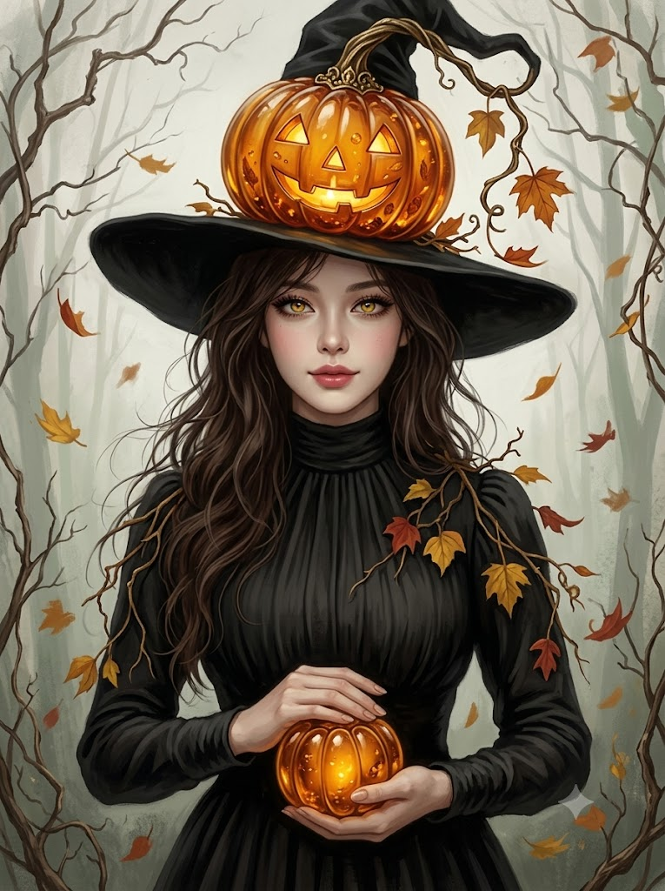
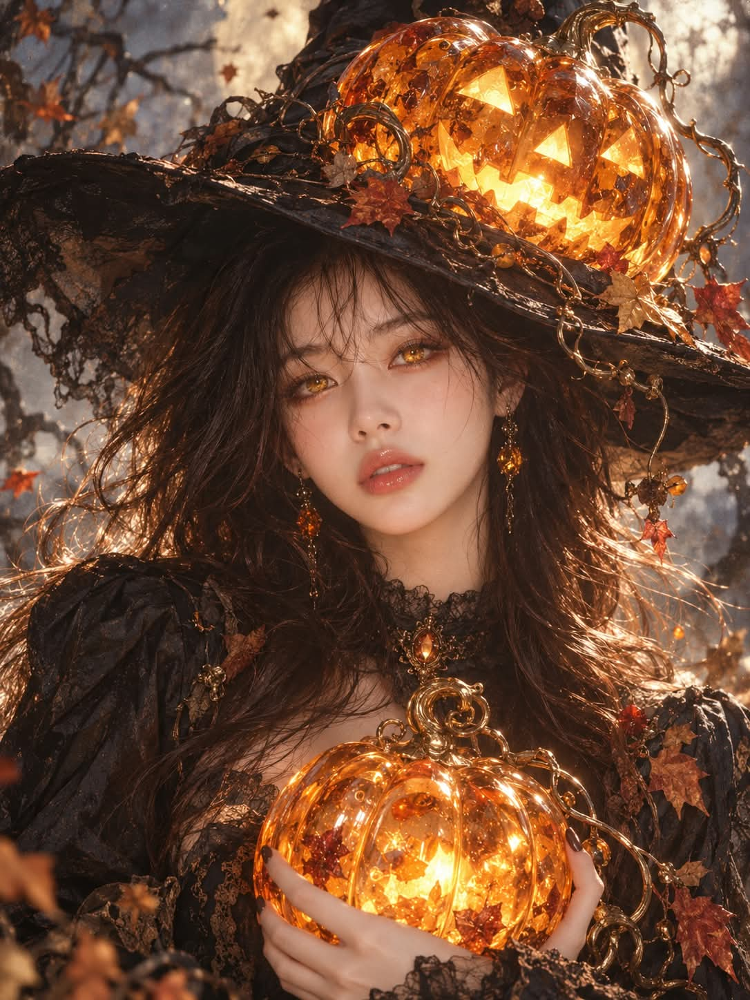

# 앰버 보석 호박 할로윈 판타지 디지털 아트 프롬프트 (남자·여자·동물 버전)

## 1. 개요 및 아트 디렉팅 가이드

- **컨셉**: 보석 호박(amber)을 통째로 깎아 만든 호박(pumpkin)을 핵심 소재로 한 할로윈 판타지 디지털 아트. 업로드한 사진의 대상에 따라 남자·여자·동물 세 버전 중 하나만 자동 적용
- **업로드 사진 사용 규칙**:
  - 사람 사진이면 눈·코·입의 생김새만 가져오고, 동물 사진이면 종·품종·털 색과 무늬·눈 색·얼굴 생김새를 가져옴
  - 사진 속 각도·시선·표정은 따르지 않고 프롬프트 서술대로 새로 그리며, 안경은 그대로 유지
- **얼굴 미화 (사람에게만)**: 인상은 알아볼 수 있게 유지하면서 로맨스 판타지 웹소설 표지 주인공 수준으로 미화, 실사에 가까운 사실적 묘사 유지
- **공통 소재 (앰버 호박)**:
  - 세로 골이 깊은 통통한 할로윈 호박 실루엣에 앤틱 골드 세공 꼭지, 반투명한 꿀빛~진한 오렌지 앰버 보석 재질
  - 내부의 작은 기포와 나뭇잎 화석 같은 내포물, 안쪽에서 차오르는 촛불 같은 주황빛
  - 사람 버전의 홍채는 앰버의 빛과 이어지는 노란 금빛
- **남자 버전 (가면을 벗기는 호박 신사)**:
  - 머리 전체를 감싼 거대한 앰버 잭오랜턴, 깨진 틈으로 드러난 한쪽 눈과 앰버 너머로 굴절되어 비치는 얼굴
  - 호박 조각용 칼을 쥔 손으로 가면을 벗겨 올리는 포즈, 흰 셔츠와 짙은 정장 재킷
  - 검은 배경에 붉은·자주·보라 네온 림라이트와 RGB 색수차 글리치 효과, 세로 3:4 바스트샷
- **여자 버전 (모자 위 잭오랜턴을 얹은 마녀)**:
  - 넓은 챙의 검은 마녀 모자 위에 얹힌 앰버 잭오랜턴과 늘어진 마른 덩굴, 가림 없이 보이는 얼굴과 정면 응시
  - 목까지 올라오는 빈티지 검은 드레스, 두 손으로 감싸 안은 작은 앰버 호박
  - 안개 낀 숲과 흩날리는 낙엽, 유화 붓터치와 채도를 낮춘 빈티지 톤, 세로 3:4 바스트샷
- **동물 버전 (호박 우주복을 입은 동물)**:
  - 두 발로 선 통통한 체형에 주황색 호박 모양 올인원, 후드 꼭대기의 앰버 보석 꼭지와 작은 검은 부츠
  - 크림색 종이 배경의 과슈·유화풍 빈티지 일러스트, 세로 5:7 전신
- **화풍**: 얼굴·눈·손·앰버는 사진처럼 사실적으로, 그 외 부분은 붓터치가 살아 있는 회화 질감으로 섞이는 하이엔드 디지털 아트

---

## 2. 프롬프트 전문

```text
[업로드 사진 사용 규칙]

업로드한 사진은 얼굴 정체성 참고용이다.

사람 사진이면: 사진에서는 눈·코·입의 생김새만 가져오고, 가져온 생김새는 [얼굴 미화] 지시에 따라 다듬어서 적용한다. 얼굴형, 피부톤, 헤어, 이마/헤어라인, 메이크업, 체형, 조명, 배경, 의상은 사진에서 가져오지 않는다.

동물 사진이면: 동물의 종, 품종, 털 색과 무늬, 눈 색, 얼굴 생김새를 가져온다. 체형, 포즈, 조명, 배경은 사진에서 가져오지 않는다.

사진 속 머리·얼굴 각도(고개 기울기, 방향, 시선)는 절대 따라 하지 않는다. 각도와 시선은 아래 구도대로만 새로 그린다.

표정은 사진이 아니라 아래 서술대로 새로 그린다.

사진 속 사람이 안경을 쓰고 있으면 안경은 그대로 유지한다.

[얼굴 미화 - 로판 표지급, 사람에게만 적용]

업로드 사진의 눈·코·입 생김새와 인상은 알아볼 수 있게 유지하되, 로맨스 판타지 웹소설 표지 주인공 수준으로 대폭 미화한다.

피부: 잡티·모공·주름 없이 맑고 매끈한 피부.

얼굴선: 턱선과 광대를 갸름하고 매끄럽게, 이목구비 비율을 균형 있게.

눈: 조금 더 크고 또렷하게, 길고 풍성한 속눈썹. 코는 곧고 오똑하게, 입술은 윤곽이 또렷하고 도톰하게.

남자: 로판 남주풍. 날렵한 턱선, 짙고 곧은 눈썹, 깊고 서늘한 눈매. 차갑고 귀족적인 미남.

여자: 로판 여주풍. 갸름한 V라인, 작고 도톰한 입술, 섬세한 콧대. 우아하고 몽환적인 미녀.

다른 사람처럼 보일 정도로 바꾸지 말 것. 얼굴은 실사에 가까운 사실적 묘사를 유지하고, 애니메이션·만화 그림체로 단순화하지 말 것.

[대상 판단]
업로드한 사진을 보고 대상을 판단한다.

남자 사람이면 [남자 버전]만 적용한다.

여자 사람이면 [여자 버전]만 적용한다.

동물이면 [동물 버전]만 적용한다.
세 버전의 요소를 섞지 않는다.

[공통 소재 - 앰버 호박]
할로윈 판타지 디지털 아트. 모든 버전의 핵심 소재는 통째로 깎아 만든 보석 호박(amber)으로 된 호박(pumpkin)이다. "호박 보석으로 만든 호박"이 핵심.

형태: 세로 골이 깊고 둥글고 통통한 할로윈 호박 실루엣, 꼭지는 앤틱 골드 세공.

재질: 꿀빛~진한 오렌지 앰버 보석. 반투명하고 유리 같은 광택, 골마다 은은한 보석 컷팅 면 반사, 내부에 작은 기포와 나뭇잎 화석 같은 내포물. 채소 호박의 무광·섬유질 질감은 절대 아님.

빛: 안쪽에서 촛불 같은 따뜻한 주황빛이 차올라 앰버가 안에서부터 빛난다.

눈빛(사람 버전만): 사람 인물의 홍채는 안에서 빛이 새어 나오는 듯한 노란 금빛으로, 앰버 호박의 빛과 같은 색으로 연결된다.

[남자 버전 - 가면을 벗기는 호박 신사]

앰버 잭오랜턴 머리: 인물의 머리 전체를 감싸는 거대한 앰버 잭오랜턴. 정면에 날카롭게 찢어진 듯한 지그재그 이빨의 거대한 미소가 조각되어 있고, 그 입 안쪽이 노란 빛으로 강하게 빛난다.

드러나는 얼굴: 잭오랜턴의 한쪽 눈 부분이 깨진 듯 열려 있고, 그 틈으로 인물의 진짜 한쪽 눈과 이마 위 흐트러진 짙은 앞머리 몇 가닥이 드러난다. 드러난 눈은 노란 금빛으로 빛나는 홍채, 날카롭게 가늘게 뜬 눈. 나머지 얼굴은 앰버 너머로 굴절되어 살짝 왜곡된 채 비쳐 보인다. 다른 쪽 눈 자리는 삼각형 조각 구멍에서 노란 빛이 둥글게 번진다.

포즈: 한 손은 잭오랜턴 옆면을 손톱을 세워 움켜쥐고, 다른 손은 잭오랜턴 아래 가장자리를 잡아 가면을 위로 벗겨 올리려는 듯 들어 올리고 있다. 들어 올리는 손에는 은빛으로 휘어진 호박 조각용 칼을 함께 쥐고 있다. 손톱은 검은색.

체형: 슬림한 근육질. 넓은 어깨, 단단한 가슴, 군살 없는 모델 체형.

의상: 단추를 몇 개 풀어 쇄골과 가슴 윗부분이 드러난 흰 셔츠, 넓게 펼쳐진 셔츠 깃, 그 위에 짙은 남색·검정 정장 재킷.

표정(드러난 눈과 비치는 얼굴): 섬뜩하게 즐거워하는 광기 어린 눈빛.

구도: 상반신 클로즈업 바스트샷, 세로 3:4, 정면.

배경·조명: 완전한 검은 배경. 잭오랜턴 안의 노란빛이 얼굴과 셔츠를 아래에서 비추고, 윤곽에는 붉은·자주·보라 네온 림라이트. 전체에 RGB 색수차 글리치 효과(윤곽이 빨강·파랑으로 살짝 어긋남).

화풍: 얼굴·눈·손·앰버는 사실적으로 묘사하고, 옷·머리카락·배경 가장자리는 거칠고 빠른 붓터치로 풀어지듯 처리.

색감: 검정 바탕에 주황·빨강·자주·남보라의 강렬한 대비.

[여자 버전 - 모자 위 잭오랜턴을 얹은 마녀]

앰버 잭오랜턴 위치: 머리가 아니라 넓은 챙의 검은 마녀 모자 위에 큼직한 앰버 잭오랜턴이 얹혀 있다. 정면에 삼각형 눈 두 개, 작은 삼각형 코, 이빨 몇 개가 있는 미소가 조각되어 있고 조각 안쪽이 따뜻하게 빛난다. 꼭지는 길고 구불구불한 마른 덩굴로 이어져 모자 주변으로 늘어지고, 덩굴에 말라가는 단풍잎 몇 장이 매달려 있다.

얼굴: 모자 챙 아래로 얼굴 전체가 가림 없이 선명하게 보인다.

눈: 눈을 또렷하게 뜨고 카메라를 정면으로 응시한다. 홍채는 노란 금빛, 동공 주변으로 갈수록 밝아지는 신비로운 발광.

헤어: 모자 아래로 흘러내리는 길고 헝클어진 짙은 갈색 머리, 잔머리가 얼굴 주변에 흩어져 있다.

메이크업: 창백하고 매끈한 피부, 은은한 장밋빛 볼, 눈가에 옅은 그림자, 차분한 로즈 립.

체형: 성인 여성의 볼륨 있는 글래머 몸매. 풍만한 가슴, 잘록한 허리의 실루엣이 프레임 안에서 드러난다.

의상: 목까지 올라오는 빈티지 검은 드레스. 몸에 붙는 주름 잡힌 블라우스형 보디스, 긴 소매. 어깨와 소매에 마른 덩굴과 낙엽이 걸려 있다.

소품: 두 손으로 가슴 아래쪽에 작은 앰버 호박(조각 없는 통짜)을 감싸 안고 있다.

포즈·구도: 상반신 클로즈업 바스트샷, 세로 3:4. 모자 위 잭오랜턴 꼭지부터 가슴 아래 호박까지 프레임에 들어온다. 고개는 정면.

표정: 입은 다물고 아주 옅은 미소, 무언가를 알고 있는 듯 신비롭고 고요한 눈빛.

배경: 옅은 회백색·연한 세이지 톤의 안개 낀 숲, 앙상하게 구불구불한 마른 나뭇가지와 덩굴이 가장자리에서 뻗어 있고 노랑·주황·적갈색 낙엽이 흩날린다. 배경은 흐릿하게.

화풍: 얼굴·눈·손·앰버는 사실적으로 묘사하고, 드레스·머리카락·배경은 유화 붓터치와 오래된 캔버스·종이 텍스처로 번지듯 처리.

색감: 채도를 낮춘 빈티지 톤, 미세한 그레인. 노란 눈빛과 앰버 호박의 주황빛만 은은하게 강조.

[동물 버전 - 호박 우주복을 입은 동물]

대상: 업로드 사진 속 동물의 종, 품종, 털 색과 무늬, 눈 색, 얼굴 생김새를 그대로 유지한다.

체형: 동글동글 통통하게 살이 오른 귀여운 체형. 사람처럼 두 발로 똑바로 서 있고, 앞발은 몸 양옆에 가지런히 내리고 있다.

의상: 몸 전체를 감싸는 주황색 호박 모양 우주복(올인원 잠옷). 부드러운 기모 원단, 배 부분이 호박처럼 둥글게 부풀어 있고 세로 골 라인이 은은하게 들어가 있다. 소매와 바짓단은 주름 잡힌 시보리 처리.

후드: 얼굴만 동그랗게 드러나는 주황 후드. 동물에게 귀가 있으면 후드에 난 구멍으로 귀가 쏙 빠져나와 있다. 목 앞에 갈색 끈 조임 리본.

앰버 꼭지: 후드 꼭대기에 꿀빛 앰버 보석을 깎아 만든 작고 짧게 휘어진 호박 꼭지가 달려 있다. 꼭지 밑동은 앤틱 골드 받침으로 후드에 고정되어 있고, 앰버 꼭지는 반투명하게 안에서부터 은은한 주황빛을 낸다. 꼭지 끝에 작은 앰버 덩굴이 살짝 말려 있다.

신발: 작고 뭉툭한 검은 부츠.

표정: 크고 동그랗고 촉촉한 눈동자에 반짝이는 캐치라이트, 입은 살짝 뾰로통하게 다문 시크하고 귀여운 표정. 정면을 바라본다.

구도: 전신, 세로 5:7, 정면에 가운데 배치. 발밑에 옅은 그림자.

배경: 아무것도 없는 따뜻한 아이보리·크림색 종이 배경.

화풍: 사실적인 털 묘사에 과슈·유화 붓터치가 섞인 부드러운 빈티지 일러스트. 털 한 올 한 올과 원단 질감이 살아 있게, 앰버 꼭지만 보석처럼 사실적으로 반짝이게.

색감: 크림 배경에 주황 우주복, 검은 부츠, 꿀빛 앰버 꼭지의 단순하고 따뜻한 대비.

[스타일·품질]

실사와 페인팅이 섞인 하이엔드 디지털 아트, 고해상도.

사람 버전: 얼굴·눈·손·앰버 보석은 사진처럼 사실적이고, 그 외 부분으로 갈수록 붓터치가 살아 있는 회화 질감으로 자연스럽게 섞인다.

모든 버전: 앰버의 반투명함, 내부 발광, 보석 굴절을 사실적으로.

[금지]

앰버 호박과 앰버 꼭지를 채소 호박처럼 그리지 말 것.

사람 얼굴을 붓터치로 뭉개거나 만화처럼 단순화하지 말 것.

여자 버전에서 눈을 감기지 말 것. 반드시 뜬 눈으로 정면 응시.

여자 버전에서 잭오랜턴이 얼굴을 가리지 말 것. 반드시 모자 위에 얹을 것.

여자 버전을 어린아이로 그리지 말 것. 반드시 성인 여성.

동물 버전에 노란 발광 눈, 사람 의상, 어두운 배경을 넣지 말 것. 동물의 원래 눈 색과 털 무늬를 바꾸지 말 것.

세 버전의 요소를 섞지 말 것.

업로드 사진의 고개 각도·시선·표정·헤어·체형·배경을 따라 하지 말 것.

텍스트, 로고, 워터마크 넣지 말 것.
```

---

## 3. 결과물 비교 갤러리

| 생성 모델 | 생성 결과 이미지 |
| :--- | :--- |
| **제미나이 (Gemini)** |  |
| **ChatGPT (DALL-E 3)** |  |
