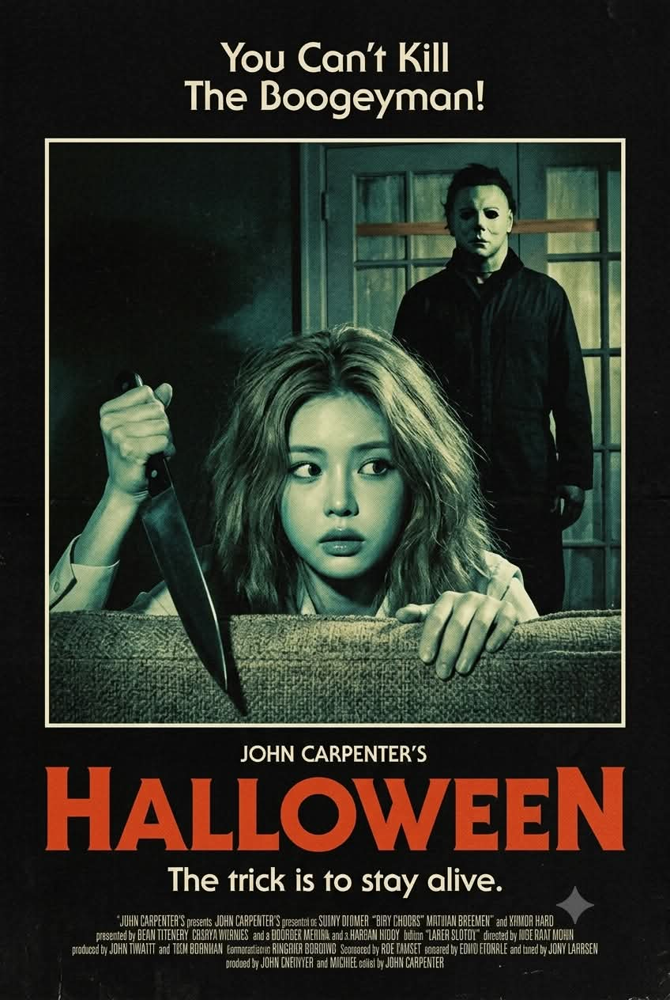
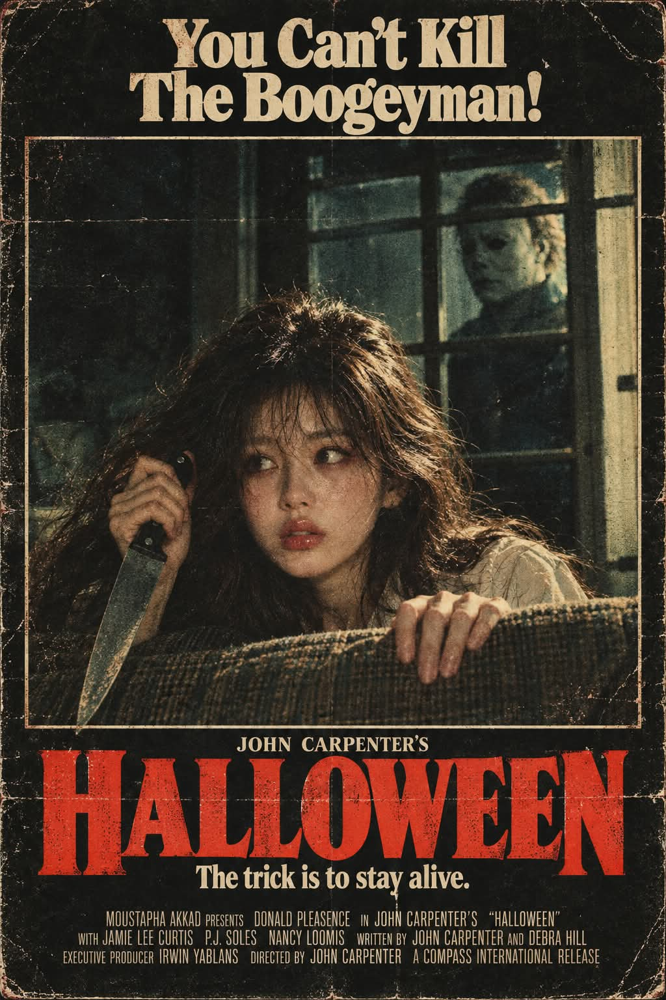

# 1970~80년대 빈티지 슬래셔 공포영화 포스터 프롬프트

## 1. 개요 및 아트 디렉팅 가이드

- **컨셉**: 1970~1980년대 빈티지 슬래셔 공포영화 포스터. 소파 뒤에 숨어 부엌칼을 움켜쥔 주인공과 그 뒤 유리문 너머에 선 흰 가면의 남성을, 오래된 영화 스틸을 거친 종이에 인쇄한 질감으로 재현. Gemini용과 GPT용 두 버전으로 작성
- **버전별 차이**:
  - **Gemini 버전**: 첨부한 인물 사진의 눈·코·입과 안경만 가져와 전경 주인공에게 적용하는 얼굴 합성 규칙 포함 (가면 남성에게는 적용하지 않음)
  - **GPT 버전**: 첨부 이미지의 구도와 색감, 인쇄 질감을 재현하는 방식으로 장면 전체를 서술
- **포스터 구성**:
  - 검정에 가까운 종이 바탕, 상단 크림색 홍보 문구, 중앙의 가느다란 크림색 사각 테두리 안 영화 장면, 하단의 거대한 주홍색 제목과 크림색 슬로건·크레딧
  - 주인공의 머리·팔과 소파 일부가 테두리 아래쪽 선을 넘어 앞으로 겹쳐 나오는 배치
- **중앙 장면**:
  - **전경**: 소파 등받이 뒤에 몸을 낮춘 주인공, 어깨까지 오는 헝클어진 짙은 금발과 밝은 색 셔츠, 화면 왼쪽을 향한 시선과 두려움·경계가 섞인 표정, 머리 옆으로 든 검은 손잡이 부엌칼
  - **후경**: 창살로 나뉜 오래된 유리문 너머, 짙은 작업복에 무표정한 흰 가면을 쓴 키 큰 남성. 주인공은 알아차리지 못한 상태
- **색감 & 조명**:
  - 탁한 청록·녹색·누런 연두빛의 제한된 색조, 얼굴·손·가면·문틀에만 닿는 강한 빛과 거의 검정에 가까운 암부
- **필름 & 인쇄 질감**:
  - 굵고 불규칙한 필름 그레인, 거친 망점, 미세한 잉크 번짐, 뭉개진 암부, 바탕과 글씨·테두리까지 이어지는 인쇄 열화
- **타이포그래피 (영문 그대로)**:
  - 상단 `You Can’t Kill / The Boogeyman!`, 장면 아래 `JOHN CARPENTER’S`, 주홍색 세리프 대문자 제목 `HALLOWEEN`, 슬로건 `The trick is to stay alive.`, 맨 아래 촘촘한 제작진 크레딧

---

## 2. 프롬프트 전문

### GPT 버전

```text
첨부 이미지의 구도와 색감, 인쇄 질감을 재현한 1970~1980년대 빈티지 슬래셔 공포영화 포스터를 만들어줘. 세로 2:3 비율.

[전체 구성]
검정에 가까운 어두운 종이 바탕. 상단에 크림색 홍보 문구, 중앙에 가느다란 크림색 사각 테두리로 둘러싼 영화 장면, 하단에 거대한 붉은 영화 제목과 크림색 슬로건·크레딧을 배치한다. 중앙 장면은 실사 영화 스틸을 오래된 종이에 인쇄한 모습이다.

[중앙 장면 — 모든 방향은 화면 기준]
오래된 집의 어두운 실내. 뒤쪽에 여러 개의 직사각형 유리창으로 나뉜 문이 서 있다. 굵은 세로·가로 창살과 화면 오른쪽의 밝은 문틀이 뚜렷하게 보인다.

전경에는 젊은 여성이 소파 등받이 뒤에 몸을 낮추고 숨어 있다. 여성의 얼굴은 화면 중앙보다 약간 오른쪽, 아래쪽에 크게 배치한다. 어깨까지 오는 풍성하고 헝클어진 짙은 금발, 밝은 피부, 밝은 색의 단정한 셔츠. 얼굴은 거의 정면이며 시선은 화면 왼쪽을 향한다. 입을 다문 채 눈을 크게 뜨고, 두려움과 경계가 섞인 긴장된 표정.

화면 왼쪽에 올라온 여성의 손은 검은 손잡이의 큰 부엌칼을 머리 옆에서 꽉 움켜쥔다. 칼날은 화면 왼쪽 아래를 향하며 어둠에 일부 묻힌다. 반대쪽 손은 전경의 두툼한 소파 등받이 위에 걸쳐 놓는다. 손가락이 등받이 앞쪽으로 자연스럽게 내려온다. 소파는 거친 직물 재질이며 화면 아래를 가로지른다.

여성 뒤쪽, 유리문의 화면 오른쪽 위 칸에는 흰 가면을 쓴 키 큰 남성이 서 있다. 짙은 작업복을 입고 몸 대부분은 어둠에 잠겨 있다. 가면은 무표정한 사람 얼굴 형태이며 눈구멍은 새까맣다. 가면의 얼굴은 화면 왼쪽을 향한 약한 측면으로 보인다. 가로 창살 하나가 가면의 이마 가까이를 지나간다. 남성은 여성 바로 뒤에 있지만 여성은 그 존재를 알아차리지 못한 듯하다.

여성의 머리와 팔, 소파 일부는 중앙 사각 테두리의 아래쪽 경계를 넘어 앞으로 튀어나오도록 배치한다.

[색감과 조명 — 최우선]
중앙 사진 전체를 탁한 청록·녹색·누런 연두빛의 제한된 색조로 표현한다. 피부와 밝은 문틀은 누런 연두색, 머리카락과 소파의 중간톤은 바랜 청록색, 깊은 그림자는 거의 검정이다.

여성의 얼굴과 손, 뒤쪽 가면에 거칠고 강한 빛이 닿는다. 배경과 남성의 몸은 짙은 암부에 묻힌다. 자연스러운 피부색이나 화려한 컬러 조명은 사용하지 않는다.

[필름과 인쇄 질감]
처음부터 오래된 저해상도 영화 스틸을 인쇄한 것처럼 만든다. 굵고 불규칙한 필름 그레인, 거친 망점, 미세한 잉크 번짐, 뭉개진 암부, 부드럽고 불완전한 윤곽. 머리카락과 피부, 원단의 세부는 인쇄 입자 속에 묻힌다.

검은 바탕에도 희미한 종이 결과 인쇄 얼룩이 보인다. 텍스트와 테두리에도 같은 인쇄 열화를 적용한다. 전체 분위기는 어둡고 투박하며 불길하다.

[타이포그래피]
상단 중앙에 크림색 글씨로 두 줄:
“You Can’t Kill”
“The Boogeyman!”

중앙 장면 아래에 작은 크림색 대문자:
“JOHN CARPENTER’S”

그 아래에 선명한 주홍빛 붉은색의 매우 크고 두꺼운 세리프 대문자:
“HALLOWEEN”
제목은 포스터 너비 대부분을 차지하며, 포스터에서 가장 강하게 눈에 들어오는 요소다.

제목 아래에 크림색 슬로건:
“The trick is to stay alive.”

맨 아래에는 오래된 영화 포스터 특유의 작고 촘촘한 크림색 영문 제작진 크레딧을 여러 줄로 배치한다.

[금지]
일러스트, 만화, 현대적인 디지털 포스터, 초선명 윤곽, HDR, 매끈한 피부, 3D 렌더링, 네온 색감, 과장된 피와 상처, 추가 인물, 불필요한 소품, 필름 테두리나 스프로킷 구멍.
```

### Gemini 버전

```text
첨부한 인물 사진을 얼굴 참고용으로 사용해, 그 인물이 주인공인 1970~1980년대 빈티지 슬래셔 공포영화 포스터를 한 장 생성해줘. 세로 2:3 비율. 설명 대신 이미지를 생성한다. 모든 방향은 화면 기준이다.

[첨부 사진 사용 규칙 — 최우선]
첨부 사진에서는 오직 눈·코·입의 생김새와 비율, 간격, 그 사람만의 얼굴 인상만 가져온다. 사진 속 인물임을 알아볼 수 있도록 특징을 유지한다.
안경이나 선글라스를 착용했다면 테의 형태·색·두께와 렌즈를 함께 유지한다.

사진 속 얼굴형, 피부톤, 피부결, 헤어스타일, 이마·헤어라인, 화장, 표정은 가져오지 않는다.
사진 속 고개 기울기, 얼굴 방향, 시선, 몸 자세, 의상, 배경, 조명, 색감도 가져오지 않는다.
이목구비와 안경을 제외한 모든 요소는 아래 장면대로 새로 만든다.

첨부 얼굴은 전경에서 소파 뒤에 숨은 주인공에게만 적용한다. 뒤쪽 가면 남성에게는 적용하지 않는다. 주인공의 성별은 첨부 인물을 따르며, 포즈와 배치는 동일하게 유지한다.

[전체 디자인]
검정에 가까운 종이 바탕.
상단에는 크림색 홍보 문구.
중앙에는 가느다란 크림색 사각 테두리로 둘러싼 실사 영화 장면.
하단에는 거대한 주홍색 영화 제목과 크림색 슬로건·제작진 크레딧.
실제 배우를 촬영한 오래된 영화 스틸을 거친 종이에 인쇄한 모습이다.

[전경 주인공]
밤, 오래된 집의 어두운 거실. 주인공은 소파 등받이 뒤에 몸을 낮추고 숨어 있다.
얼굴은 화면 중앙보다 약간 오른쪽 아래에 크게 배치한다. 몸은 소파에 가려지고 얼굴·어깨·팔·손이 주로 보인다.

헤어는 사진과 무관하게 어깨까지 오는 풍성하고 헝클어진 짙은 금발. 앞머리 없이 이마가 드러난다.
밝은 색의 단정한 셔츠를 입는다.

얼굴은 거의 정면이며 고개를 기울이지 않는다. 눈동자만 화면 왼쪽을 바라본다. 입을 다문 채 눈을 크게 뜨고 두려움과 경계가 섞인 표정을 짓는다. 첨부 사진의 표정과 시선은 따르지 않는다.

화면 왼쪽에 보이는 손을 머리 옆으로 들어 검은 손잡이의 큰 부엌칼을 꽉 움켜쥔다. 칼날은 화면 왼쪽 아래를 향해 비스듬히 내려간다.
반대쪽 손은 전경의 두툼한 소파 등받이 위에 올린다. 손가락이 등받이 앞면으로 자연스럽게 내려온다.

[후경 가면 남성]
주인공 바로 뒤쪽, 화면 오른쪽 위에 키 큰 남성이 서 있다.
여러 직사각형 유리 칸으로 나뉜 오래된 문 뒤에서 보인다.
짙은 작업복을 입고 몸 대부분은 어둠에 잠긴다.

흰색의 무표정한 사람 얼굴 형태 가면을 쓴다. 눈구멍은 새까맣다. 하키 마스크가 아니다.
가면의 얼굴은 화면 왼쪽을 향한 약한 측면이다.
가로 창살 하나가 가면의 이마 가까이를 지나간다.
주인공은 뒤쪽 남성을 알아차리지 못한 듯 앞쪽을 경계한다.

[문과 소파]
문에는 굵은 세로·가로 창살이 있고, 화면 오른쪽 문틀은 밝게 보인다. 문손잡이는 오른쪽 아래에 어둡게 보인다.
거친 직물 재질의 두꺼운 소파 등받이가 화면 아래를 가로지른다.
주인공의 머리·팔과 소파 일부는 중앙 사각 테두리의 아래쪽 선을 가리며 테두리 밖으로 겹쳐 나온다.

[색감과 조명 — 최우선]
중앙 사진 전체를 탁한 청록색·녹색·누런 연두색의 제한된 색조로 표현한다.
얼굴·손·가면·밝은 문틀은 누런 연두색.
머리카락·소파·중간톤은 바랜 청록색.
배경·남성의 작업복·깊은 그림자는 거의 검정.

주인공의 얼굴과 손, 뒤쪽 가면에 강한 빛이 닿는다. 나머지는 깊은 어둠에 묻힌다.
첨부 얼굴에도 장면의 청록·연두 색조, 그림자, 그레인을 동일하게 적용한다. 얼굴만 원본 사진의 색이나 밝기로 남겨두지 않는다.

[화질과 인쇄 질감 — 최우선]
낮은 해상도의 오래된 영화 스틸을 종이에 인쇄하고 스캔한 질감.
굵고 불규칙한 필름 그레인, 거친 인쇄 망점, 미세한 잉크 번짐, 뭉개진 암부, 부드러운 윤곽.
피부·머리카락·원단의 세부는 입자 속에 묻히되, 첨부 인물의 이목구비 특징은 알아볼 수 있게 유지한다.
검정 바탕과 글씨, 테두리에도 같은 종이 결과 인쇄 열화를 적용한다.

[타이포그래피 — 영문 그대로]
상단 중앙, 크림색으로 두 줄:
You Can’t Kill
The Boogeyman!

중앙 장면 아래, 작은 크림색 대문자:
JOHN CARPENTER’S

그 아래, 포스터 너비 대부분을 차지하는 매우 크고 두꺼운 주홍색 세리프 대문자:
HALLOWEEN

제목 아래, 크림색:
The trick is to stay alive.

맨 아래에는 작고 촘촘한 크림색 영문 영화 제작진 크레딧을 여러 줄로 배치한다.

[금지]
첨부 사진의 헤어·의상·배경·포즈·표정·시선 복사, 첨부 얼굴을 뒤쪽 가면 인물에게 적용, 얼굴만 밝게 뜨는 합성, 일러스트, 만화, 3D 렌더링, 현대적인 초선명 사진, HDR, 네온 색감, 추가 인물, 피와 상처, 추가 무기, 스프로킷 구멍, 워터마크.
```

---

## 3. 결과물 비교 갤러리

| 생성 모델 | 생성 결과 이미지 |
| :--- | :--- |
| **제미나이 (Gemini)** |  |
| **ChatGPT (DALL-E 3)** |  |
