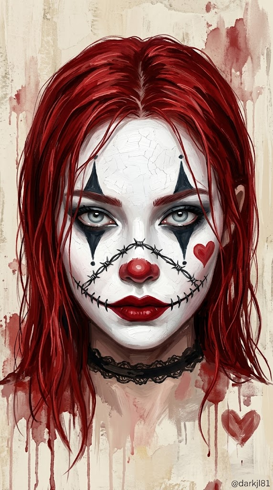
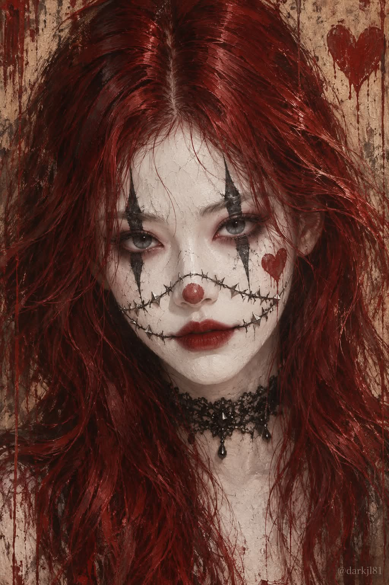

# 할로윈 순백 페이스페인트 초상 프롬프트 (까마귀 복수자·광대 메이크업)

## 1. 개요 및 아트 디렉팅 가이드

- **컨셉**: 얼굴 전체를 분필처럼 새하얀 페이스페인트로 덮은 다크 판타지 할로윈 분장 초상. 사진 속 인물의 성별에 따라 남자는 고딕 까마귀 복수자, 여자는 할로윈 광대 메이크업 버전으로 그림
- **얼굴 규칙**:
  - 업로드 사진에서는 눈·코·입의 생김새만 가져오고, 얼굴형·피부색·헤어·표정·각도·시선은 프롬프트 서술대로 새로 그림
  - 이목구비는 본인으로 알아볼 수 있게 유지하되 그 위에 페이스페인트와 메이크업이 두껍게 칠해진 모습으로 표현
  - 안경을 쓴 사진이라도 이 이미지에서는 안경을 쓰지 않음
- **남자 버전 (고딕 까마귀 복수자)**:
  - 세로 2:3, 가슴 위 상반신 클로즈업, 턱을 당겨 위로 치켜뜬 눈으로 정면을 노려보는 구도
  - 미간을 깊게 찌푸리고 입을 굳게 다문, 증오와 분노를 억누른 차갑고 위협적인 표정
  - 순백색 페이스페인트 위에 이마에서 볼까지 그은 검은 세로선, 검게 번진 눈가와 검붉은 입술, 흘러내리는 빗물
  - 어깨까지 오는 젖은 검은 장발과 비에 젖은 낡은 검은 가죽 재킷, 어깨 위에 앉은 크고 윤기 나는 검은 까마귀
  - 실사에 가까운 다크 판타지 디지털 페인팅, 어두운 차콜·네이비 배경과 위에서 떨어지는 하드 조명
- **여자 버전 (할로윈 광대 메이크업)**:
  - 세로 9:16, 얼굴과 목까지 보이는 클로즈업, 고개를 살짝 숙이고 위로 치켜뜬 눈으로 정면을 응시하는 구도
  - 눈을 크게 뜬 차갑고 섬뜩한 눈빛, 한쪽 입꼬리만 살짝 올라간 은근한 비웃음
  - 잔금이 간 도자기 질감의 순백 광대 페이스페인트, 검은 다이아몬드형 아이메이크업, 붉은 광대 코 분장과 진한 빨강 립, 볼의 붉은 하트
  - 철조망 무늬와 스티치 패턴의 검은 페이스페인팅 라인 (피부 위에 그린 분장이며 피나 상처는 표현하지 않음)
  - 가운데 가르마의 길고 젖은 듯한 레드 헤어, 검은 레이스 초커
  - 거칠고 두꺼운 임파스토 유화, 물감이 흘러내린 바랜 크림·베이지 배경
- **공통**: 하얀 얼굴이 화면에서 가장 밝게 보이게 하고, 텍스트·로고 없이 우측 하단에 작은 워터마크 `@darkjl81`

---

## 2. 프롬프트 전문

```text
업로드한 사진은 얼굴 참고용으로만 사용한다. 사진에서는 눈·코·입의 생김새만 가져온다. 얼굴형, 피부색, 헤어, 이마·헤어라인, 표정, 고개 각도·기울기·방향·시선은 절대 가져오지 않는다. 표정과 각도, 구도, 헤어, 의상은 아래 서술대로 새로 그린다.

사진 속 인물의 성별을 판단해 아래 두 버전 중 하나로 그린다.

[남자 버전 — 고딕 까마귀 복수자]
세로 2:3 비율, 가슴 위 상반신 클로즈업. 얼굴은 화면 중앙에서 정면을 향하고, 턱을 살짝 당겨 위로 치켜뜬 눈으로 정면의 보는 사람을 똑바로 노려본다.
표정: 미간을 깊게 찌푸리고 눈썹 안쪽 끝이 아래로 강하게 내려와 있다. 눈꺼풀을 반쯤 내리깐 날카로운 눈매로, 눈동자는 위쪽에 걸려 아래 흰자가 살짝 보이는 섬뜩한 응시. 졸리거나 나른한 눈빛이 아니라 증오와 분노를 억누른 차갑고 위협적인 눈빛이다. 입술은 굳게 다물어 일자로 눌려 있고 입꼬리는 아래로 처져 있다. 콧방울과 턱에 힘이 들어간 긴장된 얼굴.
얼굴은 이마부터 턱 끝까지 분필처럼 새하얀 불투명 페이스페인트로 두껍게 완전히 덮여 있다. 피부색이 전혀 비치지 않는 순백색이며 베이지·살구빛·누런 톤이 섞이지 않는다. 귀와 목 경계까지 하얗게 칠해져 있다. 양쪽 눈 위아래로 검은 세로선이 이마에서 볼까지 길게 갈라지듯 그어져 있고, 눈가는 검게 번진 아이섀도, 입술은 검붉은 색이며 입꼬리 양옆으로 검은 선이 짧게 이어진다. 흰 페인트 위로 빗물이 맺혀 흘러내리고 검은 선 끝이 살짝 번져 있다.
어깨까지 오는 젖은 검은 장발 웨이브 헤어가 얼굴 양옆으로 흐트러져 내려온다. 검은 티셔츠 위에 지퍼 달린 비에 젖은 낡은 검은 가죽 재킷.
왼쪽 어깨(화면 왼쪽) 위에 크고 윤기 나는 검은 까마귀가 앉아 있다. 까마귀는 화면 오른쪽을 향한 옆모습으로, 날카로운 부리와 깃털 결이 세밀하고 발톱이 재킷을 움켜쥐고 있다.
화풍은 실사에 가까운 다크 판타지 디지털 페인팅, 젖은 질감과 거친 브러시 텍스처, 어두운 저채도 톤. 배경은 어두운 차콜·네이비 그런지 질감 단색, 위에서 떨어지는 하드 조명으로 강한 명암 대비. 하얀 얼굴이 어두운 화면에서 가장 밝게 떠 보이게 한다.

[여자 버전 — 할로윈 광대 메이크업]
세로 9:16 비율, 얼굴과 목까지 보이는 클로즈업 유화 일러스트. 얼굴은 화면 중앙에서 정면을 향하고, 턱을 살짝 당겨 고개를 아주 약간 숙인 채 위로 치켜뜬 눈으로 정면의 보는 사람을 똑바로 응시한다.
표정: 눈을 크게 뜨고 깜빡임 없이 정면을 꿰뚫어 보는 차갑고 섬뜩한 눈빛. 눈동자는 창백한 회청색으로 서늘하게 빛나고, 눈썹은 평평하게 살짝 내려앉아 무심하면서도 위협적인 느낌이다. 졸리거나 나른하거나 유혹적인 눈빛이 아니다. 입술은 완전히 다물어 이가 보이지 않고, 한쪽 입꼬리만 아주 살짝 올라간 비대칭의 은근한 비웃음. 광기를 조용히 감춘 정적인 얼굴.
얼굴은 이마부터 턱 끝까지 분필처럼 새하얀 불투명 광대 페이스페인트로 두껍게 완전히 덮여 있다. 피부색이 전혀 비치지 않는 순백색이며 베이지·크림·누런 톤이 섞이지 않는다. 오래된 도자기처럼 가는 잔금이 간 질감. 눈 주위는 아래로 뾰족하게 떨어지는 검은 다이아몬드형 아이메이크업, 코끝은 둥근 붉은 광대 코 분장, 입술은 진한 빨강 립. 오른쪽 볼(화면 오른쪽)에 붉은 하트를 그려 넣는다.
콧잔등에서 양쪽 입꼬리 방향으로 철조망 무늬를 그린 검은 페이스페인팅 라인이 이어지고, 그 위에 작은 가시 모양 입체 장식 스티커가 붙어 있다. 입꼬리에서 바깥쪽으로는 검은 스티치 패턴의 메이크업 라인이 이어진다. 이 모든 것은 피부 위에 그린 연극용 페이스페인팅과 할로윈 특수분장 디자인이며, 피부는 매끈하고 다친 곳이 전혀 없다. 피나 상처는 표현하지 않는다.
가운데 가르마의 길고 젖은 듯한 강렬한 레드 헤어가 이마와 얼굴 양옆을 덮으며 아래로 흘러내린다. 목에는 검은 레이스 초커.
화풍은 거칠고 두꺼운 임파스토 유화, 배경 물감이 아래로 흘러내린 드립 효과, 오래된 벽처럼 바랜 크림·베이지 배경에 붉은 물감 얼룩과 화면 오른쪽 아래에 바랜 붉은 하트 하나. 부드러운 정면광, 다크 판타지 할로윈 분위기. 하얀 얼굴이 배경보다 확실히 더 밝고 하얗게 보이게 한다.

공통: 인물의 눈·코·입 생김새는 사진 속 인물로 알아볼 수 있게 유지하되 그 위에 새하얀 페이스페인트와 메이크업이 두껍게 칠해진 모습으로 표현한다. 표정은 사진이 아니라 위 서술대로 새로 그린다. 안경을 쓴 사진이라도 이 이미지에서는 안경을 쓰지 않는다. 텍스트·로고 없음. 단, 우측 하단에 작고 은은하게 "@darkjl81" 워터마크를 넣는다.
```

---

## 3. 결과물 비교 갤러리

| 생성 모델 | 생성 결과 이미지 |
| :--- | :--- |
| **제미나이 (Gemini)** |  |
| **ChatGPT (DALL-E 3)** |  |
