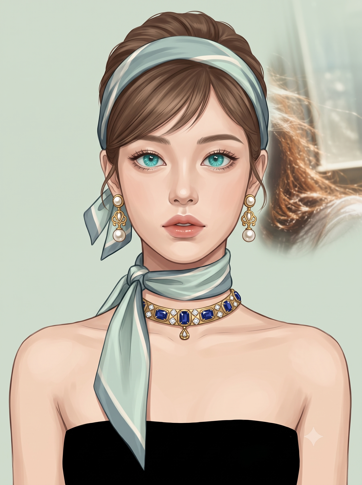
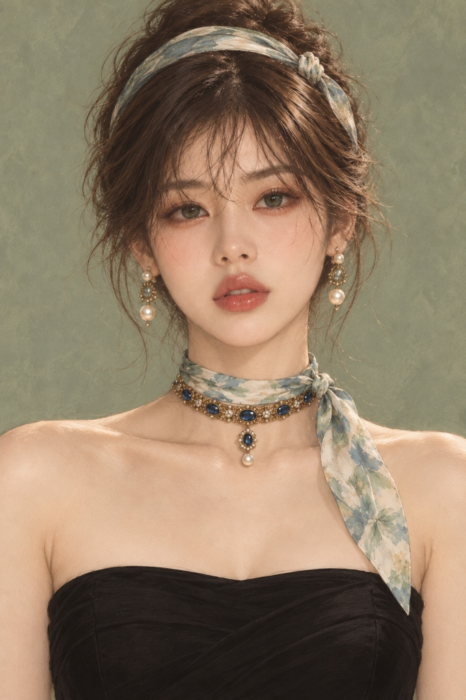

# 클래식 오드리 헵번풍 패션 뷰티 일러스트 프롬프트

## 1. 개요 및 아트 디렉팅 해설
- **콘셉트 테마**: 오드리 헵번(Audrey Hepburn) 특유의 단아하고 우아한 로맨틱 빈티지 감성을 현대적인 하이엔드 뷰티·패션 일러스트로 재해석한 **세미 리얼리스틱 버스트 포트레이트 (실사 45% + 일러스트 55%)**
- **핵심 아트 디렉팅 & 조형 원리**:
  - **얼굴 정체성 보존 (원본 특징 90% + 미화 10% / 최우선)**:
    - 원본 인물의 얼굴형, 이목구비 비율, 눈 모양·크기·기울기·간격, 눈썹 뼈대, 코와 입술의 형태, 볼과 턱선의 고유한 개성을 90% 철저히 보존.
    - 미화는 얼굴 재설계가 아닌 미세한 요철과 잔주름 정돈(10%)에만 국한하며, 전형적인 AI 미인 얼굴이나 인위적인 눈 확대, 과도한 V라인화 금지.
  - **완전 정면 버스트 샷 (Frontal Bust Shot)**:
    - 고개 회전 0도, 기울기 0도의 완전한 정면 앵글.
    - 가늘고 긴 목선과 여리여리한 어깨, 쇄골 라인이 깔끔하게 드러나는 안정적인 대칭 구도.
  - **아쿠아·에메랄드 보석 눈동자**:
    - 눈의 고유한 크기와 형태는 유지하되, 홍채에 아쿠아 터콰이즈, 시안, 딥 에메랄드가 다층으로 어우러진 신비로운 보석 광채와 방사형 결정무늬, 섬세한 크리스털 캐치라이트 적용.
  - **헤어 & 실크 스카프 스타일링**:
    - 미디엄 브라운 톤의 우아한 업스타일과 이마를 자연스럽게 드러내는 시스루 사이드 스윕 뱅.
    - 세이지 블루, 파우더 민트, 아이보리가 은은하게 감도는 얇은 실크 헤드스카프(헤어밴드 형태) 및 목을 감싸고 쇄골 쪽으로 길게 늘어뜨린 매듭 넥스카프.
  - **앤틱 골드 주얼리 & 블랙 톱 (Vintage Elegance)**:
    - 진주와 페이즐리 필리그리 세공의 앤틱 골드 드롭 귀걸이.
    - 딥 블루 사파이어와 크리스털이 세팅된 앤틱 골드 초커 목걸이.
    - 군더더기 없는 심플한 딥 블랙 스트랩리스 톱과 차분한 라이트 세이지 그린 배경.

---

## 2. 프롬프트 전문 (코드 블록)

```text
세로 2:3, 고해상도 반실사 디지털 패션 일러스트. 실사 45% + 일러스트 55%의 세미 리얼리스틱 페인팅. 부드러운 셀 셰이딩과 섬세한 그라데이션의 고급 빈티지 패션·뷰티 일러스트.

첨부 사진은 오직 ‘얼굴 정체성’ 참고용이다. 사진의 피부색·밝기·조명·명암·각도·포즈·표정·헤어·메이크업·의상·배경은 가져오지 않는다.

[얼굴 — 원본 특징 90% + 미화 10% / 최우선]
첨부 사진 속 인물의 얼굴형과 기본 비율, 눈 모양·크기·기울기·간격·눈꼬리, 눈썹, 코, 입술, 광대·볼·턱선, 이목구비의 상대적 위치와 고유한 인상을 강하게 유지한다. 완성 후에도 즉시 같은 사람이라고 알아볼 수 있어야 한다.

미화는 약 10%만 적용한다. 얼굴형이나 이목구비를 예쁘게 재설계하지 말고, 잔주름·미세한 피부 요철·거친 피부결만 자연스럽게 정돈한다. 피부를 깨끗하게 표현하되 얼굴의 실제 형태와 개성은 그대로 유지한다.

눈 확대, 코 변경, 턱 축소, V라인화, 얼굴 축소, 이목구비 재배치, 과도한 대칭화, AI 미인 얼굴로 변경 금지.

[포즈·구도]
완전한 정면 상반신 버스트 샷, 인물은 화면 중앙. 얼굴·목·몸통 모두 정확한 정면. 고개 회전 0도, 기울기 0도. 양쪽 눈과 어깨 높이가 자연스럽게 동일하다. 머리 전체부터 가슴 윗부분까지 보이며 양쪽 어깨가 드러난다. 목은 가늘고 길고 어깨는 좁고 여리여리하다.

[피부·조명]
중간 밝기의 뉴트럴 아이보리-피치 피부톤. 첨부 사진의 피부색이나 과노출된 밝기는 사용하지 않는다. 얼굴·귀·목·쇄골·어깨의 피부톤을 자연스럽게 통일한다.

잔주름과 거친 피부결만 부드럽게 정돈하되 플라스틱처럼 매끈한 피부나 과도한 뷰티 필터는 금지한다.

이마·콧등·광대에는 절제된 소프트 하이라이트, 눈두덩·코 옆·턱 아래에는 부드러운 회갈색 음영. 특히 턱 아래와 목 윗부분의 그림자를 확실하게 유지한다. 밝지만 희게 날아가지 않는 낮음~중간 대비의 패션 일러스트 조명.

[눈]
눈의 형태·크기·간격은 원본 그대로 유지하며 확대하지 않는다. 홍채색만 아쿠아 터콰이즈·시안·에메랄드가 섞인 투명한 보석 눈동자로 변경. 검은 동공, 딥 에메랄드 중심부, 밝은 터콰이즈 외곽, 섬세한 방사형 결정무늬와 작은 크리스털 캐치라이트.

[헤어]
첨부 사진의 헤어는 사용하지 않는다. 미디엄 브라운의 우아한 업스타일. 목과 어깨 앞으로 긴 머리가 내려오지 않는다. 앞머리는 얇고 가벼운 사이드 스윕 뱅으로 이마가 충분히 보이게 한다. 긴 생머리·풀뱅·두꺼운 일자 앞머리 금지.

[헤드스카프]
세이지 블루·파우더 민트·아이보리가 섞인 얇은 실크. 5~7cm 폭의 넓은 헤어밴드처럼 머리 위를 감싼다. 인물 기준 왼쪽 위에 작고 구조적인 실크 매듭과 짧은 접힌 자락. 거대한 리본이나 터번 형태 금지.

[목 스카프]
헤드스카프와 같은 실크 소재와 색상. 목을 얇게 한 바퀴 감싸고 인물 기준 왼쪽 목 옆에 작은 매듭. 한쪽 자락만 왼쪽 쇄골을 지나 가슴 윗부분까지 대각선으로 내려온다.

[주얼리]
양쪽 귀에 동일한 앤틱 골드 귀걸이: 흰색 진주 스터드 + 골드 페이즐리형 필리그리 + 둥근 진주 드롭.

목에는 넓고 납작한 앤틱 골드 초커. 딥 블루 사파이어풍 보석과 작은 투명 크리스털, 중앙 아래 작은 골드 펜던트.

[의상·배경]
심플한 딥 블랙 스트랩리스 톱. 소매·어깨끈·레이스·프릴·패턴 없음. 목·쇄골·양쪽 어깨가 완전히 드러난다.

배경은 회색이 살짝 섞인 차분한 라이트 세이지 그린 단색.

[최종 우선순위]
얼굴 = 첨부 사진의 고유 특징과 인상 90% + 미화 10%. 미화는 얼굴 재설계가 아니라 ‘잔주름과 피부결 정돈’에만 집중한다.

얼굴 정체성을 제외한 피부색·조명·각도·헤어·메이크업·홍채색·의상은 첨부 사진에서 가져오지 않는다.

포즈·화풍·조명·헤어·스카프·주얼리·의상·배경은 위 설정을 고정한다.

금지: 다른 AI 미인 얼굴, 눈 확대, 코 재설계, V라인, 얼굴 축소, 과도한 대칭화, 포토리얼 얼굴, 원본 사진의 조명·피부색·각도·헤어 복사, 과도한 피부 보정, 플라스틱 피부, 과노출, 고개 기울임, 3/4 얼굴, 몸통 회전, 3D/CGI, 애니메이션·만화풍.
```

---

## 3. 결과물 비교 갤러리

| 생성 모델 | 결과 이미지 |
| :--- | :--- |
| **Google Gemini** |  |
| **OpenAI GPT** |  |
