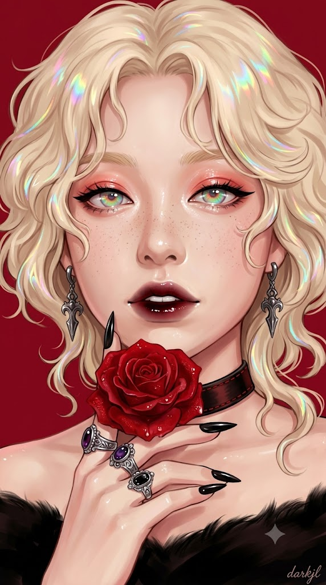
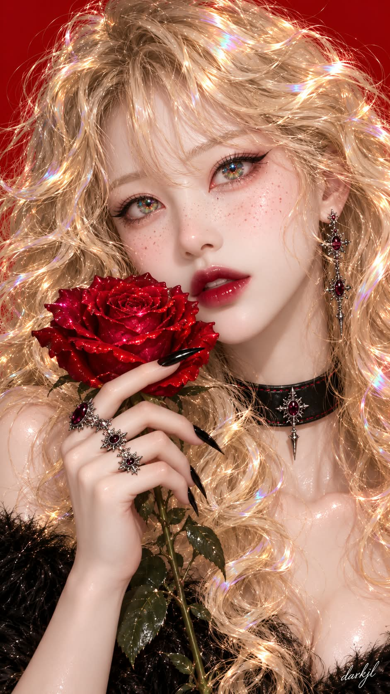

# 고딕 로맨틱 '홀로그램 로즈' 반실사 일러스트 프롬프트

## 1. 개요 및 아트 디렉팅 가이드
- **콘셉트 테마**: 단색 진홍색(Crimson Red) 배경 위, 벨벳 붉은 장미와 오팔빛 무지개 홀로그램 광택이 교차하는 고혹적인 고딕 로맨틱 반실사 디지털 일러스트 (모바일 배경화면 세로 비율)
- **핵심 아트 디렉팅 & 조형 원리**:
  - **인상 반영 & 무지개빛 오팔 홍채 (Holographic Eyes & Identity)**:
    - 참조 사진의 얼굴형, 눈매, 코, 입술 형태의 본래 인상만 가져오고 조명/피부톤은 장면 설정에 맞춰 새로 렌더링.
    - 뽀얗고 촉촉한 광택 피부와 볼/콧등의 은은한 주근깨.
    - 유리알/오팔처럼 반투명하게 빛나는 홍채 안에 초록·골드·블루·핑크가 뒤섞인 선명한 무지개빛 그라디언트, 강렬한 블랙 캣아이 윙 라이너, 코랄 핑크 글로시 섀도우.
  - **홀로그램 볼륨 컬 & 버건디-블랙 옴브레 립 (Styling & Lips)**:
    - 얼굴을 감싸는 풍성한 금발 웨이브 컬 뭉치와 컬 하이라이트에 반짝이는 무지개빛 홀로그램 스펙트럼.
    - 진한 버건디에서 블랙으로 떨어지는 고광택 옴브레 글로시 립, 살짝 벌어진 입술 사이로 드러난 앞니.
  - **고딕 다크 액세서리 & 벨벳 로즈 (Gothic Elements)**:
    - 건메탈 고딕 드롭 귀걸이, 레드 스티치 블랙 레더 초커, 어깨 퍼(Fur) 트림의 오프숄더 블랙 톱.
    - 블랙 스틸레토 네일과 3개의 볼드한 실버 젬스톤 링을 낀 손으로 턱 옆에 받쳐 든 이슬 맺힌 붉은 벨벳 장미 한 송이.
  - **진홍색 단색 배경 & 필기체 서명 ("darkjl")**:
    - 질감이나 그라데이션이 전혀 없는 순수 진홍색 단색 배경.
    - 우측 하단에 화이트 컬러의 안젤리카(Angelica) 필기체 폰트로 작게 표기된 **"darkjl"** 서명.

---

## 2. 프롬프트 전문 (코드 블록)

```text
[얼굴 참조 규칙]
첨부된 참조 사진 속 인물의 얼굴형, 눈매와 눈 모양, 코 라인, 입술 형태, 전체적인 인상(닮음)만 가져와서 아래 그림 속 얼굴에 자연스럽게 반영한다.
참조 사진의 조명, 명암, 피부톤, 색감, 그림자, 사진 특유의 質感(질감)은 절대 가져오지 않는다.
얼굴에 적용되는 조명과 명암, 피부톤은 참조 사진과 무관하게, 아래에서 지정하는 그림 자체의 조명/스타일에 맞춰 새로 그려진다.
참조 사진은 오직 "얼굴 특징과 인상"을 전달하는 용도로만 사용하고, 나머지 모든 요소(머리카락, 배경, 의상, 조명, 화풍, 홍채 색상 등)는 아래 설명을 그대로 따른다.

[장면 묘사]
빨간 단색 배경을 배경으로 한 세로형 클로즈업 인물 초상화. 얼굴을 살짝 기울인 채 정면을 응시하고 있다.

피부는 뽀얗고 매끄러우며 촉촉한 광택이 있고, 코와 양쪽 볼에 은은한 주근깨가 흩어져 있다. (피부톤과 명암은 참조 사진이 아니라 이 장면의 조명 설정을 따른다)

머리카락은 풍성한 금발의 곱슬머리로, 크고 불규칙한 컬 뭉치들이 양쪽 얼굴을 감싸듯 흘러내리며, 컬의 하이라이트 부분에는 무지개빛 홀로그램 광택이 반짝인다. 이마 쪽으로 몇 가닥이 흘러내려 있고 전체적으로 흐트러진 듯 낭만적인 볼륨감을 준다.

눈은 참조 사진의 눈 모양과 인상을 따르되, 홍채는 유리나 오팔처럼 반투명하고 맑게 빛나며, 그 안에 초록·금색·파랑·핑크가 뒤섞인 선명한 무지개빛 그라디언트가 겹겹이 비치듯 표현된다. 홍채 표면에는 빛이 투과하는 듯한 광택과 반짝이는 하이라이트가 있다. 눈매는 두껍고 진한 검은색 캣아이(윙) 아이라이너로 강조되어 있고, 속눈썹은 짙고 길게 뻗어 있다. 눈두덩에는 부드러운 코랄-핑크 톤 아이섀도우와 촉촉한 글로시 하이라이트가 얹혀 있으며, 눈동자에는 또렷한 캐치라이트가 있다. 눈썹은 부드럽고 얇은 금발색.

입술은 참조 사진의 입술 형태를 따르되, 진한 버건디에서 블랙으로 이어지는 옴브레 톤의 매우 광택 있는 글로시 립이 발려 있고, 입술이 살짝 벌어져 앞니가 보인다.

액세서리로는 어두운 건메탈 톤의 고딕풍 장식이 달린 드롭 귀걸이를 착용하고 있고, 목에는 붉은 스티치 테두리가 있는 블랙 레더 초커를 하고 있다.

손은 뽀얀 피부에 길고 뾰족한 스틸레토 모양의 블랙 아크릴 네일을 하고 있으며, 손가락 여러 곳에 짙은 보라/검은 보석이 박힌 화려한 실버 반지 3개를 끼고 있다. 이 손으로 턱 옆에 장미 줄기를 가볍게 받쳐 들고 있다.

소품은 활짝 핀 빨간 장미 한 송이로, 벨벳처럼 짙고 이슬 맺힌 듯한 광택의 꽃잎을 가지고 있으며, 손 아래로 짙은 초록색 줄기와 잎이 살짝 보인다.

의상은 어깨가 드러나는 블랙 톱으로, 어깨 라인에 부드러운 퍼(fur) 느낌의 트림이 있다.

배경은 그라디언트나 질감 없는 완전한 단색 진홍색이며, 다른 요소는 전혀 없다.

조명은 얼굴 정면에 부드러운 키라이트가 들어오고, 머리카락과 배경을 분리하는 은은한 림라이트가 있으며, 입술·눈·손톱·반지에는 반짝이는 스페큘러 하이라이트가 표현되고 강한 그림자는 없다. (이 조명 설정은 참조 사진과 무관하게 이 장면 고유의 조명이다)

전체적인 스타일은 애니메이션 영향을 받은 반실사 디지털 페인팅으로, 매우 디테일하고 피부는 글로시한 셰이더로 표현되며, 눈과 입술에 초점이 선명하게 맞춰지고 머리카락은 회화적인 붓터치로 표현된 고품질 컨셉아트 수준의 렌더링이다. 세로형 모바일 배경화면 비율의 구도.

색감은 진홍색(배경·장미·입술)이 주를 이루고, 금발의 골드 톤, 검은색(손톱·초커·의상), 무지개빛 홀로그램 포인트(머리카락 하이라이트·홍채), 뽀얀 피부톤이 조화를 이룬다.

이미지 우측 하단에 "darkjl" 텍스트를 흰색, Angelica(안젤리카) 필기체 폰트로 작게 삽입한다.
```

---

## 3. 결과물 비교 갤러리

| 생성 모델 | 결과 이미지 |
| :--- | :--- |
| **Google Gemini** |  |
| **OpenAI GPT** |  |
