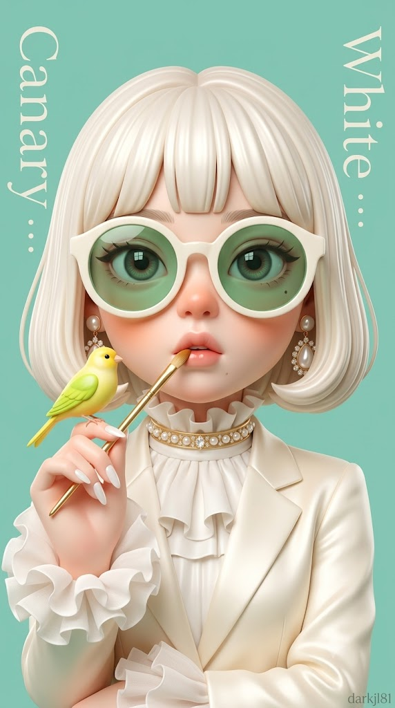
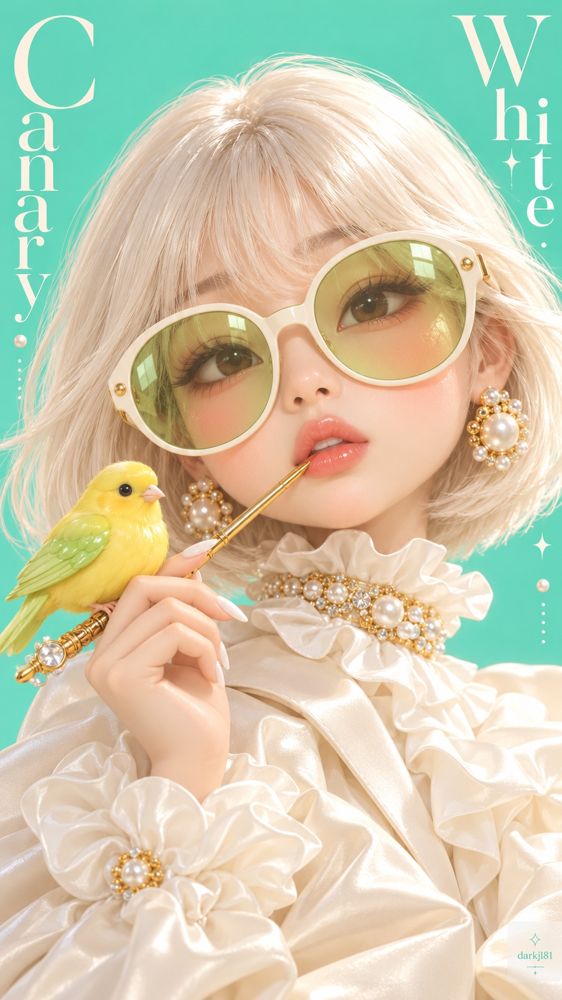

# 하이엔드 3D 아트토이 캐릭터 '화이트 카나리아' 일러스트 프롬프트

## 1. 개요 및 아트 디렉팅 가이드

- **컨셉**: 팝아트 컬렉터블 피규어와 하이패션 매거진 에디토리얼을 결합한 하이엔드 3D 아트토이 캐릭터 아트워크 (화이트 & 민트 틸 테마)
- **비율 및 화풍**: 세로 9:16, 매끈한 비닐·도자기 인형 질감, 외곽선 없이 부드러운 명암과 색면으로 구현된 에어브러시풍 3D 렌더링
- **정체성 유지 및 아트토이 재구성**:
  - 원본 사진의 눈매(모양/쌍꺼풀/눈꼬리), 눈썹, 코, 입술 두께/산 모양, 고유 표식(점, 보조개 등), 피부톤과 특유의 인상 100% 유지
  - 머리가 크고 볼이 통통하며 턱이 둥근 귀여운 대두형 아트토이 비율로 재구성 (잡티 없는 도자기 피부, 볼과 코끝의 복숭아빛 블러셔)
- **헤어 & 선글라스 연출**:
  - 플래티넘 화이트 단발 풀뱅 보브컷 (실크처럼 매끄러운 덩어리 질감과 부드러운 하이라이트)
  - 두툼한 아이보리 오버사이즈 라운드 프레임 + 반투명 청사과 그린 젤리 렌즈 (선글라스 너머로 눈매와 창문 모양 반사광 투영 / 원본에 선글라스 착용 시 해당 선글라스 유지)
- **포즈 & 시그니처 소품**:
  - 한 손으로 턱 근처를 들어 올려 입술에 살짝 물고 있는 가느다란 황금빛 붓
  - 붓대 위에 올라앉은 통통하고 귀여운 노랑 & 라임그린 카나리아 토이 피규어
  - 아몬드형 밀키 화이트 롱 네일
- **의상 & 주얼리**:
  - 풍성한 오프화이트 하이넥 러플 칼라와 크림 실크 새틴 오버사이즈 재킷 (솜사탕 같은 러플 퍼프 소매)
  - 진주와 크리스털이 촘촘한 골드 초커 및 볼륨감 있는 이어링
- **배경 & 매거진 타이포그래피**:
  - 매끈한 민트 틸 단색 배경, 세로 세리프체 영문 "Canary"(좌), "White"(우) 배치
  - 우측 하단 미세 워터마크 ("darkjl81")

---

## 2. 프롬프트 전문

```text
업로드한 사진 속 인물을 "이 사람이다"라고 알아볼 수 있는 3D 아트토이 캐릭터로 만들어줘. 얼굴 구조와 비율은 아래 [얼굴 비율]대로 인형처럼 재구성하되, [정체성 특징 유지]에 적힌 항목은 업로드 사진에서 정확히 가져와 반드시 닮게 표현해줘. 완전히 다른 사람으로 그리지 말고, 인형 비율 안에서도 본인의 개성이 살아 있어야 해. 업로드한 사진 속 인물이 선글라스를 착용하고 있다면 그 선글라스의 형태와 색은 유지해줘. 얼굴 외의 헤어, 의상, 배경, 포즈는 참고하지 말고 아래 설명대로만 새로 구성해줘.

[정체성 특징 유지 - 업로드 사진에서 그대로 가져올 것]

- 눈매: 눈꼬리가 올라갔는지 내려갔는지, 눈의 모양(둥근형·긴형), 쌍꺼풀 유무와 모양, 눈동자 색
- 눈썹: 눈썹의 굵기, 각도, 진하기
- 코: 콧대의 높이감, 코끝의 모양(둥근·뾰족), 콧망울 크기
- 입술: 입술의 두께 비율(윗입술과 아랫입술), 입꼬리의 방향, 입술 산의 모양
- 얼굴 위 고유 표식: 점, 주근깨, 보조개, 덧니 등 눈에 띄는 특징이 있으면 같은 위치에 그대로 표현
- 피부톤과 혈색
- 웃거나 표정 지을 때 나타나는 그 사람 특유의 인상(날카로운지, 순한지, 도도한지)
위 항목은 인형 비율로 축소되더라도 모양과 인상을 그대로 유지할 것.

[얼굴 비율 - 인형 구조로 재구성]
얼굴이 화면에서 매우 크고 머리가 몸에 비해 확연히 큰 아트토이 비율. 얼굴형은 폭이 넓고 위아래가 짧은 동그란 형태, 볼은 통통하게 볼록하고 턱은 작고 둥긂. 눈은 얼굴에 비해 크게, 입은 작고 도톰하게 오므린 모양. 단, 위 [정체성 특징]의 눈매·코·입술 모양은 이 비율 안에서 그대로 살릴 것. 피부는 잡티 없는 매끈한 도자기·비닐 질감에 유리 같은 광택. 복숭아빛 블러셔가 볼과 코끝에 동글게 퍼짐.

[화풍]
하이엔드 3D 아트토이 캐릭터 일러스트. 팝아트 컬렉터블 피규어와 하이패션 에디토리얼의 결합. 매끈한 비닐·도자기 인형 질감, 선 없이 부드러운 명암과 색면으로 형태를 만든 에어브러시 느낌의 3D 렌더. 사진이나 실사가 아닌 완성도 높은 캐릭터 아트. 파스텔 톤의 몽환적이고 세련된 색감.

[콘셉트]
선명한 민트 틸 단색 배경 앞에서 화이트 톤으로 통일한 하이패션 에디토리얼 캐릭터 포스터. 세련되고 장난스럽고 몽환적인 잡지 커버 분위기.

[시선 & 표정]
고개를 살짝 옆으로 돌리고 시선은 정면 쪽. 도도하고 순수하며 살짝 놀란 듯한 표정. 글로시 코랄 핑크 립을 살짝 오므려 벌림.

[헤어]
크림빛 플래티넘 화이트 컬러의 턱선 길이 단발 보브. 가지런하고 촘촘한 풀뱅 앞머리가 이마를 덮고, 양옆 머리가 볼 옆으로 둥글고 볼륨감 있게 떨어져 얼굴선을 감쌈. 실크처럼 매끈하게 뭉친 질감, 잔머리 없이 깔끔하고 결마다 부드러운 하이라이트.

[선글라스]

- 업로드한 사진에 선글라스가 있는 경우: 그 선글라스를 그대로 유지하고, 렌즈에 젤리 같은 하이라이트만 더해줘. 렌즈 너머로 눈매의 특징이 또렷이 보이게.
- 업로드한 사진에 선글라스가 없는 경우: 얼굴 절반 가까이 덮는 오버사이즈 라운드 선글라스. 두툼한 아이보리 화이트 프레임에 반투명한 청사과 그린 젤리 렌즈. 렌즈 너머로 눈매와 눈동자의 특징이 또렷이 비쳐 보이고, 창문 모양 반사광이 맺힘.

[포즈 & 소품]
한 손을 턱 가까이 들어 올려 가늘고 긴 황금빛 붓 모양의 소품 끝을 입술에 살짝 물고 있음. 붓대 위에 통통하고 동그란 카나리아 한 마리가 앉아 있음. 카나리아는 선명한 노란 얼굴과 몸, 라임 그린빛 날개, 토이처럼 매끈한 질감. 손은 가늘고 길게, 손톱은 길고 뾰족한 아몬드형 밀키 화이트 네일.

[의상 & 주얼리]
프릴이 풍성한 오프화이트 하이넥 러플 칼라와 크림빛 실크 새틴 오버사이즈 재킷. 소매 끝은 솜사탕처럼 부드러운 러플 퍼프. 목에는 진주와 크리스털이 촘촘히 박힌 골드 초커 목걸이가 러플 사이로 보임. 귀에는 진주와 골드 크리스털이 얽힌 볼륨감 있는 귀걸이.

[배경 & 타이포]
질감 없이 매끈하고 채도 높은 민트 틸 단색 배경. 세로로 쓴 우아한 세리프체 영문 "Canary"(왼쪽)와 "White"(오른쪽)를 은은한 톤으로 배치하고, 작은 장식 도트와 기호를 흩뿌려 잡지 표지 느낌.

[구도 & 카메라]
세로 9:16. 어깨 위 클로즈업 바스트샷. 얼굴이 화면 상단~중앙에서 크게 차지하고, 몸은 약간 옆을 향해 비스듬히 아래로 이어짐. 정면보다 살짝 아래에서 올려다보는 각도.

[조명 & 색감]
그림자가 거의 없는 부드럽고 화사한 스튜디오 조명. 화이트·크림·민트 틸·연두·노랑의 파스텔 팔레트. 진주, 골드, 렌즈에 은은한 반사광. 맑고 깨끗하며 채도가 살짝 높은 색감.

[하단 워터마크]
오른쪽 아래 구석에 작고 은은하게 "darkjl81" 텍스트 워터마크.
```

---

## 3. 결과물 비교 갤러리

| 생성 모델 | 생성 결과 이미지 |
| :--- | :--- |
| **제미나이 (Gemini)** |  |
| **ChatGPT (DALL-E 3)** |  |
