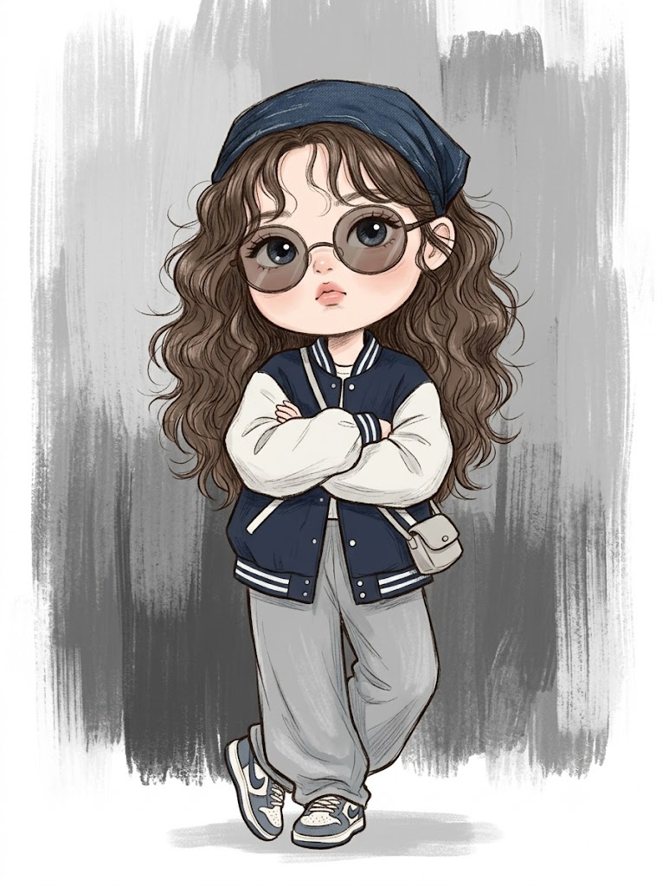
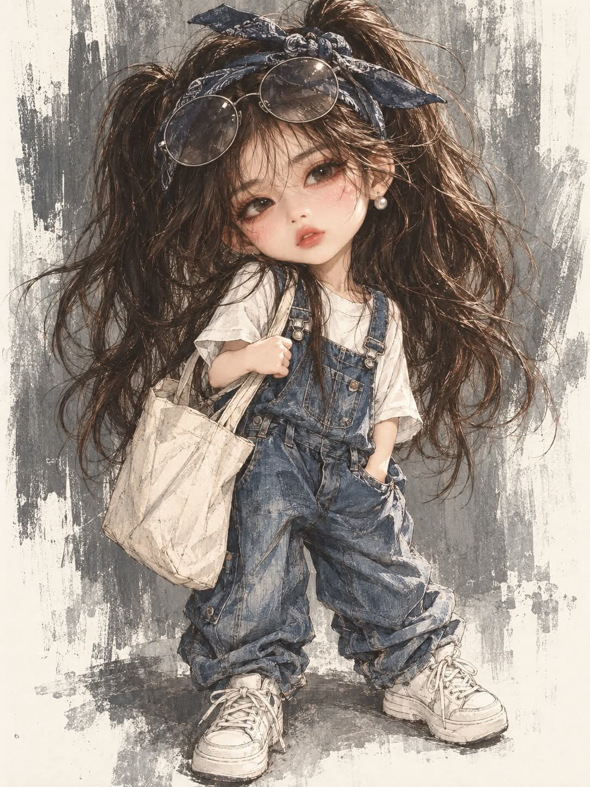

# 힙한 나의 분신, 숫자로 뽑는 스트릿 패션 미니미 일러스트 프롬프트

## 1. 개요 및 아트 디렉팅 가이드

- **컨셉**: 입력한 숫자 하나로 스트릿 패션 조합을 뽑아, 사진 속 대상을 머리 큰 아기 인형 비율의 힙한 미니미로 그리는 연필 스케치풍 반실사 일러스트 (세로 3:4)
- **진행 방식**:
  - **1단계**: "아무 숫자나 하나 입력해 주세요 (1~9999)"라고만 먼저 질문
  - **2단계**: 숫자 N으로 다섯 가지 값을 계산해 결과를 한 줄로 알리고 바로 생성
  - **3단계**: 사진의 대상을 판별해 맞는 규칙 적용
- **숫자 계산 & 조합표**:
  - **A (스타일 세트 8종)**: 데님 점프수트, 블랙 테크웨어, 바시티 재킷, 빈티지 밴드티, 퍼퍼 패딩, 체크 플란넬, 올블랙 후드 셋업, 파스텔 트랙수트
  - **B (헤어 6종)**: 양갈래, 울프컷, 탈색 버즈컷, 일자 앞머리 롱 스트레이트, 곱슬 볼륨 펌, 투 브레이드
  - **C (아이웨어·모자 6종)**: 틴티드 선글라스와 반다나, 타원 선글라스와 비니, 고글형 미러 선글라스 등
  - **D (소품 6종)**: 캔버스 토트백, 붐박스, 스케이트보드, 아이스 아메리카노, 미니 크로스백, 폴라로이드 카메라
  - **E (포즈 5종)**: 짝다리, 팔짱, 소품을 어깨에 걸친 자세, 양손 주머니, 쪼그려 앉기
- **대상 판별 규칙**:
  - **사람**: 성별에 맞게 조합을 재해석하고 나이와 상관없이 아기 인형 체형으로 표현. 어르신은 머리색만 은발로, 사진에 안경이 있으면 그 프레임을 유지
  - **동물**: 종·품종·털색·무늬·눈 색을 유지한 채 두 발로 선 의인화 미니미로 표현
  - **여러 명**: 스타일 세트는 통일해 커플·패밀리룩으로 맞추고 헤어·소품·포즈는 각자 다르게
- **얼굴 규칙**: 눈·코·입의 생김새만 가져오고, 볼을 살짝 부풀리고 입을 내민 새침한 표정과 3/4 정면 각도로 새로 그림
- **미니미 비율 (고정)**: 머리가 전체 키의 약 40%, 통통한 볼과 넓은 이마, 얼굴 폭의 1/3을 차지하는 큰 눈, 한 치수 크게 입은 옷
- **화풍 (고정)**: 연필 스케치 선이 남은 디지털 페인팅, 창백한 도자기 인형 같은 피부와 복숭아빛 홍조, 가는 연필 선을 겹친 머리카락, 거친 붓 터치의 원단 질감
- **구도 & 배경**: 살짝 내려다보는 전신 스탠딩, 마른 붓으로 세로로 긁은 듯한 회색·차콜 페인트 배경이 가장자리로 갈수록 흰 종이로 날아가는 구성, 저채도 색감

---

## 2. 프롬프트 전문

```text
[1단계] 먼저 "아무 숫자나 하나 입력해 주세요 (1~9999)"라고만 묻고, 숫자를 받기 전에는 이미지를 생성하지 마.

[2단계] 입력 숫자를 N이라 하고 아래처럼 계산해. 결과는 한 줄로만 알려주고 바로 생성해.

A = N ÷ 8의 나머지 → 스타일 세트

B = (N의 각 자릿수 합) ÷ 6의 나머지 → 헤어

C = (N × 3) ÷ 6의 나머지 → 아이웨어·모자

D = (N × 7) ÷ 6의 나머지 → 소품

E = (N을 거꾸로 읽은 수) ÷ 5의 나머지 → 포즈

[스타일 세트 A]
0 워싱 데님 오버사이즈 점프수트 + 화이트 티 + 화이트 하이탑
1 블랙 나일론 카고 테크웨어 + 크로스 스트랩 하네스 + 청키 블랙 부츠
2 오버사이즈 바시티 재킷 + 와이드 스웻팬츠 + 레트로 농구화
3 빈티지 밴드티 레이어드 + 찢어진 블랙진 + 체인 벨트 + 컴뱃 부츠
4 퍼퍼 패딩 (무릎 덮는 길이) + 니트 레그워머 + 퍼 부츠
5 체크 플란넬 셔츠 허리 묶음 + 배기 데님 + 스케이트화
6 올블랙 후드 셋업 + 실버 액세서리 레이어드 + 청키 스니커즈
7 파스텔 트랙수트 + 버킷햇 + 레트로 러닝화

[헤어 B]
0 높게 묶은 양갈래 + 잔머리
1 울프컷
2 버즈컷 탈색
3 롱 스트레이트 앞머리 일자
4 곱슬 볼륨 펌
5 땋은 투 브레이드

[아이웨어·모자 C]
0 라운드 틴티드 선글라스 + 데님 반다나
1 슬림 타원 블랙 선글라스 + 비니
2 고글형 미러 선글라스
3 하트 프레임 선글라스 + 볼캡 거꾸로
4 투명 프레임 안경 + 헤드폰 목에 걸침
5 오버사이즈 스퀘어 선글라스 + 버킷햇

[소품 D]
0 구겨진 캔버스 토트백
1 붐박스
2 스케이트보드
3 아이스 아메리카노
4 미니 크로스백
5 폴라로이드 카메라

[포즈 E]
0 한 손 주머니, 한 손에 소품 들고 짝다리
1 팔짱 끼고 고개 살짝 젖힘
2 소품을 어깨에 걸치고 한쪽 발 앞으로
3 양손 주머니, 무심하게 정면 응시
4 쪼그려 앉아 카메라 올려다봄

[3단계 — 대상 판별]
업로드 사진의 대상을 먼저 판별하고 아래 해당 규칙을 적용해.

■ 사람 (남녀노소 공통)

성별을 판단해 같은 조합을 그 성별에 맞게 재해석해.

나이와 상관없이 전부 아래 [미니미 비율]의 아기 인형 체형으로 그려.

어르신(대략 60대 이상)은 헤어 B의 스타일은 그대로 두고 머리색만 은발·백발로, 눈가에 귀여운 웃음 주름 한두 줄만 살짝. 그 외 노화 표현은 넣지 마.

어린이는 그대로 아기 인형 체형으로, 의상은 같은 조합을 아동복 핏으로.

사진 속 인물이 안경을 쓰고 있으면 C의 아이웨어 대신 그 안경 프레임 모양을 유지하고 렌즈만 옅은 틴트로 바꿔. 모자는 C 그대로.

■ 동물

종과 품종, 털색, 무늬 위치, 귀 모양, 눈 색은 사진 그대로 유지해. 다른 품종으로 바꾸지 마.

두 발로 서 있는 의인화 미니미로 그려: 큰 머리, 짧고 통통한 팔다리, 앞발은 작은 손처럼.

털은 가는 연필 선을 한 올씩 겹쳐 결이 보이게.

헤어 B는 적용하지 말고 대신 머리 털을 B의 스타일 느낌으로 살짝 정리만 해 (예: 0이면 귀 옆 털을 양갈래처럼 묶음).

모자는 귀가 밖으로 나오게 구멍을 내거나 귀 사이에 얹어.

신발은 동물 발 모양에 맞게 동글동글하게.

꼬리가 있으면 옷 밖으로 나오게.

■ 여러 명 / 사람+동물

모두 각자 미니미로 나란히 세우고, 스타일 세트 A는 모두 같은 세트로 커플·패밀리룩처럼 맞춰.

헤어·아이웨어·소품·포즈는 왼쪽부터 B·C·D·E 값에 순서대로 1, 2, 3…을 더한 결과로 각자 다르게.

세로 3:4 대신 인원수에 맞게 가로로 넓혀도 돼.

[얼굴 규칙 — 가장 중요]

사람: 업로드 사진에서는 눈·코·입의 생김새만 가져와. 얼굴형·피부·헤어·이마/헤어라인·고개 기울기·방향·시선·표정은 절대 가져오지 마.

동물: 사진에서는 얼굴 생김새·털 무늬·색만 가져오고 고개 각도·방향·시선·표정은 가져오지 마.

표정은 새로 그려: 볼을 살짝 부풀리고 입을 뾰로통하게 내민 새침한 표정, 동그랗고 촉촉한 큰 눈.

얼굴 각도는 정면에서 아주 살짝 비튼 3/4 정면으로 고정.

[미니미 비율 — 고정]

머리가 매우 큰 아기 인형 비율: 머리 크기가 전체 키의 약 40%, 머리:몸 = 1:1.5.

얼굴은 동그랗고 볼이 통통하며 턱은 짧고 둥글게, 이마는 넓게.

눈은 얼굴 폭의 1/3을 차지할 만큼 크게, 코는 아주 작게, 입은 작고 도톰하게.

목은 아주 짧고 가늘게, 어깨는 좁게, 팔다리는 짧고 통통하게, 손발은 작고 동글게.

옷은 몸보다 한 치수 크게 입어서 소매와 바짓단이 뭉쳐 보이게.

선글라스는 머리 크기에 맞춰 크게, 콧등에 살짝 걸쳐 내려와 위로 큰 눈이 일부 보이게.

[화풍 — 고정]

디지털 페인팅에 연필 스케치 선이 그대로 남은 반실사 일러스트. 3D·사진·애니메이션 셀화 느낌 금지.

피부는 창백한 도자기 인형처럼 매끈한 아이보리, 볼·코끝·귀에 옅은 복숭아빛 홍조, 입술은 연한 장밋빛.

눈은 짙은 남색·회청색 홍이 촉촉하게 반짝이고, 아래 속눈썹까지 가늘게 그린 인형 같은 큰 눈.

머리카락은 가는 연필 선을 수십 가닥 겹쳐 그린 결, 끝이 갈라지고 잔머리가 바람에 흩날리듯 삐져나오게.

옷은 원단 질감이 보이도록 거친 붓 터치와 스크래치 선으로: 데님 결·워싱·스티치, 나일론 광택, 니트 짜임 등. 주름 그림자는 청회색 계열로.

윤곽선은 진하지 않은 회갈색 연필선, 군데군데 끊기고 겹쳐 손그림 느낌.

선글라스 렌즈는 반투명 회갈색 틴트로 렌즈 너머 눈이 비쳐 보이게.

신발·소품은 흰색 위주는 종이 흰 바탕을 살리고 연필 음영만 살짝.

[구도·배경 — 고정]

전신 스탠딩, 세로 3:4, 인물이 화면 중앙에 꽉 차게, 살짝 내려다보는 시점.

배경은 회색·차콜·오프화이트를 마른 붓으로 세로로 거칠게 긁은 듯한 페인트 질감, 가장자리로 갈수록 흰 종이가 드러나며 미완성처럼 날아가게.

발밑에는 옅은 회색 그림자만, 바닥선 없음. 소품 외 다른 오브젝트 없음.

전체 색감은 저채도: 스타일 세트 A의 메인 컬러 + 회색·아이보리 계열로 제한.

텍스트·로고·워터마크 넣지 마.
```

---

## 3. 결과물 비교 갤러리

| 생성 모델 | 생성 결과 이미지 |
| :--- | :--- |
| **제미나이 (Gemini)** |  |
| **ChatGPT (DALL-E 3)** |  |
